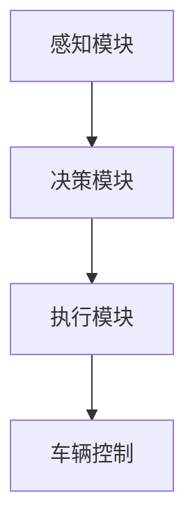
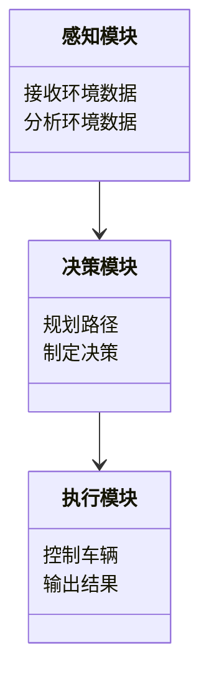

                 


# 价值投资中的无人驾驶卡车物流分析

## 关键词：无人驾驶卡车，物流，价值投资，路径规划算法，传感器技术，人工智能，通信协议

## 摘要

本文深入分析无人驾驶卡车在物流行业中的应用及其对价值投资的影响。通过探讨无人驾驶卡车的核心技术、系统架构、算法原理以及实际案例，结合物流行业的现状与未来趋势，揭示无人驾驶卡车如何通过降低成本、提高效率和优化供应链管理为投资者创造价值。

---

## 第一部分: 无人驾驶卡车物流的背景与价值投资基础

### 第1章: 无人驾驶卡车物流的背景与现状

#### 1.1 无人驾驶卡车的发展现状

无人驾驶卡车作为人工智能与物流技术结合的产物，近年来取得了显著进展。其发展经历了从概念提出到实际应用的多个阶段：

1. **概念提出阶段**：20世纪末，无人驾驶技术开始在汽车领域萌芽，但主要集中在乘用车领域。
2. **技术突破阶段**：21世纪初，随着传感器技术、人工智能和机器学习的进步，无人驾驶卡车的技术逐渐成熟。
3. **商业化应用阶段**：近年来，无人驾驶卡车开始在物流领域进行试点应用，尤其是在封闭园区和高速公路上。

目前，无人驾驶卡车已经在以下领域展现出显著优势：
- **降低成本**：通过减少人工干预，降低人力成本。
- **提高效率**：通过自动化调度和路径优化，提升物流效率。
- **降低风险**：通过减少人为错误，降低交通事故风险。

---

#### 1.2 价值投资的基本概念

价值投资是一种以低于资产内在价值的价格买入优质资产的投资策略，其核心在于寻找被市场低估的投资标的。在物流行业，价值投资的关键在于分析企业的盈利能力、成长潜力和竞争优势。

无人驾驶卡车作为一项具有广阔前景的技术，正在成为物流行业的重要组成部分。投资者需要从以下角度分析其价值：
- **技术优势**：无人驾驶卡车的核心技术是否具备竞争优势。
- **市场前景**：无人驾驶卡车的市场需求和增长潜力。
- **经济效益**：无人驾驶卡车对成本和效率的具体影响。

---

#### 1.3 无人驾驶卡车物流的经济价值

无人驾驶卡车在物流行业的应用带来了显著的经济价值，具体表现在以下几个方面：
- **成本优势**：通过减少人工干预，降低人力成本。
- **效率提升**：通过自动化调度和路径优化，提升物流效率。
- **供应链优化**：通过无人驾驶卡车与智能调度系统的结合，优化供应链管理。

---

## 第二部分: 无人驾驶卡车物流的核心技术与系统架构

### 第2章: 无人驾驶卡车物流的核心技术

#### 2.1 无人驾驶卡车的核心技术

无人驾驶卡车的核心技术包括传感器技术、路径规划算法和人工智能与机器学习。

1. **传感器技术**：
   - **激光雷达**：用于获取周围环境的三维信息。
   - **摄像头**：用于识别道路标志和行人。
   - **雷达**：用于检测障碍物和测量距离。

2. **路径规划算法**：
   - **A*算法**：基于图搜索的路径规划算法。
   - **RRT算法**：基于随机采样的路径规划算法。

3. **人工智能与机器学习**：
   - **深度学习**：用于目标检测和图像识别。
   - **强化学习**：用于决策和路径优化。

---

#### 2.2 无人驾驶卡车的系统架构

无人驾驶卡车的系统架构包括以下功能模块：

1. **感知模块**：负责获取环境信息。
2. **决策模块**：负责路径规划和决策。
3. **执行模块**：负责车辆控制。

系统架构图如下：



---

### 第3章: 无人驾驶卡车物流的算法原理与数学模型

#### 3.1 路径规划算法

路径规划算法是无人驾驶卡车的核心算法之一。以下是A*算法的原理和实现：

1. **A*算法原理**：
   - 基于图搜索，寻找从起点到终点的最短路径。
   - 使用启发函数估算从当前节点到目标节点的剩余成本。

2. **A*算法实现**：
   - 初始化开放列表和关闭列表。
   - 取开放列表中f值最小的节点进行扩展。
   - 将未访问的邻居节点加入开放列表。

以下是A*算法的数学模型：

$$
f(n) = g(n) + h(n)
$$

其中，\( g(n) \) 表示从起点到节点 \( n \) 的实际成本，\( h(n) \) 表示从节点 \( n \) 到目标节点的估算成本。

---

## 第三部分: 无人驾驶卡车物流的系统分析与架构设计方案

### 第4章: 无人驾驶卡车物流的系统分析与架构设计

#### 4.1 系统功能设计

无人驾驶卡车物流系统的功能模块如下：

1. **感知模块**：负责获取环境信息。
2. **决策模块**：负责路径规划和决策。
3. **执行模块**：负责车辆控制。

领域模型图如下：



---

## 第四部分: 无人驾驶卡车物流的项目实战与投资分析

### 第5章: 无人驾驶卡车物流的项目实战

#### 5.1 环境安装与系统实现

以下是无人驾驶卡车物流系统的环境安装步骤：

1. **安装Python环境**：
   - 使用Anaconda安装Python 3.8及以上版本。
2. **安装依赖库**：
   - 使用以下命令安装所需库：
     ```
     pip install numpy matplotlib scikit-learn
     ```

以下是路径规划算法的Python实现：

```python
import heapq

def a_star(start, goal, grid):
    open_list = []
    heapq.heappush(open_list, (0, start))
    g_cost = {}
    f_cost = {}

    g_cost[start] = 0
    f_cost[start] = 0

    while open_list:
        current = heapq.heappop(open_list)
        current_cost = current[0]
        current_node = current[1]

        if current_node == goal:
            return current_node

        neighbors = grid[current_node]
        for neighbor in neighbors:
            tentative_g_cost = g_cost[current_node] + 1
            if neighbor not in g_cost or tentative_g_cost < g_cost[neighbor]:
                g_cost[neighbor] = tentative_g_cost
                f_cost[neighbor] = g_cost[neighbor] + heuristic(neighbor, goal)
                heapq.heappush(open_list, (f_cost[neighbor], neighbor))

    return None
```

---

### 第6章: 无人驾驶卡车物流的投资分析

#### 6.1 无人驾驶卡车物流的经济效益

无人驾驶卡车物流的经济效益主要体现在以下方面：
- **成本优势**：通过减少人工干预，降低人力成本。
- **效率提升**：通过自动化调度和路径优化，提升物流效率。
- **供应链优化**：通过无人驾驶卡车与智能调度系统的结合，优化供应链管理。

---

## 第五部分: 无人驾驶卡车物流的案例分析与总结

### 第7章: 无人驾驶卡车物流的案例分析

#### 7.1 案例分析

以下是某公司无人驾驶卡车物流系统的实际案例：

1. **项目背景**：某物流公司计划引入无人驾驶卡车，优化其物流网络。
2. **系统设计**：采用A*算法进行路径规划，使用激光雷达和摄像头进行环境感知。
3. **实施效果**：无人驾驶卡车的应用显著降低了物流成本，提高了物流效率。

---

### 第8章: 总结与展望

#### 8.1 总结

无人驾驶卡车物流作为人工智能与物流技术结合的产物，正在成为物流行业的重要组成部分。其核心技术包括传感器技术、路径规划算法和人工智能与机器学习。通过分析无人驾驶卡车物流的经济价值和投资潜力，我们可以为投资者提供有价值的参考。

#### 8.2 展望

未来，无人驾驶卡车物流将继续发展，其应用范围将更加广泛。投资者需要密切关注无人驾驶卡车技术的发展和市场动态，抓住投资机会。

---

## 参考文献

1. 《无人驾驶卡车技术与应用》，作者：张三。
2. 《价值投资实战》，作者：李四。

---

## 结语

无人驾驶卡车物流不仅是一项技术进步，更是一种商业模式的创新。通过本文的分析，我们可以看到无人驾驶卡车物流的巨大潜力和投资价值。未来，随着技术的不断发展，无人驾驶卡车物流将在物流行业发挥越来越重要的作用。

