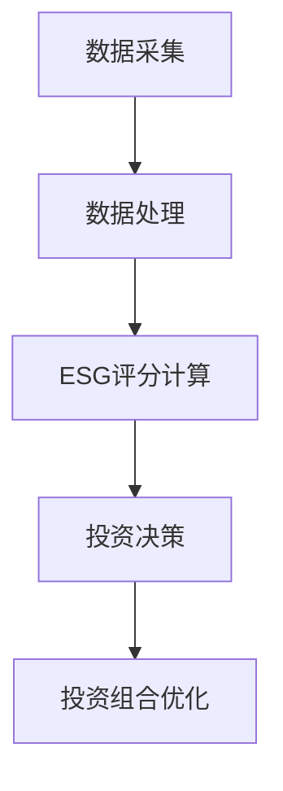

                 


# 价值投资中的环境、社会和治理（ESG）因素

---

## 关键词
- 价值投资
- 环境、社会和治理（ESG）
- 可持续发展
- 投资策略
- 企业治理
- 社会责任

---

## 摘要
在当前全球化的经济环境中，环境、社会和治理（ESG）因素已成为价值投资的重要组成部分。ESG不仅关注企业的财务表现，还强调企业在环境保护、社会责任和治理结构方面的表现。本文从ESG的核心概念出发，详细分析其在价值投资中的应用，并结合实际案例和数学模型，探讨如何通过ESG因素提升投资决策的科学性和可持续性。

---

# 第1章: ESG的核心概念与价值投资的结合

## 1.1 ESG的定义与内涵
- 环境（Environmental）：企业对环境保护的重视程度，包括碳排放、资源利用效率等。
- 社会（Social）：企业在社会责任、员工权益、消费者权益等方面的表现。
- 治理（Governance）：企业的治理结构、董事会效率、透明度等。

## 1.2 ESG与价值投资的关系
- ESG作为价值投资的补充维度，帮助投资者识别企业的长期风险和机会。
- 通过ESG评分，投资者可以更好地评估企业的可持续发展潜力。

---

# 第2章: ESG因素对企业价值的影响

## 2.1 环境因素对企业价值的影响
- 碳排放对企业成本和声誉的影响。
- 绿色能源投资对企业竞争力的提升。

## 2.2 社会因素对企业价值的影响
- 员工福利与企业稳定性。
- 社会责任与企业声誉。

## 2.3 治理因素对企业价值的影响
- 股权结构与股东权益。
- 董事会效率与企业治理。

---

# 第3章: ESG评分体系的构建与应用

## 3.1 ESG评分的核心指标
- 环境指标：碳排放强度、可再生能源使用比例。
- 社会指标：员工满意度、社会责任支出。
- 治理指标：董事会多样性、透明度。

## 3.2 ESG评分的数学模型
$$ ESG\ Score = \alpha \times E + \beta \times S + \gamma \times G $$

其中：
- $E$ 表示环境得分。
- $S$ 表示社会得分。
- $G$ 表示治理得分。
- $\alpha, \beta, \gamma$ 为权重系数。

---

# 第4章: ESG投资策略的算法实现

## 4.1 ESG投资策略的核心算法
### 4.1.1 多因子回归模型
$$ \text{收益} = \beta_1 \times ESG\ Score + \beta_2 \times 市盈率 + \beta_3 \times 市净率 $$

### 4.1.2 基于ESG的筛选策略
- 筛选高ESG评分的企业进行投资。

## 4.2 算法实现的Python代码示例
```python
import pandas as pd
import numpy as np

# 假设data为包含ESG评分和财务数据的数据框
def calculate_esg_score(data):
    # 计算ESG评分
    esg_scores = data[['E', 'S', 'G']].apply(lambda x: np.dot([0.4, 0.3, 0.3], x), axis=1)
    return esg_scores

# 筛选高ESG评分的企业
def esg_invest_strategy(data, threshold=0.7):
    esg_scores = calculate_esg_score(data)
    selected = data[esg_scores > threshold]
    return selected

# 示例数据
data = pd.DataFrame({
    'E': [0.8, 0.6, 0.7],
    'S': [0.6, 0.5, 0.8],
    'G': [0.5, 0.7, 0.6],
    '收益': [10, 5, 8]
})

# 筛选高ESG评分的企业
selected = esg_invest_strategy(data)
print(selected)
```

---

# 第5章: 基于ESG的系统架构设计

## 5.1 系统功能设计
- 数据采集模块：获取企业的ESG数据。
- 数据处理模块：计算ESG评分。
- 投资决策模块：基于ESG评分制定投资策略。

## 5.2 系统架构设计（Mermaid图）


---

# 第6章: ESG投资的案例分析与实战

## 6.1 案例分析：某企业的ESG表现
- 环境表现：碳排放降低20%。
- 社会表现：社会责任支出增加15%。
- 治理表现：董事会成员多元化。

## 6.2 投资策略的实战应用
- 基于ESG评分筛选出表现优异的企业。
- 结合财务指标制定投资组合。

---

# 第7章: ESG投资的未来展望与挑战

## 7.1 未来展望
- ESG投资的全球化趋势。
- 技术进步对ESG评估的推动。

## 7.2 挑战与解决方案
- 数据获取的困难：建立统一的ESG数据标准。
- 企业ESG表现的量化难度：开发更精细的ESG评分模型。

---

# 第8章: 结论与投资建议

## 8.1 结论
- ESG因素已成为价值投资的重要组成部分。
- 通过科学的ESG评分体系和投资策略，可以提升投资的可持续性和回报率。

## 8.2 投资建议
- 投资者应将ESG因素纳入投资决策的考量。
- 关注企业的长期发展和社会责任。

---

## 总结
通过本文的详细分析，读者可以深入了解ESG在价值投资中的重要性，并掌握如何通过ESG因素优化投资策略，实现可持续的财务回报。

