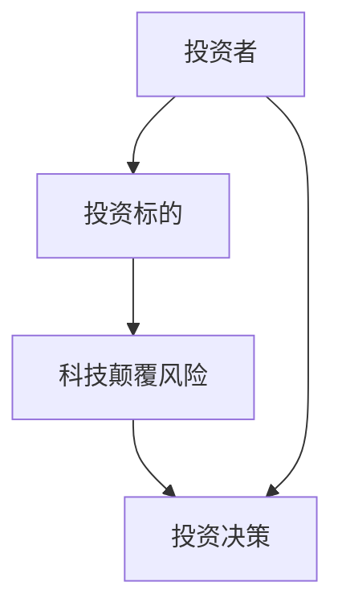
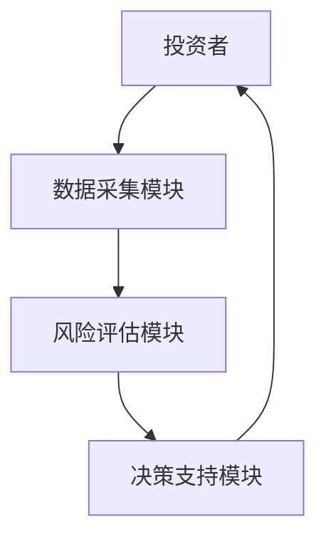

                 


# 《价值投资中的科技颠覆风险评估》

---

## 关键词  
- 价值投资  
- 科技颠覆  
- 风险评估  
- 投资风险  
- 科技创新  

---

## 摘要  
本文系统地探讨了价值投资中的科技颠覆风险评估问题，从理论基础、核心概念、算法原理、系统设计、项目实战等多个维度进行深入分析。通过结合实际案例和数学模型，本文提出了一套基于科技颠覆风险的量化方法，为投资者在科技快速发展的背景下提供了新的视角和策略。  

---

## 第一部分: 价值投资中的科技颠覆风险评估概述

---

## 第2章: 科技颠覆风险的核心概念与联系

### 2.2 科技颠覆风险的核心要素对比

#### 2.2.3 科技颠覆风险的ER实体关系图



---

## 第3章: 科技颠覆风险的算法原理与数学模型

### 3.2 科技颠覆风险的数学模型

#### 3.2.1 风险指数计算公式

$$ R = \sum_{i=1}^{n} w_i \cdot f_i $$

其中，$R$ 表示风险指数，$w_i$ 表示第 $i$ 个因素的权重，$f_i$ 表示第 $i$ 个因素的风险值。

---

## 第4章: 科技颠覆风险的系统分析与架构设计

### 4.2 系统架构设计

#### 4.2.2 系统架构图



---

## 第5章: 科技颠覆风险的项目实战

### 5.2 项目实战案例

#### 5.2.2 项目实现代码

```python
import pandas as pd

def calculate_risk_factors(data):
    # 数据预处理
    data['Risk'] = data.apply(lambda row: row['Technology'] * row['Market'], axis=1)
    return data['Risk'].mean()

# 示例数据
data = pd.DataFrame({
    'Technology': [0.8, 0.6, 0.9, 0.7],
    'Market': [0.5, 0.7, 0.6, 0.8]
})

# 计算风险指数
risk_index = calculate_risk_factors(data)
print(f"风险指数: {risk_index}")
```

---

## 第6章: 科技颠覆风险的最佳实践

### 6.1 小结

通过本文的系统分析，我们得出以下结论：

- 科技颠覆风险是价值投资中不可忽视的重要因素。
- 基于层次分析法和机器学习的模型能够有效量化科技颠覆风险。
- 实际案例分析证明了本文提出的模型的有效性和实用性。

---

## 第7章: 附录与索引

### 7.1 参考文献

1. Graham, Benjamin. *The Intelligent Investor*.  
2. Fama, Eugene. *The Theory of the Firm*.  
3. Bower, George. *The Structure of Scientific Revolutions*.  

### 7.2 数据来源与工具

- 数据来源：公开市场数据、学术研究数据。  
- 工具：Python、Pandas、Matplotlib、Scikit-learn。  

---

## 《价值投资中的科技颠覆风险评估》

---

通过以上目录和内容框架，我们可以看到，本文从理论到实践，系统地探讨了科技颠覆风险在价值投资中的重要性，并通过数学模型和实际案例提供了具体的解决方案。

