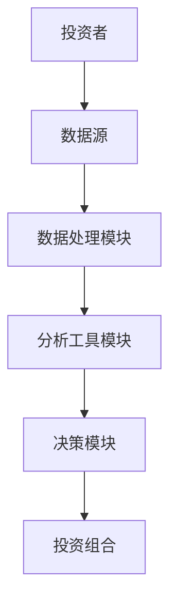
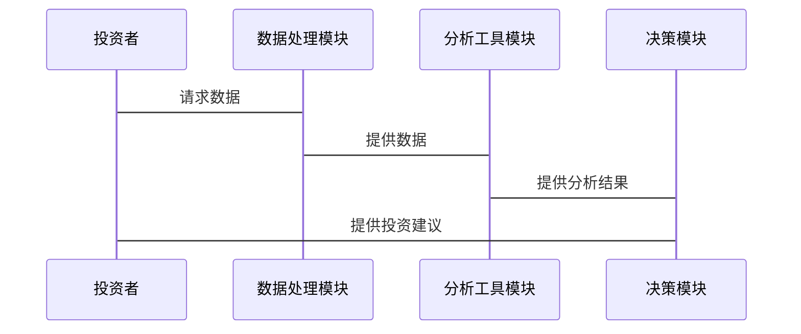

                 


# 价值投资中的质量与价格平衡

---

## 关键词

- 价值投资
- 质量与价格平衡
- 基本面分析
- 估值方法
- 投资策略
- 投资风险管理
- 价值投资系统设计

---

## 摘要

本文深入探讨了价值投资中的质量与价格平衡问题，从理论到实践，系统地分析了如何在投资决策中找到质量与价格的最佳结合点。文章首先介绍了价值投资的基本概念和历史发展，随后详细阐述了质量与价格的定义、特征及其相互关系。接着，从基本面分析和估值方法两个方面，探讨了如何通过质量评估和价格评估实现投资标的的选择。然后，通过构建价值投资的分析框架，系统地介绍了数据收集、分析工具和决策流程的设计。在项目实战部分，通过具体案例分析，展示了如何将理论应用于实际投资决策。最后，讨论了价值投资中的风险管理问题，并展望了价值投资的未来发展趋势。

---

## 第一部分: 引言

### 第1章: 价值投资概述

#### 1.1 价值投资的基本概念

##### 1.1.1 价值投资的定义

价值投资是一种以公司基本面分析为基础，通过评估公司内在价值，寻找市场价格低于内在价值的投资策略。其核心在于“买便宜货”，即以低于公司实际价值的价格买入优质资产。

##### 1.1.2 价值投资的核心理念

价值投资的核心理念是“安全边际”，即在买入价格与内在价值之间留出足够的安全空间，以降低投资风险并确保长期收益。这一理念强调在市场恐慌或低迷时期买入优质资产，以获得长期稳定的回报。

##### 1.1.3 价值投资的目标与意义

价值投资的目标是在长期内获得超越市场平均水平的收益。其意义在于通过深入分析公司基本面，避免短期市场波动的影响，实现资产的稳健增值。

#### 1.2 价值投资的历史与发展

##### 1.2.1 价值投资的起源

价值投资的起源可以追溯到20世纪初，本杰明·格雷厄姆和戴维·多德是该理论的奠基人。他们提出的“安全边际”和“内在价值”概念为价值投资奠定了基础。

##### 1.2.2 价值投资的演变过程

随着金融市场的不断发展，价值投资也在不断演变。从最初的低市盈率股票投资，发展到如今的多元化策略，包括对成长性、稳定性等多方面因素的综合评估。

##### 1.2.3 价值投资在现代投资中的地位

在现代投资理论中，价值投资与现代资产组合理论相结合，成为机构投资者和个人投资者的重要策略之一。它强调长期投资、分散风险和价值发现，对投资市场的发展产生了深远影响。

#### 1.3 价值投资的适用范围与限制

##### 1.3.1 价值投资的适用场景

价值投资适用于那些公司基本面良好、具有长期竞争优势、且市场价格低于内在价值的股票。尤其在市场低迷或恐慌时期，价值投资策略往往能获得超额收益。

##### 1.3.2 价值投资的局限性

价值投资的局限性主要体现在以下几个方面：
1. **周期性限制**：在市场高涨或泡沫时期，价值投资策略可能表现不佳。
2. **信息不对称**：投资者需要依赖公司财报和公开信息，而管理层的道德风险和信息不透明可能影响投资决策。
3. **流动性限制**：在某些情况下，优质资产可能流动性较差，导致变现困难。

##### 1.3.3 价值投资与其他投资策略的区别

与成长投资、指数投资等策略相比，价值投资更注重个股的基本面分析，强调安全边际和长期价值。其区别主要体现在投资理念、选股标准和风险管理策略上。

---

## 第二部分: 价值投资的核心概念

### 第2章: 质量与价格的平衡

#### 2.1 质量与价格的定义与特征

##### 2.1.1 质量的定义与衡量标准

在价值投资中，质量通常指公司的基本面状况，包括盈利能力、财务健康状况、竞争优势和管理团队等方面。衡量质量的主要指标包括ROE（净资产收益率）、ROA（资产收益率）、毛利率等。

##### 2.1.2 价格的定义与衡量标准

价格通常指股票的市场价格，如市盈率（P/E）、市净率（P/B）等指标。这些指标反映了市场对公司价值的评估。

##### 2.1.3 质量与价格的对比分析

质量与价格之间的对比分析可以帮助投资者找到价格低于内在价值的优质资产。通过比较不同公司的质量指标和价格指标，投资者可以识别出具有投资潜力的标的。

#### 2.2 质量与价格的相互关系

##### 2.2.1 质量对价格的影响

公司质量的优劣直接影响其股票价格。优质公司通常能够维持稳定的盈利能力，获得较高的市场估值，从而推动股价上涨。

##### 2.2.2 价格对质量的影响

市场价格的波动会影响投资者对质量的判断。在市场低迷时期，优质公司的股价可能被低估，为投资者提供了买入机会。

##### 2.2.3 质量与价格的动态平衡

质量与价格之间的关系是动态变化的。投资者需要通过持续的分析和调整，找到质量与价格的最佳平衡点，以实现长期的投资收益。

#### 2.3 质量与价格平衡的数学模型

##### 2.3.1 质量与价格平衡的公式推导

内在价值公式：
$$
\text{内在价值} = \frac{\text{净利润}}{\text{资本成本} - \text{增长率}}
$$

价格与质量的平衡公式：
$$
\text{安全边际} = \text{内在价值} - \text{市场价格}
$$

##### 2.3.2 质量与价格平衡的案例分析

以苹果公司为例，假设其净利润为1000亿美元，资本成本为8%，增长率3%，则其内在价值为：
$$
\text{内在价值} = \frac{1000}{0.08 - 0.03} = 20000 \text{亿美元}
$$
若市场价格为15000亿美元，则安全边际为5000亿美元，表明价格低于内在价值，具有投资潜力。

##### 2.3.3 质量与价格平衡的优化方法

通过动态调整投资组合，持续监测公司质量和市场价格的变化，及时发现新的投资机会或规避潜在风险。

---

## 第三部分: 价值投资的理论基础

### 第3章: 基本面分析与估值方法

#### 3.1 基本面分析的核心要素

##### 3.1.1 公司财务状况分析

包括收入、利润、资产负债表和现金流等方面。重点关注公司的盈利能力、财务健康状况和现金流稳定性。

##### 3.1.2 行业地位与竞争优势

分析公司在行业中的地位、市场份额、竞争优势以及未来发展的潜力。

##### 3.1.3 管理团队与公司治理

优秀的管理团队和良好的公司治理结构是公司长期成功的关键因素。

#### 3.2 估值方法的分类与应用

##### 3.2.1 市盈率法

$$
\text{市盈率} = \frac{\text{股价}}{\text{每股收益}}
$$

##### 3.2.2 市净率法

$$
\text{市净率} = \frac{\text{股价}}{\text{每股净资产}}
$$

##### 3.2.3 现金流折现法

$$
\text{内在价值} = \sum_{t=1}^{n} \frac{\text{现金流}}{(1 + r)^t} + \frac{\text{终值}}{(1 + r)^n}
$$

##### 3.2.4 其他估值方法

包括股息率法、EV/EBITDA等。

#### 3.3 估值与质量的结合

##### 3.3.1 估值的基本原理

通过评估公司的内在价值，判断其市场价格是否具有吸引力。

##### 3.3.2 质量对估值的影响

优质公司通常具有较高的市场估值，但市场价格可能因市场波动而低于内在价值。

##### 3.3.3 质量与价格的动态平衡

通过持续分析公司质量与市场价格的变化，调整投资策略，实现长期收益。

---

## 第四部分: 系统分析与架构设计

### 第4章: 价值投资的系统设计

#### 4.1 问题场景介绍

投资者需要一个系统化的框架，以评估公司的质量和市场价格，找到最佳的投资机会。

#### 4.2 系统功能设计

##### 4.2.1 数据收集模块

包括收集公司的财务数据、行业数据和市场数据。

##### 4.2.2 分析工具模块

包括基本面分析工具、估值模型和风险评估工具。

##### 4.2.3 决策流程模块

包括筛选优质公司、评估市场价格和制定投资策略。

#### 4.3 系统架构设计

使用Mermaid图展示系统架构：



#### 4.4 系统接口设计

定义接口：数据源接口、分析工具接口和决策模块接口。

#### 4.5 系统交互设计

使用Mermaid图展示交互流程：



---

## 第五部分: 项目实战

### 第5章: 价值投资实战分析

#### 5.1 环境安装

安装必要的工具和库，如Python、Pandas、NumPy等。

#### 5.2 核心实现

##### 5.2.1 数据收集

编写Python代码收集公司财务数据和市场数据：

```python
import pandas as pd
import requests

url = "https://www.example.com/financial_data"
response = requests.get(url)
data = response.json()
df = pd.DataFrame(data)
print(df.head())
```

##### 5.2.2 数据分析与估值

使用Python代码进行基本面分析和估值：

```python
def calculate_intrinsic_value(eps, growth_rate, cost_of_capital):
    return eps / (cost_of_capital - growth_rate)

eps = 5
growth_rate = 0.03
cost_of_capital = 0.08
intrinsic_value = calculate_intrinsic_value(eps, growth_rate, cost_of_capital)
print(f"内在价值: {intrinsic_value}")
```

##### 5.2.3 投资决策

根据分析结果，制定投资策略。

#### 5.3 案例分析

以苹果公司为例，进行详细分析：

##### 5.3.1 苹果公司的基本面分析

分析苹果的财务状况、行业地位和竞争优势。

##### 5.3.2 苹果公司的估值

使用现金流折现法计算苹果公司的内在价值。

##### 5.3.3 投资决策

根据分析结果，决定是否买入苹果股票。

#### 5.4 项目小结

总结项目实施过程中的经验和教训，提出改进建议。

---

## 第六部分: 风险管理

### 第6章: 价值投资中的风险管理

#### 6.1 风险识别

##### 6.1.1 市场风险

市场价格波动对投资组合的影响。

##### 6.1.2 信用风险

公司财务状况恶化导致的投资损失。

#### 6.2 风险评估

##### 6.2.1 风险评估模型

使用VaR（Value at Risk）模型评估投资组合的风险。

#### 6.3 风险应对策略

##### 6.3.1 分散投资

通过投资多元化资产降低风险。

##### 6.3.2 设置止损

在股价跌破一定价格时及时卖出，避免进一步损失。

##### 6.3.3 定期调整

根据市场变化和公司基本面，定期调整投资组合。

---

## 第七部分: 价值投资的未来趋势

### 第7章: 价值投资的未来发展

#### 7.1 价值投资的创新

##### 7.1.1 ESG投资

将环境、社会和治理因素纳入投资决策，寻找具有可持续发展能力的公司。

##### 7.1.2 人工智能在价值投资中的应用

利用大数据和机器学习技术，提高基本面分析和估值的准确性。

#### 7.2 价值投资的挑战

##### 7.2.1 数字化转型

随着科技的发展，投资方式也在不断变化，投资者需要适应新的技术环境。

##### 7.2.2 全球化趋势

全球化背景下，投资者需要关注跨国公司的投资机会和风险。

#### 7.3 价值投资的未来展望

未来，价值投资将更加注重长期可持续发展，结合技术创新和全球化趋势，为投资者提供更多的机会和挑战。

---

## 附录

### 附录A: 术语表

- **内在价值**：公司未来现金流的现值。
- **安全边际**：内在价值与市场价格之间的差额。
- **市盈率**：股价除以每股收益。
- **市净率**：股价除以每股净资产。

### 附录B: 数据来源

- 公司财务数据：来源于公司财报和金融数据库。
- 市场数据：来源于股票交易所和金融网站。

### 附录C: 工具推荐

- **数据收集工具**：Python、Pandas。
- **分析工具**：Excel、Python库（如Pandas、NumPy）。
- **可视化工具**：Matplotlib、Tableau。

### 附录D: 参考文献

- 格雷厄姆，本杰明. 《The Intelligent Investor》.
- 范德格，彼得. 《The Warren Buffett Way》.
- 肖恩，莫尼. 《The New York Times Guide to Personal Investment》.

---

## 结语

价值投资中的质量与价格平衡是一个复杂而深刻的话题。通过系统的分析和实践，投资者可以更好地理解这一概念，并在实际投资中应用相关策略。未来，随着技术的进步和市场的变化，价值投资将继续发展，为投资者提供更多的机会和挑战。

