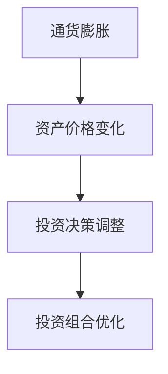
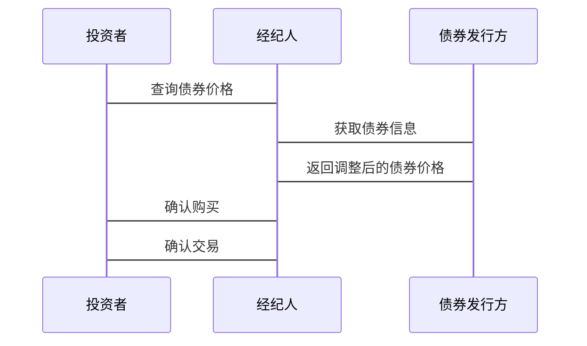
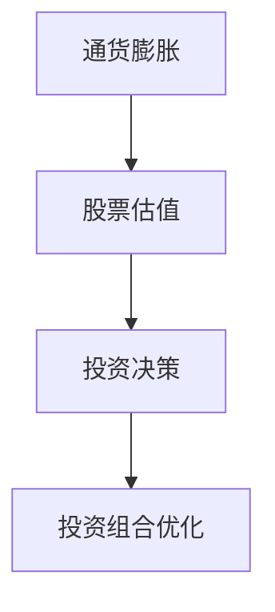

                 


# 价值投资中的通货膨胀考虑

> 关键词：价值投资、通货膨胀、资产定价、投资组合、风险管理

> 摘要：本文深入探讨了通货膨胀对价值投资策略的影响，分析了如何在通货膨胀环境下调整资产定价、优化投资组合以及管理投资风险。通过数学模型、系统架构和实际案例的分析，本文为投资者提供了应对通货膨胀的有效策略和方法。

---

## 第一部分：通货膨胀的基础与价值投资的背景

### 第1章：通货膨胀的基本概念与影响

#### 1.1 通货膨胀的定义与类型

**背景介绍**：通货膨胀是经济学中的一个重要概念，指的是物价总水平在一段时间内的持续上涨。本文将从通货膨胀的定义、类型及其对经济的影响入手，分析其对价值投资策略的潜在影响。

**核心概念与联系**：通货膨胀与价值投资之间的关系可以通过以下 **ER实体关系图** 来展示：

```mermaid
er
    entity 通货膨胀 {
        key 货币购买力
        attribute 涨幅率、影响范围
    }
    entity 价值投资 {
        key 投资策略
        attribute 股票估值、投资组合
    }
    通货膨胀 --> 价值投资 : 影响投资策略
```

**算法原理讲解**：通货膨胀率可以通过消费者价格指数（CPI）来衡量，公式为：

$$ \text{通货膨胀率} = \frac{\text{当前CPI} - \text{基期CPI}}{\text{基期CPI}} \times 100\% $$

例如，如果当前CPI为105，基期CPI为100，则通货膨胀率为5%。

---

#### 1.2 通货膨胀与价值投资的关系

**背景介绍**：价值投资的核心理念是寻找被市场低估的资产，而通货膨胀会扭曲资产的相对价值，影响投资决策。

**核心概念与联系**：以下 **mermaid流程图** 展示了通货膨胀对价值投资的潜在影响路径：



**系统分析与架构设计方案**：为了量化通货膨胀对投资组合的影响，我们可以通过以下系统架构进行分析：


---

## 第二部分：通货膨胀对资产定价的影响

### 第2章：通货膨胀与资产定价

#### 2.1 股票定价与通货膨胀

**背景介绍**：股票的内在价值公式为：

$$ V = \frac{CF}{(1 + r)^n} $$

其中，$CF$ 是未来现金流，$r$ 是折现率，$n$ 是时间跨度。通货膨胀会增加$CF$和$r$的不确定性。

**项目实战**：假设某公司的未来现金流为$100万，折现率为5%，通货膨胀率为3%，计算调整后的股票价值：

```python
def calculate_stock_value(CF, r, n, inflation):
    real_r = (1 + r) / (1 + inflation) - 1
    discounted_value = CF / (1 + real_r)
    return discounted_value

CF = 1000000
r = 0.05
n = 5
inflation = 0.03
print(calculate_stock_value(CF, r, n, inflation))
```

#### 2.2 债券定价与通货膨胀

**背景介绍**：债券的票面价值为$F$，到期收益率为$y$，通货膨胀会降低债券的实际收益率。

**算法原理讲解**：债券的通货膨胀调整后的实际收益率公式为：

$$ \text{实际收益率} = \frac{y - \text{通货膨胀率}}{1 + \text{通货膨胀率}} $$

**系统分析与架构设计方案**：以下 **mermaid序列图** 展示了债券定价过程中的通货膨胀调整：



---

## 第三部分：通货膨胀对投资组合的影响

### 第3章：投资组合的通货膨胀风险管理

#### 3.1 投资组合的资产配置

**背景介绍**：投资组合的资产配置可以通过以下 **mermaid类图** 来展示：


**项目实战**：根据通货膨胀率调整资产配置比例：

```python
def adjust_asset_allocation(inflation_rate, stock_weight, bond_weight, cash_weight):
    if inflation_rate > 5%:
        stock_weight += 5%
        bond_weight -= 5%
    return stock_weight, bond_weight, cash_weight

inflation_rate = 4%
stock_weight = 60%
bond_weight = 20%
cash_weight = 20%
print(adjust_asset_allocation(inflation_rate, stock_weight, bond_weight, cash_weight))
```

---

## 第四部分：价值投资中的通货膨胀考虑

### 第4章：通货膨胀与价值投资策略

#### 4.1 通货膨胀下的价值投资策略

**背景介绍**：在通货膨胀环境下，价值投资者需要调整传统的估值模型，引入通货膨胀因子。

**算法原理讲解**：通货膨胀调整后的股票估值公式为：

$$ V_{\text{调整后}} = V_{\text{原始}} \times (1 + \text{通货膨胀率}) $$

**系统分析与架构设计方案**：以下 **mermaid架构图** 展示了投资模型的架构：



---

## 第五部分：结论与展望

### 5.1 总结

通货膨胀是价值投资者必须考虑的重要因素。通过调整估值模型、优化资产配置和选择抗通胀资产，投资者可以在通货膨胀环境下实现稳健的投资回报。

### 5.2 展望

未来，随着通货膨胀的复杂化，价值投资者需要更加动态地调整策略，结合大数据和人工智能技术，开发更精准的通货膨胀预测模型和投资组合优化算法。

---

通过以上分析，投资者可以在通货膨胀环境下更好地进行价值投资，实现长期稳健的收益。

