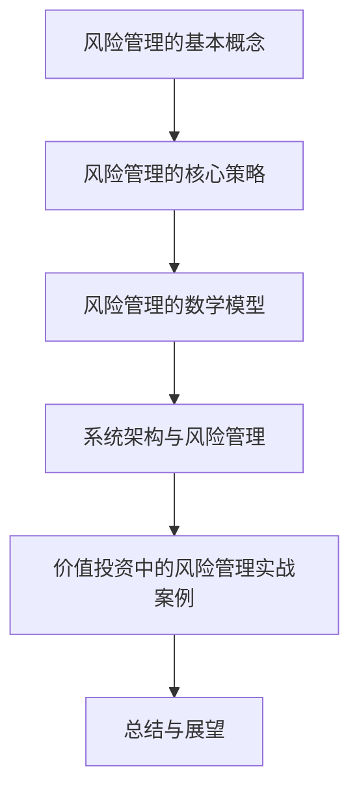

                 

# 价值投资中的风险管理策略

> 关键词：风险管理，价值投资，安全边际，波动率，投资组合，情景分析

> 摘要：本文详细探讨了价值投资中的风险管理策略，从基本概念到数学模型，从系统架构到实际案例，全面解析了如何在价值投资中有效管理风险。文章首先介绍了风险管理的核心概念和价值投资的基本理念，然后深入分析了风险管理的核心策略，包括分散投资、止损设置和情景分析等。接着，文章详细讲解了风险管理的数学模型与工具，如波动率、VaR等。最后，通过实际案例分析，展示了风险管理策略在价值投资中的应用，并总结了风险管理的重要性及未来的发展趋势。

---

## 目录

### 第1章：风险管理的基本概念

1.1 风险的定义与类型  
1.2 风险在投资中的重要性  
1.3 价值投资与风险管理的关系  
1.4 本章小结  

### 第2章：价值投资的核心理念

2.1 价值投资的定义与特点  
2.2 安全边际的概念与计算  
2.3 竞争优势的识别与分析  
2.4 长期视角在风险管理中的作用  
2.5 本章小结  

### 第3章：风险管理的核心策略

3.1 分散投资的风险  
3.2 止损点的设置与应用  
3.3 情景分析与压力测试  
3.4 风险调整后的收益评估  
3.5 本章小结  

### 第4章：风险管理的数学模型与工具

4.1 风险的量化方法  
4.2 波动率的计算与应用  
4.3 VaR（在险值）的定义与计算  
4.4 现代投资组合理论（MPT）的应用  
4.5 本章小结  

### 第5章：系统架构与风险管理

5.1 风险管理系统的整体架构  
5.2 系统功能设计与实现  
5.3 系统接口设计与交互  
5.4 系统监控与预警机制  
5.5 本章小结  

### 第6章：价值投资中的风险管理实战案例

6.1 案例背景介绍  
6.2 案例分析与策略制定  
6.3 风险管理策略的实施过程  
6.4 案例总结与经验分享  
6.5 本章小结  

### 第7章：总结与展望

7.1 全文总结  
7.2 风险管理的未来发展趋势  
7.3 对投资者的建议与展望  
7.4 本章小结  

---

### 文章结构图

---

## 第1章：风险管理的基本概念

### 1.1 风险的定义与类型

#### 1.1.1 风险的定义

风险是指在投资活动中，由于不确定性因素的存在，导致投资收益偏离预期值的可能性。简单来说，风险就是投资回报的不确定性。

#### 1.1.2 风险的主要类型

1. 市场风险：由于市场波动导致资产价格下跌的风险。
2. 利率风险：由于利率变化影响债券价格的风险。
3. 通货膨胀风险：由于通货膨胀导致购买力下降的风险。
4. 流动性风险：由于资产难以快速变现而导致的损失风险。
5. 操作风险：由于操作失误或欺诈行为导致的损失风险。

#### 1.1.3 风险在投资中的重要性

在投资中，风险管理是确保投资目标实现的重要保障。有效的风险管理可以帮助投资者在面对市场波动时，减少损失，保持投资组合的稳定性。

### 1.2 风险在价值投资中的重要性

#### 1.2.1 价值投资的核心理念

价值投资是一种长期投资策略，强调以低于内在价值的价格购买优质资产。其核心理念是通过深入分析企业的基本面，寻找具有持续竞争优势和合理估值的企业进行投资。

#### 1.2.2 风险管理在价值投资中的地位

在价值投资中，风险管理是实现长期收益的重要保障。通过有效的风险管理，投资者可以避免因短期市场波动导致的重大损失，从而实现长期的资本增值。

#### 1.2.3 风险管理与收益的关系

风险管理并不是为了降低收益，而是为了在风险可控的前提下，实现收益的最大化。通过科学的风险管理，投资者可以在长期投资中获得更稳定的收益。

---

### 总结

风险管理是价值投资中不可或缺的一部分。通过合理分散投资、设置止损点、进行情景分析等策略，投资者可以在不确定的市场环境中，保护本金安全，实现长期稳健的投资收益。

---

以上是文章的目录大纲和第1章的内容。后续章节将按照类似的逻辑展开，结合数学模型、系统架构和实际案例，深入分析价值投资中的风险管理策略。

