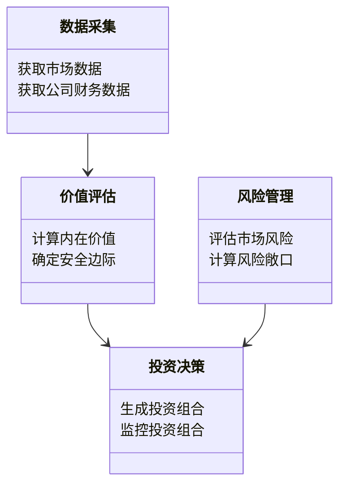
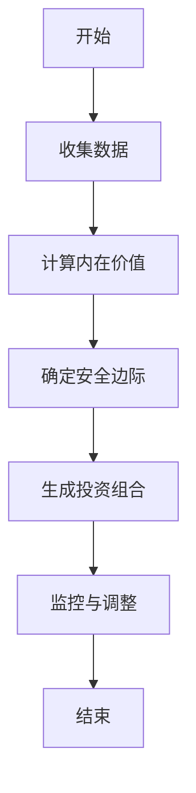

                 


# 价值投资之父：本杰明·格雷厄姆的投资哲学

## 关键词
- 价值投资
- 安全边际
- 投资哲学
- 风险管理
- 内在价值
- 防御性投资
- 投资心理学

## 摘要
本杰明·格雷厄姆是价值投资的鼻祖，他提出的投资哲学深刻影响了现代投资理论。本文系统阐述了格雷厄姆的投资理念，包括安全边际、防御性投资、价值评估、风险管理等方面，并结合实际案例和系统架构，详细分析了他的投资策略及其在实践中的应用。通过本文，读者可以全面理解格雷厄姆的投资哲学，并将其应用于实际投资中。

---

# 第1章 本杰明·格雷厄姆的生平与投资哲学概述

## 1.1 本杰明·格雷厄姆的生平简介
### 1.1.1 格雷厄姆的早年经历与教育背景
本杰明·格雷厄姆（Benjamin Graham）出生于1894年，是一位英国移民的后代。他在纽约市长大，父亲是一位成功的 businessman。格雷厄姆在哥伦比亚大学获得经济学学士学位，随后进入华尔街工作，开始了他的投资生涯。

### 1.1.2 格雷厄姆的职业生涯与发展
格雷厄姆的职业生涯始于1914年，他在多家投资公司工作，逐渐积累了丰富的投资经验。他在职业生涯中撰写了多本关于投资的书籍，其中包括《安全边际》和《价值投资》等经典著作。

### 1.1.3 格雷厄姆对投资界的贡献与影响
格雷厄姆是价值投资的鼻祖，他的投资哲学影响了无数投资者。他的学生包括著名的沃伦·巴菲特，巴菲特曾称格雷厄姆为“投资导师”。

## 1.2 投资哲学的核心概念
### 1.2.1 价值投资的基本定义
价值投资是一种投资策略，强调购买被市场低估的股票，以低于其内在价值的价格买入，并长期持有。

### 1.2.2 格雷厄姆投资哲学的核心思想
格雷厄姆的核心思想是“安全边际”，即在购买股票时，确保价格远低于其内在价值，以降低投资风险。

### 1.2.3 格雷厄姆哲学对现代投资的影响
格雷厄姆的投资哲学奠定了现代价值投资的基础，他的思想被广泛应用于机构投资和个人投资中。

---

# 第2章 安全边际与投资策略

## 2.1 安全边际的概念与重要性
### 2.1.1 安全边际的定义
安全边际是指股票的市场价格与其内在价值之间的差距。格雷厄姆认为，购买股票时，市场价格应远低于其内在价值，以确保投资的安全性。

### 2.1.2 安全边际在投资决策中的作用
安全边际为投资者提供了风险缓冲，即使市场波动，投资者也能在价格回升时获利。

### 2.1.3 安全边际与风险控制的关系
通过保持安全边际，投资者可以降低投资组合的风险，避免重大亏损。

## 2.2 格雷厄姆的投资策略
### 2.2.1 买入便宜的伟大公司
格雷厄姆强调投资于具有强大基本面和较低估值的伟大公司。

### 2.2.2 投资组合的构建与管理
格雷厄姆建议构建分散的投资组合，以降低风险，并定期审视和调整。

### 2.2.3 安全边际的应用实例
通过具体案例，分析如何在实际投资中应用安全边际的概念。

---

# 第3章 风险管理与防御性投资

## 3.1 风险管理的核心原则
### 3.1.1 风险的定义与分类
风险是指投资可能遭受损失的可能性。分类包括市场风险、流动性风险等。

### 3.1.2 风险管理在投资中的重要性
有效的风险管理可以保护投资者免受重大损失，确保投资目标的实现。

### 3.1.3 格雷厄姆的风险管理策略
格雷厄姆强调防御性投资，避免高风险和不确定的投资。

## 3.2 防御性投资的实践
### 3.2.1 防御性投资的定义与特点
防御性投资是指通过投资于低波动性和高估值安全性的资产，以降低风险。

### 3.2.2 防御性投资的具体实施方法
包括选择防御性强的行业、分散投资、定期评估等。

### 3.2.3 防御性投资与安全边际的关系
防御性投资与安全边际相辅相成，共同降低投资风险。

---

# 第4章 价值评估与内在价值计算

## 4.1 内在价值的定义与计算方法
### 4.1.1 内在价值的定义
内在价值是指公司未来现金流的现值，反映了公司的真实价值。

### 4.1.2 内在价值的计算公式与步骤
内在价值计算公式：
$$
\text{内在价值} = \sum_{t=1}^{n} \frac{\text{现金流}_t}{(1 + r)^t}
$$
其中，r是折现率，n是预测期数。

### 4.1.3 内在价值计算的注意事项
包括现金流预测的准确性、折现率的选择等。

## 4.2 市场波动与投资机会
### 4.2.1 市场波动的定义与影响
市场波动是指市场价格的频繁变动，可能会影响投资者的决策。

### 4.2.2 市场波动与内在价值的关系
市场波动可能导致市场价格偏离内在价值，为投资者提供投资机会。

### 4.2.3 如何利用市场波动寻找投资机会
投资者应关注市场价格低于内在价值的情况，寻找投资机会。

---

# 第5章 投资心理学与决策过程

## 5.1 投资者心理的误区
### 5.1.1 过度自信与从众心理
投资者常常过于自信，或盲目跟随市场趋势，导致错误决策。

### 5.1.2 情绪化决策的危害
情绪化决策可能导致投资者错失良机或过度亏损。

### 5.1.3 心理账户的错觉与偏差
心理账户可能导致投资者对不同投资的处理方式不一致，影响整体决策。

## 5.2 理性决策与投资纪律
### 5.2.1 理性决策的重要性
理性决策有助于投资者避免情绪化和错误决策。

### 5.2.2 投资纪律的建立与执行
包括制定投资计划、定期审视投资组合等。

### 5.2.3 避免情绪干扰的策略
如设定止损点、分散投资等。

---

# 第6章 价值投资的系统架构与实现

## 6.1 价值投资的系统架构
### 6.1.1 系统架构设计
包括数据采集、价值评估、风险控制、投资决策等模块。

### 6.1.2 系统功能设计
使用 Mermaid 绘制系统功能类图。



## 6.2 投资决策算法实现
### 6.2.1 算法流程
使用 Mermaid 绘制算法流程图。



### 6.2.2 数学模型与公式
内在价值计算公式：
$$
\text{内在价值} = \sum_{t=1}^{n} \frac{\text{现金流}_t}{(1 + r)^t}
$$

### 6.2.3 代码实现
以下是一个简单的内在价值计算的 Python 代码示例：

```python
def calculate_intrinsic_value(cash_flows, discount_rate):
    present_value = 0
    for t in range(len(cash_flows)):
        present_value += cash_flows[t] / (1 + discount_rate) ** t
    return present_value

cash_flows = [100, 150, 200]
discount_rate = 0.10
iv = calculate_intrinsic_value(cash_flows, discount_rate)
print(f"内在价值: {iv}")
```

---

# 第7章 项目实战与投资策略实现

## 7.1 投资策略实战
### 7.1.1 案例分析
分析一个具体的投资案例，展示如何应用格雷厄姆的投资策略。

### 7.1.2 投资组合优化
通过具体数据展示如何优化投资组合，降低风险，提高收益。

## 7.2 投资组合优化实例
### 7.2.1 数据分析
使用 Python 进行数据分析，展示如何评估股票的价值。

### 7.2.2 优化过程
通过优化算法，找到最优投资组合。

## 7.3 总结与未来展望
总结格雷厄姆投资哲学的核心要点，并展望其在未来投资中的应用前景。

---

# 结语

通过本文的详细阐述，读者可以全面理解本杰明·格雷厄姆的价值投资哲学，并将其应用于实际投资中。格雷厄姆的投资理念强调安全边际、风险管理、价值评估和理性决策，这些原则在现代投资中依然具有重要的指导意义。希望本文能为投资者提供有价值的参考，帮助他们在复杂的市场环境中做出明智的投资决策。

