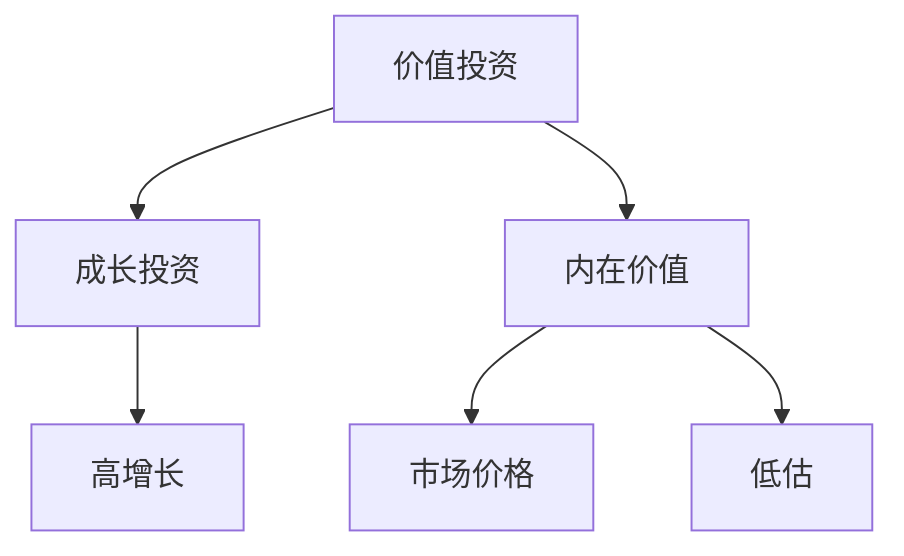
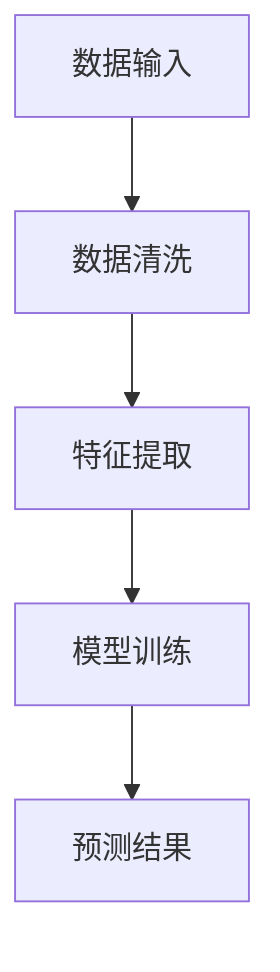
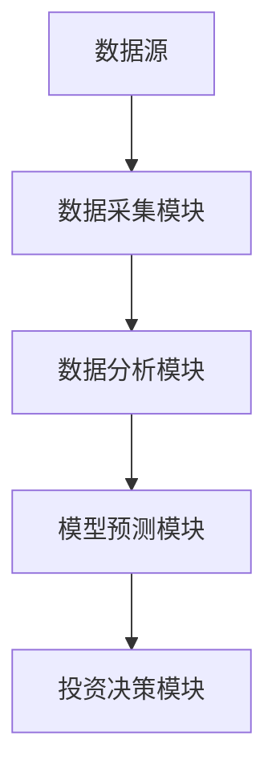

                 

# 价值投资在不同经济周期中的策略调整

## 关键词：价值投资，经济周期，投资策略，市场分析，风险管理

## 摘要：价值投资是一种长期投资策略，强调以低于内在价值的价格购买优质资产。在不同的经济周期中，价值投资的策略需要根据市场环境的变化进行调整。本文系统地分析了经济周期的特征，并结合价值投资的核心理念，提出了在扩张期、衰退期、复苏期和成熟期等不同经济周期下的策略调整方法。通过案例分析和数学模型的应用，本文为投资者提供了实用的投资决策支持。

---

## 正文

### 第1章: 价值投资的核心理念与经济周期分析

#### 1.1 价值投资的起源与发展

##### 1.1.1 价值投资的起源

价值投资的概念可以追溯到20世纪初，由本杰明·格雷厄姆和戴维·多德提出。格雷厄姆在其著作《证券分析》中首次系统地阐述了价值投资的理论，强调以内在价值为基础进行投资决策。

- **背景介绍**：价值投资是一种以基本面分析为基础的投资策略，旨在通过识别市场价格与内在价值之间的差异，寻找被市场低估的投资机会。其核心思想是“买 cheap, 卖 dear”，即以低于内在价值的价格买入，以高于内在价值的价格卖出。

- **核心概念与联系**：价值投资与成长投资是两种不同的投资理念，前者关注低估的资产，后者关注高增长的资产。图1展示了两种投资理念的对比。

##### 1.1.2 价值投资的主要理论

价值投资的核心理论包括以下几点：

1. **安全边际**：买入价格低于内在价值的部分，以提供安全边际，降低投资风险。
2. **市场情绪的影响**：市场的非理性波动为价值投资者提供了低价买入的机会。
3. **长期视角**：价值投资强调长期持有的策略，避免短期市场的波动干扰。

##### 1.1.3 价值投资与成长投资的区别

| **维度** | **价值投资** | **成长投资** |
|----------|--------------|--------------|
| 目标     | 寻找低估资产 | 寻找高增长资产 |
| 时间框架 | 长期持有     | 中短期交易   |
| 风险偏好 | 低风险       | 高风险       |

---

#### 1.2 经济周期的基本概念

##### 1.2.1 经济周期的定义

经济周期是指经济活动在时间上的波动，通常分为四个阶段：衰退、复苏、扩张和成熟。

- **衰退期**：经济活动放缓，企业盈利下降，失业率上升。
- **复苏期**：经济开始复苏，企业盈利逐步恢复。
- **扩张期**：经济增长迅速，企业盈利增加，市场情绪乐观。
- **成熟期**：经济增长稳定，市场趋于饱和。

##### 1.2.2 经济周期的类型

常用的经济周期指标包括：

1. **GDP增长率**：衡量整体经济表现的核心指标。
2. **失业率**：反映劳动力市场的健康状况。
3. **消费者价格指数（CPI）**：衡量通货膨胀水平。
4. **利率水平**：影响市场流动性和企业融资成本。

##### 1.2.3 经济周期对投资的影响

经济周期对价值投资的影响主要体现在以下几个方面：

1. **资产价格波动**：在衰退期，资产价格可能被低估；在扩张期，资产价格可能被高估。
2. **市场情绪**：市场情绪在经济周期的不同阶段会有显著变化，影响投资者的决策。
3. **投资机会**：不同经济周期阶段下，不同行业的投资机会也会有所不同。

---

### 第2章: 经济周期的分析与判断

#### 2.1 经济周期的指标分析

##### 2.1.1 GDP增长率

GDP增长率是衡量经济周期的核心指标。在衰退期，GDP增长率通常为负；在复苏期和扩张期，GDP增长率逐步上升。

##### 2.1.2 失业率

失业率在衰退期上升，在扩张期下降。失业率的变化可以帮助投资者判断经济周期所处的阶段。

##### 2.1.3 消费者价格指数（CPI）

CPI反映了通货膨胀水平。在经济周期的不同阶段，通货膨胀对投资的影响也不同。例如，在衰退期，通货膨胀率通常较低，而在扩张期，通货膨胀率可能上升。

##### 2.1.4 利率水平

利率水平影响企业的融资成本和市场的流动性。在衰退期，央行通常会降低利率以刺激经济；在扩张期，央行可能提高利率以抑制过热的经济。

##### 2.1.5 股市估值指标

常用的股市估值指标包括市盈率（P/E）和市净率（P/B）。这些指标可以帮助投资者判断市场整体的估值水平。

---

#### 2.2 经济周期的阶段划分

##### 2.2.1 经济周期的四个阶段

1. **衰退期**：经济活动放缓，企业盈利下降。
2. **复苏期**：经济开始复苏，企业盈利逐步恢复。
3. **扩张期**：经济增长迅速，企业盈利增加。
4. **成熟期**：经济增长稳定，市场趋于饱和。

##### 2.2.2 每个阶段的特征与表现

| **阶段**   | **特征**                     | **表现**                     |
|------------|------------------------------|------------------------------|
| 衰退期     | GDP增长率下降，失业率上升    | 股市表现疲软，资产价格被低估  |
| 复苏期     | GDP增长率逐步回升，失业率下降| 股市逐渐复苏，资产价格回升    |
| 扩张期     | GDP增长率上升，失业率稳定    | 股市表现强劲，资产价格被高估  |
| 成熟期     | GDP增长率稳定，失业率低      | 股市波动较小，资产价格合理    |

##### 2.2.3 如何判断当前所处的经济周期阶段

判断经济周期阶段的方法包括：

1. **观察宏观经济指标**：如GDP增长率、失业率、CPI等。
2. **市场情绪分析**：通过投资者情绪指标（如恐慌指数）判断市场情绪。
3. **行业表现分析**：不同行业在不同经济周期中的表现不同，例如周期性行业在扩张期表现较好，防御性行业在衰退期表现较好。

---

#### 2.3 经济周期的预测与模型

##### 2.3.1 经济周期预测的基本方法

常用的经济周期预测方法包括：

1. **统计模型**：如ARIMA模型、VAR模型等。
2. **指标合成法**：通过综合多个指标的变化趋势进行预测。
3. **专家判断法**：结合经济学家的判断进行预测。

##### 2.3.2 常用的经济周期预测模型

以下是一个简单的经济周期预测模型：

##### 2.3.3 如何结合模型进行投资决策

在实际投资中，投资者可以结合经济周期预测模型和价值投资策略进行综合判断。例如，在预测到经济将进入衰退期时，可以适当增加防御性资产的配置。

---

### 第3章: 价值投资在不同经济周期中的策略调整

#### 3.1 经济周期扩张期的策略调整

##### 3.1.1 扩张期的特征与投资机会

在扩张期，经济增长迅速，企业盈利增加，市场情绪乐观。此时，价值投资应关注高增长行业，如科技、消费等。

##### 3.1.2 扩张期的价值投资策略

1. **行业选择**：重点配置周期性行业，如制造业、原材料等。
2. **估值标准**：适当放宽安全边际要求，但需确保资产质量。
3. **投资组合调整**：增加股票配置比例，减少债券等固定收益资产的比例。

##### 3.1.3 实战案例分析

假设当前经济处于扩张期，市场整体估值较高。投资者可以选择那些具有较高增长潜力但估值相对合理的行业龙头股。

---

#### 3.2 经济周期衰退期的策略调整

##### 3.2.1 衰退期的特征与投资机会

在衰退期，经济活动放缓，企业盈利下降，市场情绪悲观。此时，价值投资应关注那些具有较强防御性的行业，如公用事业、医疗保健等。

##### 3.2.2 衰退期的价值投资策略

1. **行业选择**：重点配置防御性行业，如公用事业、医疗保健等。
2. **估值标准**：严格要求安全边际，寻找被市场严重低估的资产。
3. **投资组合调整**：增加现金比例，减少股票配置比例。

##### 3.2.3 实战案例分析

假设当前经济处于衰退期，市场整体估值较低。投资者可以选择那些具有较高分红率且财务状况稳定的蓝筹股。

---

#### 3.3 经济周期复苏期的策略调整

##### 3.3.1 复苏期的特征与投资机会

在复苏期，经济活动逐步恢复，企业盈利开始回升。此时，价值投资应关注那些在衰退期被低估但在复苏期具有增长潜力的行业。

##### 3.3.2 复苏期的价值投资策略

1. **行业选择**：重点配置周期性行业，如房地产、汽车等。
2. **估值标准**：寻找那些在衰退期被低估但在复苏期具有增长潜力的资产。
3. **投资组合调整**：逐步增加股票配置比例，优化资产配置结构。

##### 3.3.3 实战案例分析

假设当前经济处于复苏期，市场整体估值逐渐回升。投资者可以选择那些具有较高增长潜力且估值合理的成长股。

---

#### 3.4 经济周期成熟期的策略调整

##### 3.4.1 成熟期的特征与投资机会

在成熟期，经济增长稳定，市场趋于饱和。此时，价值投资应关注那些具有较强竞争优势且估值合理的行业。

##### 3.4.2 成熟期的价值投资策略

1. **行业选择**：重点配置成熟行业，如消费、金融等。
2. **估值标准**：寻找那些具有较高分红率且财务状况稳定的资产。
3. **投资组合调整**：保持资产配置的均衡，注重风险控制。

##### 3.4.3 实战案例分析

假设当前经济处于成熟期，市场整体估值合理。投资者可以选择那些具有较高分红率且财务状况稳定的蓝筹股。

---

### 第4章: 价值投资策略的数学模型与系统分析

#### 4.1 价值投资策略的数学模型

##### 4.1.1 内在价值计算模型

内在价值计算公式：

$$
\text{内在价值} = \frac{\text{净利润}}{\text{折现率} - \text{增长率}}
$$

##### 4.1.2 安全边际计算模型

安全边际计算公式：

$$
\text{安全边际} = \text{内在价值} - \text{市场价格}
$$

##### 4.1.3 经济周期对价值投资策略的影响模型

$$
\text{投资策略} = f(\text{经济周期阶段}, \text{资产质量}, \text{估值水平})
$$

#### 4.2 系统架构设计

##### 4.2.1 系统功能设计

| **功能模块** | **功能描述** |
|--------------|--------------|
| 数据采集     | 收集宏观经济指标、行业数据等 |
| 数据分析     | 计算内在价值、安全边际等 |
| 模型预测     | 预测经济周期阶段 |
| 投资决策     | 根据模型结果制定投资策略 |

##### 4.2.2 系统架构图

---

### 第5章: 价值投资策略的实战应用与风险管理

#### 5.1 价值投资策略的实战应用

##### 5.1.1 投资组合管理

1. **资产配置**：根据经济周期阶段调整资产配置比例。
2. **个股选择**：根据内在价值和安全边际选择个股。
3. **动态调整**：定期评估投资组合表现，进行动态调整。

##### 5.1.2 风险管理

1. **风险识别**：识别市场风险、流动性风险等。
2. **风险控制**：设置止损点、分散投资等。
3. **风险管理模型**：使用VaR模型等工具进行风险评估。

#### 5.2 价值投资策略的风险管理

##### 5.2.1 风险识别与控制

| **风险类型** | **风险描述**                     | **控制措施**                     |
|--------------|----------------------------------|----------------------------------|
| 市场风险     | 市场波动导致资产价格下跌          | 设置止损点、分散投资             |
| 流动性风险   | 投资资产难以快速变现             | 选择流动性较高的资产             |
| 判断风险     | 经济周期判断错误导致投资失误     | 多元化投资策略、定期评估投资组合 |

##### 5.2.2 风险管理模型

使用VaR模型进行风险评估：

$$
\text{VaR} = \text{损失金额的分位数}
$$

---

### 第6章: 总结与展望

#### 6.1 总结

本文系统地分析了价值投资在不同经济周期中的策略调整方法，提出了在扩张期、衰退期、复苏期和成熟期等不同经济周期下的具体策略。通过数学模型和系统分析，为投资者提供了实用的投资决策支持。

#### 6.2 展望

未来，随着经济全球化和金融创新的深入发展，价值投资策略需要不断创新和调整。投资者应密切关注宏观经济指标和市场变化，灵活调整投资策略，以应对复杂多变的经济环境。

---

### 参考文献

1. 格雷厄姆，B. F. (1974). 《证券分析》。
2. 多德，D. (1979). 《价值投资策略》。
3. 凯恩斯，J. M. (1936). 《就业、利息与货币通论》。

---

通过以上思考过程，我为您构建了一个详细的《价值投资在不同经济周期中的策略调整》的目录大纲和部分内容。希望这个结构清晰、逻辑严谨的框架能为您提供启发和帮助。

