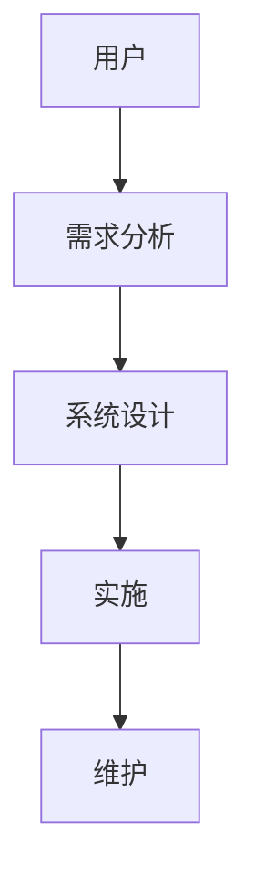
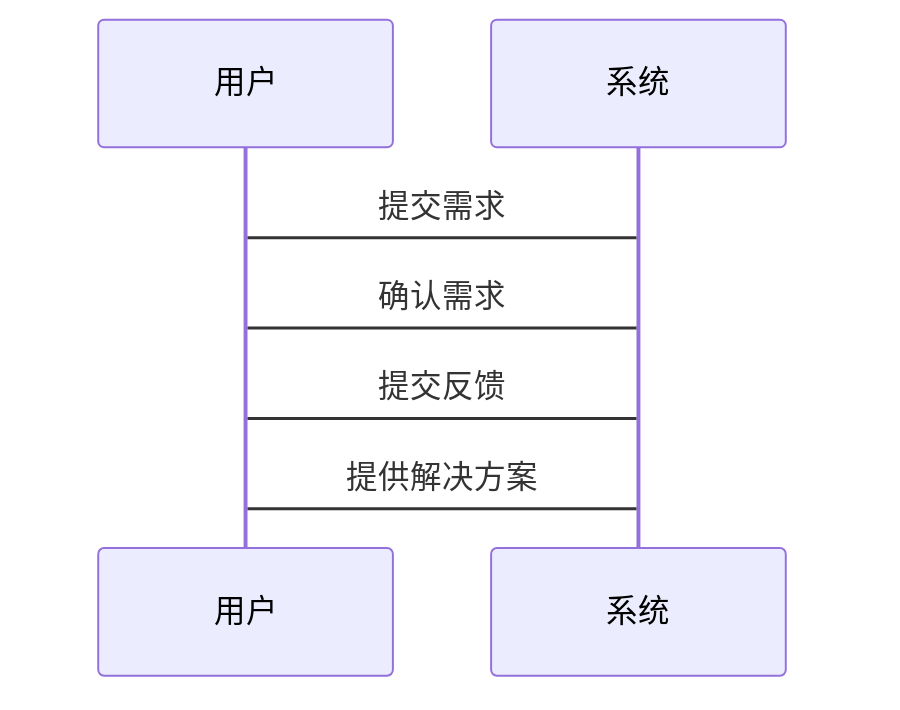

                 

# 价值投资在循环经济中的应用：可持续商业模式的机遇

## 关键词：
- 价值投资
- 循环经济
- 可持续商业模式
- 投资策略
- 环境影响评估

## 摘要：
本文探讨了价值投资在循环经济中的应用，分析了循环经济的模式和价值投资的基本原理，提出了基于循环经济的可持续商业模式。文章详细介绍了循环经济中的价值评估方法、投资风险与机会、以及投资组合优化策略。通过具体案例分析和系统架构设计，展示了价值投资在循环经济中的实际应用和潜力。

---

# 第一部分：循环经济的概念与特征

## 第1章：循环经济的概念与特征

### 1.1 循环经济的定义与内涵

循环经济是以资源高效利用和循环利用为核心，通过减少资源消耗和环境污染，实现经济与环境协调发展的模式。其内涵包括：

- **资源高效利用**：最大限度地利用资源，减少浪费。
- **循环利用**：通过再利用和再生资源，延长资源生命周期。
- **可持续发展**：经济、环境、社会效益的统一。

循环经济与传统经济的区别如下：

| **方面** | **传统经济** | **循环经济** |
|----------|--------------|--------------|
| 资源观   | 稀缺性       | 无限性       |
| 污染观   | 接受污染     | 零排放       |
| 经济观   | 短期收益     | 长期效益     |

### 1.2 价值投资的基本原理

价值投资是一种长期投资策略，强调以合理价格投资具有持续竞争优势的企业。其核心理念包括：

- **长期视角**：关注企业的长期价值，而非短期波动。
- **内在价值**：寻找市场价格低于内在价值的企业。
- **安全边际**：在价格折扣时进行投资，以降低风险。

循环经济的可持续特性为价值投资提供了新的机会，因为循环经济企业通常具备长期竞争优势。

---

## 第2章：循环经济中的可持续商业模式

### 2.1 循环经济的商业模式类型

循环经济中的商业模式主要包括以下三种：

1. **产品服务系统**：通过提供产品使用服务而非销售产品，如租赁和共享经济。
2. **共享经济模式**：通过共享资源实现高效利用，降低资源闲置。
3. **资源循环利用模式**：通过回收和再生资源，创造新的经济价值。

### 2.2 可持续商业模式的核心要素

可持续商业模式的核心要素包括：

- **资源效率**：提高资源利用效率，降低成本。
- **环境影响评估**：量化环境影响，优化商业模式。
- **经济效益与社会价值**：平衡经济效益与社会价值，实现共赢。

---

## 第3章：价值投资在循环经济中的应用背景

### 3.1 全球经济与环境问题的现状

全球经济正面临资源枯竭和环境危机的挑战，循环经济作为解决这些问题的重要途径，逐渐成为全球趋势。循环经济模式能够有效减少资源消耗和环境污染，同时创造经济价值。

### 3.2 价值投资在可持续发展中的作用

价值投资的长期视角和对内在价值的关注，使其在循环经济中具有重要作用。可持续发展与投资回报密切相关，循环经济企业通常具备长期竞争优势和稳定收益，吸引投资者的关注。

---

# 第二部分：价值投资在循环经济中的应用

## 第4章：循环经济中的价值评估方法

### 4.1 价值评估指标

循环经济项目的价值评估指标包括：

- **经济效益指标**：如收入、成本和利润率。
- **环境效益指标**：如碳排放量和资源利用率。
- **社会效益指标**：如就业和社区影响力。

### 4.2 综合价值评估模型

综合价值评估模型如下：

$$ V = \alpha E + \beta S + \gamma En $$

其中，\( V \) 表示综合价值，\( E \) 表示经济效益，\( S \) 表示社会效益，\( En \) 表示环境效益，\( \alpha, \beta, \gamma \) 表示各因素的权重。

---

## 第5章：投资风险与机会

### 5.1 投资风险

循环经济项目面临的主要风险包括：

- **技术风险**：技术创新不确定性可能导致失败。
- **市场风险**：市场需求变化影响盈利能力。
- **政策风险**：政策变化可能影响项目实施。

### 5.2 风险管理策略

- **风险评估与量化**：通过分析和量化风险因素，制定应对策略。
- **风险分散**：通过多元化投资降低风险。
- **风险应对**：制定应急预案，及时应对风险。

---

## 第6章：投资组合优化

### 6.1 优化模型

基于循环经济的投资组合优化模型如下：

$$ \text{最大化} \sum w_i x_i $$

约束条件包括资源限制、风险承受能力和收益目标。

---

## 第7章：项目实战分析

### 7.1 案例分析：某环保科技公司

- **商业模式**：提供环保技术解决方案，实现资源循环利用。
- **经济效益**：年收入增长20%，成本降低15%。
- **社会效益**：减少碳排放，提升企业形象。

---

## 第8章：系统架构设计

### 8.1 系统架构

使用Mermaid图展示循环经济系统的架构：

### 8.2 系统交互

使用Mermaid序列图展示系统交互流程：

---

## 第9章：最佳实践与总结

### 9.1 投资建议

- **关注技术领先企业**：投资具备技术创新能力的企业。
- **长期视角**：重视企业的长期价值。
- **风险管理**：制定全面的风险管理策略。

### 9.2 未来展望

循环经济将推动全球经济转型，价值投资在其中扮演重要角色。未来，随着技术进步和政策支持，循环经济的潜力将进一步释放。

---

通过以上分析，价值投资在循环经济中的应用为可持续商业模式提供了新的机遇。投资者应抓住这一趋势，实现经济效益与环境效益的双赢。

