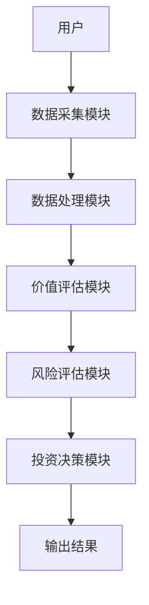
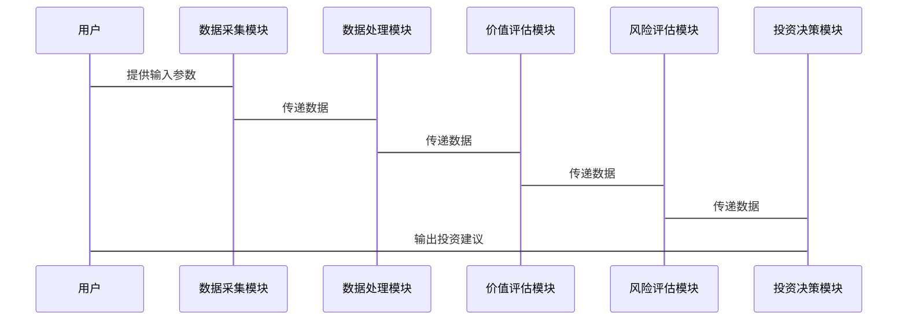

                 


```markdown
# 价值投资在房地产市场的应用：REITs的机遇与风险

## 关键词：价值投资，房地产市场，REITs，投资策略，风险管理

## 摘要： 
本文深入探讨了价值投资在房地产市场中的应用，重点分析了REITs（房地产投资信托基金）的投资机遇与风险。通过系统的理论分析、数学模型构建和实际案例研究，本文为投资者提供了基于价值投资理念的REITs投资策略和风险管理方法。文章从价值投资的核心理念出发，结合房地产市场的特点，详细解析了REITs的运作机制、价值评估方法、投资策略选择和风险控制措施。通过本文的分析，读者可以更好地理解如何在房地产市场中运用价值投资理念，抓住REITs的投资机遇，同时有效规避相关风险。

---

## 第1章 价值投资与房地产市场的基本概念

### 1.1 价值投资的起源与发展

#### 1.1.1 价值投资的起源
- 价值投资的概念最早由本杰明·格雷厄姆提出，强调以低于内在价值的价格买入优质资产。
- 价值投资的核心理念是寻找市场低估的资产，通过长期持有实现收益。

#### 1.1.2 价值投资的核心理念
- **市场有效假说的局限性**：并非所有资产的价格都反映其真实价值。
- **安全边际**：买入价格低于内在价值，以降低投资风险。
- **长期视角**：价值投资注重长期回报，而非短期波动。

#### 1.1.3 房地产市场的特点与分类
- **房地产市场的特点**：
  - 资产规模大，流动性相对较低。
  - 受宏观经济和政策影响显著。
  - 投资门槛高，但回报潜力大。
- **房地产市场的分类**：
  - 居住用房地产：住宅、公寓。
  - 商业房地产：办公楼、商场。
  - 工业房地产：工厂、仓库。
  - 特殊用途房地产：酒店、数据中心等。

### 1.2 价值投资在房地产市场的应用背景

#### 1.2.1 房地产市场的周期性分析
- **周期性波动**：房地产市场通常经历“衰退-复苏-繁荣-衰退”的周期。
- **周期中的投资策略**：
  - 在衰退期寻找低估资产。
  - 在繁荣期规避高估风险。

#### 1.2.2 价值投资与房地产市场的契合点
- **长期持有**：价值投资适合房地产市场的长期投资。
- **资产筛选**：通过价值评估找到优质资产。
- **分散风险**：通过多元化投资降低市场波动影响。

#### 1.2.3 REITs的定义与特点
- **REITs的定义**：房地产投资信托基金，是一种通过汇集资金投资房地产资产的金融工具。
- **REITs的特点**：
  - 流动性高：投资者可以通过股票市场买卖REITs。
  - 门槛低：投资者可通过少量资金参与房地产投资。
  - 透明度高：REITs需定期披露财务信息。

### 1.3 REITs的运作机制与分类

#### 1.3.1 REITs的基本运作模式
- **资金募集**：通过发行股票或债券筹集资金。
- **资产投资**：将资金投资于房地产项目，如购买、开发和出租物业。
- **收益分配**：将收益以股息形式分配给投资者。

#### 1.3.2 REITs的分类与特点
- **按投资目标分类**：
  - �住宅REITs：专注于住宅地产投资。
  - 商业REITs：专注于商业地产投资。
  - 综合REITs：投资多种房地产资产。
- **按运营模式分类**：
  - 投资型REITs：以投资房地产资产为主。
  - 经营型REITs：以出租和运营房地产资产为主。

#### 1.3.3 REITs与房地产市场的关联
- REITs是房地产市场的重要参与者，通过提供资金和专业管理，推动房地产市场的发展。
- REITs为投资者提供了间接参与房地产市场的渠道，扩大了房地产市场的资金来源。

### 1.4 价值投资在REITs中的应用前景

#### 1.4.1 REITs的投资价值分析
- **内在价值**：REITs的内在价值取决于其资产质量、租金收入和资本增值潜力。
- **市场价值**：REITs的市场价格受市场情绪和宏观经济影响，可能偏离内在价值。

#### 1.4.2 REITs的市场风险与收益平衡
- **市场风险**：房地产市场的波动直接影响REITs的收益。
- **收益平衡**：通过多元化投资和长期持有，平衡REITs的收益与风险。

#### 1.4.3 价值投资在REITs中的策略选择
- **选择低估REITs**：寻找市场价格低于内在价值的REITs。
- **长期持有**：通过长期持有REITs，分享房地产市场的长期增长。

### 1.5 本章小结
本章从价值投资的核心理念出发，分析了房地产市场的特点和REITs的运作机制，为后续分析价值投资在REITs中的应用奠定了基础。

---

## 第2章 房地产市场的价值评估与分析

### 2.1 房地产市场的价值评估方法

#### 2.1.1 市场比较法
- **基本原理**：通过比较相似资产的市场交易价格，评估目标资产的价值。
- **应用步骤**：
  1. 确定可比资产。
  2. 调整可比资产的差异（如面积、位置）。
  3. 计算目标资产的平均价格。

#### 2.1.2 收益法
- **基本原理**：通过预测资产的未来租金收入，折现计算其现值。
- **应用步骤**：
  1. 预测未来租金收入。
  2. 计算净收益。
  3. 折现计算资产价值。

#### 2.1.3 成本法
- **基本原理**：通过估算资产的重置成本，减去折旧，评估其价值。
- **应用步骤**：
  1. 估算重置成本。
  2. 计算折旧。
  3. 确定资产价值。

### 2.2 REITs的价值评估模型

#### 2.2.1 REITs的内在价值计算
- **公式**：$$ V = \frac{C}{r - g} $$
  - \( V \)：内在价值
  - \( C \)：年化现金流
  - \( r \)：折现率
  - \( g \)：现金流增长率
- **解释**：该公式基于股利增长模型，适用于稳定增长的REITs。

#### 2.2.2 REITs的市场价值评估
- **公式**：$$ P = V \times N $$
  - \( P \)：市场价值
  - \( V \)：单个REITs的价值
  - \( N \)：REITs的数量

#### 2.2.3 REITs的流动性分析
- **流动性风险**：REITs的流动性越高，市场价格越接近内在价值。
- **流动性溢价**：流动性差的REITs可能需要更高的溢价。

### 2.3 房地产市场的周期性与投资策略

#### 2.3.1 房地产市场的周期性分析
- **周期阶段**：衰退期、复苏期、繁荣期、衰退期。
- **周期中的投资策略**：
  - 衰退期：寻找低估资产。
  - 复苏期：逐步增加投资。
  - 繁荣期：谨慎选择资产。

#### 2.3.2 不同周期下的投资策略
- **衰退期**：选择高分红的REITs，注重现金流。
- **复苏期**：关注租金增长潜力大的REITs。
- **繁荣期**：选择低估值的REITs，避免高杠杆。

#### 2.3.3 REITs在周期中的表现
- **衰退期**：REITs价格可能大幅下跌，但高分红REITs表现相对稳定。
- **复苏期**：REITs价格逐步回升，租金收入增长。
- **繁荣期**：REITs价格可能被高估，需谨慎选择。

### 2.4 本章小结
本章通过分析房地产市场的价值评估方法和REITs的价值评估模型，为投资者提供了科学的评估工具和方法。

---

## 第3章 REITs的投资策略与风险管理

### 3.1 REITs的投资策略分析

#### 3.1.1 基于价值投资的REITs选择标准
- **内在价值**：选择市场价格低于内在价值的REITs。
- **财务状况**：关注ROE（净资产收益率）和股息率。
- **管理层**：选择经验丰富且透明的管理团队。

#### 3.1.2 REITs的行业分布与风险分散
- **行业分布**：选择多元化投资的REITs，降低行业风险。
- **风险分散**：通过投资不同地区的REITs，降低地域风险。

#### 3.1.3 REITs的长期投资与短期波动
- **长期视角**：关注REITs的长期增长潜力。
- **短期波动**：避免短期市场波动对投资决策的影响。

### 3.2 REITs的风险管理策略

#### 3.2.1 信用风险
- **定义**：REITs的借款人违约风险。
- **管理措施**：选择高信用评级的REITs，分散借款人。

#### 3.2.2 市场风险
- **定义**：房地产市场价格波动带来的风险。
- **管理措施**：通过多元化投资和长期持有降低风险。

#### 3.2.3 利率风险
- **定义**：利率上升导致REITs价格下跌的风险。
- **管理措施**：关注利率走势，调整投资组合。

### 3.3 价值投资与风险管理的结合

#### 3.3.1 价值投资的纪律性
- **买入标准**：严格按照价值投资标准选择REITs。
- **卖出标准**：当市场价格远高于内在价值时，考虑卖出。

#### 3.3.2 定期复盘
- **复盘频率**：每季度复盘投资组合。
- **复盘内容**：评估REITs的内在价值和市场价值。

#### 3.3.3 情绪管理
- **避免贪婪与恐惧**：保持理性，避免情绪化决策。
- **长期视角**：关注长期目标，忽略短期波动。

### 3.4 本章小结
本章结合价值投资理念和风险管理方法，为投资者提供了科学的投资策略和风险管理措施。

---

## 第4章 系统架构与REITs投资实现

### 4.1 系统架构设计

#### 4.1.1 系统功能设计
- **数据采集**：获取房地产市场数据和REITs信息。
- **价值评估**：计算REITs的内在价值和市场价值。
- **风险评估**：分析REITs的风险指标。
- **投资决策**：基于评估结果，制定投资策略。

#### 4.1.2 系统架构图


#### 4.1.3 系统交互图


### 4.2 系统实现

#### 4.2.1 数据采集模块
- **功能**：采集房地产市场数据和REITs信息。
- **实现**：使用爬虫技术从公开数据源获取数据。

#### 4.2.2 数据处理模块
- **功能**：清洗和预处理数据，确保数据质量。
- **实现**：使用Python的Pandas库进行数据处理。

#### 4.2.3 价值评估模块
- **功能**：计算REITs的内在价值和市场价值。
- **实现**：基于股利增长模型，使用Python代码实现。

#### 4.2.4 风险评估模块
- **功能**：分析REITs的风险指标，如波动率、VaR等。
- **实现**：使用统计学方法和Python的Scipy库进行风险评估。

#### 4.2.5 投资决策模块
- **功能**：基于评估结果，制定投资策略。
- **实现**：使用逻辑判断和策略规则，生成投资建议。

### 4.3 项目实战

#### 4.3.1 环境安装
- **Python版本**：3.8以上
- **依赖库**：Pandas、Scipy、Matplotlib

#### 4.3.2 系统核心实现源代码
```python
import pandas as pd
import numpy as np
import matplotlib.pyplot as plt

# 数据采集模块
class DataCollector:
    def collect_data(self):
        # 从公开数据源获取数据
        pass

# 数据处理模块
class DataProcessor:
    def process_data(self, data):
        # 数据清洗和预处理
        pass

# 价值评估模块
class ValueEstimator:
    def estimate_value(self, data):
        # 基于股利增长模型计算内在价值
        C = data['cash_flow']
        r = data['discount_rate']
        g = data['growth_rate']
        V = C / (r - g)
        return V

# 风险评估模块
class RiskEstimator:
    def estimate_risk(self, data):
        # 计算波动率和VaR
        returns = data['returns']
        # 计算波动率
        volatility = np.std(returns)
        # 计算VaR
        VaR = np.percentile(returns, 5)
        return {'volatility': volatility, 'VaR': VaR}

# 投资决策模块
class InvestmentStrategy:
    def make_decision(self, value, risk):
        # 基于价值和风险评估结果，制定投资策略
        if value > risk:
            return "买入"
        else:
            return "卖出"

# 主程序
def main():
    data_collector = DataCollector()
    data_processor = DataProcessor()
    value_estimator = ValueEstimator()
    risk_estimator = RiskEstimator()
    investment_strategy = InvestmentStrategy()

    raw_data = data_collector.collect_data()
    processed_data = data_processor.process_data(raw_data)
    value = value_estimator.estimate_value(processed_data)
    risk = risk_estimator.estimate_risk(processed_data)
    decision = investment_strategy.make_decision(value, risk)
    print(f"投资决策：{decision}")

if __name__ == "__main__":
    main()
```

#### 4.3.3 代码解读与分析
- **数据采集模块**：从公开数据源获取房地产市场数据和REITs信息。
- **数据处理模块**：清洗和预处理数据，确保数据质量。
- **价值评估模块**：基于股利增长模型，计算REITs的内在价值。
- **风险评估模块**：计算波动率和VaR，评估REITs的风险。
- **投资决策模块**：基于价值和风险评估结果，制定投资策略。

#### 4.3.4 案例分析
- **案例背景**：假设某REITs的年化现金流为$100万，折现率为8%，租金增长率为3%。
- **内在价值计算**：$$ V = \frac{100}{0.08 - 0.03} = 2000万 $$
- **市场价格**：假设市场价格为1500万，低于内在价值，建议买入。

### 4.4 本章小结
本章通过系统架构设计和项目实战，展示了如何利用价值投资理念和技术手段，实现REITs的科学投资和风险管理。

---

## 第5章 总结与建议

### 5.1 本章总结
- 价值投资在房地产市场中具有重要的应用价值。
- REITs作为房地产投资的重要工具，具有较高的投资潜力。
- 通过科学的价值评估和风险管理，投资者可以有效把握REITs的投资机遇，规避相关风险。

### 5.2 投资建议
- **长期视角**：坚持价值投资理念，避免短期波动影响。
- **多元化投资**：通过投资不同类型的REITs，分散投资风险。
- **定期复盘**：定期评估投资组合，调整投资策略。

### 5.3 注意事项
- **市场风险**：房地产市场波动较大，需谨慎选择REITs。
- **流动性风险**：REITs的流动性可能较低，需关注市场的流动性。
- **政策风险**：房地产市场受政策影响较大，需关注政策变化。

### 5.4 拓展阅读
- **书籍推荐**：
  - 《价值投资实战策略》
  - 《房地产投资指南》
- **网站推荐**：
  - [REITs行业研究](https://www.reit.com)
  - [房地产数据分析](https://www.realestate.com)

### 5.5 本章小结
本章总结了全文的主要内容，并为投资者提供了实用的建议和注意事项。

---

## 参考文献
1. 格雷厄姆，本杰明. 《证券分析》. 北京：机械工业出版社，2019.
2. 巴菲特，沃伦. 《巴菲特致股东的信》. 北京：中信出版社，2020.
3. 美国房地产协会. 《REITs投资指南》. 纽约：McGraw-Hill，2018.

---

## 致谢
感谢读者的耐心阅读，感谢所有支持和帮助的同仁。希望本文能为价值投资在房地产市场的应用提供有益的参考和借鉴。
```

