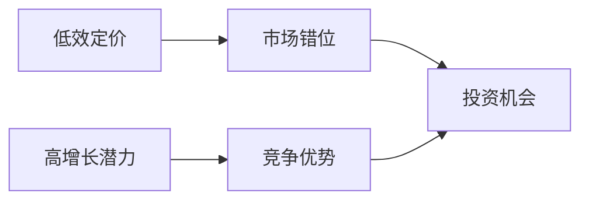
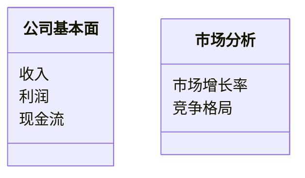

                 


# 价值投资在新兴市场的应用

> 关键词：价值投资、新兴市场、低效定价、高增长潜力、高波动性、竞争优势、周期性波动

> 摘要：本文深入分析了价值投资在新兴市场中的应用，探讨了其核心概念、数学模型、系统架构以及实际案例。通过对比分析和系统设计，提出了在新兴市场中应用价值投资的具体策略，包括低效定价、高增长潜力、竞争优势和周期性波动等关键因素，并结合实际案例总结了投资策略和风险管理的最佳实践。

---

## 第一部分：价值投资基础

### 第1章：价值投资的定义与历史发展

#### 1.1 价值投资的定义
- **核心理念**：价值投资是一种长期投资策略，强调以低于内在价值的价格买入优质资产。
- **历史发展**：起源于20世纪初，由本杰明·格雷厄姆等投资者发展，强调安全边际和对公司基本面的深入分析。

#### 1.2 新兴市场的特点
- **定义与范围**：新兴市场是指经济快速发展、金融市场逐步完善的国家，如中国、印度、东南亚等。
- **经济特征**：高增长、高波动、市场不完善、信息不对称。
- **投资机会与风险**：高增长潜力与高风险并存，市场波动性大，但存在低估资产。

---

## 第二部分：价值投资的核心概念与分析框架

### 第2章：价值投资的核心要素

#### 2.1 低效定价与市场错位
- **低效定价的定义**：市场价格低于内在价值的情况，常见于新兴市场。
- **市场错位的识别**：通过比较市场价格与内在价值，识别被低估的资产。

#### 2.2 高增长潜力与竞争优势
- **高增长潜力的评估**：通过分析行业趋势、公司增长率等指标，评估公司的增长潜力。
- **竞争优势的分析**：通过分析公司的护城河、成本优势、品牌影响力等，判断其竞争优势。

#### 2.3 高波动性与周期性
- **高波动性的成因**：新兴市场的不稳定性导致资产价格波动较大。
- **周期性对投资策略的影响**：在周期性波动中，价值投资者应关注长期趋势，避免短期波动干扰。

#### 2.4 核心概念对比分析
- **低效定价与高增长潜力的对比**：低效定价关注价格与价值的偏差，高增长潜力关注未来增长空间。
- **高波动性与周期性的相互作用**：高波动性可能导致周期性波动加剧，但周期性波动为价值投资者提供了买入机会。

#### 2.5 实体关系图


---

## 第三部分：数学模型与估值方法

### 第3章：数学模型与估值方法

#### 3.1 现金流折现模型（DCF）
- **模型概述**：DCF模型通过预测未来现金流并折现，评估资产的内在价值。
- **数学公式**：
  - 现金流折现公式：$$ V = \sum_{t=1}^{n} \frac{CF_t}{(1 + r)^t} $$
  - 其中，$CF_t$ 是第t年的现金流，$r$ 是折现率，$n$ 是预测年数。

#### 3.2 DCF模型在新兴市场的应用
- **案例分析**：以印度某公司为例，预测未来5年的现金流，计算其内在价值。
- **公式推导**：通过实际数据代入DCF模型，计算出公司的目标股价。

---

## 第四部分：系统分析与架构设计

### 第4章：系统架构与数据支持

#### 4.1 系统功能设计
- **领域模型**：使用Mermaid类图展示公司基本面分析的模块，包括收入、利润、现金流等。


#### 4.2 系统架构设计
- **架构图**：展示价值投资系统的整体架构，包括数据收集、分析、决策模块。


---

## 第五部分：项目实战

### 第5章：项目实战与案例分析

#### 5.1 实战环境与数据准备
- **环境安装**：安装Python、Pandas、NumPy等工具。
- **数据收集**：收集新兴市场公司的财务数据和市场数据。

#### 5.2 核心代码实现
- **DCF模型实现**：编写Python代码，计算公司内在价值。
  ```python
  def dcf_valuation(cash_flows, discount_rate, years):
      return sum(cash_flows[i]/(1+discount_rate)**i for i in range(years))
  ```

#### 5.3 案例分析
- **环境分析**：分析印度市场，选择低估的公司。
- **数据收集与分析**：收集公司财务数据，计算DCF模型。
- **估值与决策**：根据DCF模型结果，判断是否买入。

---

## 第六部分：最佳实践与风险管理

### 第6章：最佳实践与风险管理

#### 6.1 投资策略总结
- **长期视角**：关注公司长期价值，避免短期波动干扰。
- **分散投资**：分散投资以降低市场波动带来的风险。

#### 6.2 风险管理
- **止损策略**：设定止损点，控制投资风险。
- **定期复盘**：定期评估投资组合，调整策略。

#### 6.3 小结
- 价值投资在新兴市场中具有广阔的应用前景，但需要结合市场特点和公司基本面，制定合理的投资策略。

---

## 总结

通过系统分析和实际案例，本文深入探讨了价值投资在新兴市场中的应用，从核心概念到数学模型，再到系统设计和实战案例，为投资者提供了全面的指导。未来的研究可以进一步结合人工智能和大数据技术，优化价值投资策略。

--- 

# END

