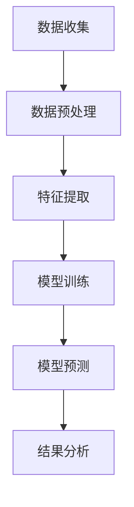
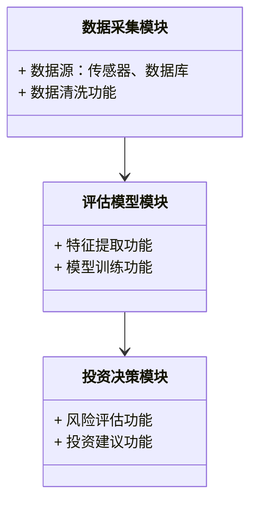
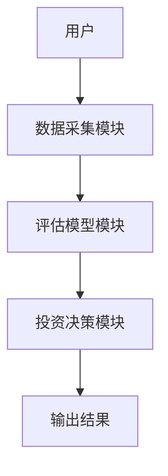

                 


# 价值投资在智慧城市发展中的应用：基础设施投资新思路

## 关键词：价值投资、智慧城市、基础设施、算法原理、系统架构

## 摘要：  
本文探讨了价值投资在智慧城市基础设施投资中的应用，分析了智慧城市的定义、特征及其基础设施的分类，详细阐述了价值投资的核心理念及其在智慧城市中的作用。通过构建价值评估模型和算法，本文提出了基于机器学习的智慧城市建设投资决策方案，并通过实际案例分析展示了如何将价值投资的理念应用于智慧城市的建设中。最后，本文总结了价值投资在智慧城市中的最佳实践和未来发展方向。

---

# 第一部分: 智慧城市与价值投资的背景与基础

## 第1章: 智慧城市概述

### 1.1 智慧城市的定义与特征  
#### 1.1.1 智慧城市的定义  
智慧城市是指通过运用信息和通信技术（ICT），将城市的各个系统（如交通、能源、医疗、教育等）进行智能化融合，以实现城市资源优化配置、提高居民生活质量、降低运营成本并增强城市可持续性发展的城市形态。

#### 1.1.2 智慧城市的特征  
- **智能化**：通过物联网、大数据、人工智能等技术实现城市管理和服务的智能化。  
- **数据驱动**：依赖于数据的收集、分析和应用，数据是智慧城市的“血液”。  
- **协同性**：各子系统之间高度协同，形成统一的整体。  
- **可持续性**：注重资源的高效利用和环境的保护，实现绿色城市发展。  

#### 1.1.3 智慧城市的发展历程  
- **起步阶段**：20世纪末，以信息技术为核心的智慧城市概念开始出现。  
- **快速发展阶段**：21世纪初，随着互联网和移动通信技术的普及，智慧城市进入快速发展阶段。  
- **深度发展阶段**：近年来，人工智能和大数据技术的应用推动智慧城市进入深度发展阶段。  

### 1.2 智慧城市基础设施的分类  
#### 1.2.1 信息基础设施  
- 包括通信网络、数据中心、云计算平台等，是智慧城市的核心支撑。  
#### 1.2.2 物联网基础设施  
- 包括传感器、智能终端、物联网平台等，用于实时数据的采集和传输。  
#### 1.2.3 交通基础设施  
- 包括智能交通管理系统、无人驾驶技术、智能停车系统等，提升城市交通效率。  
#### 1.2.4 能源基础设施  
- 包括智能电网、可再生能源系统、能源管理平台等，推动城市能源的高效利用和绿色转型。  

### 1.3 价值投资的基本原理  
#### 1.3.1 价值投资的定义  
价值投资是一种投资策略，强调以低于内在价值的价格买入优质资产，长期持有，以获得超额收益。  
#### 1.3.2 价值投资的核心理念  
- **长期视角**：关注企业的长期价值，而非短期市场波动。  
- **基本面分析**：通过对企业财务状况、行业地位、竞争优势等进行深入分析，评估其内在价值。  
- **安全边际**：买入价格低于内在价值，以降低投资风险。  
#### 1.3.3 价值投资与智慧城市的关系  
- 智慧城市的建设需要长期投资，价值投资的长期视角与智慧城市的发展目标高度契合。  
- 智慧城市基础设施的高门槛和复杂性要求投资者具备基本面分析能力，而价值投资的核心理念为投资者提供了方法论支持。  

---

## 第2章: 智慧城市发展的现状与挑战  

### 2.1 智慧城市发展的现状  
#### 2.1.1 全球智慧城市发展概况  
- 全球范围内，智慧城市建设已进入快速发展阶段，欧洲、北美和亚洲是主要的智慧城市分布区域。  
- 例如，新加坡、迪拜、巴塞罗那等城市在智慧城市建设方面具有领先地位。  

#### 2.1.2 中国智慧城市发展现状  
- 中国是全球智慧城市发展最快的国家之一，北上广深等一线城市在智慧城市建设方面走在前列。  
- 政府政策支持、技术创新和资本投入是推动中国智慧城市发展的主要动力。  

#### 2.1.3 智慧城市发展的典型案例  
- **案例1：新加坡的智慧城市建设**  
  新加坡通过智能交通、智慧能源和智慧医疗等系统的建设，打造了一个高效、宜居的城市。  
- **案例2：巴塞罗那的智慧城市转型**  
  巴塞罗那通过大数据和物联网技术，优化城市管理，提升居民生活质量。  

### 2.2 智慧城市发展的主要挑战  
#### 2.2.1 技术挑战  
- 技术的多样性和复杂性导致系统集成难度大，且存在数据孤岛问题。  
#### 2.2.2 经济挑战  
- 智慧城市建设需要巨额投资，回报周期长，存在资金不足和融资困难的问题。  
#### 2.2.3 社会挑战  
- 数据隐私、居民习惯的改变以及社会公平性等问题可能阻碍智慧城市的推广。  

### 2.3 价值投资在智慧城市中的作用  
#### 2.3.1 价值投资在智慧城市中的应用领域  
- 智慧交通、智慧能源、智慧医疗等领域是价值投资的重点关注方向。  
#### 2.3.2 价值投资对智慧城市发展的推动作用  
- 通过长期投资，为智慧城市提供稳定的资金支持。  
- 通过基本面分析，筛选出具有竞争优势的智慧城市项目，提升投资回报率。  
#### 2.3.3 价值投资在智慧城市中的风险与机遇  
- **风险**：市场波动、技术不确定性、政策变化等可能影响投资收益。  
- **机遇**：智慧城市的发展前景广阔，价值投资可通过长期持有优质资产实现超额收益。  

---

## 第3章: 价值投资的核心概念与联系  

### 3.1 价值投资的核心概念  
#### 3.1.1 投资价值的定义  
投资价值是基于资产的内在价值，而非市场波动决定的价值。  
#### 3.1.2 投资价值的评估方法  
- 财务指标分析（如市盈率、市净率、股息率等）  
- 竞争优势分析  
- 管理团队评估  
#### 3.1.3 投资价值与市场价值的关系  
- 投资价值是内在价值，市场价值是市场价格，两者可能长期偏离，但在长期会趋于一致。  

### 3.2 价值投资与智慧城市基础设施的关系  
#### 3.2.1 智慧城市基础设施的价值构成  
- 价值来源于其对城市运行效率的提升和对居民生活质量的改善。  
#### 3.2.2 价值投资在智慧城市基础设施中的应用  
- 通过基本面分析，选择具有竞争优势的智慧城市项目进行投资。  
#### 3.2.3 价值投资与智慧城市发展的相互作用  
- 智慧城市的发展为价值投资提供了丰富的应用场景。  
- 价值投资的长期视角推动智慧城市项目的可持续发展。  

### 3.3 价值投资与智慧城市基础设施的对比分析  
#### 3.3.1 传统投资与价值投资的对比  
| **对比维度** | **传统投资** | **价值投资** |
|--------------|--------------|--------------|
| 投资策略     | 短期交易为主  | 长期持有为主  |
| 分析方法     | 技术分析为主  | 基本面分析为主 |
| 风险承受     | 高           | 中            |

#### 3.3.2 智慧城市基础设施与其他基础设施的对比  
| **对比维度** | **智慧城市基础设施** | **传统基础设施** |
|--------------|---------------------|------------------|
| 技术含量     | 高                 | 低               |
| 数据依赖性   | 高                 | 低               |
| 可扩展性     | 高                 | 低               |

#### 3.3.3 价值投资在智慧城市基础设施中的独特优势  
- 高技术含量和数据依赖性使得智慧城市基础设施的内在价值更易评估。  
- 长期持有策略与智慧城市项目的长周期特性高度契合。  

---

## 第4章: 价值投资在智慧城市基础设施中的算法原理  

### 4.1 价值评估模型的构建  
#### 4.1.1 数据收集与处理  
- 数据来源：政府公开数据、企业财报、行业报告等。  
- 数据处理：清洗、整合、特征提取。  

#### 4.1.2 模型的建立与训练  
- 使用回归分析、聚类分析等方法，构建价值评估模型。  

#### 4.1.3 模型的验证与优化  
- 通过回测和交叉验证，优化模型参数。  

### 4.2 基于机器学习的价值评估算法  
#### 4.2.1 算法原理  
- 使用随机森林或神经网络等算法，对智慧城市基础设施的价值进行预测。  

#### 4.2.2 算法流程图（mermaid）  


#### 4.2.3 算法实现的Python代码  
```python
import pandas as pd
from sklearn.ensemble import RandomForestRegressor
from sklearn.metrics import mean_squared_error

# 数据加载与预处理
data = pd.read_csv('smart_city_data.csv')
X = data.drop('value', axis=1)
y = data['value']

# 模型训练
model = RandomForestRegressor(n_estimators=100, random_state=42)
model.fit(X, y)

# 模型预测
predictions = model.predict(X)

# 模型评估
 mse = mean_squared_error(y, predictions)
 print(f"均方误差: {mse}")
```

### 4.3 数学模型与公式  
#### 4.3.1 投资价值评估公式  
$$ \text{投资价值} = \frac{\text{未来现金流的现值}}{\text{折现率}} $$  

#### 4.3.2 价值评估的数学模型  
$$ V = \sum_{t=1}^{n} \frac{CF_t}{(1 + r)^t} $$  
其中，\( V \) 为投资价值，\( CF_t \) 为第 \( t \) 年的现金流，\( r \) 为折现率。  

---

## 第5章: 智慧城市基础设施的价值评估系统分析  

### 5.1 问题场景介绍  
- **问题背景**：某城市计划建设智能交通系统，需评估其投资价值。  
- **问题描述**：如何基于价值投资理念，构建智能交通系统的价值评估模型？  

### 5.2 系统功能设计  
#### 5.2.1 领域模型（mermaid 类图）  


#### 5.2.2 系统架构设计（mermaid 架构图）  


### 5.3 项目实战  
#### 5.3.1 环境搭建  
- 安装Python、Pandas、Scikit-learn等工具。  

#### 5.3.2 核心代码实现  
```python
import pandas as pd
from sklearn.ensemble import RandomForestRegressor
from sklearn.metrics import mean_squared_error

# 数据加载与预处理
data = pd.read_csv('smart_city_data.csv')
X = data.drop('value', axis=1)
y = data['value']

# 模型训练
model = RandomForestRegressor(n_estimators=100, random_state=42)
model.fit(X, y)

# 模型预测
predictions = model.predict(X)

# 模型评估
mse = mean_squared_error(y, predictions)
print(f"均方误差: {mse}")
```

#### 5.3.3 案例分析  
- 以智能交通系统为例，分析模型预测结果与实际价值的偏差，调整模型参数，优化评估效果。  

---

## 第6章: 最佳实践与小结  

### 6.1 最佳实践  
- **长期视角**：投资者应关注智慧城市的长期价值，而非短期市场波动。  
- **基本面分析**：深入研究智慧城市项目的财务状况、行业地位和竞争优势。  
- **风险管理**：合理控制投资风险，避免过度集中在单一领域。  

### 6.2 小结  
价值投资作为一种长期、稳健的投资策略，为智慧城市建设提供了重要的理论和实践支持。通过构建科学的价值评估模型和算法，投资者可以更好地识别具有长期发展潜力的智慧城市项目，实现投资收益与城市发展目标的双赢。  

### 6.3 注意事项  
- 投资者需关注政策变化和技术进步对智慧城市项目的影响。  
- 智慧城市建设需注重数据隐私和居民利益的保护。  

### 6.4 拓展阅读  
- 《价值投资：一种长期主义的投资哲学》  
- 《智慧城市：数字化转型的路径与实践》  

---

通过以上分析，我们可以看到，价值投资在智慧城市建设中的应用不仅需要理论支持，更需要实践中的技术创新和策略优化。未来，随着人工智能和大数据技术的进一步发展，价值投资在智慧城市中的应用将更加广泛和深入。

