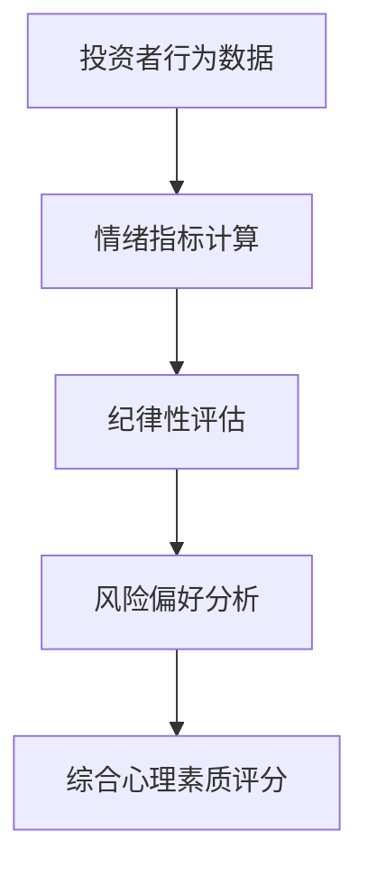
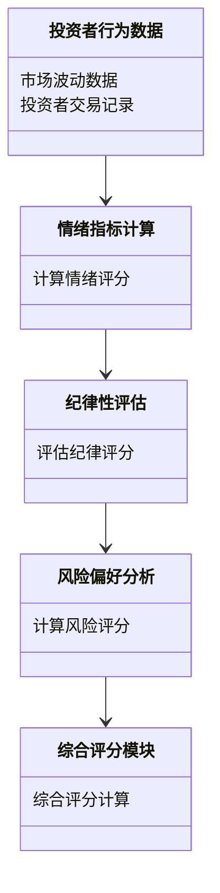
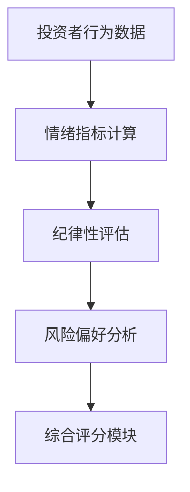

                 


# 价值投资者的心理素质培养

## 关键词：价值投资、心理素质、情绪管理、耐心、纪律、风险管理、长期思维

## 摘要：  
价值投资不仅仅是一种投资方法，更是一种心理素质的修炼。本文从价值投资的核心概念出发，分析投资者在实际操作中常见的心理问题，探讨心理素质的构成要素及其对投资决策的影响。通过系统化的分析与实践，本文为价值投资者提供心理素质培养的理论框架、算法模型和实战方案，帮助投资者在复杂多变的市场环境中保持理性和耐心，实现长期稳健的投资收益。

---

# 第一部分：价值投资与心理素质的背景介绍

## 第1章：价值投资的核心概念

### 1.1 价值投资的定义与背景

价值投资是一种以基本面分析为基础的投资策略，强调以低于内在价值的价格购买优质资产，以实现长期稳定的收益。其核心理念来源于格雷厄姆和多德的理论，强调安全边际和长期价值。与短期交易相比，价值投资更注重企业的内在价值和长期增长潜力。

### 1.2 价值投资者的典型问题与挑战

在实际投资中，投资者常常面临以下心理问题：

1. **过度自信**：投资者倾向于高估自己的判断能力，导致盲目决策。
2. **情绪化交易**：市场波动容易引发恐慌性抛售或贪婪性买入。
3. **缺乏耐心**：面对市场的短期波动，投资者容易放弃长期策略。
4. **纪律性不足**：在市场低迷时，投资者容易偏离既定的投资策略。

### 1.3 价值投资的应用边界与外延

价值投资并非适用于所有市场环境和投资标的。在波动剧烈的市场中，价值投资需要更强大的心理素质支持。同时，价值投资可以与其他策略结合，形成多元化投资组合，以应对不同市场环境。

---

# 第二部分：价值投资者心理素质的核心要素与联系

## 第2章：价值投资者心理素质的原理与特征

### 2.1 心理素质的核心概念与属性

心理素质是投资者在面对市场波动和复杂决策时的心理状态和能力。核心要素包括：

1. **耐心**：在市场低迷时坚持投资，不被短期波动影响。
2. **纪律**：严格遵守投资计划，避免情绪化决策。
3. **情绪控制**：保持冷静，避免过度反应市场变化。
4. **风险意识**：理性评估风险，避免盲目追求高收益。

### 2.2 心理素质的ER实体关系图

```mermaid
er
actor 心理素质, 投资者心理
  投资者心理 --> 耐心
  投资者心理 --> 纪律
  投资者心理 --> 情绪控制
  投资者心理 --> 风险意识
```

---

# 第三部分：价值投资者心理素质的算法与模型

## 第3章：价值投资者心理素质的算法原理

### 3.1 心理素质评估算法的原理与流程



### 3.2 心理素质评估算法的Python实现

```python
def calculate_mood_score(market_volatility, investor_behavior):
    # 计算情绪评分
    mood_score = (market_volatility - investor_behavior) * 0.5 + 0.5
    return mood_score

def assess_discipline(mood_score, backtest_results):
    # 评估纪律性
    discipline_score = (backtest_results['wins'] / backtest_results['total']) * 100
    return discipline_score

def risk_assessment(risk_factors, portfolio_value):
    # 风险评估
    risk_score = sum(risk_factors) / len(risk_factors)
    return risk_score

def overall_psychological_score(mood_score, discipline_score, risk_score):
    # 综合评分
    total_score = (mood_score + discipline_score + risk_score) / 3
    return total_score

# 示例用法
market_volatility = 0.8
investor_behavior = 0.6
backtest_results = {'wins': 70, 'total': 100}
risk_factors = [0.3, 0.4, 0.5]

mood = calculate_mood_score(market_volatility, investor_behavior)
discipline = assess_discipline(mood, backtest_results)
risk = risk_assessment(risk_factors, 100000)

total_score = overall_psychological_score(mood, discipline, risk)
print(f"综合心理素质评分为: {total_score:.2f}")
```

### 3.3 算法原理的数学模型

心理素质评估模型可以表示为：

$$
\text{总评分} = \frac{\text{情绪评分} + \text{纪律评分} + \text{风险评分}}{3}
$$

其中，各评分的计算公式如下：

- 情绪评分：$$ \text{情绪评分} = \frac{\text{市场波动} - \text{投资者行为}}{2} + 0.5 $$
- 纪律评分：$$ \text{纪律评分} = \left( \frac{\text{胜率}}{\text{总交易数}} \right) \times 100 $$
- 风险评分：$$ \text{风险评分} = \frac{\sum \text{风险因素}}{\text{风险因素数量}} $$

---

# 第四部分：价值投资者心理素质的系统分析与架构设计

## 第4章：价值投资者心理素质评估系统

### 4.1 系统功能设计



### 4.2 系统架构设计



### 4.3 系统交互设计

```mermaid
sequenceDiagram
    投资者 --> 提供投资者行为数据
    投资者行为数据 --> 情绪指标计算
    情绪指标计算 --> 纪律性评估
    纪律性评估 --> 风险偏好分析
    风险偏好分析 --> 综合评分模块
    综合评分模块 --> 返回总评分
```

---

# 第五部分：价值投资者心理素质的项目实战

## 第5章：价值投资者心理素质评估系统实战

### 5.1 环境安装与配置

- 安装Python和必要的库（如Pandas、Matplotlib）
- 配置数据源（市场波动数据、投资者交易记录）

### 5.2 系统核心实现

```python
import pandas as pd
import matplotlib.pyplot as plt

def visualize_results(scores):
    plt.bar(scores.keys(), scores.values())
    plt.title('心理素质评分')
    plt.show()

# 示例数据
data = {
    '市场波动': [0.8, 0.7, 0.9],
    '投资者行为': [0.6, 0.5, 0.7],
    '胜率': [70, 65, 80],
    '总交易数': [100, 100, 100],
    '风险因素': [0.3, 0.4, 0.5]
}

scores = {
    '情绪评分': 0.7,
    '纪律评分': 0.8,
    '风险评分': 0.6,
    '总评分': 0.7
}

visualize_results(scores)
```

### 5.3 项目案例分析

通过分析一个投资者的交易记录和市场数据，评估其心理素质并提出改进建议。例如，若投资者在市场波动加剧时频繁交易，系统会提示其情绪化倾向，并建议加强纪律性训练。

---

# 第六部分：价值投资者心理素质的总结与拓展

## 第6章：价值投资者心理素质培养的总结

### 6.1 心理素质培养的最佳实践Tips

- 定期进行心理素质评估，及时发现问题。
- 制定明确的投资计划，并严格执行。
- 通过模拟交易练习情绪管理。
- 保持学习，提升对市场的认知能力。

### 6.2 项目小结与未来展望

本文通过系统化的分析，为价值投资者提供了心理素质培养的理论框架和实践方案。未来可以进一步研究如何将心理素质评估与机器学习结合，提升评估的准确性和实时性。

### 6.3 拓展阅读与学习资源

- 格雷厄姆的《证券分析》
- 巴菲特的股东大会演讲
- 行为金融学相关书籍

---

通过本文的系统分析和实践，价值投资者可以更好地理解心理素质的重要性，并在实际投资中不断提升自己的心理素质，从而在长期投资中获得成功。

