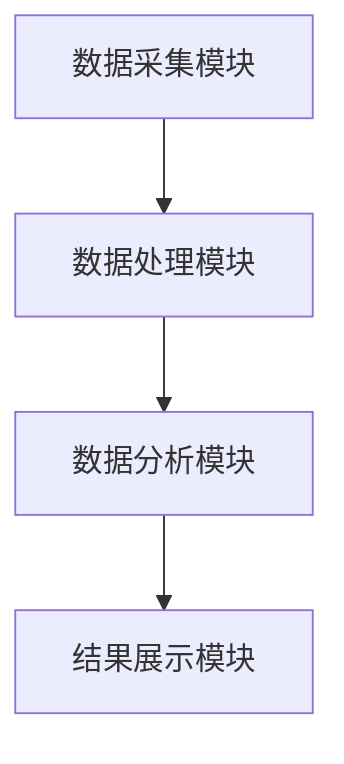
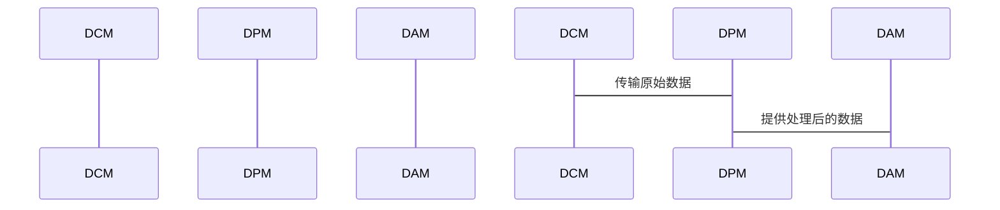
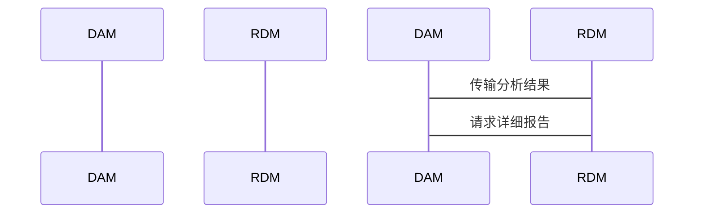

                 


# 价值投资者的数字化转型：大数据分析的应用

> 关键词：价值投资，数字化转型，大数据分析，机器学习，投资决策，数据驱动

> 摘要：本文探讨了价值投资者如何通过大数据分析实现数字化转型，详细介绍了大数据分析的核心概念、算法实现、系统架构设计以及在价值投资中的应用案例。通过逐步分析，本文为投资者提供了从数据收集到决策优化的完整指南。

---

## 第1章: 价值投资者的数字化转型背景

### 1.1 价值投资的数字化转型

#### 1.1.1 传统价值投资的核心理念
传统价值投资强调基本面分析，通过研究公司的财务状况、行业地位和管理团队等因素，寻找被市场低估的投资标的。这种方法依赖于分析师的主观判断和经验，存在效率低下和人为误差的问题。

#### 1.1.2 数字化转型对投资的影响
随着科技的发展，投资领域逐渐从人工分析转向数据驱动的决策。数字化转型使投资者能够利用大数据、人工智能和机器学习等技术，提高分析效率和准确性。

#### 1.1.3 大数据分析在投资中的应用前景
大数据分析能够处理海量数据，识别传统方法难以察觉的模式和趋势。通过实时数据分析，投资者可以更快地做出决策，抓住市场机会。

### 1.2 问题背景与问题描述

#### 1.2.1 传统投资分析的局限性
传统分析方法依赖于有限的数据和经验判断，难以应对复杂多变的市场环境。人工分析效率低下，容易受到主观因素影响。

#### 1.2.2 数据爆炸与信息过载的挑战
现代社会数据量急剧增加，投资者需要处理来自多个来源的大量数据，包括社交媒体、新闻、财务报表等。信息过载使得传统方法难以有效处理。

#### 1.2.3 大数据分析如何解决投资问题
大数据分析技术能够高效处理海量数据，提取有价值的信息，帮助投资者做出更明智的决策。通过自动化分析，投资者可以减少人为误差，提高分析效率。

### 1.3 问题解决与边界定义

#### 1.3.1 大数据分析的核心目标
大数据分析的目标是通过数据挖掘、机器学习和统计分析，发现数据中的模式和趋势，为投资决策提供支持。

#### 1.3.2 投资分析的边界与外延
数据分析的边界在于数据质量和模型的有效性。外延则包括数据的实时性、模型的可解释性和结果的可操作性。

#### 1.3.3 大数据分析与投资决策的关系
大数据分析是投资决策的工具，通过提供数据支持和预测结果，帮助投资者做出更准确的判断。

---

## 第2章: 大数据分析的核心概念与价值投资的结合

### 2.1 大数据分析的核心概念

#### 2.1.1 数据的收集与处理
数据收集包括从各种来源获取数据，如社交媒体、新闻网站、财务报表等。数据处理包括清洗、转换和整合，确保数据的质量和一致性。

#### 2.1.2 数据分析的类型与方法
数据分析分为描述性分析、诊断性分析、预测性分析和规范性分析。方法包括统计分析、机器学习和自然语言处理等。

#### 2.1.3 数据可视化与决策支持
数据可视化通过图表和仪表盘，将复杂的数据信息直观呈现，帮助投资者快速理解数据。

### 2.2 价值投资与大数据分析的结合

#### 2.2.1 价值投资的核心要素
价值投资关注企业的内在价值，包括财务状况、盈利能力、竞争优势和管理团队等因素。

#### 2.2.2 大数据分析如何辅助价值评估
大数据分析可以评估企业的财务健康状况，识别潜在风险，并预测企业的未来表现。

#### 2.2.3 数据驱动的投资决策模式
通过数据驱动的决策模式，投资者可以更准确地评估企业的内在价值，发现市场低估的投资机会。

### 2.3 核心概念的联系与对比

#### 2.3.1 大数据分析与传统投资分析的对比
| 特性             | 传统分析          | 大数据分析        |
|------------------|-------------------|-------------------|
| 数据来源         | 有限数据          | 海量数据          |
| 分析效率         | 低效              | 高效              |
| 分析准确性       | 受主观影响         | 更客观            |

#### 2.3.2 数据驱动决策的优缺点
- **优点**：提高效率，减少人为误差，发现潜在机会。
- **缺点**：依赖数据质量，模型可能存在过拟合风险。

#### 2.3.3 价值投资中

---

## 第3章: 价值投资中的大数据分析算法实现

### 3.1 算法原理概述

#### 3.1.1 线性回归算法
线性回归用于预测目标变量与自变量之间的线性关系。其数学模型为：
$$ y = \beta_0 + \beta_1 x_1 + \beta_2 x_2 + \dots + \beta_n x_n + \epsilon $$
其中，$\beta$表示回归系数，$\epsilon$是误差项。

#### 3.1.2 随机森林算法
随机森林是一种基于决策树的集成算法。通过构建多个决策树并进行投票，提高模型的准确性和鲁棒性。

### 3.2 算法实现与优化

#### 3.2.1 线性回归实现
```python
import pandas as pd
import numpy as np
from sklearn.linear_model import LinearRegression

# 数据预处理
data = pd.read_csv('investment_data.csv')
X = data[['revenue', 'profit_margin']]
y = data['stock_price']

# 模型训练
model = LinearRegression()
model.fit(X, y)

# 预测与评估
 predictions = model.predict(X)
 print('Coefficients:', model.coef_)
 print('Intercept:', model.intercept_)
```

#### 3.2.2 随机森林实现
```python
from sklearn.ensemble import RandomForestRegressor

# 数据预处理
X = data[['revenue', 'profit_margin', 'market_cap']]
y = data['stock_price']

# 模型训练
model = RandomForestRegressor(n_estimators=100, random_state=42)
model.fit(X, y)

# 预测与评估
importances = model.feature_importances_
print('Feature Importances:', importances)
```

### 3.3 算法对比与选择

#### 3.3.1 算法对比
| 算法名称    | 优点                     | 缺点                     |
|------------|--------------------------|--------------------------|
| 线性回归    | 简单，解释性强            | 适合线性关系，不擅长非线性 |
| 随机森林    | 高准确度，鲁棒性好        | 解释性较弱，计算复杂     |

#### 3.3.2 算法选择策略
根据数据类型和目标选择合适的算法。对于复杂的非线性关系，随机森林可能更适合；对于线性关系，线性回归更简单有效。

---

## 第4章: 价值投资分析系统的架构设计

### 4.1 系统概述

#### 4.1.1 系统目标
构建一个高效的大数据分析系统，支持投资者进行实时数据采集、分析和决策。

#### 4.1.2 系统功能
- 数据采集：从多个来源获取实时数据。
- 数据处理：清洗、转换和整合数据。
- 数据分析：使用机器学习模型进行预测和评估。
- 结果展示：通过可视化工具呈现分析结果。

### 4.2 系统架构设计

#### 4.2.1 系统模块
- 数据采集模块：负责收集各种来源的数据。
- 数据处理模块：清洗和转换数据。
- 数据分析模块：应用机器学习模型进行分析。
- 结果展示模块：生成可视化报告。

#### 4.2.2 系统架构图


### 4.3 系统接口设计

#### 4.3.1 数据接口
- 数据输入接口：接收来自不同数据源的实时数据。
- 数据输出接口：将分析结果输出到展示模块。

#### 4.3.2 接口协议
使用RESTful API进行数据交互，确保系统的高效性和可扩展性。

### 4.4 系统交互流程

#### 4.4.1 数据采集流程


#### 4.4.2 分析流程


---

## 第5章: 价值投资中的大数据分析项目实战

### 5.1 项目背景与目标

#### 5.1.1 项目背景
通过分析历史股价数据，识别潜在的投资机会，验证大数据分析在价值投资中的有效性。

#### 5.1.2 项目目标
构建一个基于大数据分析的投资模型，实现对股票价格的预测和投资建议。

### 5.2 项目环境与工具安装

#### 5.2.1 环境要求
- 操作系统：Windows/Mac/Linux
- Python版本：3.6+
- 安装依赖：pandas、numpy、scikit-learn、matplotlib

#### 5.2.2 工具安装
```bash
pip install pandas numpy scikit-learn matplotlib
```

### 5.3 核心代码实现

#### 5.3.1 数据预处理
```python
import pandas as pd
import numpy as np

# 数据加载
data = pd.read_csv('stock_data.csv')

# 数据清洗
data.dropna(inplace=True)
data = pd.get_dummies(data)
```

#### 5.3.2 模型训练
```python
from sklearn.model_selection import train_test_split
from sklearn.ensemble import RandomForestRegressor
from sklearn.metrics import mean_absolute_error

# 数据分割
X = data[['revenue', 'profit_margin', 'market_cap']]
y = data['stock_price']

X_train, X_test, y_train, y_test = train_test_split(X, y, test_size=0.2, random_state=42)

# 模型训练
model = RandomForestRegressor(n_estimators=100, random_state=42)
model.fit(X_train, y_train)

# 模型预测
y_pred = model.predict(X_test)
print('Mean Absolute Error:', mean_absolute_error(y_test, y_pred))
```

#### 5.3.3 结果可视化
```python
import matplotlib.pyplot as plt

plt.scatter(y_test, y_pred)
plt.xlabel('Actual Price')
plt.ylabel('Predicted Price')
plt.title('Stock Price Prediction')
plt.show()
```

### 5.4 项目优化与扩展

#### 5.4.1 模型调优
通过网格搜索优化模型参数，提高预测准确率。

#### 5.4.2 分布式计算
利用分布式计算框架（如Spark）处理更大规模的数据，提升系统的处理能力。

---

## 第6章: 总结与展望

### 6.1 总结
本文详细探讨了大数据分析在价值投资中的应用，从核心概念到算法实现，再到系统设计和项目实战，为投资者提供了全面的指导。

### 6.2 展望
未来，随着人工智能和大数据技术的不断发展，投资分析将更加智能化和自动化。投资者需要持续学习新技术，提升数据分析能力，以应对市场的挑战。

---

## 第7章: 最佳实践与注意事项

### 7.1 最佳实践

#### 7.1.1 数据质量管理
确保数据的准确性和完整性，避免错误数据对分析结果的影响。

#### 7.1.2 模型可解释性
选择可解释性强的模型，便于投资者理解和调整投资策略。

#### 7.1.3 定期模型更新
市场环境不断变化，需要定期更新模型和数据，保持模型的有效性。

### 7.2 注意事项

#### 7.2.1 数据隐私与合规性
遵守相关法律法规，确保数据的合法使用和隐私保护。

#### 7.2.2 风险控制
合理分散投资风险，避免过度依赖单一模型或数据源。

#### 7.2.3 持续学习与适应
市场环境复杂多变，投资者需要持续学习新技术，优化投资策略。

---

## 第8章: 拓展阅读

### 8.1 推荐书籍
- 《大数据投资之道》
- 《机器学习实战》
- 《投资学原理》

### 8.2 推荐资源
- [Kaggle](https://www.kaggle.com/)：提供丰富的数据集和机器学习项目。
- [Coursera](https://www.coursera.org/)：提供大数据和投资相关的在线课程。

---

## 第9章: 小结与思考

通过本文的探讨，读者可以了解到大数据分析在价值投资中的重要性，掌握从数据收集到模型构建的完整流程。大数据技术不仅提高了投资分析的效率，还为投资者提供了更多潜在的机会。未来，随着技术的进一步发展，大数据分析将在投资领域发挥更大的作用。

---

感谢您的阅读！希望本文能为您提供有价值的见解和实用的指导。如果您有任何问题或建议，请随时与我联系。

