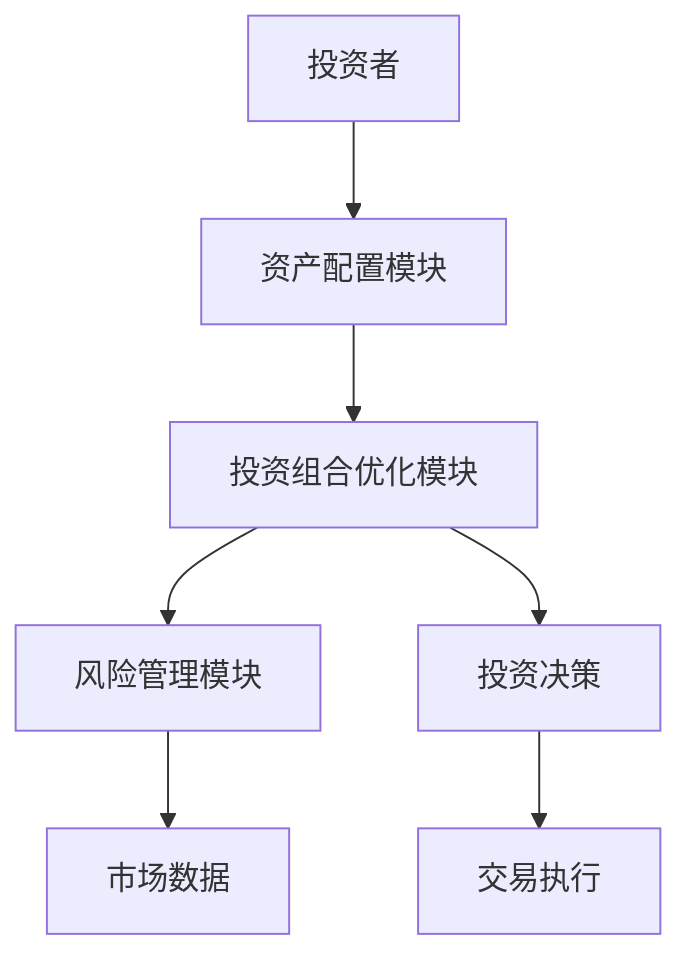

                 

# 价值投资者的耐心：长期持有的重要性

## 关键词：价值投资、长期持有、耐心、复利效应、投资策略、风险管理

## 摘要：  
价值投资是一种强调长期持有的投资策略，其核心在于通过深入分析企业的内在价值，选择优质企业进行长期投资，以实现财富的稳健增长。本文从技术角度分析了长期持有在价值投资中的重要性，探讨了耐心在投资决策中的作用，结合复利效应、风险管理等理论，为投资者提供了系统化的长期投资策略。通过实际案例分析和系统架构设计，本文为价值投资者提供了理论支持和实践指导，帮助投资者更好地理解并践行长期持有的投资理念。

---

## 第一章：价值投资的背景与核心理念

### 1.1 投资的基本概念

#### 1.1.1 投资的定义与分类  
投资是指将资金投入到某个项目或资产中，以期在未来获得收益或资本增值的行为。根据投资期限的不同，投资可以分为短期投资和长期投资。短期投资注重短期收益，而长期投资则注重资产的长期增值。

#### 1.1.2 价值投资的起源与发展  
价值投资由本杰明·格雷厄姆和戴维·多德提出，强调以低于内在价值的价格买入优质企业，长期持有，等待市场的理性回归。价值投资的核心在于对企业基本面的深入分析，寻找被市场低估的投资标的。

#### 1.1.3 长期投资与短期投资的对比  
- **短期投资**：注重市场波动，追求短期收益，风险较高，需要频繁操作。  
- **长期投资**：注重企业价值，追求长期收益，风险较低，操作频率低。  

### 1.2 耐心在投资中的重要性

#### 1.2.1 耐心的定义与特征  
耐心是指在面对市场波动和不确定性时，能够保持冷静，避免短期情绪化决策的能力。耐心的核心特征包括：  
- **稳定性**：在市场波动中保持冷静，不盲目追涨杀跌。  
- **持久性**：长期坚持投资策略，不因短期亏损而放弃。  

#### 1.2.2 耐心在投资决策中的作用  
- **降低决策失误**：耐心使投资者能够避免因情绪化决策导致的错误。  
- **抓住长期机会**：耐心让投资者能够长期持有优质资产，享受复利效应。  

#### 1.2.3 长期持有与耐心的关系  
长期持有是耐心的体现，耐心是长期持有的基础。只有具备耐心，投资者才能在市场低迷时坚持持有，最终获得长期收益。

### 1.3 价值投资的核心理念

#### 1.3.1 价值投资的核心要素  
- **内在价值**：企业的真实价值，不随市场波动而变化。  
- **安全边际**：买入价格低于内在价值，以降低投资风险。  

#### 1.3.2 长期持有与价值投资的结合  
价值投资者通过长期持有优质资产，等待市场重新认识到其内在价值，从而实现收益。长期持有不仅能够享受复利效应，还能降低交易成本和税务负担。

---

## 第二章：长期投资的理论与策略

### 2.1 长期投资的理论基础

#### 2.1.1 复利效应的重要性  
复利效应是指投资收益的再投资能够带来更高的收益，其公式为：  
$$ A = P \times (1 + r)^n $$  
其中，\( P \) 是本金，\( r \) 是年化收益率，\( n \) 是投资年数。  

复利效应的数学模型表明，长期持有能够显著放大投资收益。例如，以10%的年化收益率投资30年，最终收益为：  
$$ A = 1 \times (1 + 0.1)^{30} \approx 19.53 \times P $$  

#### 2.1.2 价值投资的基本原理  
价值投资的核心在于寻找被市场低估的企业，长期持有，等待市场回归理性。通过对企业基本面的分析，投资者可以识别出具有持续竞争优势的企业。

#### 2.1.3 长期投资的策略选择  
- **资产配置**：将资金分配到不同资产类别中，降低风险。  
- **风险管理**：通过分散投资和止损策略，控制投资风险。  
- **定期审视**：定期评估投资组合，调整持仓结构。  

### 2.2 长期投资的策略分析

#### 2.2.1 资产配置与再平衡  
- 资产配置是长期投资的重要策略，通过将资金分配到股票、债券、现金等资产中，降低整体风险。  
- 再平衡是指定期调整资产配置比例，以适应市场变化。  

#### 2.2.2 风险管理与控制  
- 通过分散投资降低特定风险。  
- 设置止损点，避免重大亏损。  

#### 2.2.3 投资组合优化  
- 使用现代投资组合理论（MPT）优化资产配置，降低风险。  

---

## 第三章：耐心与心态管理

### 3.1 心态对投资决策的影响

#### 3.1.1 投资者的心理特征  
- **贪婪与恐惧**：贪婪可能导致高位买入，恐惧可能导致低位卖出。  
- **过度自信**：认为自己能够准确预测市场走势。  

#### 3.1.2 耐心与情绪控制  
- 耐心是克服贪婪与恐惧的关键，帮助投资者做出理性决策。  

#### 3.1.3 长期持有中的心理陷阱  
- **频繁交易**：试图通过短期交易获利，反而增加成本和风险。  
- **过度关注短期波动**：忽视长期投资目标，导致决策失误。  

### 3.2 长期投资中的纪律性

#### 3.2.1 纪律性的重要性  
- 长期持有需要严格的纪律，避免因市场波动而改变投资策略。  

#### 3.2.2 纪律性与耐心的关系  
- 纪律性是耐心的体现，耐心是纪律性的基础。  

### 3.3 面对市场波动的耐心

#### 3.3.1 市场波动的应对策略  
- **保持冷静**：市场波动是短期的，长期趋势由基本面决定。  
- **利用波动**：在市场低迷时买入优质资产，利用波动获利。  

#### 3.3.2 耐心与市场波动的关系  
- 耐心是应对市场波动的关键，帮助投资者在波动中把握长期机会。

---

## 第四章：长期投资的系统架构与实践

### 4.1 长期投资的系统架构

#### 4.1.1 系统功能设计  
- **资产配置模块**：根据投资者风险偏好配置资产。  
- **风险管理模块**：监控投资组合风险，制定止损策略。  
- **投资组合优化模块**：优化资产配置，降低整体风险。  

#### 4.1.2 系统架构图  

### 4.2 投资组合优化的数学模型

#### 4.2.1 现代投资组合理论（MPT）  
MPT的目标是通过优化资产配置，找到风险与收益的最佳平衡点。其数学模型为：  
$$ \text{Minimize } \sigma^2 \text{ s.t. } E[r] \geq \text{目标收益} $$  

#### 4.2.2 风险调整后的收益  
风险调整后的收益可以通过夏普比率衡量：  
$$ \text{夏普比率} = \frac{E[r - r_f]}{\sigma} $$  

---

## 第五章：长期投资的实战与案例分析

### 5.1 长期投资的实战策略

#### 5.1.1 选择优质企业  
- 选择具有持续竞争优势、良好财务状况和管理团队的企业。  

#### 5.1.2 长期持有与复利效应  
- 通过长期持有优质资产，享受复利效应带来的收益增长。  

### 5.2 案例分析

#### 5.2.1 巴菲特的长期投资策略  
巴菲特通过长期持有伯克希尔哈撒韦等优质企业，实现了巨额财富增长。其投资策略体现了价值投资的核心理念。  

#### 5.2.2 系统性投资组合管理  
通过定期审视和调整投资组合，确保资产配置与投资目标一致。  

---

## 第六章：总结与展望

### 6.1 总结  
价值投资的核心在于长期持有优质资产，耐心是投资成功的关键。通过复利效应和风险管理，投资者可以实现财富的稳健增长。

### 6.2 未来展望  
随着市场的变化，价值投资者需要不断学习和适应新的投资环境，抓住长期投资的机遇，实现可持续的财富增长。

---

通过以上系统化的分析和实践，价值投资者可以更好地理解长期持有的重要性，并在实际投资中践行耐心和纪律，实现投资目标。

