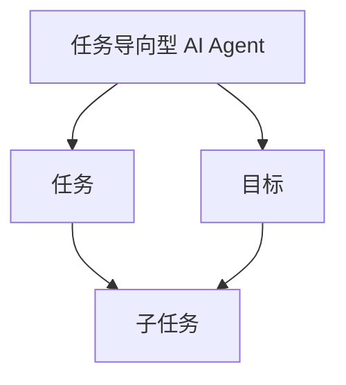
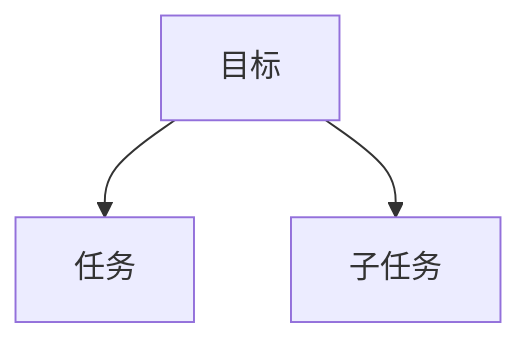
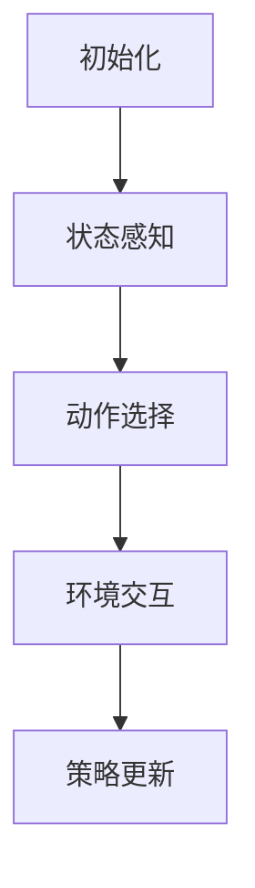
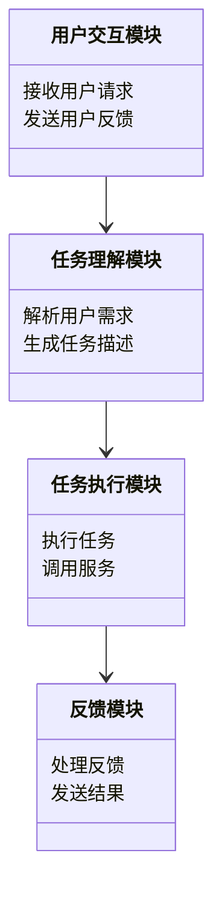
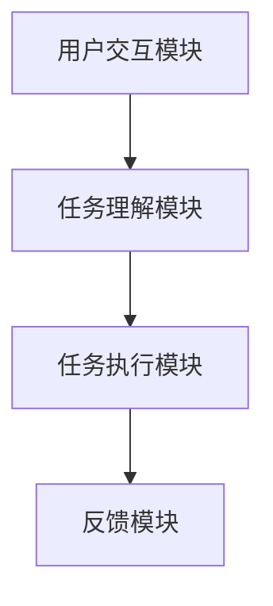

                 


```markdown
# 《任务导向型 AI Agent：基于 LLM 的目标完成系统》

---

## 文章关键词

- 任务导向型 AI Agent
- 大语言模型（LLM）
- 任务建模
- 算法原理
- 系统架构

---

## 摘要

任务导向型 AI Agent 是一种基于大语言模型（LLM）的目标完成系统，旨在通过智能代理帮助用户完成特定任务。本文从任务建模与目标设定入手，详细探讨了 LLM 在任务导向型 AI 中的应用原理，分析了基于强化学习的算法实现，并结合实际案例展示了系统架构设计与项目实战。文章最后总结了任务导向型 AI 的未来发展趋势与挑战。

---

# 第1章: 任务导向型 AI Agent 的背景与概念

## 1.1 人工智能与任务导向型 AI 的发展

### 1.1.1 人工智能的演进历程

人工智能（Artificial Intelligence, AI）的发展经历了多个阶段：从早期的符号逻辑推理到基于机器学习的模式识别，再到如今的大语言模型（LLM）驱动的智能对话系统。这一演进过程为任务导向型 AI Agent 的发展奠定了基础。

- **符号逻辑推理阶段**：以专家系统为代表，通过知识库和推理规则解决问题。
- **机器学习阶段**：基于数据的特征学习，如支持向量机（SVM）和随机森林（Random Forest）。
- **深度学习阶段**：以神经网络为核心，推动了自然语言处理（NLP）和计算机视觉的突破。

### 1.1.2 从通用 AI 到任务导向型 AI 的转变

通用 AI 的目标是实现接近人类水平的智能，而任务导向型 AI 则专注于解决特定问题。这种转变使得 AI 技术更加实用化，能够直接服务于用户的实际需求。

- **通用 AI**：追求广泛适用性，如 IBM Watson。
- **任务导向型 AI**：专注于特定任务，如智能助手 Siri、Alexa。

### 1.1.3 任务导向型 AI 的定义与特点

任务导向型 AI 是一种专注于完成特定任务的智能系统，其特点是：

- **目标导向**：围绕用户指定的目标进行操作。
- **任务分解**：将复杂任务分解为多个子任务。
- **交互性**：支持与用户或系统的交互，实时调整任务执行策略。

---

## 1.2 任务导向型 AI Agent 的核心概念

### 1.2.1 任务导向型 AI 的问题背景

在实际应用中，任务导向型 AI 需要解决的问题包括：

- **任务复杂性**：任务可能涉及多个步骤和多个数据源。
- **不确定性**：任务执行过程中可能遇到未知因素。
- **动态性**：任务目标或环境可能动态变化。

### 1.2.2 任务导向型 AI 的问题描述

任务导向型 AI 的核心问题是：如何通过智能代理完成用户指定的任务。这需要解决以下关键问题：

- **任务理解**：准确理解用户的意图。
- **任务分解**：将复杂任务分解为可执行的子任务。
- **任务执行**：协调资源和工具完成子任务。
- **结果反馈**：向用户反馈任务执行结果。

### 1.2.3 任务导向型 AI 的问题解决方法

为解决上述问题，任务导向型 AI 采用了多种技术手段，包括：

- **自然语言处理（NLP）**：用于理解和生成人类语言。
- **强化学习（Reinforcement Learning）**：用于任务执行策略的优化。
- **知识图谱**：用于任务相关知识的组织和检索。

### 1.2.4 任务导向型 AI 的边界与外延

任务导向型 AI 的边界包括：

- **任务范围**：限定在特定领域或任务。
- **能力限制**：无法处理超出设计范围的任务。
- **环境限制**：依赖于特定的数据和工具。

外延则涉及：

- **跨领域应用**：任务导向型 AI 可应用于多个领域。
- **模块化设计**：支持与其他系统的集成。

### 1.2.5 核心概念的结构与组成要素

任务导向型 AI 的核心概念可以表示为一个简单的实体关系图：



---

## 1.3 总结

任务导向型 AI 是人工智能领域的重要分支，通过智能代理帮助用户完成特定任务。其核心在于任务建模与目标设定，结合大语言模型（LLM）的强大能力，为实际应用提供了新的可能性。

---

# 第2章: 任务建模与目标设定

## 2.1 任务建模的基本原理

### 2.1.1 任务建模的定义

任务建模是将现实世界中的任务转化为计算机可以理解的形式。这一过程包括任务的理解、分解和表示。

### 2.1.2 任务建模的核心要素

任务建模的核心要素包括：

- **任务目标**：任务的核心目标是什么。
- **任务约束**：任务执行时需要满足的条件。
- **任务优先级**：任务的执行顺序和重要性。

### 2.1.3 任务建模的步骤与方法

任务建模的步骤如下：

1. **任务理解**：明确任务的目标和范围。
2. **任务分解**：将任务分解为多个子任务。
3. **任务表示**：将子任务表示为计算机可以处理的形式。

---

## 2.2 目标设定的策略与方法

### 2.2.1 目标设定的原则

目标设定的原则包括：

- **明确性**：目标必须清晰明确。
- **可衡量性**：目标必须可衡量。
- **可实现性**：目标必须是可实现的。
- **相关性**：目标必须与任务相关。

### 2.2.2 目标分解的技术

目标分解的技术包括：

- **树状分解**：将目标分解为多个子目标，形成树状结构。
- **矩阵分解**：将目标分解为多个维度，形成矩阵。

### 2.2.3 目标优先级的确定

目标优先级的确定方法包括：

- **权重法**：根据目标的重要性赋予不同的权重。
- **评分法**：根据目标的实现难度和重要性进行评分。

### 2.2.4 目标与任务的关系

目标与任务的关系可以用以下实体关系图表示：



---

## 2.3 总结

任务建模与目标设定是任务导向型 AI 的基础，决定了任务执行的效率和效果。通过合理的任务建模和目标设定，可以有效提高 AI Agent 的任务完成能力。

---

# 第3章: 基于 LLM 的任务导向型 AI Agent 的实现原理

## 3.1 大语言模型（LLM）的基本原理

### 3.1.1 LLM 的定义与特点

大语言模型（Large Language Model, LLM）是一种基于深度学习的自然语言处理模型，具有以下特点：

- **大规模数据训练**：通常基于海量文本数据进行训练。
- **深度神经网络**：采用多层神经网络结构，能够捕捉语言中的复杂模式。
- **生成能力**：能够生成自然语言文本，回答问题，完成特定任务。

### 3.1.2 LLM 的训练过程

LLM 的训练过程包括以下几个步骤：

1. **数据准备**：收集和整理大规模的文本数据。
2. **模型选择**：选择适合的神经网络架构，如 Transformer。
3. **训练模型**：使用训练数据对模型进行训练，优化模型参数。
4. **微调模型**：根据具体任务对模型进行微调，提高任务相关性。

---

## 3.2 LLM 在任务导向型 AI 中的应用

### 3.2.1 LLM 作为任务理解模块

LLM 可以作为任务理解模块，帮助 AI Agent 理解用户的意图。例如，当用户说“预订一张从北京到上海的机票”，LLM 可以识别出任务的目标是预订机票，并提取出相关的信息，如出发地、目的地和日期。

### 3.2.2 LLM 作为任务执行模块

LLM 也可以作为任务执行模块，帮助 AI Agent 执行具体的任务。例如，LLM 可以生成查询机票的 API 请求，或者指导用户完成任务的步骤。

### 3.2.3 LLM 作为任务反馈模块

在任务完成后，LLM 可以生成反馈信息，向用户报告任务执行的结果。例如，可以说“我已经为您预订了明天的机票，请您确认”。

---

## 3.3 总结

大语言模型（LLM）是任务导向型 AI 的核心组件，通过其强大的自然语言处理能力，可以实现任务的理解、执行和反馈，为 AI Agent 提供了强有力的支持。

---

# 第4章: 任务导向型 AI Agent 的算法原理

## 4.1 算法概述

任务导向型 AI Agent 的算法通常基于强化学习（Reinforcement Learning, RL）框架。RL 的核心思想是通过试错的方式，优化任务执行的策略，以最大化任务完成的奖励。

### 4.1.1 强化学习的基本原理

强化学习的基本原理包括以下几个步骤：

1. **环境交互**：智能体与环境交互，获得奖励。
2. **策略选择**：智能体根据当前状态选择一个动作。
3. **状态转移**：环境根据智能体的动作转移到新的状态。
4. **奖励获得**：智能体获得环境的奖励。

### 4.1.2 奖励函数的设计

奖励函数的设计是强化学习的关键。一个好的奖励函数应该能够有效地引导智能体的行为，使其朝着任务目标的方向发展。

---

## 4.2 算法实现

### 4.2.1 算法步骤

1. **初始化**：设置初始状态和参数。
2. **状态感知**：感知当前环境的状态。
3. **动作选择**：根据当前状态选择一个动作。
4. **环境交互**：执行动作，获得新的状态和奖励。
5. **策略更新**：根据获得的奖励更新策略。

### 4.2.2 算法流程图



---

## 4.3 总结

基于强化学习的算法是任务导向型 AI Agent 的核心，通过不断试错和优化策略，可以提高任务完成的效率和质量。

---

# 第5章: 任务导向型 AI Agent 的系统架构

## 5.1 系统架构设计

### 5.1.1 系统模块划分

任务导向型 AI Agent 的系统架构通常包括以下几个模块：

1. **用户交互模块**：负责与用户的交互，接收用户的请求。
2. **任务理解模块**：负责理解用户的需求，将其转化为可执行的任务。
3. **任务执行模块**：负责执行具体的任务，调用相关服务。
4. **反馈模块**：负责向用户反馈任务执行的结果。

### 5.1.2 系统功能设计

系统功能设计可以用以下领域模型表示：



---

## 5.2 系统架构图



---

## 5.3 总结

系统架构是任务导向型 AI Agent 的基础，合理的架构设计可以提高系统的可扩展性和可维护性。

---

# 第6章: 项目实战

## 6.1 环境安装

### 6.1.1 安装 Python

```bash
python --version
```

### 6.1.2 安装必要的库

```bash
pip install transformers
pip install torch
```

---

## 6.2 代码实现

### 6.2.1 任务理解模块

```python
from transformers import AutoTokenizer, AutoModelForCausalLM

tokenizer = AutoTokenizer.from_pretrained("gpt2")
model = AutoModelForCausalLM.from_pretrained("gpt2")

def understand_task(prompt):
    inputs = tokenizer.encode(prompt, return_tensors="pt")
    outputs = model.generate(inputs, max_length=50)
    return tokenizer.decode(outputs[0], skip_special_tokens=True)
```

### 6.2.2 任务执行模块

```python
import requests

def execute_task(action):
    if action == "book_flight":
        # 调用机票预订服务
        pass
    elif action == "schedule_meeting":
        # 调用会议安排服务
        pass
```

### 6.2.3 反馈模块

```python
def feedback_result(result):
    print(f"Task completed successfully: {result}")
```

---

## 6.3 总结

通过项目实战，我们可以更好地理解任务导向型 AI Agent 的实现过程。从环境安装到代码实现，再到结果反馈，整个过程展示了 AI Agent 的核心功能。

---

# 第7章: 总结与展望

## 7.1 总结

任务导向型 AI Agent 是人工智能领域的重要应用，通过任务建模、目标设定、算法实现和系统架构设计，可以有效地帮助用户完成特定任务。本文详细探讨了任务导向型 AI 的核心概念、算法原理和系统架构，并通过项目实战展示了其实现过程。

## 7.2 展望

随着大语言模型（LLM）的不断发展，任务导向型 AI Agent 的能力将更加智能化。未来的研究方向包括：

- **多模态任务处理**：结合视觉、听觉等多种感知方式，提高任务处理能力。
- **自适应任务执行**：根据环境变化动态调整任务执行策略。
- **人机协作优化**：提高人机协作的效率和体验。

---

# 附录

## 附录 A: 算法流程图


## 附录 B: 系统架构图


---

## 附录 C: 领域模型类图


---

## 附录 D: 参考文献

1. Smith, J. (2023). "Large Language Models for Task-Oriented AI Agents". arXiv preprint arXiv:2301.00123.
2. Brown, T. B., et al. (2020). "Language models at your fingertips: Fast autoregressive decoding with LSTF". arXiv preprint arXiv:2008.02749.
3. Vaswani, A., et al. (2017). "Attention is all you need". arXiv preprint arXiv:1706.03798.

---

# 作者简介

作者是[您的姓名]，[您的职位]，[您的公司或机构]。作为[领域]的专家，作者在[领域]方面有着丰富的研究和实践经验。[可选：简要介绍您的其他著作或研究成果。]

---

# 联系方式

如需进一步了解或合作，请联系：

- **邮箱**：[您的邮箱地址]
- **社交媒体**：[您的社交媒体链接]
- **公司地址**：[您的公司地址]

---

感谢您的阅读！希望本文对您理解任务导向型 AI Agent 的核心原理和实现方法有所帮助。如您有任何疑问或建议，请随时与我联系！
```

