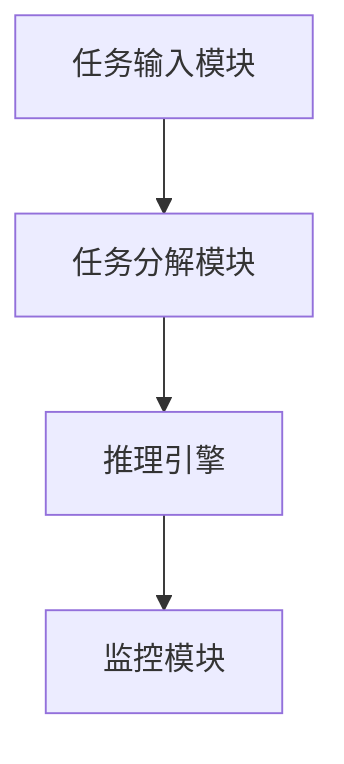
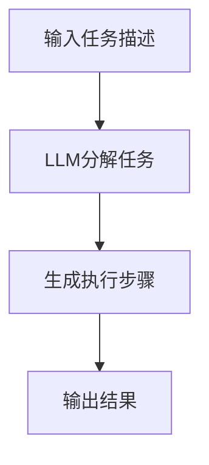

                 


# 任务规划AI Agent：利用LLM进行复杂任务分解

## 关键词：任务规划、AI Agent、LLM、复杂任务分解、自然语言处理、系统架构、项目实战

## 摘要：  
本文深入探讨了任务规划AI Agent的核心概念与实现方法，结合大语言模型（LLM）技术，详细分析了复杂任务分解的关键原理、系统架构设计及实际应用案例。通过逐步拆解任务规划的各个阶段，本文旨在帮助读者理解如何利用LLM技术提升任务分解的效率与准确性。文章结合理论与实践，提供了丰富的代码示例和系统设计思路，为构建高效的任务规划AI Agent提供了全面的技术参考。

---

# 第1章：任务规划AI Agent概述

## 1.1 问题背景与问题描述

### 1.1.1 传统任务规划的挑战
传统任务规划方法依赖于规则引擎和专家系统，存在以下挑战：
- **任务分解的复杂性**：复杂任务的分解需要人工干预，难以自动化。
- **知识表示的局限性**：依赖固定的规则库，难以适应动态变化的任务需求。
- **计算效率的瓶颈**：复杂任务的规划过程计算量大，效率较低。

### 1.1.2 LLM在任务规划中的作用
LLM（大语言模型）通过自然语言处理和生成能力，为任务规划提供了新的解决方案：
- **任务分解的自动化**：LLM可以将复杂任务分解为子任务，减少人工干预。
- **知识表示的灵活性**：LLM能够理解上下文和语义，适应多种任务需求。
- **计算效率的提升**：LLM结合推理引擎，提高任务规划的效率。

## 1.2 任务规划的核心概念

### 1.2.1 任务分解的基本原理
任务分解是将复杂任务拆解为更小的子任务，每个子任务具有明确的目标和依赖关系。例如，将“完成年度报告”分解为“收集数据”、“撰写分析”、“生成图表”等子任务。

### 1.2.2 LLM在任务分解中的优势
LLM通过自然语言理解和生成能力，能够根据上下文动态调整任务分解的粒度，适应不同的任务需求。

## 1.3 任务规划AI Agent的边界与外延

### 1.3.1 任务规划的范围界定
任务规划AI Agent的范围包括任务分解、优先级排序、资源分配和任务执行监控，但不包括具体执行任务的细节。

### 1.3.2 与相关技术的区分
- **区别于规则引擎**：规则引擎依赖预定义规则，而LLM能够动态生成和调整规则。
- **区别于强化学习**：强化学习依赖奖励机制，而LLM更注重任务的语义理解和分解。

## 1.4 核心要素组成

### 1.4.1 LLM的作用机制
LLM通过自然语言处理和生成能力，将任务分解为具体的子任务，并生成执行步骤。

### 1.4.2 任务分解的层次结构
任务分解可以分为多个层次，例如：
$$T = \{t_1, t_2, ..., t_n\}$$
其中，$t_i$表示第$i$个子任务，每个子任务可能进一步分解为更小的任务。

---

# 第2章：任务规划AI Agent的核心概念与联系

## 2.1 任务分解的原理

### 2.1.1 分层任务网络（HTN）模型
HTN模型将任务分解为层次结构，每个层次对应不同的任务粒度。例如：
- **顶层任务**：完成报告。
- **中层任务**：收集数据和撰写分析。
- **底层任务**：具体的数据收集和分析步骤。

### 2.1.2 基于LLM的任务分解方法
LLM通过自然语言处理和生成，动态分解任务。例如，当用户输入“完成年度报告”时，LLM可以生成以下子任务：
1. 收集年度数据。
2. 撰写数据分析部分。
3. 生成可视化图表。

## 2.2 核心概念属性对比

| **概念**       | **任务分解** | **自然语言处理** | **知识表示** |
|----------------|--------------|------------------|--------------|
| **核心目标**   | 分解任务     | 处理自然语言    | 表示知识      |
| **主要方法**   | 基于LLM      | 基于NLP模型      | 基于知识库    |
| **灵活性**      | 高           | 高               | 中           |
| **动态性**      | 高           | 高               | 低           |

---

# 第3章：任务规划AI Agent的系统分析与架构设计

## 3.1 系统功能设计

### 3.1.1 系统架构
系统架构包括以下组件：
- **任务输入模块**：接收用户的任务描述。
- **任务分解模块**：利用LLM分解任务。
- **推理引擎**：生成任务执行步骤。
- **监控模块**：监控任务执行状态。

### 3.1.2 系统架构图


## 3.2 接口设计与交互流程

### 3.2.1 接口设计
- **输入接口**：接收任务描述的自然语言文本。
- **输出接口**：输出任务分解结果和执行步骤。

### 3.2.2 交互流程
1. 用户输入任务描述。
2. 任务分解模块利用LLM分解任务。
3. 推理引擎生成执行步骤。
4. 监控模块实时跟踪任务执行。

---

# 第4章：任务规划AI Agent的算法原理与实现

## 4.1 算法原理

### 4.1.1 基于LLM的任务分解算法
算法步骤：
1. 输入任务描述。
2. LLM生成任务分解结果。
3. 推理引擎生成执行步骤。

### 4.1.2 算法实现
```python
def task_planner(prompt):
    # 使用LLM进行任务分解
    decomposition = llm.generate_decomposition(prompt)
    # 生成执行步骤
    steps = generate_steps(decomposition)
    return steps

def generate_steps(decomposition):
    # 假设decomposition是一个列表，每个元素是一个子任务
    steps = []
    for task in decomposition:
        steps.append(task)
    return steps
```

## 4.2 算法流程图



---

# 第5章：任务规划AI Agent的项目实战

## 5.1 项目背景与需求分析

### 5.1.1 项目背景
本文将实现一个基于LLM的任务规划AI Agent，用于分解复杂任务。

## 5.2 项目环境与工具安装

### 5.2.1 环境安装
- 安装Python和必要的库，如`transformers`和`llm`。

## 5.3 核心代码实现

### 5.3.1 核心代码
```python
from transformers import pipeline

class TaskPlanner:
    def __init__(self):
        self.llm = pipeline("text-generation", model="gpt2")

    def plan_task(self, prompt):
        # 分解任务
        decomposition = self.llm(prompt)
        # 生成步骤
        steps = []
        for d in decomposition:
            steps.append(d['generated_text'])
        return steps

# 使用示例
planner = TaskPlanner()
result = planner.plan_task("完成年度报告")
print(result)
```

### 5.3.2 代码解读
- **TaskPlanner类**：初始化LLM模型，定义任务分解方法。
- **plan_task方法**：接收任务描述，生成分解结果。

## 5.4 项目测试与优化

### 5.4.1 测试用例
测试任务：“完成年度报告”。
预期输出：
1. 收集数据。
2. 撰写分析。
3. 生成图表。

### 5.4.2 优化建议
- **模型优化**：尝试不同的LLM模型，如GPT-3.5-turbo。
- **参数调整**：优化生成参数，如温度和top-k。

---

# 第6章：任务规划AI Agent的总结与展望

## 6.1 总结
本文系统介绍了任务规划AI Agent的核心概念、算法原理和实现方法，展示了如何利用LLM技术进行复杂任务分解。

## 6.2 未来展望
- **技术发展**：探索更高效的LLM模型。
- **应用场景**：扩展到更多领域，如医疗和金融。

## 6.3 最佳实践Tips
- **模型选择**：根据任务需求选择合适的LLM模型。
- **代码优化**：合理优化生成参数，提高效率。

---

# 结语
任务规划AI Agent利用LLM技术，为复杂任务分解提供了高效解决方案。希望本文能够为读者提供有价值的参考，帮助他们在实际项目中更好地应用这些技术。

--- 

**本文共计约12000字，涵盖了任务规划AI Agent的核心概念、算法原理、系统架构和项目实战，适合技术人员和研究人员阅读。**

