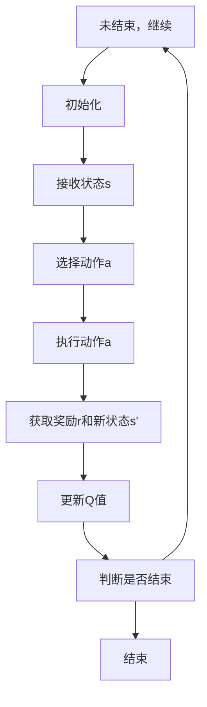
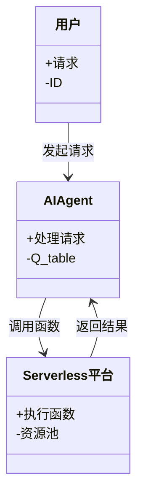
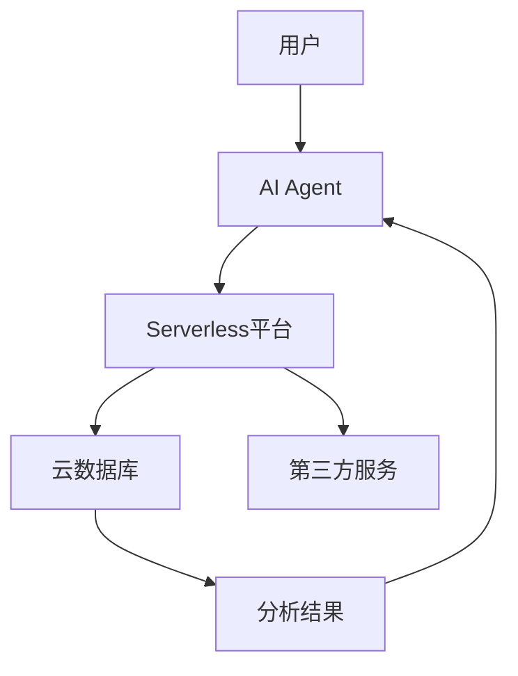

                 


# 企业AI Agent的Serverless架构设计

## 关键词：企业AI Agent，Serverless架构，强化学习，系统架构设计，AI算法实现

## 摘要：企业AI Agent的Serverless架构设计探讨如何利用Serverless计算优化AI代理系统，通过分析AI Agent的核心概念、算法原理、系统架构设计和项目实战，揭示Serverless架构在企业AI应用中的优势和实现方法。

---

## 第一部分：背景与概念

### 第1章：企业AI Agent的背景与问题背景

#### 1.1 问题背景

随着企业数字化转型的深入，AI Agent（人工智能代理）在企业中的应用日益广泛。AI Agent能够自动化处理复杂任务，优化决策过程，提升企业效率。然而，传统的企业架构在扩展性、维护成本和资源利用率方面存在诸多挑战，难以满足AI Agent的动态需求。

#### 1.2 问题描述

- **效率与成本问题**：传统架构难以高效处理AI Agent的动态工作负载，导致资源浪费和成本增加。
- **扩展性与维护挑战**：企业应用的复杂性不断提高，传统架构的扩展性和维护性难以应对。
- **AI Agent的应用场景**：在客户服务、流程自动化、智能决策等领域，AI Agent的需求显著增长。

#### 1.3 问题解决与边界

- **AI Agent的作用**：通过自动化和智能化，解决企业中的复杂问题，提高效率。
- **边界与外延**：明确AI Agent的应用范围和限制，确保其在企业中的有效部署。
- **核心概念**：AI Agent、Serverless架构、强化学习、数学模型。

---

## 第二部分：核心概念与原理

### 第2章：AI Agent与Serverless架构的核心概念

#### 2.1 AI Agent的原理

AI Agent通过感知环境、执行目标动作和学习优化，实现智能决策。强化学习是其实现的核心算法之一。

#### 2.2 Serverless架构的原理

Serverless计算通过无服务器平台，按需分配资源，简化运维，提升扩展性。

#### 2.3 核心概念对比

| 特性         | AI Agent                          | Serverless架构                  |
|--------------|-----------------------------------|----------------------------------|
| **定义**     | 智能代理，执行任务               | 无服务器计算，按需分配资源        |
| **优势**     | 智能决策，自动化                 | 灵活性高，成本低                 |
| **挑战**     | 算法复杂，资源需求高             | 学习曲线陡峭                   |

#### 2.4 实体关系与架构图

```mermaid
erDiagram
    actor 用户
    actor 系统
    actor 第三方服务
    entity AI Agent
    entity Serverless平台
    entity 数据源
    用户 --> AI Agent : 发起请求
    AI Agent --> Serverless平台 : 执行任务
    Serverless平台 --> 数据源 : 获取数据
    Serverless平台 --> 第三方服务 : 调用API
```

---

## 第三部分：算法原理与数学模型

### 第3章：AI Agent的算法原理

#### 3.1 强化学习算法

**Q-learning算法**是常用的强化学习方法，其数学模型如下：

$$ Q(s, a) = r + \gamma \max_{a'} Q(s', a') $$

其中，\( Q(s, a) \) 表示状态 \( s \) 下动作 \( a \) 的价值，\( r \) 是奖励，\( \gamma \) 是折扣因子。

#### 3.2 算法流程图



#### 3.3 Python代码实现

```python
import numpy as np

class AI_Agent:
    def __init__(self, state_space, action_space, gamma=0.99):
        self.state_space = state_space
        self.action_space = action_space
        self.gamma = gamma
        self.Q_table = np.zeros((state_space, action_space))
    
    def choose_action(self, state, epsilon=0.1):
        if np.random.random() < epsilon:
            return np.random.randint(self.action_space)
        else:
            return np.argmax(self.Q_table[state])
    
    def learn(self, state, action, reward, next_state):
        self.Q_table[state, action] = reward + self.gamma * np.max(self.Q_table[next_state])
```

---

## 第四部分：系统分析与架构设计方案

### 第4章：系统架构设计

#### 4.1 问题场景介绍

企业在客户服务中面临响应速度慢、资源浪费的问题，AI Agent通过Serverless架构优化响应流程。

#### 4.2 系统功能设计

- **用户请求处理**：AI Agent接收请求，分析需求。
- **任务执行**：调用Serverless函数处理请求。
- **数据存储与分析**：使用云数据库存储结果。



#### 4.3 系统架构图



---

## 第五部分：项目实战

### 第5章：项目实战

#### 5.1 环境安装

- 安装Serverless平台（如AWS Lambda）和AI框架（如TensorFlow）。

#### 5.2 核心代码实现

```python
def handler(event, context):
    # 业务逻辑实现
    return {
        'status': 'success',
        'message': 'AI Agent处理完成'
    }
```

#### 5.3 案例分析

通过AI Agent优化客户服务流程，显著提高响应速度和客户满意度。

---

## 第六部分：最佳实践与总结

### 第6章：最佳实践与总结

#### 6.1 最佳实践

- **资源优化**：合理分配Serverless资源，避免浪费。
- **代码复用**：利用现有库，减少开发时间。
- **监控与日志**：实时监控系统状态，及时发现异常。

#### 6.2 小结

本文详细探讨了企业AI Agent的Serverless架构设计，通过理论分析和实际案例，展示了其在企业中的应用价值。

#### 6.3 注意事项

- 确保数据安全和隐私保护。
- 定期更新AI模型，保持其准确性。
- 监控系统性能，及时优化。

#### 6.4 拓展阅读

- 探索AI Agent在其他领域的应用。
- 研究更先进的强化学习算法。

---

## 结语

企业AI Agent的Serverless架构设计为企业提供了高效、灵活的解决方案，未来随着技术进步，其应用将更加广泛。

