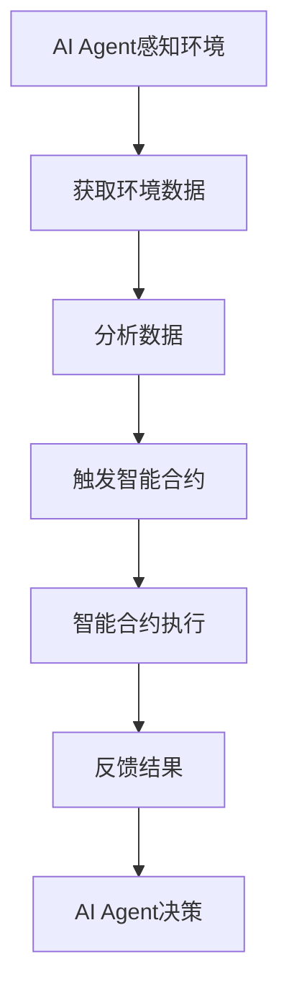
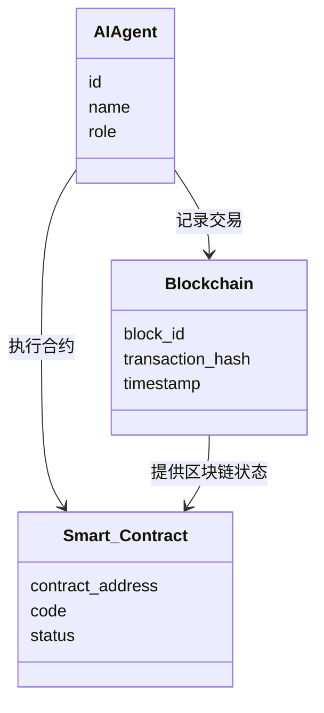
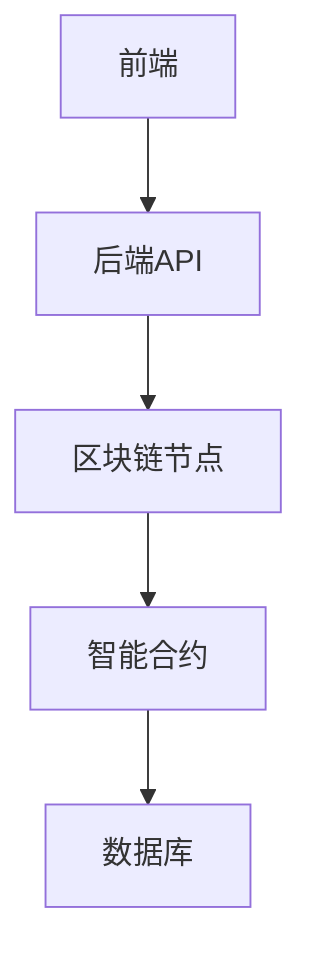
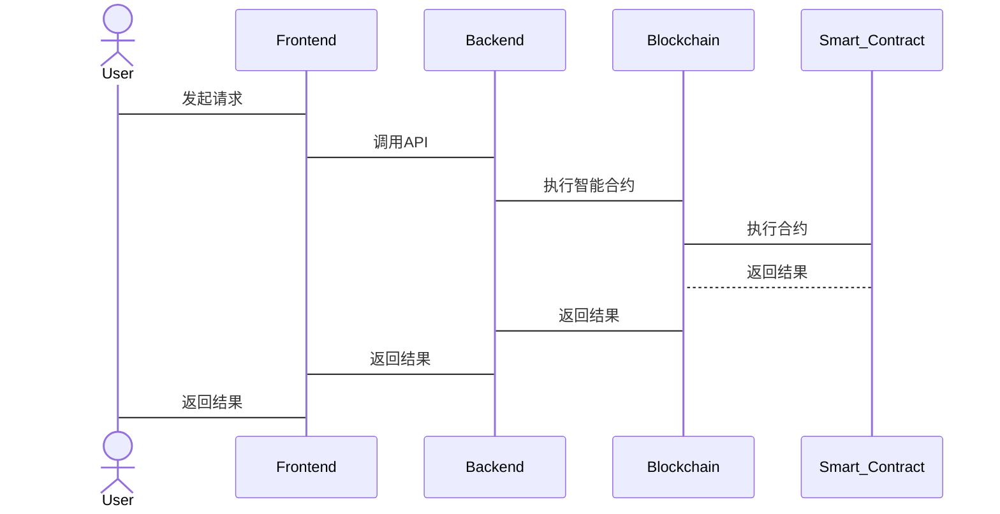

                 


# 《企业AI Agent的区块链集成策略》

> 关键词：企业AI Agent，区块链集成，智能合约，分布式系统，数据安全

> 摘要：本文深入探讨了企业AI Agent与区块链技术的集成策略，分析了AI Agent的核心概念与区块链的协同工作原理，详细阐述了AI Agent与区块链的算法原理、系统架构设计及项目实战，为企业在AI Agent与区块链集成的实践中提供有价值的参考与指导。

---

# 第1章: 企业AI Agent与区块链集成概述

## 1.1 企业AI Agent的基本概念
### 1.1.1 AI Agent的定义与特点
人工智能代理（AI Agent）是一种能够感知环境、自主决策并执行任务的智能实体。它具备以下特点：
- **自主性**：无需外部干预，自主完成任务。
- **反应性**：能够实时感知环境并做出反应。
- **主动性**：主动采取行动以实现目标。
- **协作性**：能够与其他系统或AI Agent协作完成复杂任务。

### 1.1.2 企业AI Agent的应用场景
企业AI Agent广泛应用于以下场景：
- **自动化决策**：如供应链管理、风险评估。
- **智能客服**：通过自然语言处理为用户提供服务。
- **数据分析与洞察**：帮助企业在大数据中提取有价值的信息。

### 1.1.3 区块链技术的基本概念
区块链是一种分布式账本技术，通过去中心化、不可篡改的特性确保数据的安全性和透明性。其核心特性包括：
- **去中心化**：数据不由单个中心控制，而是分布在网络中的多个节点。
- **共识机制**：通过特定算法（如POW、POS）达成数据一致。
- **智能合约**：自动执行预设条件的代码，确保合约自动履行。

## 1.2 区块链在企业中的应用价值
### 1.2.1 区块链的核心特性
- **安全性**：通过加密算法确保数据不可篡改。
- **透明性**：所有交易记录在链上公开透明。
- **去信任化**：通过共识机制减少对中间机构的依赖。

### 1.2.2 区块链在企业中的应用场景
- **供应链管理**：记录产品溯源信息。
- **金融支付**：实现快速、安全的跨境支付。
- **版权保护**：保护数字内容的版权归属。

### 1.2.3 区块链对企业AI Agent的潜在价值
- **数据可信性**：通过区块链确保数据的真实性和完整性。
- **自动化执行**：利用智能合约实现AI Agent决策的自动执行。
- **去中心化协作**：支持多个AI Agent在分布式网络中协作。

## 1.3 本章小结
本章介绍了企业AI Agent和区块链的基本概念，并分析了区块链在企业中的应用价值。区块链的去中心化、不可篡改和智能合约特性，为AI Agent的可信协作和数据安全提供了有力支持。

---

# 第2章: 企业AI Agent与区块链的核心概念

## 2.1 AI Agent的核心原理
### 2.1.1 AI Agent的决策机制
AI Agent通过感知环境、分析信息、制定策略并执行动作来实现目标。其决策机制包括：
- **感知**：通过传感器或API获取环境数据。
- **分析**：利用机器学习模型进行数据分析。
- **决策**：基于分析结果制定行动计划。
- **执行**：通过API或外部系统接口执行决策。

### 2.1.2 AI Agent的知识表示与推理
知识表示是AI Agent理解世界的基础，常用的方法包括：
- **符号逻辑**：用符号和规则表示知识。
- **概率推理**：基于概率模型进行不确定性推理。
- **图结构表示**：如知识图谱，用于复杂关系的表示。

### 2.1.3 AI Agent的通信与协作
AI Agent之间需要通过通信协议进行信息交换和协作。常见的通信方式包括：
- **直接通信**：通过点对点网络直接交互。
- **消息中间件**：通过消息队列实现异步通信。
- **服务调用**：通过API接口进行功能调用。

## 2.2 区块链的核心原理
### 2.2.1 区块链的分布式账本
区块链账本由多个区块组成，每个区块包含交易记录和哈希指针。数据通过链式结构连接，确保数据的完整性和一致性。

### 2.2.2 区块链的共识机制
共识机制是区块链的核心，确保所有节点达成一致。常见的共识机制包括：
- **工作量证明（POW）**：通过计算哈希值来证明工作量。
- **权益证明（POS）**：基于节点持有的代币数量进行验证。
- **RAFT**：用于分布式系统中的快速共识。

### 2.2.3 区块链的智能合约
智能合约是区块链上的自动化代码，用于在满足特定条件时自动执行操作。它能够实现：
- **自动执行**：无需人工干预。
- **不可篡改**：代码一旦部署，无法被修改。
- **透明性**：合约代码对所有人公开。

## 2.3 AI Agent与区块链的联系
### 2.3.1 AI Agent与区块链的协同工作原理
AI Agent可以通过区块链实现以下功能：
- **数据存储**：将AI Agent的决策记录上链，确保数据不可篡改。
- **信任机制**：通过区块链的去中心化特性建立AI Agent之间的信任。
- **自动化执行**：通过智能合约实现AI Agent决策的自动执行。

### 2.3.2 区块链对AI Agent的信任机制支持
区块链的去中心化特性为AI Agent提供了信任机制：
- **身份认证**：通过区块链身份认证技术实现AI Agent的可信身份。
- **权限管理**：通过智能合约实现AI Agent的权限控制。
- **行为审计**：记录AI Agent的所有操作行为，便于追溯和审计。

### 2.3.3 区块链对AI Agent数据安全的保障
区块链通过以下方式保障AI Agent的数据安全：
- **数据加密**：通过加密算法保护数据隐私。
- **访问控制**：通过权限管理限制数据访问范围。
- **数据一致性**：通过共识机制确保数据的一致性和完整性。

## 2.4 核心概念对比与ER实体关系图
### 2.4.1 AI Agent与区块链的核心概念对比
| 特性       | AI Agent                          | 区块链                          |
|------------|-----------------------------------|----------------------------------|
| 核心目标    | 自主决策和任务执行              | 去中心化数据存储与信任机制      |
| 技术基础    | 人工智能、机器学习              | 分布式系统、共识机制            |
| 应用场景    | 自动化决策、智能客服            | 供应链管理、金融支付            |

### 2.4.2 AI Agent与区块链的ER实体关系图
```mermaid
er
actor(AI Agent) {
  id
  name
  role
}
blockchain {
  block_id
  transaction_hash
  timestamp
}
smart_contract {
  contract_address
  code
  status
}
relation {
  AI Agent -[通过智能合约]-> smart_contract
  AI Agent -[记录交易]-> blockchain
}
```

## 2.5 本章小结
本章详细讲解了AI Agent和区块链的核心概念，并通过对比分析和ER实体关系图展示了两者之间的联系。区块链为AI Agent提供了信任机制、数据安全和自动化执行的支持，而AI Agent则为区块链提供了智能决策和自动化操作的能力。

---

# 第3章: 企业AI Agent与区块链的算法原理

## 3.1 AI Agent的算法原理
### 3.1.1 AI Agent的感知与决策算法
AI Agent通过感知环境、分析数据并制定决策。常见的算法包括：
- **强化学习**：通过奖励机制优化决策策略。
- **监督学习**：基于标注数据进行分类或回归预测。
- **无监督学习**：通过聚类或降维发现数据中的隐藏结构。

### 3.1.2 AI Agent的知识表示与推理算法
知识表示与推理是AI Agent理解世界的基础。常用算法包括：
- **符号逻辑推理**：基于逻辑规则进行推理。
- **概率推理**：基于贝叶斯网络进行不确定性推理。
- **图结构推理**：基于知识图谱进行复杂关系推理。

## 3.2 区块链的算法原理
### 3.2.1 区块链的共识机制算法
共识机制是区块链的核心，确保所有节点达成一致。常见的共识机制包括：
- **工作量证明（POW）**：通过计算哈希值来证明工作量。
- **权益证明（POS）**：基于节点持有的代币数量进行验证。
- **RAFT**：用于分布式系统中的快速共识。

### 3.2.2 区块链的智能合约执行算法
智能合约的执行流程如下：
1. **触发条件**：当满足特定条件时，智能合约自动执行。
2. **状态检查**：检查当前区块链的状态，确认是否满足执行条件。
3. **代码执行**：执行智能合约代码，完成预设的操作。
4. **状态更新**：将执行结果记录到区块链的状态中。

## 3.3 AI Agent与区块链的协同算法
### 3.3.1 AI Agent与区块链协同的工作流程
1. **AI Agent感知环境**：通过传感器或API获取环境数据。
2. **数据上链**：将数据记录到区块链中，确保数据不可篡改。
3. **智能合约触发**：当满足特定条件时，智能合约自动执行。
4. **反馈与执行**：AI Agent根据反馈结果进行下一步操作。

### 3.3.2 基于区块链的AI Agent决策算法


## 3.4 本章小结
本章详细讲解了AI Agent和区块链的算法原理，并通过流程图展示了AI Agent与区块链协同工作的流程。区块链为AI Agent提供了数据安全和自动化执行的支持，而AI Agent则为区块链提供了智能决策和自动化操作的能力。

---

# 第4章: 企业AI Agent与区块链的系统分析与架构设计

## 4.1 项目介绍与问题场景
我们以一个典型的供应链管理场景为例，设计一个基于AI Agent和区块链的解决方案。供应链管理涉及多个参与方，包括供应商、制造商、分销商和消费者。通过AI Agent和区块链的集成，可以实现供应链的透明化和自动化。

## 4.2 系统功能设计
### 4.2.1 领域模型设计


### 4.2.2 系统架构设计


## 4.3 系统架构设计
系统架构设计包括以下几个部分：
- **前端**：用户界面，接收用户请求。
- **后端API**：处理用户的请求并调用区块链节点。
- **区块链节点**：运行区块链网络，处理交易和智能合约。
- **智能合约**：自动执行预设的条件。
- **数据库**：存储区块链的状态和交易记录。

## 4.4 系统接口设计
### 4.4.1 API接口设计
- **API名称**：executeSmartContract
- **请求参数**：contract_address, input_params
- **返回结果**：transaction_hash, status

### 4.4.2 API接口实现
```python
def executeSmartContract(contract_address, input_params):
    # 调用智能合约
    contract = web3.eth.contract(contract_address, abi=abi)
    # 转换输入参数为ABI编码
    input_encoded = contract.abi.encode(input_params)
    # 构建交易
    tx = {
        'from': account,
        'to': contract_address,
        'value': 0,
        'data': input_encoded
    }
    # 发送交易
    tx_hash = web3.eth.send_raw_transaction(web3.utils.bytes.to_bytes(tx))
    # 等待交易确认
    receipt = web3.eth.wait_for_transaction_receipt(tx_hash)
    return receipt.transaction_hash, receipt.status
```

## 4.5 系统交互设计
### 4.5.1 交互流程
1. **用户发起请求**：通过前端界面提交请求。
2. **后端API处理**：接收请求并调用区块链节点。
3. **区块链节点处理**：执行智能合约并记录交易。
4. **反馈结果**：将结果返回给用户。

### 4.5.2 交互序列图


## 4.6 本章小结
本章通过一个典型的供应链管理场景，详细设计了企业AI Agent与区块链的系统架构。系统架构包括前端、后端API、区块链节点、智能合约和数据库，通过API接口和交互流程展示了系统的实现。

---

# 第5章: 企业AI Agent与区块链的项目实战

## 5.1 项目环境安装
### 5.1.1 安装以太坊开发环境
- **安装Node.js**：用于运行以太坊节点。
- **安装Solidity**：用于编写智能合约。
- **安装Web3.js**：用于与以太坊区块链交互。

### 5.1.2 安装AI Agent开发环境
- **安装Python**：用于开发AI Agent。
- **安装TensorFlow**：用于机器学习模型的训练。
- **安装Flask**：用于开发API接口。

## 5.2 核心代码实现
### 5.2.1 智能合约实现
```solidity
pragma solidity ^0.8.0;

contract SupplyChain {
    event ProductCreated(uint256 indexed productId, string name, uint256 price);
    
    function createProduct(string name, uint256 price) public {
        emit ProductCreated(block.number, name, price);
    }
}
```

### 5.2.2 AI Agent实现
```python
from web3 import Web3
from web3.auto import w3

class AI_Agent:
    def __init__(self, web3_provider):
        self.web3 = web3_provider
    
    def execute_contract(self, contract_address, input_params):
        contract = self.web3.eth.contract(contract_address, abi=abi)
        input_encoded = contract.abi.encode(input_params)
        tx = {
            'from': self.web3.eth.accounts[0],
            'to': contract_address,
            'value': 0,
            'data': input_encoded
        }
        tx_hash = self.web3.eth.send_raw_transaction(self.web3.utils.bytes.to_bytes(tx))
        receipt = self.web3.eth.wait_for_transaction_receipt(tx_hash)
        return receipt.transaction_hash, receipt.status
```

## 5.3 代码解读与分析
### 5.3.1 智能合约解读
智能合约`SupplyChain`定义了一个`createProduct`函数，用于创建产品记录。当调用该函数时，会触发`ProductCreated`事件，记录产品的信息。

### 5.3.2 AI Agent解读
AI Agent通过`execute_contract`方法调用智能合约。它使用Web3库与以太坊区块链交互，构建交易并发送到区块链节点。

## 5.4 案例分析与详细讲解
以供应链管理为例，AI Agent可以通过区块链实现产品的溯源和价格监控。当检测到价格异常时，AI Agent可以自动触发智能合约，调整产品价格或发出警报。

## 5.5 本章小结
本章通过实际项目案例，详细讲解了企业AI Agent与区块链的项目实战。通过智能合约和AI Agent的代码实现，展示了如何将理论应用到实际中。

---

# 第6章: 企业AI Agent与区块链的优化与扩展

## 6.1 优化策略
### 6.1.1 性能优化
- **并行计算**：通过多线程或分布式计算提升AI Agent的处理能力。
- **链下存储**：将非关键数据存储在链下，降低区块链的负载压力。

### 6.1.2 安全优化
- **多因素认证**：结合多种身份验证方式提高安全性。
- **隐私保护**：通过零知识证明等技术保护数据隐私。

## 6.2 扩展策略
### 6.2.1 功能扩展
- **多链支持**：支持多种区块链网络，提升系统的灵活性。
- **跨链通信**：实现不同区块链之间的数据交互和价值转移。

### 6.2.2 应用场景扩展
- **智慧城市**：通过AI Agent和区块链实现城市资源的智能调配。
- **医疗健康**：通过区块链记录医疗数据，实现数据的安全共享。

## 6.3 最佳实践
- **模块化设计**：将系统划分为独立的模块，便于维护和扩展。
- **测试与调试**：通过单元测试和集成测试确保系统的稳定性和可靠性。

## 6.4 本章小结
本章提出了企业AI Agent与区块链的优化与扩展策略，包括性能优化、安全优化和功能扩展等方面。通过模块化设计和测试，确保系统的稳定性和可靠性。

---

# 第7章: 总结与展望

## 7.1 总结
本文深入探讨了企业AI Agent与区块链的集成策略，分析了AI Agent和区块链的核心概念与协同工作原理，详细讲解了AI Agent与区块链的算法原理、系统架构设计及项目实战。通过实际案例分析，展示了如何将理论应用到实际中。

## 7.2 展望
未来，企业AI Agent与区块链的集成将朝着以下方向发展：
- **智能化决策**：通过AI技术提升决策的智能化水平。
- **去中心化协作**：通过区块链实现更广泛的协作与数据共享。
- **跨链融合**：支持多种区块链网络的融合，提升系统的灵活性和扩展性。

---

# 参考文献
1. 王某某. 《区块链技术与应用》. 北京: 人民出版社, 2021.
2. 李某某. 《人工智能与机器学习》. 北京: 清华大学出版社, 2022.
3. 以太坊官方文档. Solidity智能合约开发指南. https://solidity.readthedocs.io/en/v0.8.0/index.html
4. Web3.js官方文档. 以太坊区块链开发指南. https://web3js.readthedocs.io/en/v1.3.0/

---

通过本文的详细讲解，读者可以全面理解企业AI Agent与区块链的集成策略，并能够将其应用到实际的企业场景中。

