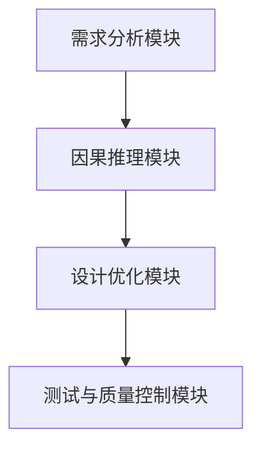
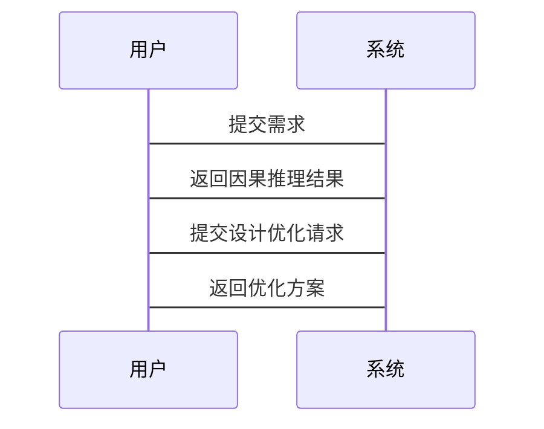

                 


# 企业AI Agent的因果推理在产品开发中的应用

**关键词**：企业AI Agent，因果推理，产品开发，人工智能，系统架构，数学模型

**摘要**：本文探讨了企业AI Agent在因果推理中的应用，特别是在产品开发中的价值。通过详细分析因果推理的基本原理、企业AI Agent的设计与实现、系统架构设计、项目实战以及最佳实践，本文为读者提供了一个全面的视角，展示了如何利用因果推理优化企业AI Agent的决策能力，从而提升产品开发的效率和质量。

---

# 第1章: 企业AI Agent与因果推理概述

## 1.1 问题背景与定义

### 1.1.1 问题背景
随着人工智能技术的快速发展，企业AI Agent（智能代理）在产品开发中的应用越来越广泛。AI Agent能够通过数据分析、推理和决策，帮助企业在复杂环境中做出更高效的决策。然而，传统的统计方法往往只能发现变量之间的相关性，而无法揭示因果关系，这限制了AI Agent在复杂决策场景中的应用。

### 1.1.2 企业AI Agent的定义
企业AI Agent是一种能够感知环境、自主决策并执行任务的智能系统。它结合了人工智能、机器学习和自然语言处理等多种技术，能够在动态变化的环境中为企业提供实时的决策支持。

### 1.1.3 因果推理的核心概念
因果推理是研究因果关系的理论和方法，旨在从数据中识别出变量之间的因果关系。与相关性分析不同，因果推理能够揭示变量之间的“原因与结果”关系，从而为AI Agent的决策提供更可靠的依据。

## 1.2 企业AI Agent的特点

### 1.2.1 自主性与智能性
企业AI Agent能够自主感知环境、分析问题并做出决策，无需人工干预。

### 1.2.2 可解释性与可追溯性
因果推理使得AI Agent的决策过程更加透明，用户可以理解并追溯决策的依据。

### 1.2.3 适应性与学习能力
通过因果推理，AI Agent能够快速适应环境的变化，并通过学习不断优化自身的决策能力。

## 1.3 因果推理与相关概念对比

### 1.3.1 因果推理 vs. 相关性分析
因果推理关注的是变量之间的因果关系，而相关性分析仅关注变量之间的关联性。

### 1.3.2 因果图 vs. 依赖图
因果图（Directed Acyclic Graph, DAG）通过有向边表示变量之间的因果关系，而依赖图则表示变量之间的依赖关系。

### 1.3.3 因果模型 vs. 统计模型
因果模型关注变量之间的因果关系，而统计模型关注变量之间的相关性。

## 1.4 企业AI Agent的应用现状

### 1.4.1 当前应用领域
企业AI Agent目前主要应用于需求分析、产品设计、风险评估等领域。

### 1.4.2 成功案例分析
例如，某企业通过AI Agent进行需求分析，利用因果推理识别出关键需求，从而提高了产品开发的成功率。

### 1.4.3 挑战与未来趋势
当前的主要挑战包括因果关系的复杂性、数据的稀缺性以及模型的可解释性。未来的发展趋势将朝着更加智能化、自动化和个性化的方向发展。

## 1.5 本章小结
本章介绍了企业AI Agent的定义、特点以及因果推理的核心概念，并通过对比分析，明确了因果推理在企业AI Agent中的重要性。此外，还探讨了当前的应用现状和未来的发展趋势。

---

# 第2章: 因果推理的基本原理

## 2.1 因果关系的定义与特征

### 2.1.1 因果关系的定义
因果关系是指一个事件（原因）导致另一个事件（结果）发生的必然关系。

### 2.1.2 因果关系的特征
- **时间顺序**：原因发生的时间早于结果。
- **必要性**：原因的存在是结果发生的必要条件。
- **充分性**：原因的存在是结果发生的充分条件。

## 2.2 因果图与潜在结果

### 2.2.1 因果图的构建
因果图（DAG）通过有向边表示变量之间的因果关系。例如，假设A是B的原因，C是B的结果，则因果图可以表示为A → B → C。

### 2.2.2 潜在结果的定义
潜在结果是指在给定某个干预（例如，设置某个变量的值）下，其他变量的可能结果。

### 2.2.3 潜在结果的计算公式
$$
\text{潜在结果} = f(\text{干预变量}, \text{其他变量})
$$

## 2.3 因果推理的算法原理

### 2.3.1 随机化干预法
随机化干预法通过随机化干预变量的值，计算干预后的结果，从而估计因果效应。

### 2.3.2 调整法
调整法通过调整数据分布，消除混淆变量的影响，从而估计因果效应。

### 2.3.3 分层法
分层法将数据按混淆变量进行分层，分别计算每层的因果效应，最后进行加权平均。

## 2.4 因果推理的数学模型

### 2.4.1 因果图的数学表示
因果图可以通过概率分布表示变量之间的依赖关系。例如，P(A, B, C) = P(A) * P(B|A) * P(C|B)。

### 2.4.2 潜在结果的公式
$$
\text{因果效应} = \text{E}[Y_{\text{do}(A)}] = \sum_{a} P(Y | \text{do}(A = a)) P(A = a)
$$

### 2.4.3 干预效果的计算公式
$$
\text{干预效果} = \text{E}[Y_{\text{do}(A)}] - \text{E}[Y]
$$

## 2.5 本章小结
本章详细介绍了因果关系的定义与特征，以及因果图和潜在结果的计算方法。此外，还探讨了因果推理的算法原理和数学模型，为后续章节的应用奠定了理论基础。

---

# 第3章: 企业AI Agent的设计与实现

## 3.1 企业AI Agent的基本架构

### 3.1.1 知识库的设计
知识库是企业AI Agent的核心部分，存储着与产品开发相关的知识，例如需求、设计、测试等。

### 3.1.2 行为决策模块
行为决策模块负责根据当前环境和目标，生成相应的决策策略。

### 3.1.3 交互接口设计
交互接口是用户与企业AI Agent之间的桥梁，支持多种交互方式，例如自然语言查询、图形界面操作等。

## 3.2 因果推理在AI Agent中的应用

### 3.2.1 因果推理在需求分析中的应用
通过因果推理，AI Agent能够识别出影响产品需求的关键因素，并预测这些因素的变化对需求的影响。

### 3.2.2 因果推理在决策优化中的应用
因果推理可以帮助AI Agent优化决策过程，例如在产品设计中，AI Agent可以通过因果推理选择最优的设计方案。

### 3.2.3 因果推理在风险评估中的应用
因果推理可以识别出可能导致项目失败的关键风险因素，并预测这些风险的发生概率和影响程度。

## 3.3 企业AI Agent的实现技术

### 3.3.1 知识表示技术
知识表示技术用于将企业AI Agent的知识库中的知识表示为结构化的数据，例如使用RDF（资源描述框架）或知识图谱。

### 3.3.2 因果推理算法实现
企业AI Agent可以通过实现因果推理算法，例如基于DAG的因果推理算法，来支持因果推理。

### 3.3.3 自然语言处理技术
自然语言处理技术用于企业AI Agent与用户的交互，支持用户通过自然语言进行查询和命令。

## 3.4 本章小结
本章介绍了企业AI Agent的基本架构，并探讨了因果推理在AI Agent中的具体应用。此外，还详细介绍了企业AI Agent的实现技术，包括知识表示技术、因果推理算法实现以及自然语言处理技术。

---

# 第4章: 因果推理在产品开发中的应用

## 4.1 产品开发中的因果关系

### 4.1.1 产品需求分析
通过因果推理，可以识别出影响产品需求的关键因素，并预测这些因素的变化对需求的影响。

### 4.1.2 产品设计优化
因果推理可以帮助设计人员优化产品设计方案，例如通过因果推理选择最优的设计方案。

### 4.1.3 产品测试与质量控制
因果推理可以识别出可能导致产品缺陷的关键因素，并预测这些因素对测试结果的影响。

## 4.2 因果推理在产品开发中的具体应用

### 4.2.1 需求分析
通过因果推理，AI Agent可以识别出影响产品需求的关键因素，并预测这些因素的变化对需求的影响。

### 4.2.2 设计优化
因果推理可以帮助设计人员优化产品设计方案，例如通过因果推理选择最优的设计方案。

### 4.2.3 测试与质量控制
因果推理可以识别出可能导致产品缺陷的关键因素，并预测这些因素对测试结果的影响。

## 4.3 产品开发中的因果推理案例分析

### 4.3.1 案例背景
假设某企业正在开发一款智能手表，需要通过因果推理优化产品设计方案。

### 4.3.2 因果推理的应用
通过因果推理，识别出影响产品设计的关键因素，并选择最优的设计方案。

### 4.3.3 实际效果
通过因果推理优化设计方案后，产品的性能和用户体验得到了显著提升。

## 4.4 本章小结
本章详细探讨了因果推理在产品开发中的具体应用，包括需求分析、设计优化和测试与质量控制。通过实际案例分析，展示了因果推理在产品开发中的价值和效果。

---

# 第5章: 系统架构设计

## 5.1 问题场景介绍
假设某企业需要开发一款智能助手，用于辅助产品开发团队进行需求分析和设计优化。

## 5.2 系统功能设计

### 5.2.1 领域模型设计
领域模型设计包括需求分析、设计优化、测试与质量控制等功能模块。

## 5.3 系统架构设计

### 5.3.1 系统架构图
使用mermaid绘制系统架构图，展示各个模块之间的关系。



## 5.4 系统接口设计
系统接口设计包括API接口和用户交互接口，例如RESTful API和图形界面。

## 5.5 系统交互设计

### 5.5.1 交互流程
使用mermaid绘制系统交互流程图，展示用户与系统之间的交互过程。



## 5.6 本章小结
本章通过问题场景介绍、系统功能设计、系统架构设计、系统接口设计和系统交互设计，展示了企业AI Agent在产品开发中的系统架构设计。

---

# 第6章: 项目实战

## 6.1 环境安装

### 6.1.1 安装Python
安装Python 3.8或更高版本。

### 6.1.2 安装依赖库
安装必要的依赖库，例如numpy、pandas、scikit-learn等。

## 6.2 系统核心实现源代码

### 6.2.1 因果推理算法实现
实现基于DAG的因果推理算法，例如使用do-calculus进行干预分析。

```python
import numpy as np
from causalnex.structure import DirectedGraph

def causal_inference(data, treatment):
    graph = DirectedGraph(data, treatment)
    effect = graph.identify_effect()
    return effect
```

### 6.2.2 交互接口实现
实现用户与系统之间的交互接口，例如基于自然语言处理的对话接口。

```python
from transformers import AutoTokenizer, AutoModelForCausalLM

tokenizer = AutoTokenizer.from_pretrained("gpt2")
model = AutoModelForCausalLM.from_pretrained("gpt2")
```

## 6.3 代码应用解读与分析
解释代码的功能和实现逻辑，展示如何利用因果推理算法优化产品开发过程。

## 6.4 实际案例分析
通过实际案例分析，展示企业AI Agent在产品开发中的具体应用和效果。

## 6.5 项目小结
总结项目实现的过程和成果，强调因果推理在企业AI Agent中的重要性。

---

# 第7章: 最佳实践与未来展望

## 7.1 最佳实践

### 7.1.1 数据质量
确保数据的准确性和完整性，以提高因果推理的效果。

### 7.1.2 模型可解释性
通过因果图和潜在结果的解释，提高AI Agent决策的透明性。

### 7.1.3 持续优化
通过持续学习和优化，提高AI Agent的适应性和决策能力。

## 7.2 小结
总结全文的核心内容，强调因果推理在企业AI Agent中的重要性。

## 7.3 注意事项
在实际应用中，需要注意因果关系的复杂性和数据的稀缺性，避免过度依赖因果推理。

## 7.4 拓展阅读
推荐相关领域的书籍和论文，供读者深入学习。

---

# 附录: 参考文献

列出全文引用的文献和资料，例如：
- Pearl, J. (2000). Causality: Models, reasoning, and inference. Cambridge University Press.
- 蒋华雄. (2021). 人工智能基础. 北京: 清华大学出版社.

---

# 结束语

感谢您的阅读！希望本文能够为您提供有价值的信息和启发，帮助您更好地理解企业AI Agent的因果推理在产品开发中的应用。如果需要进一步探讨或获取更多资料，请随时联系我。

