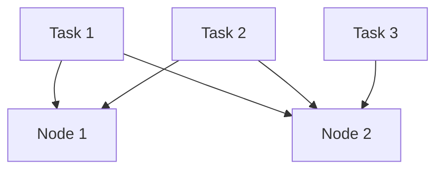
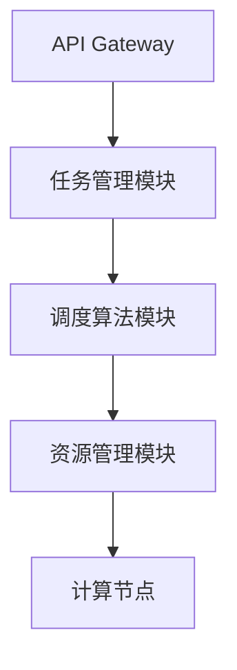
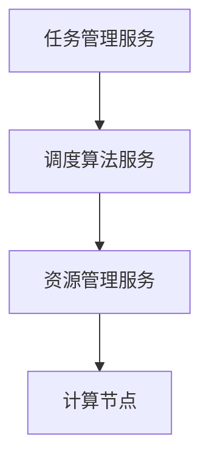

                 


# 企业AI Agent的容器化应用编排策略

> 关键词：企业AI Agent，容器化，应用编排，Kubernetes，Docker，任务调度

> 摘要：随着企业智能化转型的加速，AI Agent作为一种能够自主执行复杂任务的智能体，正在成为企业数字化转型的核心技术之一。容器化技术以其轻量、高效、灵活的特点，为AI Agent的应用提供了理想的运行环境。然而，如何在复杂的生产环境中高效地编排和管理这些容器化AI Agent，成为了企业面临的重要挑战。本文将从企业AI Agent的定义、容器化编排的核心概念、算法原理、系统架构设计、项目实战等多个方面，详细探讨企业AI Agent的容器化应用编排策略，为企业技术团队提供有价值的参考。

---

## 第一部分：企业AI Agent与容器化应用概述

### 第1章：企业AI Agent的定义与背景

#### 1.1 企业AI Agent的定义与背景
企业AI Agent（Artificial Intelligence Agent）是指一种能够感知环境、自主决策、执行任务并能够与人类或其他系统交互的智能体。它结合了人工智能、大数据分析和自动化技术，能够帮助企业实现智能化的业务流程管理、任务执行和决策支持。

#### 1.2 企业AI Agent的发展背景
随着企业数字化转型的深入，传统的人工操作和单一自动化工具已经难以满足企业对高效、智能、灵活的业务处理需求。AI Agent的出现，为企业的智能化转型提供了新的解决方案，尤其是在复杂业务流程优化、多系统协同、数据驱动决策等领域展现了巨大的潜力。

#### 1.3 企业AI Agent的核心价值
- **智能决策**：基于实时数据和历史行为，AI Agent能够做出最优决策。
- **自主执行**：无需人工干预，AI Agent能够独立完成复杂任务。
- **高效协同**：AI Agent能够与其他系统、AI Agent协同工作，实现业务流程的无缝衔接。

### 第2章：容器化技术的简介

#### 2.1 容器化技术的基本概念
容器化是一种轻量级的虚拟化技术，通过将应用程序及其依赖打包为一个可移植的容器，能够在不同的计算环境之间轻松运行。容器化技术的核心是Docker，它通过操作系统级的虚拟化实现了资源隔离和复用。

#### 2.2 容器化技术的优势
- **轻量高效**：容器的启动速度远快于虚拟机，资源占用低。
- **一致的运行环境**：容器提供了统一的运行环境，避免了环境依赖问题。
- **弹性扩展**：容器化应用能够快速响应负载变化，实现弹性伸缩。

#### 2.3 容器化技术在企业中的应用
- **微服务架构**：将企业应用拆分为多个独立的服务，每个服务以容器形式运行。
- **持续集成与交付**：通过容器化技术实现快速迭代和部署。
- **多环境支持**：容器化技术能够轻松地在开发、测试、生产环境中一致运行。

### 第3章：容器化应用编排的必要性

#### 3.1 容器化应用编排的定义
容器编排是指通过自动化工具对多个容器化应用进行部署、管理和维护的过程。编排的目标是确保应用在不同的环境中能够高效、稳定、安全地运行。

#### 3.2 编排技术在企业中的作用
- **自动化部署**：通过编排工具实现应用的自动化部署。
- **资源优化**：通过智能调度算法优化资源使用。
- **故障恢复**：通过自动化的故障检测和恢复机制保证应用的高可用性。

#### 3.3 企业AI Agent与容器化编排的结合
企业AI Agent作为一种智能体，其运行依赖于高效的资源管理和任务调度。容器化编排技术能够为AI Agent提供一个灵活、可靠的运行环境，同时通过编排策略优化AI Agent的任务执行效率。

---

## 第二部分：企业AI Agent的容器化编排核心概念

### 第4章：容器编排的原理

#### 4.1 容器编排的基本流程
容器编排的过程通常包括以下几个步骤：
1. **任务定义**：明确任务的需求和目标。
2. **资源分配**：根据任务需求分配计算资源。
3. **任务调度**：将任务分配到合适的节点上运行。
4. **监控与调整**：实时监控任务执行情况，动态调整资源分配。

#### 4.2 容器编排的核心要素
- **任务调度策略**：如何将任务分配到合适的节点上。
- **资源管理策略**：如何高效利用计算资源。
- **容错机制**：如何处理任务执行中的异常情况。

#### 4.3 容器编排的实现方式
容器编排的实现方式包括：
- **基于Docker Swarm的编排**：Docker自带的容器编排工具，简单易用。
- **基于Kubernetes的编排**：功能强大，支持复杂的分布式应用部署。
- **基于云平台的编排**：利用云平台提供的容器编排服务，如AWS ECS、Azure Kubernetes Service等。

### 第5章：企业AI Agent的编排策略

#### 5.1 AI Agent的任务调度策略
- **负载均衡策略**：根据节点的负载情况动态分配任务。
- **优先级调度策略**：根据任务的重要性和紧急程度优先调度。
- **预测模型调度策略**：基于历史数据和当前负载预测未来的资源需求。

#### 5.2 AI Agent的资源分配策略
- **资源需求预测**：根据任务类型预测所需的资源量。
- **资源分配优化**：通过数学优化算法实现资源的最优分配。
- **资源弹性伸缩**：根据负载动态调整资源分配。

#### 5.3 AI Agent的错误处理策略
- **故障检测**：通过监控系统状态发现故障。
- **自动恢复**：在检测到故障后，自动重启任务或分配新的节点执行任务。
- **容错机制**：通过冗余部署和数据备份实现容错。

---

## 第三部分：企业AI Agent容器化编排的算法原理

### 第6章：任务调度算法

#### 6.1 基于负载均衡的任务调度算法


#### 6.2 基于优先级的任务调度算法
```mermaid
graph TD
A[Task 1 (High)] --> B[Node 1]
C[Task 2 (Medium)] --> D[Node 2]
E[Task 3 (Low)] --> F[Node 3]
```

#### 6.3 基于预测模型的任务调度算法
```python
def predict_resource Demand(task_type):
    if task_type == 'high':
        return 4
    elif task_type == 'medium':
        return 2
    else:
        return 1
```

### 第7章：资源分配算法

#### 7.1 资源需求预测算法
```latex
\text{资源需求} = \sum_{i=1}^{n} \text{任务}_i \times \text{资源消耗}_i
```

#### 7.2 资源分配优化算法
```latex
\text{优化目标} = \min \sum_{i=1}^{n} \text{资源分配}_i \times \text{资源价格}_i
```

#### 7.3 资源弹性伸缩算法
```python
def auto_scale(resource_usage):
    if resource_usage > 0.8:
        return '增加节点'
    elif resource_usage < 0.3:
        return '减少节点'
    else:
        return '保持不变'
```

---

## 第四部分：企业AI Agent容器化编排的系统架构设计

### 第8章：系统功能设计

#### 8.1 任务管理模块
- **任务提交**：用户可以通过API提交任务。
- **任务调度**：根据调度策略分配任务到合适的节点。
- **任务监控**：实时监控任务的执行状态。

#### 8.2 资源管理模块
- **资源分配**：根据任务需求分配计算资源。
- **资源监控**：实时监控资源使用情况。
- **资源调整**：根据负载动态调整资源分配。

#### 8.3 调度算法实现模块
- **算法选择**：根据任务类型选择合适的调度算法。
- **算法实现**：实现具体的调度算法。
- **算法优化**：根据实际运行情况优化调度算法。

#### 8.4 监控与日志模块
- **系统监控**：监控系统的运行状态。
- **日志记录**：记录系统的运行日志。
- **故障分析**：根据日志分析系统故障。

### 第9章：系统架构图

#### 9.1 分层架构设计


#### 9.2 微服务架构设计


---

## 第五部分：企业AI Agent容器化编排的项目实战

### 第10章：环境搭建

#### 10.1 安装Docker
```bash
sudo apt-get update
sudo apt-get install docker.io
docker --version
```

#### 10.2 安装Kubernetes
```bash
sudo apt-get install kubectl
kubectl --version
```

#### 10.3 创建容器化AI Agent
```dockerfile
FROM ubuntu:20.04
WORKDIR /app
COPY . .
CMD ["python", "app.py"]
```

### 第11章：核心代码实现

#### 11.1 调度算法实现
```python
import random

def load_balancing_scheduler(tasks, nodes):
    node_load = {node: 0 for node in nodes}
    for task in tasks:
        min_load_node = min(node_load, key=lambda k: node_load[k])
        node_load[min_load_node] += task['resource_demand']
        assign_task_to_node(task, min_load_node)
```

#### 11.2 资源分配实现
```python
def resource_allocator(resource_demand, available_resources):
    allocation = {}
    for node in nodes:
        allocation[node] = min(resource_demand, available_resources)
    return allocation
```

### 第12章：案例分析

#### 12.1 案例分析
假设我们有一个包含3个计算节点的企业AI Agent集群，每个节点的计算能力为4核。我们需要调度4个任务，任务1和任务2需要4核，任务3和任务4需要2核。

#### 12.2 调度结果
- 节点1：任务1和任务3
- 节点2：任务2和任务4
- 节点3：空闲

---

## 第六部分：总结与展望

### 第13章：总结

#### 13.1 本章小结
通过本文的介绍，我们详细探讨了企业AI Agent的容器化应用编排策略。从容器化技术的基本概念到编排算法的实现，再到系统的架构设计和项目实战，我们为企业技术团队提供了全面的指导。

### 第14章：注意事项与拓展阅读

#### 14.1 注意事项
- **资源分配策略**：需要根据实际业务需求进行调整。
- **调度算法选择**：需要根据任务类型和系统规模进行选择。
- **系统安全性**：需要加强容器化系统的安全防护。

#### 14.2 拓展阅读
- 《容器化技术入门与实践》
- 《Kubernetes官方文档》
- 《分布式系统设计与实现》

---

通过本文的详细讲解，我们希望能够帮助企业技术团队更好地理解和应用企业AI Agent的容器化编排策略，为企业的智能化转型提供有力的技术支持。

