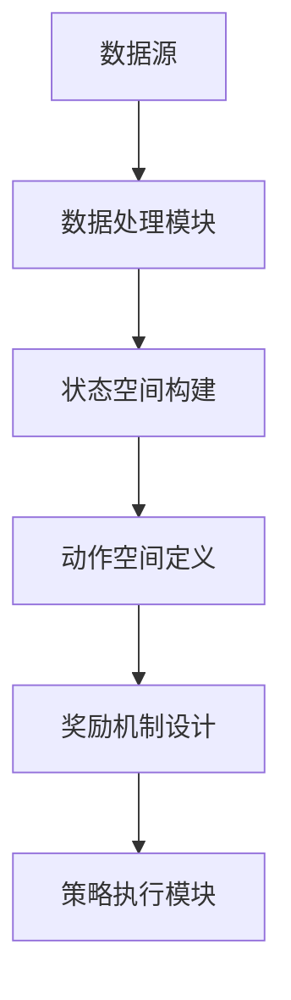
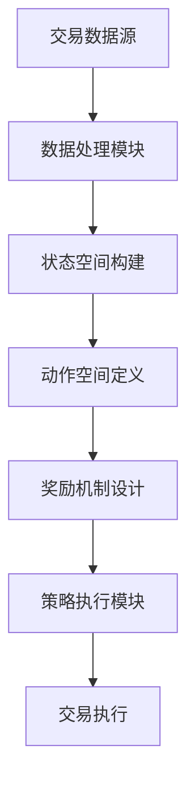
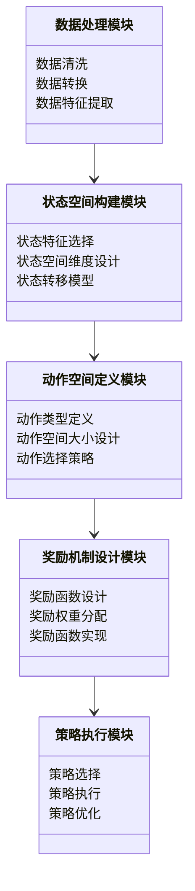

                 


# 企业AI Agent的强化学习在金融交易中的应用

> 关键词：AI Agent，强化学习，金融交易，Q-learning，Deep Q-learning，数学模型

> 摘要：本文详细探讨了企业AI Agent在金融交易中的强化学习应用。从强化学习的基本概念到其在金融交易中的具体应用，从算法原理到系统架构设计，再到实际项目案例的分析，本文旨在为读者提供一个全面而深入的视角，帮助读者理解如何利用强化学习优化金融交易策略。

---

# 第一部分: 企业AI Agent与强化学习基础

## 第1章: 强化学习与AI Agent概述

### 1.1 强化学习的基本概念

#### 1.1.1 强化学习的定义
强化学习（Reinforcement Learning，RL）是一种机器学习范式，通过智能体（Agent）与环境的交互，学习最优策略以最大化累积奖励。与监督学习和无监督学习不同，强化学习强调通过试错和经验积累来优化决策。

#### 1.1.2 AI Agent的定义与特点
AI Agent是指能够感知环境、自主决策并采取行动的智能实体。其特点包括：
- **自主性**：无需外部干预，自主决策。
- **反应性**：能够实时感知环境并做出反应。
- **目标导向**：基于目标函数优化决策。
- **学习能力**：通过经验改进决策策略。

#### 1.1.3 强化学习与AI Agent的关系
强化学习为AI Agent提供了决策优化的框架，通过定义状态、动作和奖励，使AI Agent能够在复杂环境中找到最优策略。AI Agent则是强化学习算法的实现载体。

### 1.2 强化学习的核心原理

#### 1.2.1 状态、动作、奖励的定义
- **状态（State）**：环境中的当前情况，例如股票价格、市场趋势等。
- **动作（Action）**：AI Agent基于当前状态采取的决策，例如买入、卖出或持有。
- **奖励（Reward）**：AI Agent采取动作后获得的反馈，通常表示该动作的好坏。

#### 1.2.2 贝尔曼方程与动态规划
贝尔曼方程是强化学习的核心数学模型，表示状态的价值函数：
$$ V(s) = \max_{a} [ r(s,a) + \gamma V(s') ] $$
其中，$r(s,a)$是当前状态下采取动作$a$的奖励，$\gamma$是折扣因子，$s'$是下一步的状态。

#### 1.2.3 Q-learning算法的基本原理
Q-learning是一种经典的强化学习算法，通过更新Q值表来学习最优策略：
$$ Q(s,a) = Q(s,a) + \alpha [ r + \gamma \max Q(s',a') - Q(s,a) ] $$
其中，$\alpha$是学习率，$r$是奖励，$\gamma$是折扣因子。

### 1.3 AI Agent在金融交易中的应用前景

#### 1.3.1 金融交易中的决策问题
金融交易涉及高度不确定性，传统的基于规则的交易策略难以应对复杂市场环境。

#### 1.3.2 AI Agent在金融交易中的优势
AI Agent能够实时感知市场变化，基于历史数据和当前状态优化交易策略。

#### 1.3.3 应用场景与挑战
- **应用场景**：股票交易、外汇交易、期货交易等。
- **挑战**：市场不确定性、数据噪声、策略过拟合等。

---

## 第2章: 强化学习在金融交易中的核心概念

### 2.1 强化学习与金融交易的关系

#### 2.1.1 金融市场的不确定性与强化学习的适用性
金融市场高度动态，强化学习能够通过经验积累适应市场变化。

#### 2.1.2 交易策略的动态优化
强化学习能够实时优化交易策略，提高收益并降低风险。

#### 2.1.3 奖励函数的设计与实现
奖励函数是强化学习的核心，设计合理的奖励函数能够引导AI Agent做出最优决策。

### 2.2 AI Agent在金融交易中的决策模型

#### 2.2.1 状态空间的构建
状态空间是AI Agent感知市场环境的基础，通常包括价格、成交量、市场情绪等指标。

#### 2.2.2 动作空间的定义
动作空间是AI Agent可采取的动作集合，例如买入、卖出或持有。

#### 2.2.3 奖励机制的设计
奖励机制是强化学习的核心，设计合理的奖励机制能够引导AI Agent做出最优决策。

### 2.3 强化学习算法在金融交易中的应用

#### 2.3.1 Q-learning算法的实现
Q-learning算法通过更新Q值表，学习最优交易策略。

#### 2.3.2 Deep Q-learning算法的改进
Deep Q-learning算法通过深度神经网络近似Q值函数，能够处理高维状态空间。

#### 2.3.3 策略梯度方法的应用
策略梯度方法直接优化策略参数，能够更高效地找到最优策略。

---

## 第3章: 强化学习的数学模型与算法原理

### 3.1 强化学习的数学基础

#### 3.1.1 贝尔曼方程的数学表达
$$ V(s) = \max_{a} [ r(s,a) + \gamma V(s') ] $$

#### 3.1.2 动态规划的数学推导
动态规划通过迭代更新状态价值函数，逼近最优策略。

#### 3.1.3 Q-learning算法的数学模型
$$ Q(s,a) = Q(s,a) + \alpha [ r + \gamma \max Q(s',a') - Q(s,a) ] $$

### 3.2 强化学习的算法实现

#### 3.2.1 Q-learning算法的实现步骤
1. 初始化Q值表。
2. 与环境交互，感知状态。
3. 选择动作并执行。
4. 更新Q值表。

#### 3.2.2 Deep Q-learning算法的神经网络结构
Deep Q-learning通过深度神经网络近似Q值函数，能够处理高维状态空间。

#### 3.2.3 策略梯度方法的数学推导
策略梯度方法通过优化策略参数，直接寻找最优策略。

---

## 第4章: 企业AI Agent的系统架构与设计

### 4.1 金融交易系统的整体架构

#### 4.1.1 系统模块划分
- 数据处理模块
- 状态空间构建模块
- 动作空间定义模块
- 奖励机制设计模块
- 策略执行模块

#### 4.1.2 系统功能设计
- 数据收集与预处理
- 状态空间构建
- 动作空间定义
- 奖励机制设计
- 策略执行与优化

#### 4.1.3 系统架构图


### 4.2 系统功能设计

#### 4.2.1 数据处理模块
- 数据清洗
- 数据转换
- 数据特征提取

#### 4.2.2 状态空间构建
- 状态特征选择
- 状态空间维度设计
- 状态转移模型

#### 4.2.3 动作空间定义
- 动作类型定义
- 动作空间大小设计
- 动作选择策略

#### 4.2.4 奖励机制设计
- 奖励函数设计
- 奖励权重分配
- 奖励函数实现

#### 4.2.5 策略执行模块
- 策略选择
- 策略执行
- 策略优化

### 4.3 系统架构设计

#### 4.3.1 系统架构图


#### 4.3.2 系统功能模块设计


---

## 第5章: 强化学习在金融交易中的项目实战

### 5.1 环境安装与配置

#### 5.1.1 环境要求
- Python 3.6+
- TensorFlow 2.0+
- Keras 2.2.5+

#### 5.1.2 安装依赖
```bash
pip install numpy
pip install pandas
pip install tensorflow
pip install gym
```

### 5.2 核心代码实现

#### 5.2.1 数据处理模块
```python
import numpy as np
import pandas as pd

# 数据加载
data = pd.read_csv('stock_data.csv')

# 数据清洗
data = data.dropna()

# 数据特征提取
data['moving_avg'] = data['price'].rolling(window=5).mean()
```

#### 5.2.2 策略执行模块
```python
class TradingStrategy:
    def __init__(self):
        self.q_table = np.zeros((state_space, action_space))

    def choose_action(self, state):
        if np.random.random() < 0.9:  # 探索与利用策略
            return np.argmax(self.q_table[state])
        else:
            return np.random.randint(action_space)

    def update_q_table(self, state, action, reward, next_state):
        self.q_table[state, action] += 0.1 * (reward + 0.9 * np.max(self.q_table[next_state]) - self.q_table[state, action])
```

### 5.3 案例分析与优化

#### 5.3.1 策略优化
通过调整学习率和折扣因子，优化交易策略的收益和风险。

#### 5.3.2 性能分析
通过回测和风险指标分析，评估强化学习算法在金融交易中的表现。

### 5.4 项目小结
通过实际案例分析，验证了强化学习在金融交易中的有效性和潜力。

---

## 第6章: 最佳实践与小结

### 6.1 小结
本文详细探讨了企业AI Agent在金融交易中的强化学习应用，从算法原理到系统设计，再到实际案例，全面展示了强化学习在金融交易中的潜力。

### 6.2 注意事项
- 强化学习模型的过拟合问题
- 市场环境的不确定性
- 策略的实时更新与维护

### 6.3 扩展阅读
- Deep Q-learning在金融交易中的应用
- 策略梯度方法的优化与改进
- 多智能体强化学习在金融交易中的应用

---

通过本文的系统讲解，读者可以深入了解强化学习在金融交易中的应用，掌握从理论到实践的完整流程，为实际应用提供参考和指导。

