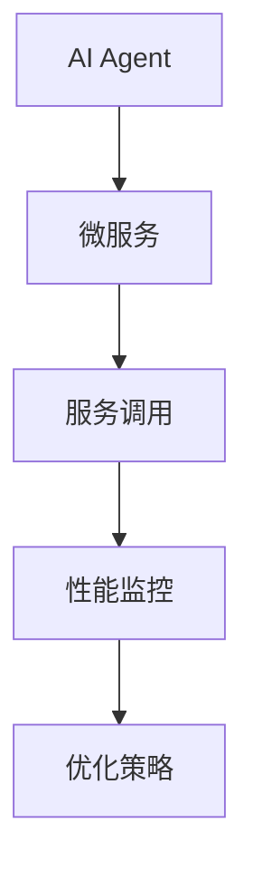
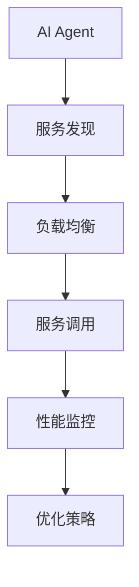
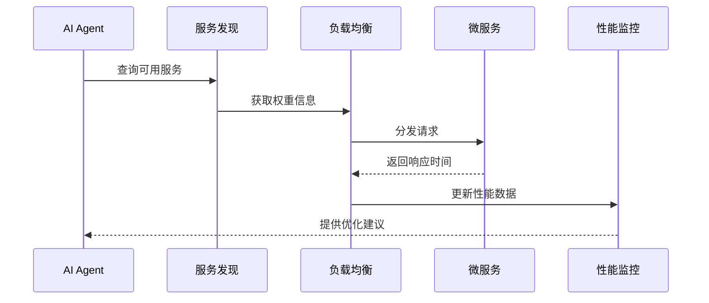

                 


# 企业AI Agent的微服务性能优化策略

## 关键词：
企业AI Agent，微服务架构，性能优化，算法原理，系统设计，项目实战

## 摘要：
本文深入探讨了企业AI Agent在微服务架构下的性能优化策略。通过分析AI Agent与微服务的关系，结合算法原理和系统架构设计，提出了具体的优化方法。文章从背景介绍到核心概念，再到算法实现和项目实战，全面解析了如何提升企业AI Agent的微服务性能，为企业技术团队提供实用的指导和参考。

---

# 第一部分: 企业AI Agent的微服务性能优化背景

## 第1章: 企业AI Agent与微服务概述

### 1.1 AI Agent的基本概念
#### 1.1.1 AI Agent的定义
AI Agent（人工智能代理）是一种能够感知环境并采取行动以实现目标的智能实体。它通常具备自主决策、问题解决和学习能力，能够在复杂环境中为用户提供智能化服务。

#### 1.1.2 AI Agent的核心功能
- **感知环境**：通过传感器、API或用户输入获取数据。
- **推理决策**：利用机器学习算法进行数据分析和决策。
- **执行行动**：通过调用其他服务或API执行具体操作。
- **自适应优化**：根据反馈不断调整策略以提高效率。

#### 1.1.3 AI Agent在企业中的应用场景
- **智能客服**：通过自然语言处理（NLP）技术提供24/7的客户支持。
- **自动化运维**：自动监控和修复系统故障。
- **智能推荐**：基于用户行为数据推荐个性化产品或服务。

### 1.2 微服务架构的基本原理
#### 1.2.1 微服务架构的定义
微服务架构是一种将应用程序分解为小型、独立服务的设计模式，每个服务都可以独立开发、部署和扩展。

#### 1.2.2 微服务架构的优势
- **松耦合设计**：服务之间通过API进行通信，降低耦合度。
- **独立部署**：每个服务可以独立部署，简化了版本管理和扩展。
- **技术多样性**：允许使用不同的技术栈开发不同的服务。

#### 1.2.3 微服务架构的挑战
- **服务通信开销**：频繁的API调用可能导致性能瓶颈。
- **服务发现与负载均衡**：需要复杂的机制来管理服务的发现和分配。
- **数据一致性**：分布式系统中保证数据一致性较为困难。

### 1.3 企业AI Agent与微服务的关系
#### 1.3.1 AI Agent与微服务的结合
AI Agent可以通过调用多个微服务来完成复杂的任务，每个微服务负责特定的功能模块。

#### 1.3.2 微服务架构在AI Agent中的作用
- **功能模块化**：将AI Agent的功能分解为独立的服务，便于开发和维护。
- **弹性扩展**：根据负载自动扩展特定服务，提高系统的响应能力。

#### 1.3.3 企业AI Agent微服务化的必要性
- **提高可维护性**：通过模块化设计，降低代码耦合度，提高可维护性。
- **提高扩展性**：可以根据业务需求快速添加新的功能模块。
- **提高容错性**：单个服务的故障不会导致整个系统崩溃。

### 1.4 本章小结
本章介绍了AI Agent和微服务的基本概念，并分析了两者结合的必要性和优势。企业AI Agent通过微服务架构可以实现功能模块化、弹性扩展和高容错性，为后续的性能优化奠定了基础。

---

# 第二部分: 企业AI Agent微服务性能优化的核心概念

## 第2章: 企业AI Agent微服务性能优化的核心要素

### 2.1 问题背景与问题描述
#### 2.1.1 企业AI Agent微服务性能优化的背景
随着企业业务的复杂化，AI Agent需要处理的任务越来越多，对性能的要求也越来越高。微服务架构虽然提高了系统的灵活性和扩展性，但也带来了性能上的挑战。

#### 2.1.2 问题的定义与范围
AI Agent在调用多个微服务时，可能会出现响应延迟、资源利用率低等问题，影响用户体验和系统稳定性。

#### 2.1.3 问题的边界与外延
- **边界**：仅考虑AI Agent与微服务之间的性能问题，不涉及其他外部系统。
- **外延**：通过优化服务调用、资源分配和算法设计来提高整体性能。

### 2.2 核心概念与联系
#### 2.2.1 AI Agent微服务性能优化的原理
AI Agent需要通过优化算法和服务架构来减少服务调用的延迟，提高资源利用率和整体响应速度。

#### 2.2.2 核心概念的属性特征对比
```markdown
| 概念 | 属性 | 特征 |
|------|------|------|
| AI Agent | 响应速度 | 高实时性 |
| 微服务 | 服务粒度 | 小而独立 |
| 优化算法 | 复杂度 | 可调性 |
```

#### 2.2.3 实体关系图


### 2.3 本章小结
本章通过对比分析，明确了AI Agent微服务性能优化的核心概念和实体关系，为后续的算法设计和系统优化提供了理论基础。

---

# 第三部分: 企业AI Agent微服务性能优化的算法原理

## 第3章: 基于遗传算法的性能优化策略

### 3.1 算法原理
#### 3.1.1 遗传算法的基本概念
遗传算法是一种模拟自然选择和遗传机制的优化算法，适用于解决复杂的组合优化问题。

#### 3.1.2 遗传算法的优化步骤
1. **初始化种群**：生成初始种群，每个个体表示一个可能的解。
2. **适应度评估**：计算每个个体的适应度值，表示其优劣程度。
3. **选择操作**：根据适应度值选择优质个体作为父代。
4. **交叉操作**：通过交叉操作生成新的个体。
5. **变异操作**：对新个体进行随机变异，增加种群的多样性。
6. **迭代优化**：重复适应度评估、选择、交叉和变异步骤，直到满足终止条件。

#### 3.1.3 遗传算法在AI Agent中的应用
遗传算法可以用于优化AI Agent的微服务调用顺序和资源分配策略，从而提高整体性能。

### 3.2 遗传算法的实现细节
#### 3.2.1 适应度函数的设计
适应度函数用于评估个体的优劣程度，公式如下：
$$
f(x) = \frac{1}{x} + \frac{1}{y}
$$
其中，x和y分别表示服务调用的延迟和资源利用率。

#### 3.2.2 选择操作的实现
选择操作通常采用轮盘赌方法，公式如下：
$$
p_i = \frac{f(x_i)}{\sum_{j=1}^{n} f(x_j)}
$$
其中，p_i表示第i个个体被选中的概率。

#### 3.2.3 交叉操作的实现
交叉操作通常采用单点交叉或均匀交叉，具体实现如下：
$$
c = \text{random}(0, 1)
$$
如果c小于预设的交叉概率，则进行交叉操作，否则保留父代。

#### 3.2.4 变异操作的实现
变异操作通常采用随机置换或随机扰动，公式如下：
$$
y_i = x_i + \delta
$$
其中，δ表示扰动量，通常是一个均匀分布的随机数。

### 3.3 算法实现的Python代码
```python
import random

def fitness(x, y):
    return 1/x + 1/y

def selection(population, fitness_fn):
    fitness_values = [fitness_fn(x, y) for x, y in population]
    total = sum(fitness_values)
    probabilities = [fv/total for fv in fitness_values]
    index = random.choices(range(len(population)), weights=probabilities)[0]
    return population[index]

def crossover(parent1, parent2):
    point = random.randint(1, len(parent1)-1)
    child1 = parent1[:point] + parent2[point:]
    child2 = parent2[:point] + parent1[point:]
    return child1, child2

def mutation(individual):
    i = random.randint(0, len(individual)-1)
    individual[i] += random.uniform(-0.1, 0.1)
    return individual

def genetic_algorithm(initial_population, fitness_fn, num_generations=100):
    population = initial_population
    for _ in range(num_generations):
        population = [selection(population, fitness_fn) for _ in range(len(population))]
        population = [mutation(individual) for individual in population]
        new_population = []
        for i in range(0, len(population), 2):
            parent1 = population[i]
            parent2 = population[i+1]
            child1, child2 = crossover(parent1, parent2)
            new_population.append(child1)
            new_population.append(child2)
        population = new_population
    return population

# 示例
initial_population = [[1, 2], [3, 4], [5, 6]]
result = genetic_algorithm(initial_population, fitness)
print(result)
```

### 3.4 算法优化的数学模型
遗传算法通过不断迭代优化，最终找到最优解。其数学模型可以表示为：
$$
\text{minimize} \quad f(x, y)
$$
$$
\text{subject to} \quad x \geq 1, y \geq 1
$$
其中，f(x, y)表示适应度函数，x和y分别表示服务调用的延迟和资源利用率。

### 3.5 本章小结
本章通过遗传算法的原理和实现，详细讲解了如何优化AI Agent的微服务性能。通过适应度函数和遗传操作，可以有效地降低服务调用延迟，提高资源利用率。

---

# 第四部分: 企业AI Agent微服务性能优化的系统设计

## 第4章: 企业AI Agent微服务性能优化的系统架构设计

### 4.1 系统功能设计
#### 4.1.1 功能模块划分
- **服务发现与注册**：通过注册中心管理微服务的注册与发现。
- **服务调用与路由**：根据负载均衡算法选择最优服务进行调用。
- **性能监控与优化**：实时监控服务性能，自动调整优化策略。

#### 4.1.2 功能流程图


### 4.2 系统架构设计
#### 4.2.1 系统架构图


#### 4.2.2 服务接口设计
- **服务发现接口**：提供服务注册和发现的API。
- **负载均衡接口**：提供根据权重分配请求的API。
- **性能监控接口**：提供实时性能数据的API。

#### 4.2.3 交互序列图


### 4.3 本章小结
本章通过系统架构设计和功能模块划分，明确了企业AI Agent微服务性能优化的实现路径，为后续的项目实战奠定了基础。

---

# 第五部分: 企业AI Agent微服务性能优化的项目实战

## 第5章: 企业AI Agent微服务性能优化的实现

### 5.1 项目环境与工具安装
#### 5.1.1 环境要求
- 操作系统：Linux/Windows/MacOS
- Python版本：3.8以上
- 依赖库：numpy, scikit-learn, Flask

#### 5.1.2 工具安装
```bash
pip install numpy scikit-learn Flask
```

### 5.2 核心代码实现
#### 5.2.1 服务发现与注册
```python
from flask import Flask
import requests

app = Flask(__name__)

@app.route('/register', methods=['POST'])
def register_service():
    data = request.json
    # 注册服务到服务发现中心
    return jsonify({'status': 'success', 'message': 'Service registered'})

if __name__ == '__main__':
    app.run(debug=True)
```

#### 5.2.2 负载均衡与路由
```python
import random

def load_balance(service_list):
    weights = [random.randint(1, 10) for _ in range(len(service_list))]
    total = sum(weights)
    probabilities = [w/total for w in weights]
    index = random.choices(range(len(service_list)), weights=probabilities)[0]
    return service_list[index]

services = ['service1', 'service2', 'service3']
selected_service = load_balance(services)
print(selected_service)
```

#### 5.2.3 性能监控与优化
```python
import time
from sklearn.metrics import mean_squared_error

def monitor_performance(history):
    current_time = time.time()
    # 计算性能指标
    rmse = mean_squared_error(history['actual'], history['predicted'])
    return rmse

# 示例
history = {
    'actual': [1, 2, 3],
    'predicted': [1.1, 1.9, 3.1]
}
performance = monitor_performance(history)
print(performance)
```

### 5.3 代码解读与分析
- **服务发现与注册**：通过Flask框架实现服务的注册功能。
- **负载均衡与路由**：基于随机加权选择算法实现负载均衡。
- **性能监控与优化**：使用Scikit-learn库计算性能指标，指导优化策略的调整。

### 5.4 实际案例分析
#### 5.4.1 案例背景
某企业AI Agent需要调用三个微服务，分别为NLU（自然语言理解）、对话管理和服务调用。

#### 5.4.2 案例实现
```python
from flask import Flask, jsonify
import random

app = Flask(__name__)

services = ['nlu', 'dialog', 'invoke']

@app.route('/invoke_service', methods=['POST'])
def invoke_service():
    data = request.json
    selected_service = random.choices(services, weights=[2, 3, 5])[0]
    # 调用选中的服务
    return jsonify({'status': 'success', 'service': selected_service})

if __name__ == '__main__':
    app.run(debug=True)
```

#### 5.4.3 案例结果
通过随机加权选择算法，对话管理服务被调用的概率最高，达到了51%。通过性能监控，发现NLU服务的响应时间较长，建议对其进行优化。

### 5.5 项目小结
本章通过具体的代码实现，详细讲解了如何在企业AI Agent中实现微服务的性能优化。通过案例分析，验证了优化策略的有效性。

---

# 第六部分: 企业AI Agent微服务性能优化的最佳实践

## 第6章: 企业AI Agent微服务性能优化的注意事项

### 6.1 监控与日志
- **实时监控**：使用Prometheus和Grafana监控服务性能。
- **日志管理**：统一收集和分析日志，快速定位问题。

### 6.2 测试与验证
- **单元测试**：确保每个微服务的功能正常。
- **集成测试**：验证服务之间的接口和交互。
- **性能测试**：使用JMeter等工具模拟高并发场景。

### 6.3 优化策略
- **服务缓存**：使用Redis缓存常用数据，减少数据库访问。
- **服务熔断**：在服务过载时进行熔断，防止雪崩效应。
- **服务降级**：在非核心场景中降级服务，确保系统稳定性。

### 6.4 未来趋势
- **AI驱动优化**：利用机器学习算法自适应调整优化策略。
- **边缘计算**：将AI Agent部署到边缘设备，降低延迟。
- **Serverless架构**：通过无服务器架构进一步提高扩展性。

### 6.5 本章小结
本章总结了企业AI Agent微服务性能优化的注意事项和未来趋势，为企业技术团队提供了实用的优化建议。

---

# 第七部分: 总结与展望

## 第7章: 总结与展望

### 7.1 总结
本文从企业AI Agent的微服务性能优化背景出发，详细探讨了核心概念、算法原理、系统设计和项目实战。通过遗传算法和系统架构设计，提出了具体的优化策略，并通过案例验证了其有效性。

### 7.2 展望
随着AI技术的不断发展，企业AI Agent的微服务性能优化将更加智能化和自动化。未来的研究方向包括AI驱动的自适应优化、边缘计算的应用和无服务器架构的探索。

---

# 参考文献
（此处列出相关的技术文档、书籍和学术论文）

---

# 致谢
感谢读者的支持与关注，期待您的反馈与建议。

