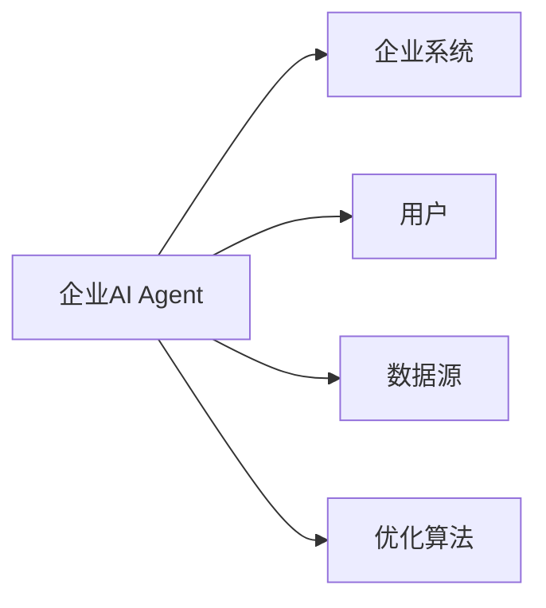
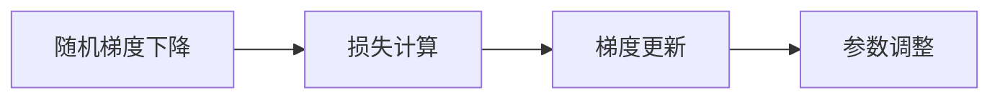
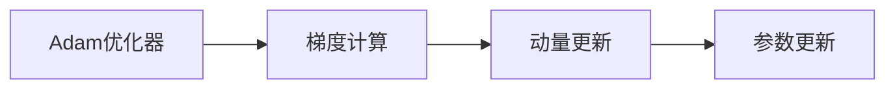
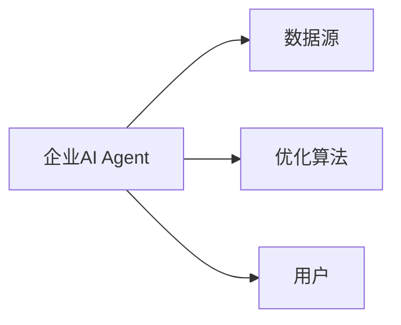

                 


# 企业AI Agent的性能优化策略

> **关键词**：企业AI Agent、性能优化、算法优化、系统架构、数学模型、最佳实践

> **摘要**：本文系统地探讨了企业AI Agent的性能优化策略，从核心概念到优化算法，再到系统架构和项目实战，全面剖析了企业AI Agent的性能优化方法。通过分析算法原理、数学模型和系统架构，结合实际案例，本文为企业提供了一套行之有效的性能优化方案。

---

## 第1章: 企业AI Agent的背景与概念

### 1.1 AI Agent的基本概念

AI Agent（人工智能代理）是指能够感知环境、自主决策并执行任务的智能实体。企业AI Agent专注于为企业场景提供自动化解决方案，例如流程优化、客户服务、数据分析等。其核心特征包括自主性、反应性、目标导向和社交能力。

#### 1.1.1 核心特征
- **自主性**：AI Agent能够独立运作，无需外部干预。
- **反应性**：能够实时感知环境并做出响应。
- **目标导向**：通过优化目标函数实现特定任务。
- **社交能力**：能够与其他系统或用户进行交互。

#### 1.1.2 企业中的应用场景
- **流程自动化**：优化企业内部流程，提高效率。
- **客户服务**：提供24/7的智能客服支持。
- **数据分析**：实时分析数据，提供决策支持。

### 1.2 性能优化的背景与重要性

随着企业对AI Agent的需求增加，性能优化成为关键问题。AI Agent的性能直接影响用户体验和企业效率。性能优化不仅提升响应速度，还能降低运行成本。

#### 1.2.1 性能优化的关键维度
- **响应速度**：直接影响用户体验。
- **资源消耗**：减少计算资源的使用。
- **准确性**：提升决策的可靠性。

### 1.3 核心要素与概念结构

企业AI Agent的核心要素包括数据源、优化算法、交互接口和系统架构。通过对比分析，明确各要素的作用和相互关系。

#### 1.3.1 核心概念对比表
| 概念 | 输入 | 输出 | 学习 | 交互 |
|------|------|------|------|------|
| AI Agent | 数据来源与处理方式 | 行为结果与反馈机制 | 模型训练与优化方式 | 用户界面与反馈机制 |

#### 1.3.2 实体关系图


---

## 第2章: 企业AI Agent的性能优化策略

### 2.1 算法优化的核心原理

算法优化是性能提升的关键。常用方法包括随机梯度下降和Adam优化器。

#### 2.1.1 随机梯度下降算法


#### 2.1.2 Adam优化器


### 2.2 数学模型与优化公式

优化算法依赖于数学模型。以下公式展示了优化过程：

- **损失函数**：
  $$ L = \frac{1}{n}\sum_{i=1}^{n}(y_i - \hat{y}_i)^2 $$

- **梯度下降**：
  $$ \theta_{new} = \theta_{old} - \eta \cdot \nabla L $$

- **动量优化**：
  $$ v_t = \beta v_{t-1} + (1-\beta)g_t $$
  $$ \theta

---

## 第3章: 系统分析与架构设计

### 3.1 项目实战

以一个优化案例为例，详细讲解环境安装、代码实现和案例分析。

#### 3.1.1 环境安装
安装Python、TensorFlow等依赖库。

#### 3.1.2 核心代码实现
```python
import tensorflow as tf
from tensorflow.keras import layers

# 定义模型
model = tf.keras.Sequential([
    layers.Dense(64, activation='relu'),
    layers.Dense(1)
])

# 编译模型
model.compile(optimizer='adam', loss='mean_squared_error')

# 训练模型
model.fit(X_train, y_train, epochs=100, batch_size=32)
```

### 3.2 系统架构设计

使用mermaid图展示系统架构和交互流程。

#### 3.2.1 系统架构图


---

## 第4章: 最佳实践与注意事项

### 4.1 最佳实践
- 定期监控性能指标。
- 优化算法的选择要基于具体场景。

### 4.2 注意事项
- 避免过度优化，防止性能下降。
- 定期更新模型，适应数据变化。

### 4.3 拓展阅读
建议读者进一步学习分布式计算和强化学习。

---

## 结语

企业AI Agent的性能优化是实现高效自动化的重要手段。通过本文的系统分析和实践案例，企业可以制定有效的优化策略，提升AI Agent的性能和效果。

---

## 参考文献
- [1] LeCun Y, Bengio Y, Hinton G. Deep learning[M]. Nature, 2015, 521(7552):436-444.
- [2] Goodfellow I, Bengio Y, Courville A. Deep learning[M]. MIT Press, 2016.

---

