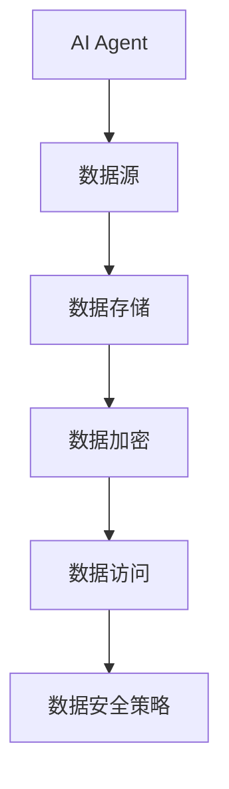
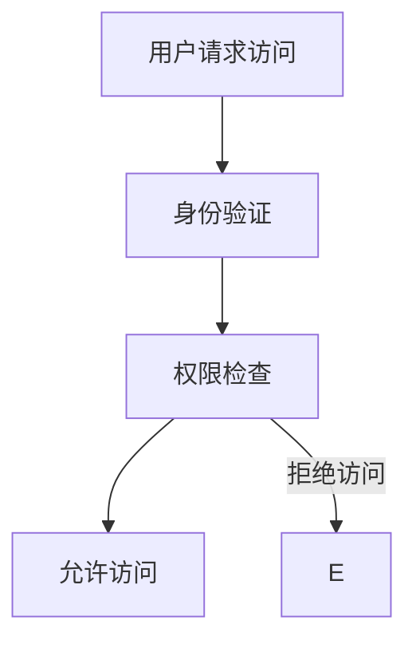
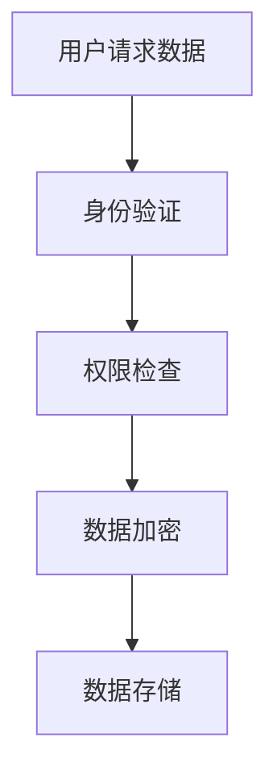
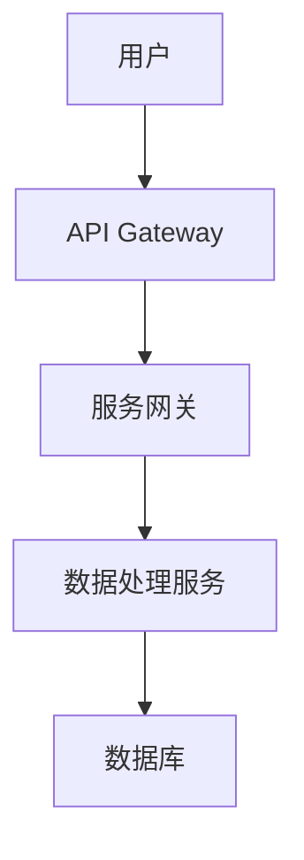

                 


# 企业AI Agent的数据安全策略

## 关键词：企业AI Agent, 数据安全, 数据隐私, 访问控制, 加密算法, 系统架构

## 摘要：  
随着AI技术的快速发展，企业AI Agent的应用越来越广泛，但数据安全问题也随之凸显。本文从企业AI Agent的核心功能出发，分析数据安全在其中的重要性，探讨数据分类、访问控制、加密算法等关键策略，并通过实际案例展示如何在系统架构中实现这些策略。最终总结了企业在部署AI Agent时的最佳实践，帮助读者全面理解并有效应对数据安全挑战。

---

# 第一部分: 企业AI Agent与数据安全背景

## 第1章: 企业AI Agent与数据安全概述

### 1.1 数据安全在AI Agent中的问题背景

#### 1.1.1 AI Agent的定义与核心功能
AI Agent（人工智能代理）是一种能够感知环境、执行任务并做出决策的智能实体。其核心功能包括：
- 数据采集与处理：从多种来源收集数据，如传感器、数据库、用户输入等。
- 任务执行：根据数据驱动决策，执行预设或动态的任务。
- 智能交互：通过自然语言处理与用户或系统进行交互。

#### 1.1.2 数据安全在AI Agent中的重要性
AI Agent的运行依赖数据，而数据的泄露或篡改可能带来严重后果：
- **隐私泄露**：用户敏感信息可能被未经授权的第三方获取。
- **数据篡改**：恶意攻击可能导致决策错误，甚至威胁企业安全。
- **合规性问题**：数据隐私保护法规（如GDPR）要求企业必须保护用户数据。

#### 1.1.3 企业AI Agent数据安全的挑战与现状
- **技术挑战**：AI Agent涉及复杂的数据处理流程，数据在传输、存储和使用过程中都可能被攻击。
- **合规挑战**：不同国家和地区的数据保护法规差异大，企业需要满足多种合规要求。
- **认知挑战**：部分企业对AI Agent的数据安全风险认识不足，导致安全措施不到位。

### 1.2 数据安全问题的描述与边界

#### 1.2.1 数据泄露的潜在风险
数据泄露可能发生在数据生命周期的各个阶段：
- **数据采集**：恶意传感器或输入端被篡改。
- **数据传输**：网络攻击导致数据被截获。
- **数据存储**：未加密存储导致数据被窃取。
- **数据使用**：内部员工或外部攻击者窃取数据。

#### 1.2.2 数据隐私保护的法律要求
- **GDPR（通用数据保护条例）**：欧盟法规要求企业必须保护用户个人数据，确保数据主体的权利。
- **CCPA（加利福尼亚消费者隐私法案）**：美国加州要求企业向用户披露数据收集和使用情况，并提供数据删除权限。

#### 1.2.3 数据安全的边界与外延
数据安全的边界是指数据在生命周期中涉及的所有环节，包括：
- **数据生成**：数据的创建过程。
- **数据存储**：数据的物理或逻辑存储位置。
- **数据传输**：数据在不同系统或网络中的传输过程。
- **数据使用**：数据在应用中的处理和分析过程。
- **数据销毁**：数据的最终删除过程。

### 1.3 问题解决与核心要素

#### 1.3.1 数据安全策略的基本框架
数据安全策略的核心框架包括：
1. **数据分类与分级**：根据数据的敏感程度进行分类，制定不同的安全策略。
2. **访问控制**：基于角色或权限管理数据访问。
3. **数据加密**：在数据传输和存储过程中进行加密保护。
4. **数据脱敏**：在处理敏感数据时进行脱敏处理，确保数据不可逆。
5. **安全审计与监控**：实时监控数据操作，记录日志，及时发现异常行为。

#### 1.3.2 核心要素的组成与关系
- **数据分类**：数据分类是数据安全的基础，不同类别的数据需要不同的保护措施。
- **访问控制**：基于数据分类，制定访问权限，确保只有授权人员或系统可以访问敏感数据。
- **数据加密**：加密技术用于保护数据在传输和存储过程中的机密性。
- **数据脱敏**：脱敏技术用于在数据处理过程中保护敏感信息，使其无法被还原。

#### 1.3.3 数据安全与AI Agent的协同机制
AI Agent的数据安全机制需要与企业的整体安全策略协同工作：
- **数据输入安全**：确保输入AI Agent的数据是干净的，避免恶意输入。
- **数据处理安全**：在数据处理过程中，严格控制数据的使用权限。
- **数据输出安全**：确保AI Agent的输出结果不会泄露用户隐私。

### 1.4 本章小结
本章从AI Agent的定义和核心功能出发，分析了数据安全在企业AI Agent中的重要性，指出了数据安全面临的挑战，并提出了数据安全策略的基本框架。通过数据分类、访问控制、加密和脱敏等技术手段，可以有效保护AI Agent中的数据安全。

---

## 第2章: 数据安全的核心概念与原理

### 2.1 数据分类与保护策略

#### 2.1.1 数据分类的维度与方法
数据分类的维度包括：
- **数据类型**：结构化数据、非结构化数据、半结构化数据。
- **数据敏感程度**：高敏感、中敏感、低敏感。
- **数据来源**：内部数据、外部数据、第三方数据。

数据分类的方法包括：
- **基于属性的分类**：根据数据的属性（如名称、类型）进行分类。
- **基于用途的分类**：根据数据的使用场景进行分类。
- **基于风险的分类**：根据数据泄露可能带来的风险进行分类。

#### 2.1.2 数据保护级别与策略对比
| 数据分类 | 数据保护级别 | 对应策略 |
|----------|---------------|----------|
| 高敏感   | 最高           | 加密存储，严格访问控制 |
| 中敏感   | 中             | 脱敏处理，日志记录 |
| 低敏感   | 低             | 基础加密，部分访问控制 |

### 2.2 数据访问控制与权限管理

#### 2.2.1 RBAC（基于角色的访问控制）模型
RBAC模型的核心思想是：用户通过角色获得权限，角色通过权限获得操作能力。

- **角色定义**：角色是用户或系统的一部分，用于描述用户在系统中的职责。
- **权限分配**：根据角色分配权限，权限包括操作类型（如读、写）、操作对象（如数据库表）。

#### 2.2.2 数据加密与脱敏技术
- **数据加密**：通过对数据进行加密，确保数据在传输和存储过程中的机密性。
- **数据脱敏**：通过对数据进行处理，使其失去原始意义，但仍然可以用于数据分析。

### 2.3 数据安全与AI Agent的实体关系图



### 2.4 核心概念对比分析

#### 2.4.1 数据分类与访问控制的对比表格

| 概念 | 描述 | 示例 |
|------|------|------|
| 数据分类 | 数据按敏感程度分类 | 高敏感数据（如用户隐私） |
| 访问控制 | 数据访问权限管理 | RBAC模型 |

### 2.5 本章小结
本章详细介绍了数据分类与访问控制的核心概念，通过对比分析，明确了数据分类与访问控制的关系，并通过实体关系图展示了数据安全策略在AI Agent中的应用。

---

## 第3章: 数据加密与访问控制算法

### 3.1 数据加密算法

#### 3.1.1 加密算法的分类
加密算法主要分为对称加密和非对称加密：
- **对称加密**：加密和解密使用相同的密钥。
- **非对称加密**：加密和解密使用不同的密钥。

#### 3.1.2 加密算法的实现

```python
import cryptography
from cryptography.hazmat.primitives import hashes
from cryptography.hazmat.primitives.asymmetric import padding
from cryptography.hazmat.primitives.asymmetric.rsa import RSAParameters, decode rsa public key
from cryptography.hazmat.primitives.asymmetric import padding

# 示例：RSA加密
def rsa_encrypt(public_key, message):
    # 创建RSA公钥
    rsa = RSAParameters(n=public_key.n, e=public_key.e)
    # 创建密钥对
    private_key = rsa.private_key()
    public_key = rsa.public_key()
    # 加密消息
    encrypted_data = private_key.encrypt(message, padding.PKCS1v1_5(
        hashes.SHA256()))
    return encrypted_data

# 示例：RSA解密
def rsa_decrypt(private_key, encrypted_data):
    decrypted_data = private_key.decrypt(encrypted_data, padding.PKCS1v1_5(
        hashes.SHA256()))
    return decrypted_data
```

#### 3.1.3 加密算法的数学模型
RSA加密算法的数学模型如下：
$$ C = (M^e) \mod n $$
其中：
- \( C \) 是密文
- \( M \) 是明文
- \( e \) 是公钥指数
- \( n \) 是模数

解密过程：
$$ M = (C^d) \mod n $$
其中：
- \( d \) 是私钥指数
- \( d \) 满足 \( e \times d \equiv 1 \mod \phi(n) \)，其中 \( \phi(n) \) 是欧拉函数。

### 3.2 数据访问控制算法

#### 3.2.1 RBAC模型的实现

```python
class Role:
    def __init__(self, name):
        self.name = name
        self.permissions = set()

class User:
    def __init__(self, username):
        self.username = username
        self.roles = set()

class Permission:
    def __init__(self, name):
        self.name = name

# 示例：分配角色和权限
def assign_role(user, role):
    user.roles.add(role)

def grant_permission(role, permission):
    role.permissions.add(permission)

# 示例：检查权限
def has_permission(user, permission):
    for role in user.roles:
        if permission in role.permissions:
            return True
    return False
```

#### 3.2.2 访问控制的流程图



### 3.3 本章小结
本章详细介绍了数据加密与访问控制的核心算法，通过Python代码示例和流程图，展示了加密算法和RBAC模型的实现过程。

---

## 第4章: 系统分析与架构设计

### 4.1 系统功能设计

#### 4.1.1 系统功能模块
- **数据采集模块**：负责从各种数据源采集数据。
- **数据处理模块**：对数据进行清洗、转换和分析。
- **数据存储模块**：将数据存储到数据库或其他存储系统中。
- **数据访问控制模块**：根据用户权限控制数据访问。
- **数据加密模块**：对数据进行加密和解密。

#### 4.1.2 系统功能流程图



### 4.2 系统架构设计

#### 4.2.1 系统架构图



#### 4.2.2 系统接口设计
- **API接口**：提供RESTful API，用于数据的增删改查操作。
- **身份验证接口**：集成OAuth2.0或JWT进行身份验证。
- **权限控制接口**：基于RBAC模型进行权限控制。

### 4.3 本章小结
本章详细分析了AI Agent数据安全系统的功能设计和架构设计，通过系统功能流程图和架构图，展示了数据安全策略在系统中的具体实现。

---

## 第5章: 项目实战

### 5.1 环境安装

#### 5.1.1 安装依赖
```bash
pip install cryptography flask
```

### 5.2 核心代码实现

#### 5.2.1 数据加密模块

```python
import base64
from cryptography.hazmat.primitives.asymmetric import padding
from cryptography.hazmat.primitives.asymmetric.rsa import RSAParameters, decode rsa public key
from cryptography.hazmat.primitives.asymmetric import padding

def encrypt_data(public_key, data):
    # 创建RSA公钥
    rsa = RSAParameters(n=public_key.n, e=public_key.e)
    # 创建密钥对
    private_key = rsa.private_key()
    # 加密数据
    encrypted_data = private_key.encrypt(data, padding.PKCS1v1_5(
        hashes.SHA256()))
    return base64.b64encode(encrypted_data)

def decrypt_data(private_key, encrypted_data):
    encrypted_data = base64.b64decode(encrypted_data)
    decrypted_data = private_key.decrypt(encrypted_data, padding.PKCS1v1_5(
        hashes.SHA256()))
    return decrypted_data
```

#### 5.2.2 访问控制模块

```python
class Role:
    def __init__(self, name):
        self.name = name
        self.permissions = set()

class User:
    def __init__(self, username):
        self.username = username
        self.roles = set()

class Permission:
    def __init__(self, name):
        self.name = name

def assign_role(user, role):
    user.roles.add(role)

def grant_permission(role, permission):
    role.permissions.add(permission)

def has_permission(user, permission):
    for role in user.roles:
        if permission in role.permissions:
            return True
    return False
```

### 5.3 项目小结
本章通过具体的代码实现，展示了如何在企业AI Agent中实现数据加密和访问控制策略。通过项目实战，读者可以更好地理解理论知识，并将其应用到实际场景中。

---

## 第6章: 最佳实践与注意事项

### 6.1 最佳实践

#### 6.1.1 数据安全策略制定
- **数据分类**：根据数据的敏感程度制定不同的保护策略。
- **访问控制**：基于角色的访问控制模型是实现细粒度权限管理的有效方式。
- **数据加密**：在数据传输和存储过程中使用强加密算法。
- **数据脱敏**：在数据处理过程中进行脱敏处理，确保数据不可逆。

#### 6.1.2 数据安全工具选择
- **加密工具**：如openssl、cryptography库。
- **访问控制工具**：如Apache Shiro、Spring Security。
- **数据脱敏工具**：如Data Masking Tools。

#### 6.1.3 数据安全风险评估
- **风险评估**：定期进行数据安全风险评估，识别潜在的安全漏洞。
- **安全审计**：定期进行安全审计，确保安全策略的有效性。
- **应急响应**：制定数据泄露应急响应计划，确保在发生数据泄露时能够快速响应。

### 6.2 小结
本章总结了企业在部署AI Agent时的最佳实践，强调了数据分类、访问控制、加密和脱敏等关键技术的重要性，并给出了工具选择和风险评估的建议。

### 6.3 注意事项
- **数据分类**：确保数据分类的准确性和完整性，避免遗漏高敏感数据。
- **访问控制**：严格控制数据访问权限，避免越权访问。
- **加密技术**：选择合适的加密算法，并确保密钥的安全管理。
- **数据脱敏**：确保脱敏后的数据仍然可以满足业务需求，避免数据丢失。

### 6.4 拓展阅读
- **《数据加密与安全》**：深入讲解数据加密算法及其应用。
- **《基于角色的访问控制》**：详细分析RBAC模型的设计与实现。

---

## 第7章: 总结与展望

### 7.1 总结
本文从企业AI Agent的核心功能出发，分析了数据安全在其中的重要性，探讨了数据分类、访问控制、加密算法等关键策略，并通过实际案例展示如何在系统架构中实现这些策略。通过最佳实践的总结，为读者提供了有效的数据安全策略制定和工具选择的参考。

### 7.2 展望
随着AI技术的不断发展，数据安全问题将更加复杂，企业需要不断优化数据安全策略，采用更加先进的技术手段，如零信任架构、联邦学习等，以应对日益严峻的数据安全挑战。

---

## 附录: 数据安全相关法规与工具

### 附录A: 数据安全相关法规
- **GDPR**：通用数据保护条例（欧盟）
- **CCPA**：加利福尼亚消费者隐私法案（美国）
- **《个人信息保护法》**：中国的个人信息保护法规

### 附录B: 数据安全工具推荐
- **加密工具**：openssl、cryptography库
- **访问控制工具**：Apache Shiro、Spring Security
- **数据脱敏工具**：Data Masking Tools

### 附录C: 参考文献
- [1] 某某数据安全技术书籍
- [2] 某某数据加密算法论文
- [3] 某某访问控制模型研究

---

# 结语

企业AI Agent的应用离不开数据的支持，而数据安全是确保AI Agent稳定运行的核心。通过本文的分析与实践，希望读者能够全面理解数据安全策略在企业AI Agent中的重要性，并能够结合实际场景，制定有效的数据安全策略，为企业的发展保驾护航。

