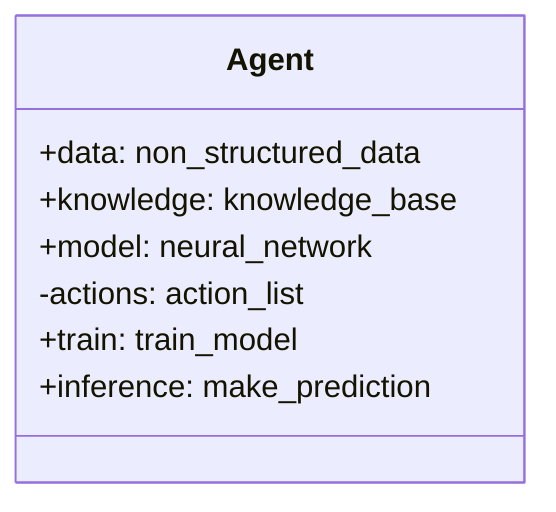
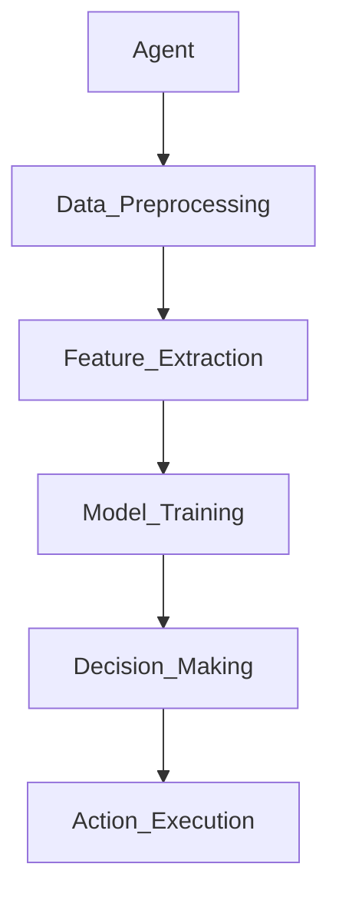
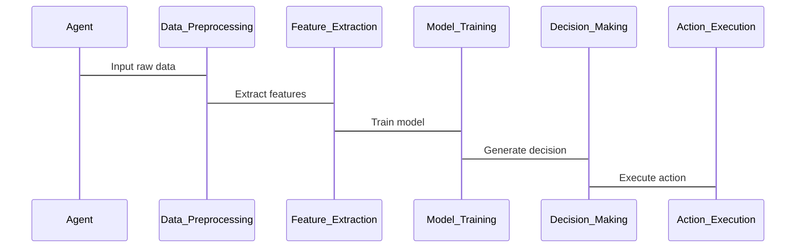

                 


# 《企业AI Agent的自监督学习在非结构化数据挖掘中的实践》

> 关键词：企业AI Agent、自监督学习、非结构化数据挖掘、算法原理、系统设计、项目实战

> 摘要：本文探讨企业AI Agent在非结构化数据挖掘中的应用，重点分析自监督学习技术及其在实际场景中的实践。通过理论与实践相结合的方式，深入解析自监督学习的算法原理、系统架构设计和项目实现，为读者提供系统化的知识和实用的指导。

---

# 第1章: 企业AI Agent的背景与概念

## 1.1 企业AI Agent的定义与特点

企业AI Agent是一种能够理解、分析和执行复杂任务的智能实体，具备以下特点：

- **自主性**：能够在没有外部干预的情况下独立执行任务。
- **反应性**：能够实时感知环境变化并做出相应的调整。
- **学习能力**：通过自监督学习等技术，持续优化自身的知识库和决策能力。

## 1.2 自监督学习的定义与特点

自监督学习是一种无监督学习的变体，通过利用数据本身的结构来学习有用的特征表示。其特点包括：

- **无需人工标注**：通过数据内部的关联性进行学习。
- **样本效率高**：能够在较少标注数据的情况下完成任务。
- **灵活性强**：适用于多种类型的数据，包括文本、图像和音频。

## 1.3 非结构化数据挖掘的背景与挑战

### 1.3.1 非结构化数据的定义与特点

非结构化数据是指没有固定结构、难以通过常规数据库查询的复杂数据，例如文本、图像和视频等。

### 1.3.2 非结构化数据挖掘的挑战

- 数据量大且复杂，难以直接提取有用信息。
- 数据分布不均匀，部分数据可能缺失或噪声较多。
- 需要结合领域知识，才能准确理解数据含义。

## 1.4 本章小结

本章介绍了企业AI Agent、自监督学习和非结构化数据挖掘的基本概念及其特点，强调了自监督学习在非结构化数据挖掘中的重要性。

---

# 第2章: 企业AI Agent与自监督学习的核心概念

## 2.1 企业AI Agent的核心要素

### 2.1.1 企业AI Agent的组成

企业AI Agent通常由以下几个部分组成：

- **感知层**：负责数据的采集和初步处理。
- **知识库**：存储相关领域的知识和历史数据。
- **推理层**：通过逻辑推理和模式识别，生成决策建议。
- **执行层**：根据决策结果执行具体操作。

### 2.1.2 企业AI Agent的功能模块

- 数据采集模块：从企业系统中获取非结构化数据。
- 数据处理模块：对数据进行清洗、转换和增强。
- 模型训练模块：利用自监督学习算法进行特征提取和模型优化。
- 决策执行模块：根据模型输出结果执行具体操作。

## 2.2 自监督学习的核心原理

### 2.2.1 自监督学习的基本原理

自监督学习的核心在于通过数据本身的关联性来生成监督信号。例如，在文本挖掘任务中，可以通过词嵌入技术生成词与词之间的关系。

### 2.2.2 自监督学习的关键技术

- 对比学习：通过比较不同数据点的相似性来生成监督信号。
- 生成对抗网络：通过生成器和判别器的对抗训练来学习数据的分布。
- 图神经网络：通过图结构数据来建模数据之间的关系。

## 2.3 非结构化数据挖掘的关键技术

### 2.3.1 非结构化数据的预处理技术

- 数据清洗：去除噪声和无关信息。
- 数据增强：通过技术手段增强数据的质量和多样性。
- 数据标注：对数据进行人工或自动化的标注，以便后续处理。

### 2.3.2 非结构化数据的特征提取技术

- 词嵌入：将文本数据转换为向量表示。
- 图嵌入：将图结构数据转换为低维向量表示。
- 多模态融合：结合多种数据模态的信息，生成更丰富的特征表示。

## 2.4 本章小结

本章详细讲解了企业AI Agent和自监督学习的核心概念及其在非结构化数据挖掘中的应用，为后续的算法实现和系统设计奠定了理论基础。

---

# 第3章: 企业AI Agent与自监督学习的数学模型与算法原理

## 3.1 自监督学习的数学模型

### 3.1.1 对比学习的数学模型

对比学习是一种常用的自监督学习方法，其数学模型如下：

$$ L = \text{contrastive\_loss}(x_i, x_j) $$

其中，$x_i$ 和 $x_j$ 是通过数据增强得到的两个样本。

### 3.1.2 生成对抗网络的数学模型

生成对抗网络由生成器和判别器组成，其损失函数为：

$$ L = \text{generator\_loss} + \text{discriminator\_loss} $$

### 3.1.3 图神经网络的数学模型

图神经网络通过节点之间的关系进行建模，其传播规则可以表示为：

$$ h_i^{(l+1)} = \sigma(\sum_{j \in N(i)} W_{ij} h_j^{(l)}) $$

其中，$h_i^{(l)}$ 表示节点$i$在第$l$层的表示，$N(i)$表示节点$i$的邻居节点集合。

## 3.2 企业AI Agent的算法实现

### 3.2.1 基于自监督学习的特征提取算法

```python
def contrastive_loss(x, y):
    similarity = torch.cosine_similarity(x, y)
    return -torch.mean(torch.log(1 - similarity))
```

### 3.2.2 基于强化学习的决策算法

```python
def reinforce_policy(policy, env, num_episodes=100):
    for _ in range(num_episodes):
        state = env.reset()
        while not done:
            action = policy(state)
            next_state, reward, done = env.step(action)
            policy.update(reward)
```

## 3.3 本章小结

本章详细讲解了自监督学习的数学模型和企业AI Agent的算法实现，为后续的系统设计和项目实战奠定了基础。

---

# 第4章: 企业AI Agent的系统分析与架构设计

## 4.1 系统功能设计

### 4.1.1 领域模型设计



### 4.1.2 系统架构设计



## 4.2 接口设计与交互流程

### 4.2.1 系统接口设计

- 数据输入接口：接收非结构化数据输入。
- 模型训练接口：对模型进行训练和优化。
- 决策输出接口：生成决策建议并执行操作。

### 4.2.2 交互流程设计



## 4.3 本章小结

本章详细讲解了企业AI Agent的系统架构设计和交互流程，为后续的项目实现提供了明确的指导。

---

# 第5章: 企业AI Agent的项目实战

## 5.1 环境安装与配置

- 安装Python和相关库：`pip install torch numpy matplotlib`

## 5.2 核心代码实现

### 5.2.1 数据预处理代码

```python
import numpy as np

def preprocess_data(data):
    # 假设data是一个包含文本和图像的数据集
    # 对文本进行分词和向量化处理
    text_vector = vectorizer(data['text'])
    # 对图像进行降维处理
    image_vector = encoder(data['image'])
    return np.concatenate([text_vector, image_vector], axis=1)
```

### 5.2.2 模型训练代码

```python
import torch

def train_model(model, optimizer, criterion, data_loader):
    for epoch in range(num_epochs):
        for inputs, labels in data_loader:
            outputs = model(inputs)
            loss = criterion(outputs, labels)
            loss.backward()
            optimizer.step()
            optimizer.zero_grad()
```

## 5.3 代码解读与分析

### 5.3.1 数据预处理代码解读

- `preprocess_data`函数将输入的文本和图像数据分别进行处理，生成对应的向量表示。
- 使用`vectorizer`对文本数据进行分词和向量化处理，使用`encoder`对图像数据进行编码。

### 5.3.2 模型训练代码解读

- `train_model`函数定义了模型的训练过程，包括前向传播、计算损失、反向传播和优化器更新。

## 5.4 实际案例分析

### 5.4.1 案例背景

假设我们正在开发一个客服系统，需要通过自监督学习技术对客户的邮件进行分类和分析。

### 5.4.2 案例实现

```python
# 假设已经预处理好的数据
processed_data = preprocess_data(raw_data)
# 训练模型
train_model(model, optimizer, criterion, data_loader)
# 进行预测
predicted_labels = model.predict(test_data)
```

## 5.5 项目小结

本章通过具体的项目实战，详细讲解了企业AI Agent的实现过程，包括环境配置、代码编写和案例分析，帮助读者更好地理解和应用相关技术。

---

# 第6章: 企业AI Agent的最佳实践与总结

## 6.1 最佳实践

- **数据预处理**：确保数据的高质量和一致性。
- **模型选择**：根据具体任务选择合适的自监督学习算法。
- **系统优化**：通过并行计算和分布式训练提升模型性能。

## 6.2 小结

本文详细探讨了企业AI Agent在非结构化数据挖掘中的应用，重点分析了自监督学习技术的算法原理和系统设计。通过具体的项目实战，帮助读者掌握了相关技术的实现方法。

## 6.3 注意事项

- 在实际应用中，需要注意数据隐私和安全问题。
- 模型训练过程中，要定期监控和调整超参数，确保模型的稳定性和准确性。

## 6.4 拓展阅读

- 《自监督学习入门与实践》
- 《企业AI Agent的系统设计与优化》

---

# 附录

## 附录A: 常见问题解答

- **Q1: 什么是自监督学习？**
  - 自监督学习是一种无监督学习的变体，通过数据本身的关联性生成监督信号。

- **Q2: 为什么企业需要AI Agent？**
  - 企业需要AI Agent来提高效率、降低成本，并通过智能化决策提升竞争力。

---

以上是《企业AI Agent的自监督学习在非结构化数据挖掘中的实践》的目录大纲和部分章节内容。如需进一步扩展或调整，请随时告知！

