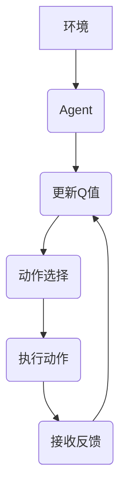
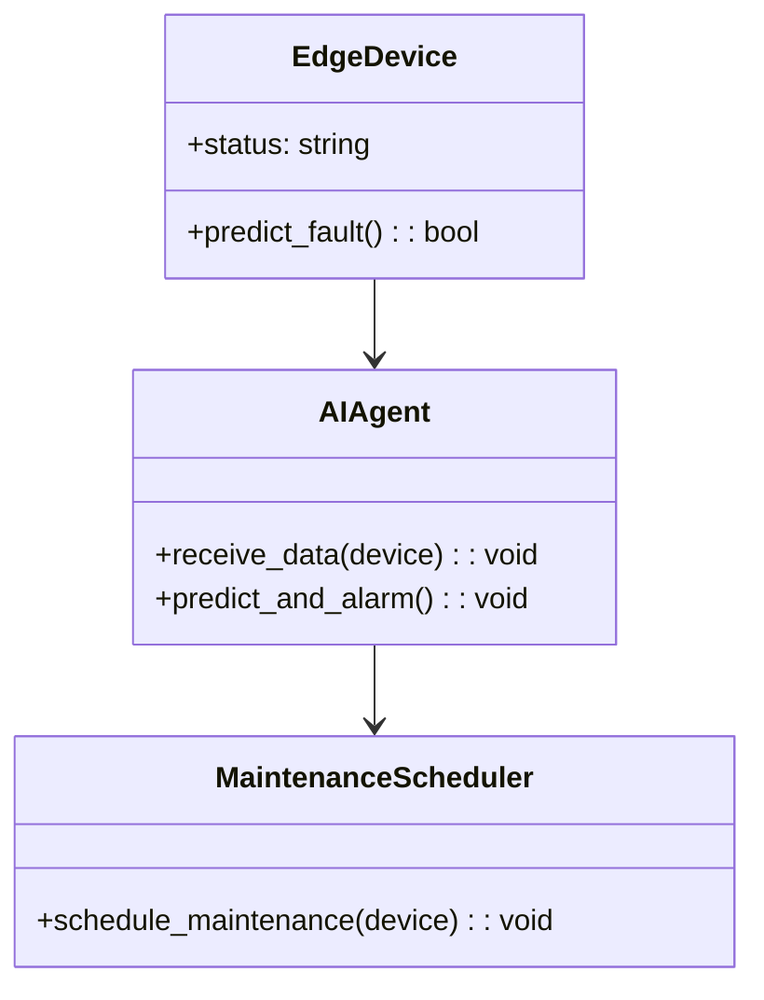

                 


# 企业AI Agent的边缘AI部署策略

> 关键词：企业AI Agent，边缘AI，分布式计算，强化学习，系统架构设计

> 摘要：随着AI技术的快速发展，企业AI Agent在边缘计算环境下的部署需求日益增长。本文从企业AI Agent的背景、核心概念、算法原理、系统架构、项目实战等多个方面展开分析，探讨企业在边缘环境中部署AI Agent的最佳实践策略。通过结合实际案例和详细的技术实现，本文旨在为企业技术团队提供一份全面的技术指南，帮助他们在边缘环境下高效、安全地部署和管理AI Agent。

---

## 第1章: 企业AI Agent的背景与基础

### 1.1 AI Agent的基本概念

#### 1.1.1 AI Agent的定义
AI Agent（人工智能代理）是指能够感知环境、自主决策并执行任务的智能实体。它可以是一个软件程序，也可以是一个硬件设备，其核心目标是通过与环境交互来实现特定目标。

#### 1.1.2 AI Agent的核心特征
- **自主性**：能够在没有外部干预的情况下独立运行。
- **反应性**：能够实时感知环境并做出响应。
- **目标导向性**：所有行为都围绕实现特定目标展开。
- **学习能力**：通过经验改进自身性能。

#### 1.1.3 企业级AI Agent的特殊性
企业级AI Agent通常需要处理复杂业务逻辑，具有高可用性和高性能要求，且需要符合企业内部的安全和合规标准。

---

### 1.2 边缘AI的定义与特点

#### 1.2.1 边缘计算的基本概念
边缘计算是一种分布式计算范式，数据在靠近数据源的边缘设备上进行处理，而非传统的云端集中处理。其特点包括低延迟、高实时性和数据隐私保护。

#### 1.2.2 边缘AI的核心优势
- **低延迟**：边缘计算能够在数据生成的地方快速处理，减少延迟。
- **数据隐私**：通过在边缘设备上处理数据，可以减少数据传输到云端的过程，降低隐私泄露风险。
- **高可用性**：边缘设备能够在断开网络的情况下继续运行。

#### 1.2.3 边缘AI的应用场景
- 智能工厂中的实时监控。
- 智慧交通中的自动驾驶和实时决策。
- 智能医疗中的边缘诊断系统。

---

### 1.3 企业AI Agent与边缘AI的结合

#### 1.3.1 AI Agent在边缘计算中的作用
AI Agent可以作为边缘计算环境中的智能决策者，负责协调边缘设备之间的任务分配和资源管理。

#### 1.3.2 边缘AI部署的挑战与机遇
- **挑战**：边缘设备的计算资源有限，如何在资源受限的环境中高效运行AI Agent是一个难题。
- **机遇**：边缘AI为企业提供了更灵活、更高效的分布式计算解决方案。

#### 1.3.3 企业AI Agent的边缘化趋势
随着5G网络和物联网技术的普及，企业AI Agent的边缘部署正在成为趋势，尤其是在实时性要求高、数据隐私保护严格的场景中。

---

## 第2章: 企业AI Agent边缘部署的核心概念

### 2.1 分布式架构与AI Agent的边缘化特征

#### 2.1.1 分布式架构
分布式架构将计算资源分散到多个边缘设备上，每个设备负责特定的任务，通过协同完成整体目标。

#### 2.1.2 自适应能力
AI Agent需要能够根据边缘环境的变化（如网络波动、设备故障等）动态调整自身行为。

#### 2.1.3 实时响应
边缘AI Agent需要在极短的时间内完成感知、决策和执行，以满足实时性要求。

---

### 2.2 边缘AI的系统架构

#### 2.2.1 边缘计算架构
边缘计算架构通常包括边缘设备、边缘网关和云端三个层次，AI Agent可以部署在边缘设备或边缘网关上。

#### 2.2.2 AI Agent的边缘部署架构
AI Agent可以以两种形式部署：
1. **边缘设备本地部署**：AI Agent直接在边缘设备上运行，适合任务独立性较高的场景。
2. **边缘网关集中部署**：多个边缘设备共享一个边缘网关，AI Agent在网关上统一决策和协调。

#### 2.2.3 与云计算的协同架构
边缘AI Agent可以与云端服务协同工作，边缘设备负责实时任务处理，云端负责长期数据存储和深度分析。

---

### 2.3 企业AI Agent的边缘部署策略

#### 2.3.1 基于场景的部署策略
根据具体应用场景的需求选择部署方式。例如，对于需要实时决策的场景，优先选择边缘设备本地部署；对于需要集中协调的场景，选择边缘网关集中部署。

#### 2.3.2 基于性能的优化策略
在资源受限的边缘环境中，需要对AI Agent进行轻量化设计，优化算法效率，减少计算资源消耗。

#### 2.3.3 基于安全的防护策略
在边缘部署中，需要考虑数据隐私和设备安全问题，采用加密通信、访问控制等技术保护系统安全。

---

## 第3章: 企业AI Agent边缘部署的核心算法

### 3.1 强化学习在AI Agent中的应用

#### 3.1.1 强化学习的基本原理
强化学习是一种通过试错机制来优化决策的算法，AI Agent通过与环境交互，学习最优策略。

#### 3.1.2 Q-learning算法
Q-learning是一种经典的强化学习算法，通过维护一个Q值表来记录状态-动作对的最优价值。



#### 3.1.3 算法实现的边缘化优化
在边缘环境中，AI Agent需要快速完成决策过程，因此需要对Q-learning算法进行优化，例如减少状态空间和动作空间的维度。

```python
import numpy as np

class AIAgent:
    def __init__(self, state_space, action_space):
        self.state_space = state_space
        self.action_space = action_space
        self.Q = np.zeros((state_space, action_space))
    
    def choose_action(self, state, epsilon=0.1):
        if np.random.random() < epsilon:
            return np.random.randint(self.action_space)
        else:
            return np.argmax(self.Q[state])
    
    def update_Q(self, state, action, reward, next_state, alpha=0.1):
        self.Q[state][action] += alpha * (reward + np.max(self.Q[next_state]) - self.Q[state][action])
```

---

### 3.2 边缘AI中的分布式算法

#### 3.2.1 分布式计算的基

---

## 第4章: 企业AI Agent边缘部署的系统架构设计

### 4.1 问题场景介绍

#### 4.1.1 项目介绍
假设我们正在为一家制造企业设计一个智能工厂监控系统，需要在车间的边缘设备上部署AI Agent，实现设备故障预测和实时报警。

#### 4.1.2 系统功能设计
- 设备状态监测
- 故障预测与报警
- 维护调度管理

#### 4.1.3 系统架构设计


---

## 第5章: 企业AI Agent边缘部署的项目实战

### 5.1 环境安装

#### 5.1.1 安装依赖
```bash
pip install numpy
pip install matplotlib
```

#### 5.1.2 配置边缘设备
配置边缘设备的网络参数和计算资源，确保AI Agent能够正常运行。

---

## 第6章: 总结与展望

### 6.1 最佳实践 tips
- 在资源受限的环境中，优先选择轻量级AI算法。
- 定期监控和优化AI Agent的性能，确保其在边缘环境中高效运行。
- 在边缘部署中，数据隐私和设备安全是重点关注领域。

### 6.2 小结
本文详细探讨了企业AI Agent在边缘环境下的部署策略，从核心概念到算法实现，再到系统架构设计，为企业技术团队提供了一份全面的技术指南。

### 6.3 注意事项
- 边缘AI部署需要考虑网络波动、设备故障等不确定性因素。
- 在实际部署中，需要结合具体业务需求灵活调整部署策略。

### 6.4 拓展阅读
- 《Distributed Machine Learning in Edge Computing》
- 《Practical AI Agent Design for Enterprise Systems》

---

通过本文的系统分析和详细讲解，读者可以全面理解企业AI Agent在边缘环境下的部署策略，并能够将其应用到实际项目中，推动企业智能化转型。

