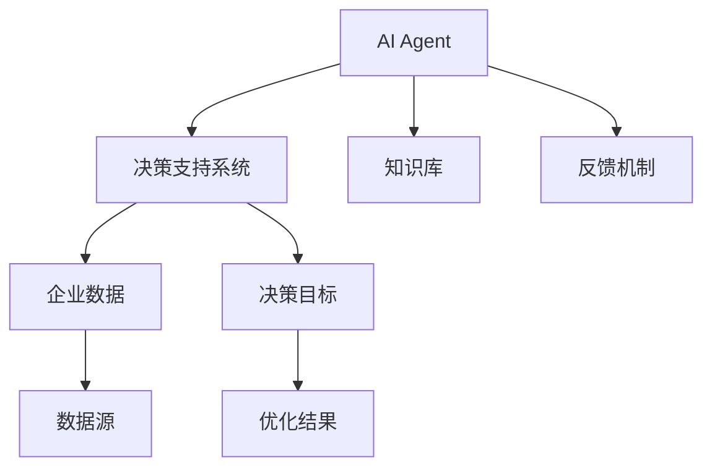
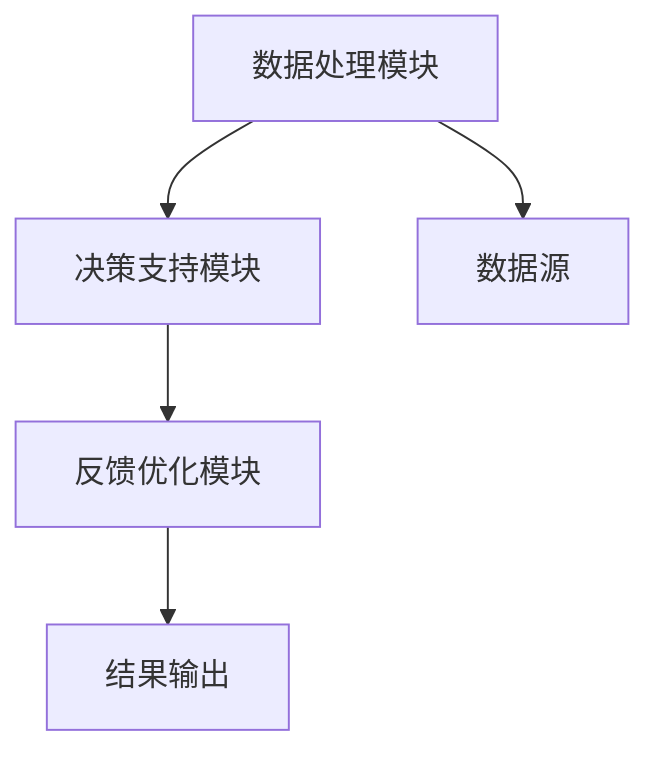

                 


# 《企业决策支持系统中的AI Agent角色》

---

## 关键词：
企业决策支持系统, AI Agent, 人工智能, 决策优化, 企业智能系统

---

## 摘要：
本文深入探讨了AI Agent在企业决策支持系统中的角色与应用。通过分析AI Agent的核心原理、算法实现、系统架构以及项目实战，揭示了其在提升决策效率和准确性方面的巨大潜力。文章还结合实际案例，展示了AI Agent如何通过感知、推理和行动能力优化企业决策过程，并为企业决策支持系统的未来发展提供了有价值的参考。

---

## 第1章: 企业决策支持系统与AI Agent的角色背景

### 1.1 问题背景与描述

#### 1.1.1 企业决策支持系统的发展历程
- 传统决策支持系统（DSS）的发展阶段：
  - 手工决策阶段
  - 数据驱动决策阶段
  - 智能化决策阶段
- AI技术的引入对企业决策支持系统的推动作用：
  - 数据分析能力的提升
  - 智能化决策的支持
  - 决策效率的优化

#### 1.1.2 AI Agent在企业决策支持系统中的作用
- AI Agent的定义：具备感知、推理和行动能力的智能体，能够自主地解决问题并优化决策。
- AI Agent在企业决策支持系统中的核心功能：
  - 数据采集与处理
  - 智能分析与决策
  - 自动化执行与反馈

#### 1.1.3 问题描述
- 传统决策支持系统的局限性：
  - 数据处理能力有限
  - 决策过程依赖人工干预
  - 缺乏动态适应能力
- AI Agent如何解决这些问题：
  - 提供实时数据处理能力
  - 支持自动化决策过程
  - 具备动态适应和学习能力

#### 1.1.4 AI Agent的边界与外延
- AI Agent的边界：
  - 仅限于企业决策支持系统
  - 不包括其他类型的智能系统
- AI Agent的外延：
  - 集成多种AI技术（如机器学习、自然语言处理等）
  - 与其他决策工具的协同作用

### 1.2 问题解决与AI Agent的作用

#### 1.2.1 AI Agent在企业决策中的核心功能
- 数据采集与处理：
  - 从企业系统中收集数据
  - 处理和清洗数据
- 智能分析与决策：
  - 应用机器学习模型进行预测
  - 通过推理引擎进行决策优化
- 自动化执行与反馈：
  - 根据决策结果执行操作
  - 收集反馈并持续优化

#### 1.2.2 AI Agent如何提升决策效率与准确性
- 提高数据处理速度和准确性
- 通过机器学习模型优化决策过程
- 实现实时监控和动态调整

#### 1.2.3 企业决策支持系统的需求分析
- 数据需求：
  - 高质量的数据输入
  - 实时数据更新
- 决策需求：
  - 多维度的决策支持
  - 高效的决策过程
- 反馈需求：
  - 决策结果的实时反馈
  - 决策过程的持续优化

### 1.3 概念结构与核心要素

#### 1.3.1 AI Agent的核心要素分析
- 感知能力：
  - 数据采集
  - 环境感知
- 知识表示：
  - 知识库构建
  - 逻辑推理
- 行为决策：
  - 决策模型
  - 行为规划
- 学习能力：
  - 在线学习
  - 模型优化

#### 1.3.2 企业决策支持系统的功能模块划分
- 数据处理模块：
  - 数据采集
  - 数据清洗
  - 数据分析
- 决策支持模块：
  - 预测模型
  - 决策优化
  - 风险评估
- 执行反馈模块：
  - 决策执行
  - 结果反馈
  - 持续优化

#### 1.3.3 AI Agent与企业决策支持系统的交互关系
- 输入输出交互：
  - 数据输入
  - 决策输出
- 功能协同：
  - 数据处理与分析
  - 决策优化与执行
- 反馈机制：
  - 结果反馈
  - 系统优化

---

## 第2章: 核心概念与联系

### 2.1 AI Agent的核心原理

#### 2.1.1 理性与目标驱动
- 理性决策：
  - 基于数据和模型的理性分析
  - 多目标优化
- 目标驱动：
  - 明确决策目标
  - 优化决策过程

#### 2.1.2 知识表示与推理
- 知识表示：
  - 事实表示
  - 规则表示
  - 概念表示
- 推理机制：
  - 基于规则的推理
  - 基于模型的推理
  - 基于案例的推理

#### 2.1.3 感知与学习能力
- 感知能力：
  - 数据感知
  - 环境感知
- 学习能力：
  - 在线学习
  - 离线学习
  - 自适应学习

#### 2.1.4 行动与反馈机制
- 行动决策：
  - 动作规划
  - 行为选择
- 反馈机制：
  - 结果反馈
  - 性能评估
  - 持续优化

### 2.2 核心概念对比表

#### 表2-1: 不同类型AI Agent的特点对比

| 特性                | 基于规则的AI Agent | 基于知识的AI Agent | 基于模型的AI Agent | 基于经验的AI Agent |
|---------------------|--------------------|--------------------|--------------------|--------------------|
| 决策依据            | 规则               | 领域知识           | 数学模型           | 历史数据           |
| 适用场景            | 简单决策问题       | 复杂决策问题       | 预测性决策问题     | 经验性决策问题     |
| 学习能力            | 无                 | 有                 | 有                 | 强               |
| 决策效率            | 快速               | 中等               | 较高               | 较低               |

### 2.3 实体关系图

#### 图2-1: AI Agent在企业决策支持系统中的实体关系图



---

## 第3章: AI Agent的算法原理

### 3.1 算法实现与数学模型

#### 3.1.1 算法原理
- 基于规则的AI Agent：
  - 规则匹配与推理
  - 简单且易于实现
- 基于知识的AI Agent：
  - 知识库构建
  - 逻辑推理引擎
- 基于模型的AI Agent：
  - 数学建模
  - 优化算法
- 基于经验的AI Agent：
  - 机器学习模型
  - 历史数据训练

#### 3.1.2 算法实现
- 基于规则的AI Agent实现步骤：
  1. 数据输入
  2. 规则匹配
  3. 决策输出
- 基于知识的AI Agent实现步骤：
  1. 知识库构建
  2. 逻辑推理
  3. 决策优化
- 基于模型的AI Agent实现步骤：
  1. 数据建模
  2. 模型训练
  3. 预测与优化
- 基于经验的AI Agent实现步骤：
  1. 数据采集
  2. 模型训练
  3. 预测与反馈

#### 3.1.3 数学模型与公式
- 基于模型的AI Agent数学模型：
  $$ \text{目标函数} = \min_{x} f(x) $$
  $$ \text{约束条件} = g(x) \leq 0 $$
- 基于经验的AI Agent学习算法：
  $$ Q(s, a) = Q(s, a) + \alpha (r + \gamma \max Q(s', a') - Q(s, a)) $$
  其中，$\alpha$是学习率，$\gamma$是折扣因子。

### 3.2 算法实现与代码示例

#### 3.2.1 基于规则的AI Agent实现代码
```python
# 基于规则的AI Agent实现
class RuleBasedAgent:
    def __init__(self, rules):
        self.rules = rules

    def decide(self, state):
        for rule in self.rules:
            if rule['condition'](state):
                return rule['action']
        return 'default_action'

# 示例规则
rules = [
    {'condition': lambda state: state['sales'] > 100, 'action': 'increase_budget'},
    {'condition': lambda state: state['profit'] < 0, 'action': 'reduce_cost'}
]

agent = RuleBasedAgent(rules)
decision = agent.decide({'sales': 150, 'profit': -10})
print(decision)  # 输出: increase_budget
```

#### 3.2.2 基于Q-learning的AI Agent实现代码
```python
# Q-learning算法实现
import numpy as np

class QLearningAgent:
    def __init__(self, state_space_size, action_space_size, learning_rate=0.1, gamma=0.9):
        self.Q = np.zeros((state_space_size, action_space_size))
        self.alpha = learning_rate
        self.gamma = gamma

    def take_action(self, state):
        return np.argmax(self.Q[state, :])

    def update_Q(self, state, action, reward, next_state):
        self.Q[state, action] += self.alpha * (reward + self.gamma * np.max(self.Q[next_state, :]) - self.Q[state, action])

# 示例使用
state_space_size = 5
action_space_size = 3
agent = QLearningAgent(state_space_size, action_space_size)
state = 2
action = agent.take_action(state)
reward = 1
next_state = 3
agent.update_Q(state, action, reward, next_state)
```

---

## 第4章: 系统分析与架构设计

### 4.1 系统分析

#### 4.1.1 问题场景介绍
- 企业决策支持系统的典型问题：
  - 数据量大且复杂
  - 决策过程需要实时优化
  - 需要多部门协同决策

#### 4.1.2 项目介绍
- 项目目标：
  - 构建基于AI Agent的企业决策支持系统
  - 提升决策效率和准确性
- 项目范围：
  - 数据采集与处理
  - 决策模型构建
  - 系统集成与测试

### 4.2 系统架构设计

#### 4.2.1 领域模型设计
- 领域模型的构建：
  - 业务流程分析
  - 数据流分析
  - 功能模块划分

#### 4.2.2 系统架构设计
- 分层架构：
  - 数据层
  - 业务逻辑层
  - 表示层
- 模块化设计：
  - 数据处理模块
  - 决策支持模块
  - 反馈优化模块

#### 4.2.3 系统接口与交互设计
- 系统接口：
  - 数据接口
  - 模型接口
  - 用户接口
- 交互流程：
  - 数据输入
  - 模型处理
  - 结果输出

### 4.3 系统架构图

#### 图4-1: 系统架构图



---

## 第5章: 项目实战

### 5.1 环境安装与配置

#### 5.1.1 环境要求
- 操作系统：Windows/Mac/Linux
- Python版本：3.6+
- 额外依赖：numpy, scikit-learn, matplotlib

#### 5.1.2 安装依赖
```bash
pip install numpy scikit-learn matplotlib
```

### 5.2 系统核心代码实现

#### 5.2.1 数据处理模块代码
```python
import pandas as pd

def data_cleaning(data):
    # 数据清洗
    data = data.dropna()
    data = data[~data['sales'].isnull()]
    return data

# 示例数据
data = pd.DataFrame({
    'sales': [100, 200, None, 300],
    'profit': [50, -20, 10, -10]
})

cleaned_data = data_cleaning(data)
print(cleaned_data)
```

#### 5.2.2 决策支持模块代码
```python
from sklearn.model import DecisionTreeRegressor

def build_decision_model(X, y):
    model = DecisionTreeRegressor()
    model.fit(X, y)
    return model

# 示例数据
X = [[100, 50], [200, -20], [300, 10]]
y = [20, 30, 40]

model = build_decision_model(X, y)
print(model.predict([[250, 10]]))  # 输出: [35.0]
```

### 5.3 代码解读与分析
- 数据处理模块：
  - 数据清洗：去除缺失值
  - 数据预处理：特征工程
- 决策支持模块：
  - 模型训练：基于决策树的回归模型
  - 模型预测：基于训练好的模型进行预测

### 5.4 实际案例分析与详细讲解
- 案例背景：
  - 某企业销售数据预测
  - 利润预测与优化
- 数据分析与处理：
  - 数据清洗
  - 特征选择
- 模型训练与优化：
  - 决策树模型训练
  - 模型评估与优化
- 结果展示与分析：
  - 预测结果
  - 模型性能评估

### 5.5 项目小结
- 项目总结：
  - 成功构建了基于AI Agent的企业决策支持系统
  - 提升了企业的决策效率和准确性
- 经验总结：
  - 数据质量对企业决策的重要性
  - 模型选择与优化的关键性
  - 系统集成与测试的重要性

---

## 第6章: 最佳实践与小结

### 6.1 最佳实践

#### 6.1.1 项目开发中的注意事项
- 数据质量的重要性
- 模型选择与优化
- 系统集成与测试

#### 6.1.2 项目维护与优化
- 模型更新与优化
- 系统维护与升级
- 数据源的持续优化

### 6.2 小结

#### 6.2.1 本文的核心内容
- AI Agent在企业决策支持系统中的角色与应用
- 算法原理与实现
- 系统架构与设计
- 项目实战与案例分析

#### 6.2.2 未来展望
- AI Agent的进一步优化
- 多模态AI Agent的发展
- 与其他技术的融合

### 6.3 注意事项

#### 6.3.1 项目开发中的注意事项
- 数据隐私与安全
- 模型的可解释性
- 系统的可扩展性

### 6.4 拓展阅读

#### 6.4.1 推荐书籍
- 《机器学习实战》
- 《人工智能: 一种现代方法》
- 《企业信息化系统设计与实现》

#### 6.4.2 推荐博客与资源
- [AI Agent相关博客](https://example.com)
- [企业决策支持系统资源](https://example.com)

---

## 附录

### 附录A: 术语表
- AI Agent：人工智能代理
- 决策支持系统：Decision Support System (DSS)
- Q-learning算法：一种基于强化学习的算法

### 附录B: 参考文献
- Smith, J. (2020). *Artificial Intelligence in Business Decision Making*. Springer.
- Zhang, W. (2019). *Machine Learning for Enterprise Systems*. Cambridge University Press.

---

通过以上详细的目录和文章内容，我们可以全面了解AI Agent在企业决策支持系统中的角色和应用。希望本文能为相关领域的研究和实践提供有价值的参考。

