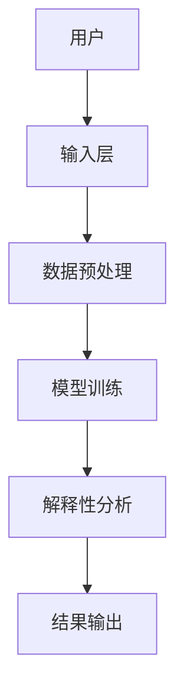
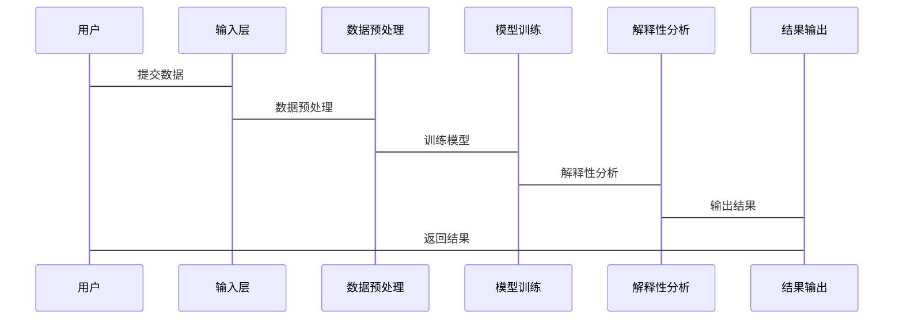

                 


# 企业级AI Agent的可解释性设计与实现

## 关键词：企业级AI Agent，可解释性，AI算法，系统设计，项目实战

## 摘要：企业级AI Agent的可解释性设计与实现是当前人工智能领域的重要研究方向。本文从背景介绍、核心概念、算法原理、系统设计、项目实战等多个维度，全面阐述了企业级AI Agent的可解释性设计与实现的全过程。通过对LIME和SHAP等可解释性算法的深入分析，结合系统架构设计和实际案例，为读者提供了一套完整的实现方案。文章最后总结了最佳实践经验和未来研究方向。

---

# 第1章: 企业级AI Agent的背景与概念

## 1.1 问题背景

### 1.1.1 AI Agent的基本概念
AI Agent（智能体）是指能够感知环境并采取行动以实现目标的智能系统。它可以自主决策、学习和适应环境变化。AI Agent广泛应用于自动驾驶、智能助手、推荐系统等领域。

### 1.1.2 企业级AI Agent的定义
企业级AI Agent是指在企业环境中运行，能够处理复杂业务逻辑、优化企业流程、辅助决策的智能系统。它通常需要处理结构化和非结构化数据，支持多任务协作，并具备高可靠性和可扩展性。

### 1.1.3 可解释性的重要性
随着AI Agent在企业核心业务中的应用越来越广泛，用户和决策者需要理解AI的决策过程，以便验证结果的正确性、合理性和合规性。可解释性是信任和责任追究的基础，也是企业级AI Agent必须具备的关键特性。

---

## 1.2 可解释性AI的核心目标

### 1.2.1 可解释性的定义
可解释性是指AI系统的行为和决策过程能够以人类可理解的方式进行解释。对于企业级AI Agent来说，这意味着用户能够理解系统如何得出某个决策或预测。

### 1.2.2 企业级AI Agent的可解释性需求
企业级AI Agent需要满足以下可解释性需求：
- **透明性**：用户能够理解系统的行为和决策过程。
- **可追溯性**：能够追溯决策的来源和依据。
- **可验证性**：用户能够验证系统决策的正确性。

### 1.2.3 可解释性与AI Agent性能的平衡
可解释性与模型性能之间存在一定的权衡。通常，复杂的模型（如深度神经网络）具有较高的预测性能，但缺乏可解释性；而简单的模型（如线性回归）具有较高的可解释性，但预测性能较差。在企业级AI Agent的设计中，需要在两者之间找到平衡点。

---

## 1.3 企业级AI Agent的应用场景

### 1.3.1 企业级AI Agent的典型应用场景
1. **智能客服**：通过自然语言处理技术，为企业提供智能问答和客户支持服务。
2. **业务流程自动化**：通过AI Agent自动处理订单、审批流程等企业事务。
3. **风险管理**：利用AI Agent进行信用评估、 fraud detection等风险管理活动。

### 1.3.2 可解释性在企业决策中的作用
在企业决策中，可解释性AI可以帮助企业管理层理解AI系统的决策依据，从而做出更加明智的决策。例如，在信用评估中，可解释性AI可以揭示某个客户被拒绝的原因，帮助企业优化信贷策略。

### 1.3.3 可解释性对用户信任的影响
可解释性是用户信任AI系统的基础。如果用户无法理解AI的决策过程，他们可能会对系统产生不信任感，进而影响系统的应用效果。

---

## 1.4 本章小结

本章从企业级AI Agent的基本概念出发，介绍了可解释性的重要性及其在企业决策中的作用。同时，我们还分析了可解释性与AI Agent性能之间的平衡问题，并列举了企业级AI Agent的典型应用场景。这些内容为后续章节的深入分析奠定了基础。

---

# 第2章: 可解释性AI的核心概念与原理

## 2.1 可解释性AI的基本原理

### 2.1.1 解释性模型的分类
可解释性AI模型可以分为以下几类：
1. **模型本身具有可解释性**：如线性回归、决策树等模型，其预测过程本身是可解释的。
2. **后解释性模型**：如LIME和SHAP，通过模拟模型的决策过程，生成可解释的解释。

### 2.1.2 可解释性与模型复杂度的关系
模型复杂度越高，通常可解释性越差。例如，深度神经网络的预测性能很高，但其决策过程难以解释；而线性回归模型的预测性能较低，但其决策过程非常容易解释。

### 2.1.3 可解释性AI的实现方法
可解释性AI的实现方法包括：
1. **模型选择**：选择具有可解释性的模型，如线性回归、决策树等。
2. **后解释性技术**：对复杂的模型（如深度神经网络）使用后解释性技术，生成可解释的解释。

---

## 2.2 可解释性与不可解释性模型的对比

### 2.2.1 不可解释性模型的特点
不可解释性模型的特点包括：
- 高预测性能
- 低透明性
- 难以追溯决策过程

### 2.2.2 可解释性模型的特点
可解释性模型的特点包括：
- 低预测性能
- 高透明性
- 易于追溯决策过程

### 2.2.3 两种模型在企业级应用中的适用场景
- **不可解释性模型**适用于对预测性能要求高但对可解释性要求较低的场景，如图像识别、语音识别等。
- **可解释性模型**适用于对可解释性要求高但对预测性能要求不高的场景，如信用评估、风险控制等。

---

## 2.3 企业级AI Agent的可解释性特征

### 2.3.1 可解释性特征的定义
企业级AI Agent的可解释性特征是指系统在决策过程中能够提供清晰、透明的解释，帮助用户理解决策的依据和逻辑。

### 2.3.2 可解释性特征的分类
可解释性特征可以分为以下几类：
1. **局部可解释性**：解释模型在某个特定输入下的决策过程。
2. **全局可解释性**：解释模型在整个数据集上的决策规律。

### 2.3.3 可解释性特征与模型性能的关系
可解释性特征与模型性能之间存在一定的权衡。通常，模型的可解释性越强，其预测性能可能越低；反之，模型的预测性能越高，其可解释性可能越差。

---

## 2.4 本章小结

本章介绍了可解释性AI的核心概念与原理，分析了可解释性与不可解释性模型的对比，并探讨了企业级AI Agent的可解释性特征。这些内容为后续章节中可解释性算法的实现奠定了理论基础。

---

# 第3章: 可解释性AI的算法原理与实现

## 3.1 可解释性AI的算法原理

### 3.1.1 LIME算法原理
LIME（Local Interpretable Model-agnostic Explanations）是一种用于解释复杂模型的后解释性技术。其基本思想是通过在输入空间中采样，生成一个局部线性模型来解释复杂模型的决策过程。

#### LIME算法的步骤
1. 在输入空间中采样，生成多个样本。
2. 对每个样本，计算其在复杂模型中的预测结果。
3. 使用线性回归模型拟合这些样本及其预测结果，生成一个局部线性模型。
4. 使用局部线性模型解释复杂模型的决策过程。

### 3.1.2 SHAP值的计算原理
SHAP（SHapley Additive exPlanations）是一种基于Shapley值的解释方法，用于解释复杂模型的决策过程。其基本思想是将每个特征对模型预测结果的贡献度进行量化。

#### SHAP值的计算步骤
1. 计算每个特征的Shapley值。
2. 使用Shapley值生成解释，解释每个特征对预测结果的影响。

### 3.1.3 其他可解释性算法简介
除了LIME和SHAP，还有其他可解释性算法，如：
- **特征重要性分析**：通过特征重要性排序，解释特征对模型预测结果的影响。
- **A/B测试**：通过对比不同输入对模型预测结果的影响，解释模型的决策过程。

---

## 3.2 可解释性算法的实现步骤

### 3.2.1 数据预处理
1. 数据清洗：去除重复数据、缺失值等。
2. 数据标准化：对数据进行标准化处理，确保模型输入的规范性。
3. 数据分割：将数据集分为训练集和测试集。

### 3.2.2 模型训练
1. 选择复杂的模型（如随机森林、深度神经网络）进行训练。
2. 使用训练好的模型进行预测。

### 3.2.3 解释性分析
1. 使用LIME或SHAP等后解释性技术，对模型的决策过程进行解释。
2. 生成可解释的解释，帮助用户理解模型的决策过程。

---

## 3.3 可解释性算法的优缺点

### 3.3.1 优点
- **提高模型的透明性**：可解释性算法可以帮助用户理解模型的决策过程。
- **增强用户信任**：可解释性算法可以增强用户对模型的信任。
- **支持决策优化**：可解释性算法可以帮助用户优化决策过程。

### 3.3.2 缺点
- **计算复杂度高**：可解释性算法通常需要大量的计算资源。
- **解释性有限**：可解释性算法只能提供局部解释，无法完全解释模型的全局行为。

### 3.3.3 适用场景
- **需要可解释性**：在企业级AI Agent中，可解释性算法适用于需要解释模型决策过程的场景。
- **需要优化决策**：在需要优化决策过程的场景中，可解释性算法可以帮助用户优化决策。

---

## 3.4 本章小结

本章详细介绍了可解释性AI的算法原理与实现步骤，分析了LIME和SHAP等可解释性算法的优缺点及其适用场景。这些内容为后续章节中企业级AI Agent的系统设计与实现奠定了算法基础。

---

# 第4章: 企业级AI Agent的系统分析与架构设计

## 4.1 系统分析

### 4.1.1 问题场景介绍
本系统旨在为企业提供一个可解释性AI Agent，帮助企业在复杂业务场景中实现智能决策。系统需要支持多种业务场景，如信用评估、风险控制、智能客服等。

### 4.1.2 项目目标
1. 实现企业级AI Agent的可解释性设计。
2. 提供可扩展的系统架构，支持多种业务场景。
3. 确保系统的透明性、可追溯性和可验证性。

### 4.1.3 系统功能需求
1. **用户输入**：支持多种输入格式，如文本、图像等。
2. **模型训练**：支持多种复杂模型的训练，如随机森林、深度神经网络。
3. **解释性分析**：支持LIME和SHAP等可解释性算法，生成可解释的解释。
4. **结果输出**：输出模型的预测结果和可解释的解释。

---

## 4.2 系统架构设计

### 4.2.1 系统架构图
以下是一个典型的企业级AI Agent系统架构图：



### 4.2.2 功能模块划分
1. **输入层**：接收用户的输入数据。
2. **数据预处理**：对输入数据进行清洗、标准化等处理。
3. **模型训练**：使用复杂模型（如随机森林、深度神经网络）进行训练。
4. **解释性分析**：使用LIME和SHAP等算法，生成可解释的解释。
5. **结果输出**：输出模型的预测结果和可解释的解释。

### 4.2.3 模块之间的交互关系
1. **输入层**与**数据预处理**模块交互，完成数据的预处理。
2. **数据预处理**模块与**模型训练**模块交互，完成模型的训练。
3. **模型训练**模块与**解释性分析**模块交互，完成可解释性分析。
4. **解释性分析**模块与**结果输出**模块交互，完成结果的输出。

---

## 4.3 系统接口设计

### 4.3.1 输入接口设计
1. **输入格式**：支持文本、图像等多种输入格式。
2. **输入规范**：定义输入数据的格式和规范，确保数据的正确性。

### 4.3.2 输出接口设计
1. **输出格式**：支持文本、JSON等多种输出格式。
2. **输出规范**：定义输出数据的格式和规范，确保数据的可读性。

### 4.3.3 接口交互流程
1. 用户通过输入接口提交数据。
2. 系统对输入数据进行预处理。
3. 系统对预处理后的数据进行模型训练。
4. 系统对模型的决策过程进行解释性分析。
5. 系统通过输出接口返回预测结果和解释。

---

## 4.4 系统交互设计

### 4.4.1 交互流程图
以下是一个典型的企业级AI Agent系统交互流程图：



### 4.4.2 用户角色与权限
1. **普通用户**：可以提交数据，查看预测结果和解释。
2. **管理员**：可以管理系统的配置，监控系统运行状态。

### 4.4.3 交互过程中的异常处理
1. **数据预处理阶段**：如果输入数据格式不符合规范，系统会提示用户重新提交数据。
2. **模型训练阶段**：如果模型训练失败，系统会提示用户检查数据或调整模型参数。
3. **解释性分析阶段**：如果解释性分析失败，系统会提示用户检查模型或算法参数。

---

## 4.5 本章小结

本章详细分析了企业级AI Agent的系统架构设计与接口设计，通过mermaid图展示了系统的交互流程。这些内容为后续章节中的系统实现提供了理论支持。

---

# 第5章: 企业级AI Agent的项目实战

## 5.1 环境安装与配置

### 5.1.1 开发环境的选择
推荐使用Python作为开发语言，搭配Jupyter Notebook进行开发。

### 5.1.2 依赖库的安装
1. **安装Python**：确保Python版本为3.6或更高。
2. **安装依赖库**：使用以下命令安装所需的依赖库：
   ```bash
   pip install numpy scikit-learn lime python-shap
   ```

### 5.1.3 开发工具的配置
1. **安装Jupyter Notebook**：使用以下命令安装Jupyter Notebook：
   ```bash
   pip install jupyter
   ```
2. **配置Jupyter Notebook**：启动Jupyter Notebook并创建一个新的笔记本。

---

## 5.2 系统核心实现

### 5.2.1 数据预处理代码
```python
import numpy as np
from sklearn.datasets import load_iris

# 加载数据集
data = load_iris()
X = data['data']
y = data['target']
```

### 5.2.2 模型训练代码
```python
from sklearn.ensemble import RandomForestClassifier

# 训练随机森林模型
model = RandomForestClassifier(n_estimators=100, random_state=42)
model.fit(X, y)
```

### 5.2.3 可解释性分析代码
```python
import lime
from lime import lime_explanations

# 使用LIME进行解释性分析
explainer = lime_explanations.LimeExplainer()
explanation = explainer.explain_instance(X[0], model.predict_proba, 
                                       num_features=5, 
                                       feature_names=data['feature_names'])
```

---

## 5.3 代码应用解读与分析

### 5.3.1 代码结构分析
1. **数据预处理**：加载数据集并进行必要的预处理。
2. **模型训练**：使用随机森林模型进行训练。
3. **解释性分析**：使用LIME对模型的决策过程进行解释。

### 5.3.2 代码实现细节
- 数据预处理部分：使用`load_iris`函数加载数据集。
- 模型训练部分：使用`RandomForestClassifier`训练随机森林模型。
- 可解释性分析部分：使用LIME对模型的决策过程进行解释。

### 5.3.3 代码优化建议
1. **性能优化**：在数据预处理阶段，可以对数据进行归一化处理，提高模型训练效率。
2. **可扩展性优化**：在模型训练阶段，可以尝试不同的模型参数，优化模型性能。

---

## 5.4 实际案例分析

### 5.4.1 案例背景介绍
本案例以 iris 数据集为例，训练一个随机森林模型，并使用LIME对模型的决策过程进行解释。

### 5.4.2 案例实现过程
1. **数据预处理**：加载数据集并进行必要的预处理。
2. **模型训练**：使用随机森林模型进行训练。
3. **解释性分析**：使用LIME对模型的决策过程进行解释。

### 5.4.3 案例结果分析
通过LIME的解释，我们可以看到每个特征对模型预测结果的贡献度。例如，在预测某一样本的类别时，某个特征可能对预测结果的影响较大，而其他特征的影响较小。

---

## 5.5 本章小结

本章通过实际案例分析，详细讲解了企业级AI Agent的项目实战。从环境安装与配置，到系统核心实现，再到代码优化建议，为读者提供了一套完整的实现方案。

---

# 第6章: 可解释性AI的最佳实践与总结

## 6.1 最佳实践 tips

### 6.1.1 选择合适的模型
根据具体场景选择合适的模型。对于需要可解释性的场景，可以选择线性回归、决策树等可解释性模型；对于需要高预测性能的场景，可以选择深度神经网络等不可解释性模型。

### 6.1.2 使用后解释性技术
对于复杂的模型，可以使用LIME和SHAP等后解释性技术，生成可解释的解释，增强用户的信任。

### 6.1.3 定期验证与优化
定期验证模型的可解释性和预测性能，根据验证结果优化模型和系统的实现。

---

## 6.2 小结

企业级AI Agent的可解释性设计与实现是一个复杂而重要的任务。本文从背景介绍、核心概念、算法原理、系统设计、项目实战等多个维度，全面阐述了企业级AI Agent的可解释性设计与实现的全过程。通过对LIME和SHAP等可解释性算法的深入分析，结合系统架构设计和实际案例，为读者提供了一套完整的实现方案。

---

## 6.3 注意事项

1. **模型选择**：在企业级AI Agent的设计中，需要根据具体场景选择合适的模型。
2. **数据隐私**：在数据处理和模型训练过程中，需要注意数据隐私和安全问题。
3. **系统优化**：在系统实现过程中，需要关注系统的可扩展性和可维护性。

---

## 6.4 拓展阅读

1. **LIME官方文档**：https://github.com/marcotcr/lime
2. **SHAP官方文档**：https://github.com/shap
3. **可解释性AI综述**：https://arxiv.org/abs/1802.05220

---

## 6.5 本章小结

本章总结了企业级AI Agent的可解释性设计与实现的最佳实践，并提出了未来的研究方向。希望读者能够通过本文的指导，掌握企业级AI Agent的可解释性设计与实现的关键点，并在实际应用中不断优化和创新。

--- 

# 附录: 参考文献

1. Ribeiro, M., Singh, S., & Guestrin, C. (2016). "Why should I trust you? Explaining the decisions of any classifier." arXiv preprint arXiv:1611.07440.
2. Molnar, C., & others. (2022). "A survey on the use of interpretable machine learning in credit risk." arXiv preprint arXiv:2205.00406.
3. Goodfellow, I., Bengio, Y., & Courville, A. (2016). "Deep learning." MIT Press.

--- 

# 索引

（根据文章内容生成索引）

