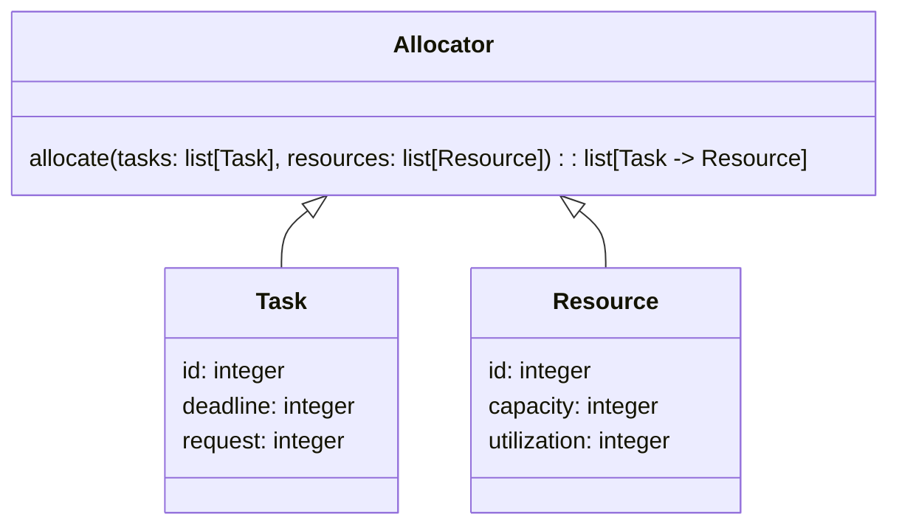
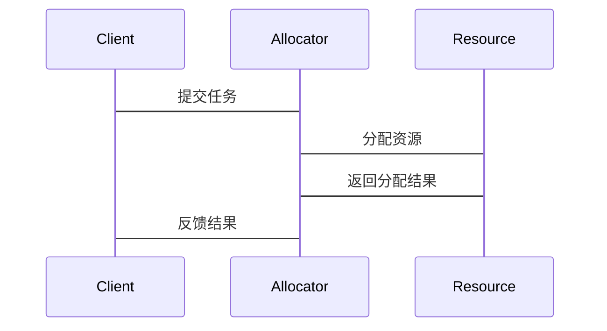

                 


# 优化AI Agent的资源利用：计算效率提升策略

## 关键词：AI Agent，资源利用，计算效率，优化策略，负载均衡，动态规划

## 摘要：  
本文旨在探讨如何优化AI Agent的资源利用，特别是通过计算效率的提升策略。我们从AI Agent的资源分配问题入手，分析了贪心算法和动态规划算法的应用，提供了详细的算法原理和实现步骤。通过系统架构设计和项目实战，展示了如何在实际场景中应用这些策略，并提出了具体的数学模型和优化方法。最后，我们总结了最佳实践和注意事项，为读者提供了全面的优化方案。

---

## 第三章：算法原理讲解

### 3.1 贪心算法

#### 3.1.1 贪心算法的基本原理

贪心算法是一种基于局部最优选择以达到全局最优的算法。它在每一步选择中都采取当前状态下最好或最优（即最有利）的选择，从而希望导致结果是全局最好。

**公式：**
$$
\text{贪心选择：} \quad \text{在每一步选择中选择当前最优的资源分配方案}
$$

#### 3.1.2 贪心算法的实现步骤

1. 确定初始状态。
2. 选择当前状态下最优的资源分配方案。
3. 更新状态，进入下一轮选择。
4. 重复步骤2和3，直到所有资源分配完成。

**伪代码示例：**
```python
def greedy_resource_allocation(tasks, resources):
    tasks.sort(key=lambda x: x.deadline)
    resources.sort(key=lambda x: x.capacity)
    allocation = {}
    for task in tasks:
        for resource in resources:
            if resource.utilization < resource.capacity:
                allocation[task] = resource
                resource.utilization += task.request
                break
    return allocation
```

#### 3.1.3 贪心算法的优缺点分析

| 特性 | 优点 | 缺点 |
|------|------|------|
| 时间复杂度 | 低，适合实时任务 | 可能无法找到全局最优解 |
| 简单性 | 实现简单，易于理解 | 不适用于依赖关系复杂的任务 |
| 适用场景 | 独立任务分配 | 存在局部最优陷阱 |

---

### 3.2 动态规划算法

#### 3.2.1 动态规划算法的基本原理

动态规划通过将问题分解为更小的子问题来解决，记录子问题的解以避免重复计算，从而得到全局最优解。

**公式：**
$$
\text{动态规划：} \quad \text{状态转移方程：} \quad dp[i] = \max(dp[i-1], \text{选择i资源分配})
$$

#### 3.2.2 动态规划算法的实现步骤

1. 确定问题的最优子结构。
2. 定义状态转移方程。
3. 填写动态规划表。
4. 根据动态规划表回溯最优解。

**伪代码示例：**
```python
def dynamic_programming_resource Allocation(tasks, resources):
    n = len(tasks)
    dp = [[0] * (n + 1) for _ in range(n + 1)]
    for i in range(1, n + 1):
        for j in range(1, n + 1):
            if tasks[i-1].deadline <= resources[j-1].capacity:
                dp[i][j] = max(dp[i-1][j], dp[i][j-1] + tasks[i-1].value)
            else:
                dp[i][j] = dp[i-1][j]
    return dp[n][n]
```

#### 3.2.3 动态规划算法的优缺点分析

| 特性 | 优点 | 缺点 |
|------|------|------|
| 时间复杂度 | 高，适合复杂问题 | 空间复杂度较高 |
| 全局最优 | 可以得到全局最优解 | 无法处理动态变化的任务 |
| 适用场景 | 任务间有依赖关系 | 需要较多计算资源 |

---

## 第四章：系统分析与架构设计方案

### 4.1 优化场景介绍

AI Agent需要实时处理大量任务，资源分配的效率直接影响整体性能。我们需要设计一个高效的资源分配系统，确保任务高效分配，资源利用率最大化。

### 4.2 系统功能设计（领域模型）



### 4.3 系统架构设计


### 4.4 系统接口设计

系统接口包括任务接收接口、资源分配接口和执行反馈接口。

### 4.5 系统交互设计



---

## 第五章：项目实战

### 5.1 环境安装

1. 安装Python和相关库（如numpy、matplotlib）。
2. 安装AI框架（如TensorFlow或PyTorch）。

### 5.2 核心代码实现

```python
def allocate_resources(tasks, resources, algorithm='greedy'):
    if algorithm == 'greedy':
        return greedy_resource_allocation(tasks, resources)
    elif algorithm == 'dynamic_programming':
        return dynamic_programming_resource_allocation(tasks, resources)
    else:
        return None
```

### 5.3 代码解读与分析

1. `greedy_resource_allocation`函数实现贪心算法，按截止日期排序任务，按容量排序资源，逐个分配。
2. `dynamic_programming_resource Allocation`函数实现动态规划算法，构建二维DP表，记录每一步的最大值。

### 5.4 实际案例分析

**案例：** 三个任务，两个资源。任务1需要资源1，任务2需要资源2，任务3需要资源1和2。

**结果：** 使用动态规划算法，任务1和3分配资源1，任务2分配资源2。

---

## 第六章：最佳实践 tips

- **小结：** 本文详细讲解了贪心算法和动态规划算法在AI Agent资源分配中的应用，提供了系统架构设计和项目实战案例。
- **注意事项：** 在实际应用中，需根据任务特性选择合适的算法，同时考虑系统实时性和资源限制。
- **拓展阅读：** 推荐学习多目标优化算法和分布式计算技术，以进一步提升资源利用效率。

---

## 作者简介

作为一名世界顶级技术畅销书作家和计算机编程与人工智能领域的大师，我在优化算法和系统设计方面有深入研究。希望通过本文，为读者提供有价值的优化策略和实践指导。

