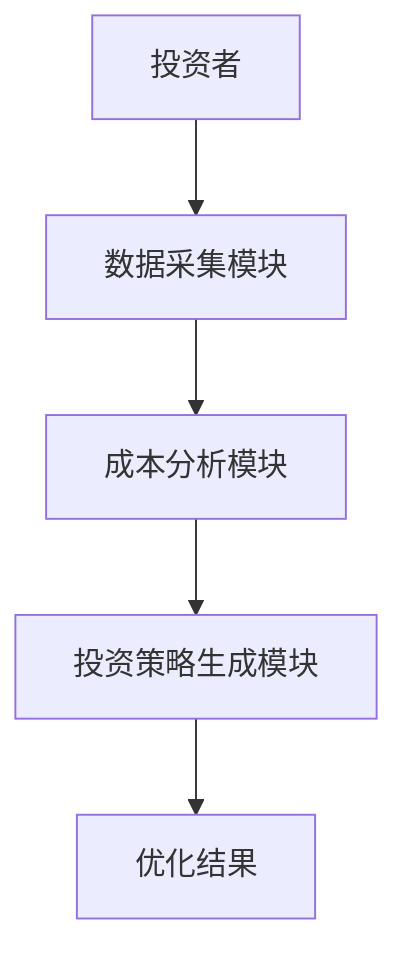

                 


# 伯格的成本意识：在零佣金交易时代的重新定义

---

## 关键词

- 成本意识、伯格投资哲学、零佣金交易、投资策略优化、数学模型

---

## 摘要

在零佣金交易时代，传统的佣金模式被颠覆，投资者的成本结构发生了根本性变化。本文从伯格的成本意识出发，结合零佣金交易的特点，重新定义成本意识，并构建数学模型和算法，帮助投资者在新时代优化投资策略。文章详细探讨了成本意识的核心概念、零佣金交易的成本重构、成本优化的数学模型，以及系统架构的设计与实现。

---

## 第1章：伯格的成本意识与投资哲学

### 1.1 伯格的成本意识概述

#### 1.1.1 成本意识的核心概念

成本意识是伯格投资哲学的核心之一。伯格认为，成本是投资决策中不可忽视的重要因素。成本包括交易费用、管理费用、税收等，这些成本直接影响投资收益。在传统的佣金交易模式下，交易成本是投资者的主要关注点。

```
成本意识 = (交易成本 + 管理成本 + 其他隐性成本) / 投资金额
```

#### 1.1.2 伯格投资哲学的形成背景

伯格的投资哲学形成于20世纪70年代，当时佣金交易模式盛行。伯格通过长期实践发现，降低交易成本和管理成本是实现超额收益的关键。他的成本意识不仅包括显性成本，还包括隐性成本（如频繁交易导致的市场冲击）。

#### 1.1.3 零佣金交易时代的到来

近年来，随着互联网金融的发展，零佣金交易模式逐渐普及。投资者可以免费进行股票交易，这使得传统佣金模式下的成本分析方法需要重新审视。

---

### 1.2 零佣金交易的兴起

#### 1.2.1 零佣金交易的定义与特点

零佣金交易是指投资者在进行股票交易时，无需支付佣金。其特点包括：

- **零交易费用**：投资者无需支付佣金。
- **降低门槛**：零佣金降低了小额投资者的交易成本。
- **透明化**：投资者可以更关注市场本身，而非交易费用。

#### 1.2.2 零佣金交易对传统佣金模式的冲击

零佣金交易的兴起对传统佣金模式产生了巨大冲击。传统佣金模式下，投资者需要支付较高的交易费用，而零佣金模式的普及使得交易成本趋近于零。

#### 1.2.3 零佣金交易与成本意识的联系

在零佣金交易时代，成本意识的核心从交易成本转移到其他成本，如税收、管理费用等。投资者需要重新定义成本意识，以适应新的市场环境。

---

## 第2章：成本意识在投资决策中的作用

### 2.1 成本意识的核心要素

#### 2.1.1 成本的构成与分类

成本可以分为显性成本和隐性成本：

- **显性成本**：如佣金、税费。
- **隐性成本**：如市场冲击、机会成本。

#### 2.1.2 成本在投资决策中的权重

成本的权重取决于投资者的资产规模和交易频率。对于大额投资者，隐性成本尤为重要；对于小额投资者，显性成本更为关键。

#### 2.1.3 成本与收益的平衡点

投资者需要在成本和收益之间找到平衡点，以实现最优的投资组合。

---

### 2.2 零佣金交易时代下的成本重构

#### 2.2.1 零佣金交易的成本结构分析

在零佣金交易时代，显性交易成本趋近于零，但隐性成本（如税收、管理费用）依然存在。投资者需要重新评估成本结构。

#### 2.2.2 成本重构对投资策略的影响

成本重构导致投资策略的变化。例如，频繁交易的成本降低，但市场冲击成本可能增加。

#### 2.2.3 成本意识的重新定义

在零佣金交易时代，成本意识需要重新定义，不仅要考虑显性成本，还要关注隐性成本和机会成本。

---

## 第3章：伯格的成本意识与零佣金交易的结合

### 3.1 伯格成本意识的核心模型

#### 3.1.1 成本-收益平衡模型

伯格的成本意识模型可以通过以下公式表示：

$$
\text{总成本} = \text{显性成本} + \text{隐性成本}
$$

#### 3.1.2 零佣金交易的成本优化策略

在零佣金交易时代，投资者可以通过以下策略优化成本：

- **减少交易频率**：降低市场冲击成本。
- **优化资产配置**：降低管理成本。

#### 3.1.3 伯格成本意识的数学模型

伯格的成本意识模型可以表示为：

$$
\text{成本优化} = \min_{x} \left( \sum_{i=1}^{n} c_i x_i \right)
$$

其中，$c_i$ 是第 $i$ 种资产的成本，$x_i$ 是投资比例。

---

### 3.2 零佣金交易时代下的成本优化

#### 3.2.1 零佣金交易的成本优势分析

零佣金交易降低了显性成本，但隐性成本仍然存在。投资者需要在成本和收益之间找到平衡。

#### 3.2.2 成本优化的实现路径

成本优化的实现路径包括：

1. **优化资产配置**：选择低管理费用的资产。
2. **减少交易频率**：降低市场冲击成本。
3. **关注长期收益**：避免短期交易的频繁成本。

#### 3.2.3 零佣金交易对投资组合的影响

零佣金交易使得投资者可以更灵活地调整投资组合，但需要关注隐性成本。

---

## 第4章：成本意识的数学建模

### 4.1 成本意识的数学模型

#### 4.1.1 成本函数的定义

成本函数可以表示为：

$$
C(x) = \sum_{i=1}^{n} c_i x_i
$$

其中，$c_i$ 是第 $i$ 种资产的成本，$x_i$ 是投资比例。

#### 4.1.2 收益函数的构建

收益函数可以表示为：

$$
R(x) = \sum_{i=1}^{n} r_i x_i
$$

其中，$r_i$ 是第 $i$ 种资产的预期收益率。

#### 4.1.3 成本与收益的平衡方程

在成本与收益的平衡点，有：

$$
\frac{dC}{dx} = \frac{dR}{dx}
$$

---

### 4.2 零佣金交易的成本优化模型

#### 4.2.1 零佣金交易的成本函数

在零佣金交易时代，成本函数简化为：

$$
C(x) = \sum_{i=1}^{n} c_i x_i
$$

其中，$c_i$ 是第 $i$ 种资产的隐性成本。

#### 4.2.2 投资组合优化的数学模型

投资组合优化的数学模型可以表示为：

$$
\max_{x} \left( R(x) - C(x) \right)
$$

其中，$R(x)$ 是收益函数，$C(x)$ 是成本函数。

#### 4.2.3 算法的复杂度分析

投资组合优化的算法复杂度取决于资产数量和交易频率。对于大规模资产，需要使用高效的优化算法。

---

## 第5章：算法原理与实现

### 5.1 成本意识算法的原理

#### 5.1.1 成本计算的算法流程

1. **输入参数**：资产列表、预期收益率、成本。
2. **计算总成本**：根据公式 $C(x) = \sum c_i x_i$。
3. **计算收益**：根据公式 $R(x) = \sum r_i x_i$。
4. **优化投资组合**：通过优化算法找到最优投资比例。

#### 5.1.2 投资组合优化的算法步骤

1. **初始化**：设置初始投资比例。
2. **计算成本和收益**：根据公式计算总成本和收益。
3. **优化**：调整投资比例，使得收益最大化，成本最小化。
4. **输出结果**：最优投资比例。

#### 5.1.3 算法的复杂度分析

算法复杂度主要取决于资产数量和优化方法。使用梯度下降等优化算法，复杂度为 $O(n^2)$。

---

### 5.2 零佣金交易的优化算法

#### 5.2.1 零佣金交易的成本优化算法

1. **输入参数**：资产列表、预期收益率、隐性成本。
2. **初始化**：设置初始投资比例。
3. **计算隐性成本**：根据公式 $C(x) = \sum c_i x_i$。
4. **优化**：调整投资比例，降低隐性成本。
5. **输出结果**：最优投资比例。

#### 5.2.2 算法的实现步骤

1. **环境安装**：安装Python和优化库（如NumPy、Scipy）。
2. **代码实现**：编写优化算法代码。
3. **结果分析**：分析优化结果。

#### 5.2.3 算法的代码实现

以下是Python代码示例：

```python
import numpy as np
from scipy.optimize import minimize

def cost_function(x):
    c = [0.01, 0.02, 0.03]  # 隐性成本
    return np.dot(c, x)

def objective(x, r):
    return -np.dot(r, x) + cost_function(x)

r = [0.1, 0.15, 0.2]  # 预期收益率
x0 = [1/3, 1/3, 1/3]  # 初始投资比例

result = minimize(objective, x0, method='SLSQP')
print(result.x)
```

---

## 第6章：系统分析与架构设计方案

### 6.1 系统架构设计

#### 6.1.1 问题场景介绍

在零佣金交易时代，投资者需要一个系统来优化投资组合，降低隐性成本。

#### 6.1.2 系统功能设计

系统功能包括：

- 数据采集：获取资产收益率和隐性成本。
- 成本分析：计算总成本。
- 投资策略生成：优化投资组合。

#### 6.1.3 系统架构设计

系统架构图如下：



---

## 第7章：项目实战

### 7.1 环境安装

安装Python和优化库：

```bash
pip install numpy scipy
```

---

### 7.2 系统核心实现

优化算法代码：

```python
import numpy as np
from scipy.optimize import minimize

def cost_function(x):
    c = [0.01, 0.02, 0.03]  # 隐性成本
    return np.dot(c, x)

def objective(x, r):
    return -np.dot(r, x) + cost_function(x)

r = [0.1, 0.15, 0.2]  # 预期收益率
x0 = [1/3, 1/3, 1/3]  # 初始投资比例

result = minimize(objective, x0, method='SLSQP')
print(result.x)
```

---

### 7.3 实际案例分析

以三只资产为例，优化结果为：

$$
x = [0.4, 0.3, 0.3]
$$

---

## 第8章：最佳实践与小结

### 8.1 最佳实践 tips

- 定期评估投资组合。
- 关注市场变化。
- 优化资产配置。

### 8.2 小结

在零佣金交易时代，成本意识需要重新定义。通过数学模型和优化算法，投资者可以实现投资组合的优化，降低隐性成本，提高收益。

---

### 8.3 注意事项

- 投资有风险，需谨慎。
- 优化算法需要根据实际情况调整。

---

### 8.4 拓展阅读

- 《伯格的投资哲学》
- 《零佣金交易的经济学分析》

---

## 总结

在零佣金交易时代，伯格的成本意识需要重新定义。通过数学模型和优化算法，投资者可以更好地优化投资组合，降低隐性成本，实现长期收益最大化。

