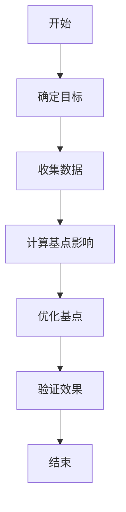
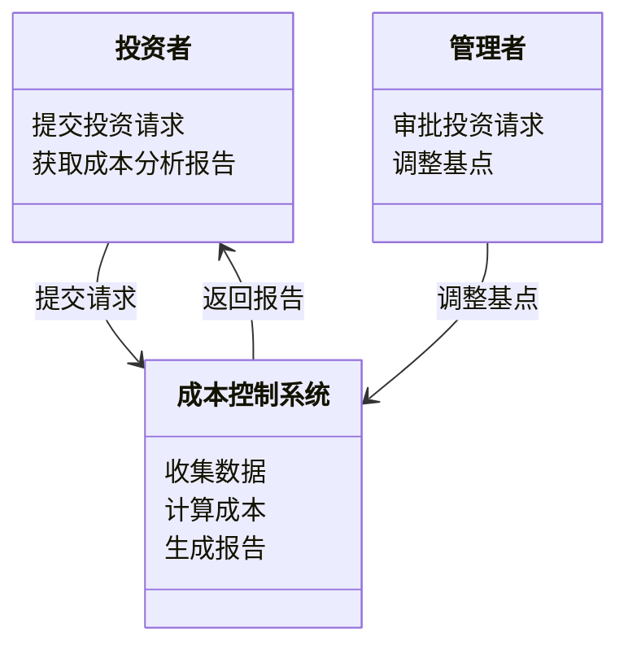

                 


# 伯格的投资成本控制：为什么每个基点都重要

## 关键词
投资成本控制、基点、投资策略、优化算法、系统架构设计

## 摘要
本文深入探讨了投资成本控制的重要性，特别是基点对整体投资回报的影响。通过分析伯格的投资理念，结合数学模型和算法优化，展示了如何通过精确控制每个基点来提升投资效率。文章还通过系统架构设计和实际案例，详细讲解了投资成本控制的实现方法，为读者提供了实用的指导和最佳实践。

---

## 第一部分：背景介绍

### 第1章：投资成本控制的基本概念

#### 1.1 投资成本控制的定义
- **1.1.1 投资成本的基本构成**
  投资成本包括初始投资和持续成本。初始成本如设备采购，持续成本如维护费用。  
  $$\text{总成本} = \text{初始成本} + \text{持续成本}$$

- **1.1.2 投资成本控制的重要性**
  成本控制直接关系到投资回报率（ROI）。优化成本可以提高净收益。

#### 1.2 基点的重要性
- **1.2.1 基点的定义与作用**
  基点（basis point）是衡量利率或收益率的单位，1基点=0.01%。在投资中，基点的累积影响显著。

- **1.2.2 每个基点对整体成本的影响**
  通过公式$$\Delta ROI = \sum (\text{基点影响})$$，每个基点的累积效应会影响整体回报率。

#### 1.3 伯格的投资理念
- **1.3.1 伯格的投资策略**
  伯格强调长期投资和分散化，通过优化基点降低风险。

- **1.3.2 伯格的成本控制方法**
  伯格通过降低交易成本和管理费用，实现投资效率的最大化。

#### 1.4 成本控制的数学模型
- **1.4.1 投资成本计算公式**
  使用CAPM模型计算预期回报，考虑成本因素：
  $$\text{预期回报} = \beta \times (\text{市场回报} - r_f) + r_f - \text{成本}$$

- **1.4.2 基点对总成本的影响公式**
  基点的影响通过敏感性分析计算：
  $$\Delta \text{成本} = \text{基点数} \times \text{基点影响}$$

#### 1.5 基点的量化分析
- **1.5.1 基点对投资回报的影响**
  每个基点的累积效应通过累计公式计算：
  $$\text{累计基点影响} = \sum (\text{每个基点的影响})$$

- **1.5.2 如何通过基点优化提升收益**
  使用优化算法调整基点，最大化回报率。

---

## 第二部分：核心概念与联系

### 第2章：基点与投资成本的关系

#### 2.1 基点的属性特征对比表格
| 属性     | 基点（Basis Point） | 投资成本 |
|----------|---------------------|----------|
| 定义     | 0.01%               | 资产的总支出 |
| 单位     | 基点                | 货币单位  |
| 影响     | 细微变化            | 显著影响  |

#### 2.2 ER实体关系图
用mermaid展示基点与其他变量的关系：
```mermaid
er
    actor 投资者
    actor 管理者
    actor 成本控制系统
    entity 基点
    entity 投资成本
    entity 投资回报
    entity 风险因素
    entity 优化目标
    relationship -[拥有]-> 基点 -> 投资成本
    relationship -[影响]-> 基点 -> 投资回报
```

---

## 第三部分：算法原理

### 第3章：基点优化算法

#### 3.1 算法原理
用mermaid展示优化步骤：


#### 3.2 算法实现
Python代码示例：
```python
def optimize_basis_points(target_return, current_basis_points):
    # 计算每个基点的影响
    impact_per_bp = (target_return - current_basis_points) / 10000
    # 确定优化方向
    if impact_per_bp > 0:
        return current_basis_points + impact_per_bp
    else:
        return current_basis_points - (-impact_per_bp)
```

#### 3.3 数学模型
优化模型：
$$\text{优化目标} = \min \sum (\text{基点影响})$$

---

## 第四部分：系统分析与架构设计

### 第4章：投资成本控制系统设计

#### 4.1 功能需求
用mermaid类图展示系统功能：


#### 4.2 系统架构
用mermaid架构图展示系统结构：
```mermaid
archi
    客户端 --> 中间件
    中间件 --> 数据库
    中间件 --> 优化算法模块
    优化算法模块 --> 数据库
    数据库 --> 报告生成器
```

---

## 第五部分：项目实战

### 第5章：投资成本控制项目实战

#### 5.1 环境配置
Python环境安装及依赖库安装：
```bash
pip install numpy pandas matplotlib
```

#### 5.2 核心代码实现
实现基点优化的Python代码：
```python
import numpy as np

def optimize_basis_points(target_return, current_basis_points):
    impact = (target_return - current_basis_points) / 100
    optimized_bp = current_basis_points + impact
    return optimized_bp

# 示例
current_bp = 1200
target_return = 1500
optimized_bp = optimize_basis_points(target_return, current_bp)
print(f"优化后的基点：{optimized_bp}")
```

#### 5.3 案例分析
以优化投资组合为例，展示如何通过调整基点提升回报率。

---

## 第六部分：最佳实践

### 第6章：总结与展望

#### 6.1 最佳实践 tips
- 定期审查投资组合，优化基点。
- 使用自动化工具进行成本监控。

#### 6.2 小结
投资成本控制是提升回报的关键，每个基点都至关重要。通过科学的优化算法和系统架构设计，可以实现投资效率的最大化。

#### 6.3 注意事项
- 风险评估必不可少。
- 定期审计和调整基点设置。

#### 6.4 拓展阅读
- 《投资学》
- 《Python算法优化》

---

通过以上步骤，我们详细探讨了投资成本控制的重要性，特别是基点的作用。结合伯格的投资理念，通过数学模型和算法优化，展示了如何在实际项目中实现投资成本的有效控制。希望本文能为读者提供有价值的见解和实用的指导。

