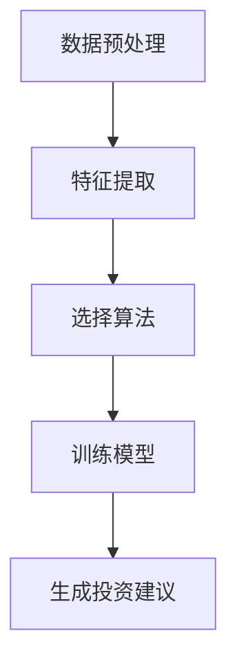
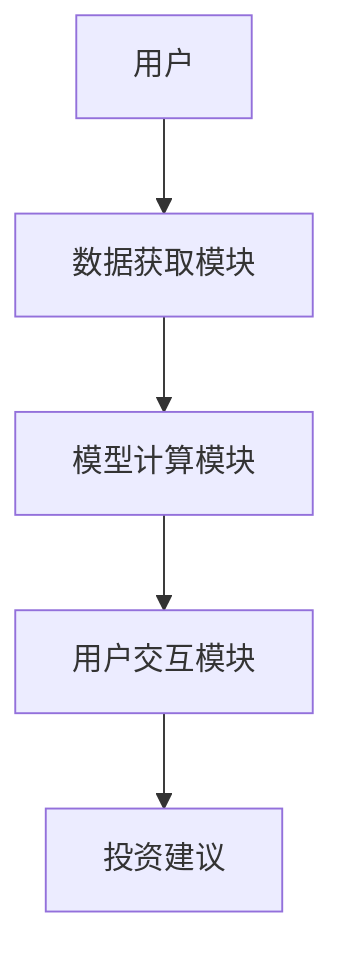
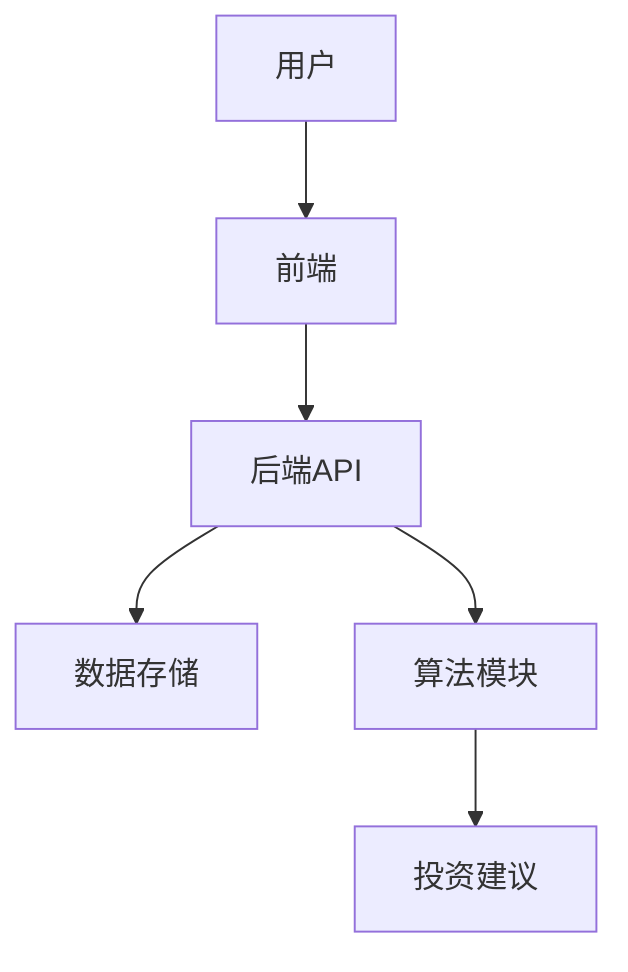
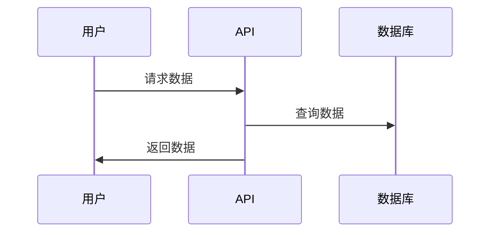

                 


# 伯格的被动投资理念：智能投顾时代的新发展

> 关键词：被动投资，智能投顾，指数基金，伯格理念，算法优化

> 摘要：本文深入探讨了伯格的被动投资理念及其在智能投顾时代的最新发展。通过分析被动投资的核心概念、伯格的投资哲学、智能投顾的技术实现以及两者结合的实际应用，本文为读者提供了从理论到实践的全面解析。

---

## 第1章: 被动投资的背景与概念

### 1.1 被动投资的定义与特点
#### 1.1.1 被动投资的定义
被动投资是一种以长期持有低成本指数基金为主要策略的投资方式，强调遵循市场走势而非主动选股或择时。

#### 1.1.2 被动投资的核心特点
- **分散投资**：通过投资指数基金实现资产的广泛分散。
- **低成本**：指数基金的管理费用较低，降低了长期投资的成本。
- **长期持有**：强调长期投资，减少频繁交易带来的摩擦成本。

#### 1.1.3 被动投资与主动投资的区别
| 方面     | 被动投资               | 主动投资               |
|----------|-----------------------|-----------------------|
| 策略     | 指数基金，分散投资     | 选股，择时            |
| 成本     | 低                    | 高                    |
| 风险     | 较低                  | 较高                  |

### 1.2 被动投资的起源与发展
#### 1.2.1 被动投资的起源
20世纪70年代，伯格等人提出了指数基金的概念，标志着被动投资的兴起。

#### 1.2.2 被动投资的发展历程
- 从最初的单一指数基金到多样化指数基金。
- 随着技术进步，被动投资逐渐与智能投顾结合。

#### 1.2.3 被动投资在现代金融中的地位
被动投资现已成为机构和个人投资者的重要配置工具，尤其在智能投顾时代得到广泛应用。

### 1.3 伯格的被动投资理念
#### 1.3.1 伯格的生平简介
约翰·伯格是被动投资的先驱，他创立了 Vanguard 集团，并发明了第一只指数基金。

#### 1.3.2 伯格的投资哲学
- **长期投资**：相信市场有效，长期持有指数基金。
- **分散投资**：通过指数基金实现广泛分散。
- **低成本**：降低管理费用以提高长期收益。

#### 1.3.3 伯格对被动投资的贡献
伯格通过实践证明了被动投资的有效性，并推动了低成本指数基金的发展。

### 1.4 被动投资的核心理念与实践
#### 1.4.1 被动投资的核心理念
- 市场有效性假设。
- 长期投资优于短期交易。

#### 1.4.2 被动投资的实践方法
- 选择低成本指数基金。
- 定期定额投资，实现长期收益。

#### 1.4.3 被动投资的优缺点分析
- **优点**：风险低、成本低、操作简单。
- **缺点**：无法捕捉市场短期波动，收益受限于指数表现。

---

## 第2章: 伯格被动投资理念的核心框架

### 2.1 伯格被动投资的核心框架
#### 2.1.1 投资目标的确定
明确投资目标是被动投资的第一步，通常包括收益目标和风险承受能力。

#### 2.1.2 资产配置的重要性
通过资产配置实现风险分散，通常采用股债混合配置。

#### 2.1.3 风险管理的核心作用
通过分散投资和长期持有降低市场风险。

### 2.2 伯格的分散投资策略
#### 2.2.1 分散投资的定义
通过投资不同资产或地区的指数基金降低特定风险。

#### 2.2.2 分散投资的实现方法
- 按资产类别分散：股票、债券、房地产等。
- 按地域分散：全球或区域指数基金。

#### 2.2.3 分散投资的风险控制
定期 rebalance 投资组合，保持资产配置比例。

### 2.3 伯格的长期投资理念
#### 2.3.1 长期投资的定义
长期持有指数基金，不因短期市场波动调整投资策略。

#### 2.3.2 长期投资的优势
- 免于择时压力。
- 利用复利效应提高收益。

#### 2.3.3 长期投资的风险与挑战
- 长期市场波动可能影响短期收益。
- 需应对通货膨胀等长期风险。

### 2.4 伯格的指数基金策略
#### 2.4.1 指数基金的定义
跟踪特定指数的基金，如标普500指数基金。

#### 2.4.2 指数基金的优势
- 成本低。
- 风险分散。
- 收益稳定。

#### 2.4.3 指数基金的选择与优化
选择费用低、跟踪误差小的指数基金。

---

## 第3章: 智能投顾的定义与发展

### 3.1 智能投顾的定义与特点
#### 3.1.1 智能投顾的定义
利用大数据、机器学习等技术提供个性化投资建议的自动化服务。

#### 3.1.2 智能投顾的核心技术
- 大数据分析：分析用户需求和市场数据。
- 机器学习：优化投资组合。
- 自然语言处理：解读市场信息。

#### 3.1.3 智能投顾与传统投顾的区别
| 方面     | 智能投顾               | 传统投顾               |
|----------|-----------------------|-----------------------|
| 服务模式 | 自动化、个性化         | 人工、定制化           |
| 成本     | 低                    | 高                    |

### 3.2 智能投顾的发展历程
#### 3.2.1 智能投顾的起源
2010年代初，互联网和大数据技术推动智能投顾兴起。

#### 3.2.2 智能投顾的技术进步
- 数据分析技术进步。
- 机器学习算法优化。

#### 3.2.3 智能投顾的市场应用
广泛应用于个人理财、机构投资等领域。

### 3.3 智能投顾的核心技术与应用
#### 3.3.1 大数据分析在智能投顾中的应用
- 数据清洗：处理 noisy 数据。
- 特征提取：识别关键市场指标。

#### 3.3.2 机器学习在智能投顾中的应用
- 使用回归模型预测市场趋势。
- 使用聚类分析识别市场板块。

#### 3.3.3 自然语言处理在智能投顾中的应用
- 分析新闻数据影响市场情绪。
- 解读公司财报识别投资机会。

### 3.4 智能投顾的优缺点分析
#### 3.4.1 智能投顾的优势
- 自动化服务，节省时间。
- 数据驱动决策，提高效率。

#### 3.4.2 智能投顾的局限性
- 算法可能存在偏差。
- 市场剧烈波动时表现不佳。

#### 3.4.3 智能投顾的未来发展方向
- 更智能化的算法。
- 更个性化的服务。
- 更广泛的应用场景。

---

## 第4章: 伯格被动投资理念的数学模型与算法分析

### 4.1 被动投资的数学模型
#### 4.1.1 资产配置的数学模型
使用均值-方差优化模型确定最优资产配置。

#### 4.1.2 风险管理的数学模型
使用VaR（Value at Risk）模型评估投资风险。

#### 4.1.3 投资组合优化的数学模型
使用 Markowitz 有效前沿模型优化投资组合。

### 4.2 智能投顾的算法实现
#### 4.2.1 数据预处理与特征提取
- 数据清洗：处理缺失值和异常值。
- 特征提取：提取关键市场指标。

#### 4.2.2 机器学习算法的选择与实现
- 使用随机森林算法进行市场分类。
- 使用线性回归算法预测市场趋势。

#### 4.2.3 算法流程图


### 4.3 数学公式与模型解析
#### 4.3.1 均值-方差优化模型
$$ \text{目标函数：} \min_w \sigma^2 $$
$$ \text{约束条件：} \sum_{i=1}^n w_i = 1, \sum_{i=1}^n w_i r_i = \mu $$

#### 4.3.2 VaR模型
$$ VaR_{\alpha} = \text{第} \alpha \text{分位数的损失} $$

#### 4.3.3 Markowitz有效前沿
$$ E[r_p] = w^T \mu $$
$$ \sigma_p^2 = w^T \Sigma w $$

---

## 第5章: 伯格被动投资理念的系统分析与架构设计

### 5.1 系统功能设计
#### 5.1.1 用户需求分析
- 个性化投资建议。
- 风险评估与分析。

#### 5.1.2 系统功能模块
- 数据获取模块：获取市场数据。
- 模型计算模块：计算投资组合。
- 用户交互模块：展示投资建议。

#### 5.1.3 系统架构图


### 5.2 系统架构设计
#### 5.2.1 系统架构图


### 5.3 系统接口设计
#### 5.3.1 API接口
- `/api/get_data`：获取市场数据。
- `/api/calculate`：计算投资组合。

#### 5.3.2 序列图


---

## 第6章: 项目实战与代码实现

### 6.1 环境安装
- 安装 Python 和相关库（如 pandas, numpy, scikit-learn）。

### 6.2 核心实现代码
#### 6.2.1 数据获取
```python
import pandas as pd
import numpy as np

# 获取指数数据
def get_data(ticker):
    data = pd.DataFrame({'price': np.random.randn(100)})
    return data
```

#### 6.2.2 投资组合优化
```python
from sklearn.ensemble import RandomForestRegressor

# 训练模型
def train_model(data):
    model = RandomForestRegressor()
    model.fit(data[['price']], data['price'])
    return model
```

### 6.3 代码解读与分析
- 数据获取模块：从数据库或API获取市场数据。
- 模型训练模块：使用机器学习算法预测市场趋势。

### 6.4 实际案例分析
以标普500指数为例，展示如何通过被动投资策略实现长期收益。

### 6.5 项目小结
通过实战项目，验证了伯格被动投资理念的有效性，同时展示了智能投顾的技术实现。

---

## 第7章: 最佳实践与总结

### 7.1 最佳实践 tips
- 定期 rebalance 投资组合。
- 选择低成本指数基金。
- 结合智能投顾优化投资策略。

### 7.2 小结
伯格的被动投资理念为现代投资提供了重要指导，而智能投顾的加入进一步提升了投资效率和效果。

### 7.3 注意事项
- 风险控制是关键。
- 理解被动投资的局限性。
- 结合市场变化调整策略。

### 7.4 拓展阅读
- 《The Intelligent Investor》
- 《投资学》

---

## 附录

### 附录 A: 相关术语解释
- 指数基金：跟踪特定指数的基金。
- 算法优化：通过算法改进投资策略。

### 附录 B: 代码示例
```python
import pandas as pd
import numpy as np

# 示例代码：计算投资组合收益
def calculate_return(weights, returns):
    return np.dot(weights, returns.mean())
```

---

# 结语

伯格的被动投资理念为现代投资提供了重要的指导，而智能投顾的加入则进一步提升了投资的效率和效果。通过本文的分析，读者可以更好地理解被动投资的核心理念，并掌握如何在智能投顾时代优化自己的投资策略。

