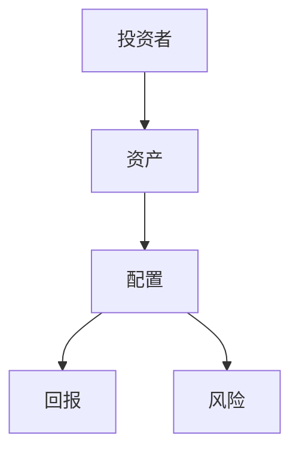
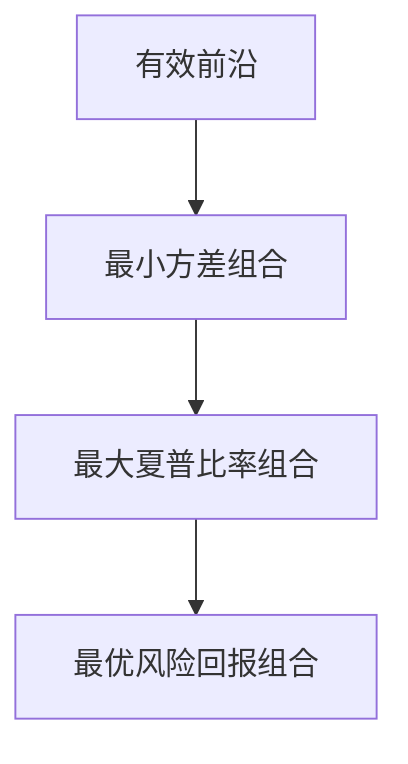
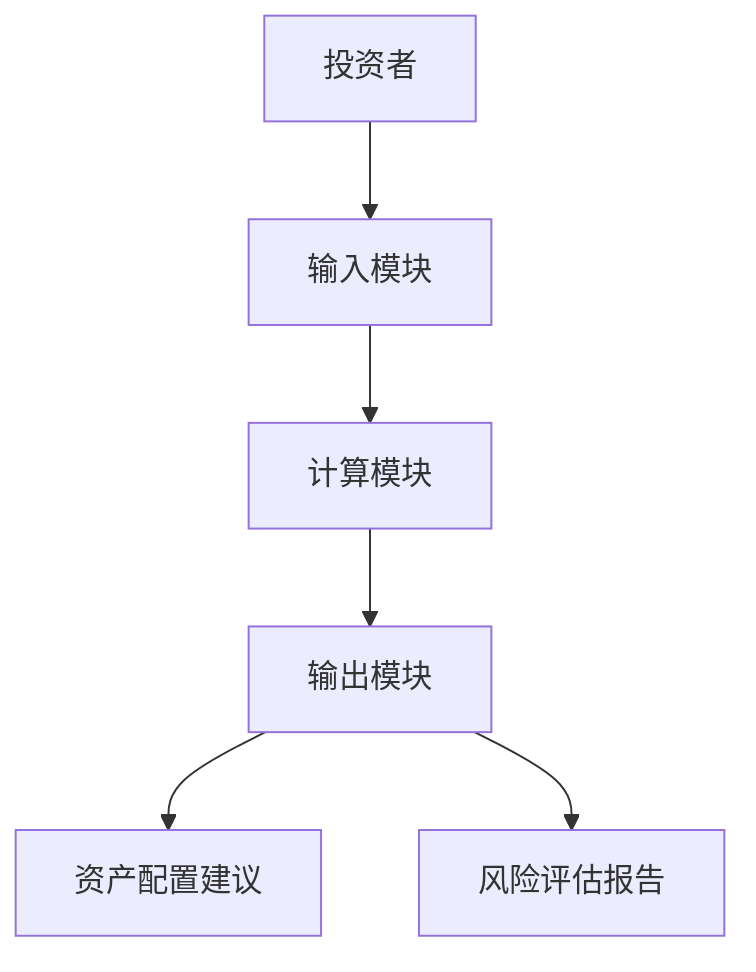
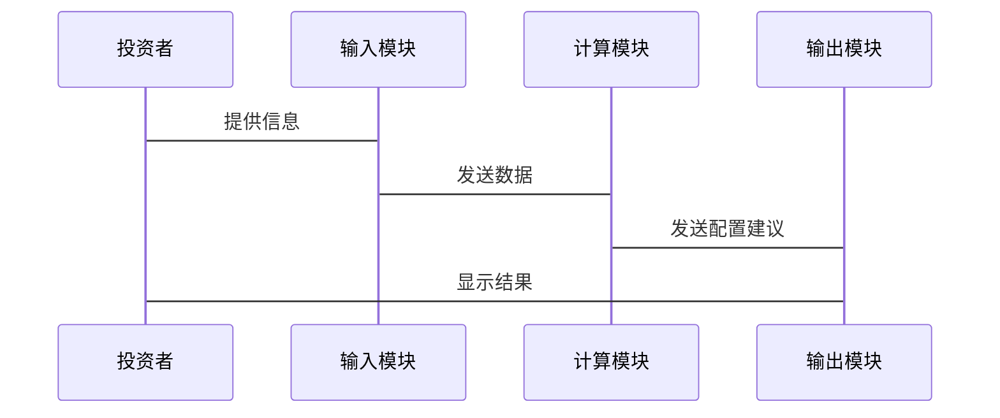

                 


# 伯格的资产配置理论：平衡风险与回报

## 关键词：资产配置，投资策略，风险控制，指数基金，现代投资组合理论

## 摘要：  
伯格的资产配置理论是投资领域的重要理论，强调通过科学的资产分配来平衡风险与回报。本文从理论基础、系统架构、实战案例等多维度详细解析伯格的资产配置理念，帮助读者掌握如何通过合理配置资产实现稳健投资回报。

---

# 第一部分: 资产配置的背景与概述

## 第1章: 资产配置的背景与重要性

### 1.1 资产配置的基本概念

#### 1.1.1 资产配置的定义
资产配置是指将资金分配到不同资产类别（如股票、债券、房地产等）以实现投资目标的过程。它强调分散投资以降低风险，同时最大化潜在回报。

#### 1.1.2 资产配置的重要性
- **风险分散**：通过将资金分配到不同资产类别，降低单一资产波动带来的风险。
- **回报优化**：合理配置资产能平衡风险与回报，避免过度投资单一市场或资产类别。

#### 1.1.3 资产配置的核心要素
- **投资目标**：明确投资者的财务目标和风险承受能力。
- **资产类别**：选择适合的资产类别，如股票、债券、现金等。
- **权重分配**：确定每类资产的分配比例。

### 1.2 伯格的生平与投资理念

#### 1.2.1 伯格的生平简介
约翰·伯格（John Bogle）是投资界的传奇人物， Vanguard 集团的创始人，被誉为“指数基金之父”。他提倡长期投资和低成本投资策略。

#### 1.2.2 伯格的投资哲学
- **长期投资**：避免频繁交易，降低费用和税务负担。
- **分散投资**：通过指数基金实现广泛分散，降低特定资产的风险。
- **成本控制**：强调低成本投资，避免高额管理费用。

#### 1.2.3 伯格与指数基金的关联
伯格创立了第一只指数基金，证明了指数基金能够长期跑赢主动管理基金，成为投资者的首选工具。

### 1.3 资产配置的背景与问题背景

#### 1.3.1 投资者面临的风险与回报的平衡问题
- **市场风险**：资产价格波动对投资组合的影响。
- **流动性风险**：资产在需要时难以变现的风险。
- **通胀风险**：通货膨胀对资产实际回报的影响。

#### 1.3.2 资产配置在投资组合中的作用
- **风险分散**：通过资产多样化降低投资组合的整体风险。
- **回报优化**：合理配置资产能够平衡风险与回报，提高整体收益。

#### 1.3.3 资产配置的边界与外延
- **边界**：根据投资者的风险承受能力和目标确定的资产分配比例。
- **外延**：资产配置不仅涉及金融资产，还包括房地产、艺术品等另类资产。

### 1.4 资产配置的核心概念结构

#### 1.4.1 核心概念的组成要素
- **投资者需求**：风险承受能力、投资目标、时间 horizon。
- **资产类别**：股票、债券、现金、房地产等。
- **配置比例**：每类资产的权重分配。

#### 1.4.2 核心概念的属性特征对比表

| 属性      | 特征描述                          |
|-----------|----------------------------------|
| 风险等级   | 高风险（股票）、中风险（债券）、低风险（现金） |
| 流动性     | 高流动性（现金）、低流动性（房地产）         |
| 预期回报   | 高回报（股票）、稳定回报（债券）             |

#### 1.4.3 ER实体关系图（使用 Mermaid 流程图）



### 1.5 本章小结
本章介绍了资产配置的基本概念、伯格的投资理念及其在投资组合中的作用。通过明确资产配置的核心要素和结构，为后续的理论分析和系统设计奠定了基础。

---

## 第2章: 现代投资组合理论

### 2.1 现代投资组合理论概述

#### 2.1.1 投资组合理论的起源
现代投资组合理论（MPT）由哈里·马科维茨在1952年提出，强调通过分散投资降低风险。

#### 2.1.2 投资组合理论的核心假设
- 投资者是理性的，追求效用最大化。
- 资产收益服从单变量分布。
- 资产之间存在相关性。

#### 2.1.3 投资组合理论的数学模型
马科维茨的理论基于均值-方差优化，目标是找到风险最小化且回报最大化或反之。

$$ \text{目标函数：} \min \sigma^2 \quad \text{在} \quad E(r) \geq \text{目标回报} $$

### 2.2 有效前沿与风险调整回报

#### 2.2.1 有效前沿的定义与特点
有效前沿是所有最优投资组合的集合，代表在给定风险下收益最高，或在给定收益下风险最低。

#### 2.2.2 风险调整回报的计算公式
夏普比率用于衡量风险调整后的回报：

$$ \text{夏普比率} = \frac{E(r_i) - r_f}{\sigma_i} $$

#### 2.2.3 有效前沿的图形化展示（使用 Mermaid 流程图）



### 2.3 风险与回报的平衡

#### 2.3.1 风险与回报的关系
资产的风险与回报呈正相关，但高风险不一定带来高回报。

#### 2.3.2 风险调整后的回报计算
通过夏普比率等指标衡量风险调整后的回报。

#### 2.3.3 风险与回报的平衡点确定
根据投资者的风险偏好确定最优资产配置。

### 2.4 资产定价模型

#### 2.4.1 CAPM 模型的介绍
CAPM（资本资产定价模型）用于计算资产的预期回报。

$$ E(r_i) = r_f + \beta_i (E(r_m) - r_f) $$

#### 2.4.2 CAPM 模型的公式推导
CAPM 假设市场是有效的，投资者可以通过分散投资消除非系统性风险。

#### 2.4.3 CAPM 模型的实际应用
计算单个资产的预期回报，用于资产定价和配置。

### 2.5 本章小结
本章详细讲解了现代投资组合理论，包括有效前沿、风险调整回报和资产定价模型，为伯格的资产配置理论提供了理论基础。

---

## 第3章: 伯格的资产配置策略

### 3.1 伯格的资产配置策略概述

#### 3.1.1 战略性资产配置
根据长期投资目标确定资产配置比例。

#### 3.1.2 战术性资产配置
根据市场变化短期调整资产配置。

#### 3.1.3 分散投资的重要性
通过广泛分散投资降低特定风险。

### 3.2 伯格的资产配置核心策略

#### 3.2.1 长期投资策略
避免频繁交易，降低费用和税务负担。

#### 3.2.2 成本控制策略
选择低成本投资工具，如指数基金。

#### 3.2.3 指数基金配置
通过指数基金实现广泛的市场分散。

### 3.3 资产配置的实施步骤

#### 3.3.1 确定投资目标
明确投资目标和风险承受能力。

#### 3.3.2 选择资产类别
根据目标选择适合的资产类别。

#### 3.3.3 确定配置比例
根据目标和风险偏好确定各资产的权重。

#### 3.3.4 定期再平衡
定期调整配置比例以维持目标。

### 3.4 伯格的资产配置案例分析

#### 3.4.1 案例背景
假设投资者有100万美元，风险承受能力中等。

#### 3.4.2 配置方案
- 股票：60%
- 债券：30%
- 现金：10%

#### 3.4.3 再平衡策略
每年根据市场变化调整各资产的权重。

### 3.5 本章小结
本章详细介绍了伯格的资产配置策略，包括长期投资、分散投资和成本控制，并通过案例展示了如何实施这些策略。

---

## 第4章: 系统分析与架构设计

### 4.1 系统分析

#### 4.1.1 问题场景介绍
投资者需要一个系统来帮助他们进行资产配置。

#### 4.1.2 需求分析
- 资产配置建议
- 风险评估
- 再平衡提醒

#### 4.1.3 功能设计
- 输入投资者信息
- 计算资产配置建议
- 提供风险评估报告

### 4.2 系统架构设计

#### 4.2.1 系统架构图（使用 Mermaid 流程图）



#### 4.2.2 系统功能模块
- 输入模块：收集投资者信息。
- 计算模块：根据算法生成配置建议。
- 输出模块：展示结果。

### 4.3 系统接口设计

#### 4.3.1 输入接口
用户输入资产规模、风险承受能力等信息。

#### 4.3.2 输出接口
显示资产配置建议和风险评估报告。

### 4.4 系统交互流程（使用 Mermaid 序列图）



### 4.5 本章小结
本章通过系统架构设计和交互流程图，展示了如何将伯格的资产配置理论应用于实际系统中。

---

## 第5章: 项目实战

### 5.1 项目实战环境安装

#### 5.1.1 系统要求
- 操作系统：Windows/Mac/Linux
- 开发工具：Python、Jupyter Notebook
- 库依赖：pandas, numpy, matplotlib

### 5.2 核心代码实现

#### 5.2.1 资产配置算法实现

```python
import pandas as pd
import numpy as np

def calculate_config(asset_return, asset_variance, target_return):
    # 使用优化算法计算资产配置
    pass
```

#### 5.2.2 风险评估模块

```python
def risk_assessment(config, market_data):
    # 计算投资组合的风险
    pass
```

### 5.3 案例分析

#### 5.3.1 案例背景
假设市场数据和投资者信息。

#### 5.3.2 实施步骤
- 数据准备
- 计算配置
- 风险评估
- 输出结果

### 5.4 项目小结
本章通过实际项目展示了如何应用伯格的资产配置理论进行投资组合管理。

---

## 第6章: 最佳实践与总结

### 6.1 最佳实践

#### 6.1.1 投资者建议
- 长期持有指数基金
- 定期再平衡投资组合
- 保持低成本投资

#### 6.1.2 风险管理
- 定期评估风险承受能力
- 了解市场波动
- 分散投资以降低风险

### 6.2 小结

#### 6.2.1 内容总结
本文详细讲解了伯格的资产配置理论，从理论基础到系统设计再到项目实战，帮助读者全面掌握该理论。

#### 6.2.2 投资建议
根据个人风险承受能力和目标进行资产配置，定期调整投资组合，保持长期投资。

### 6.3 注意事项

#### 6.3.1 风险提示
- 市场波动可能导致投资组合亏损
- 再平衡操作可能产生交易费用
- 通货膨胀会影响实际回报

#### 6.3.2 操作建议
- 定期审查投资组合
- 根据市场变化调整配置
- 选择低成本投资工具

### 6.4 拓展阅读

#### 6.4.1 推荐书籍
- 《The Intelligent Investor》
- 《The Theory of Investment Value》

#### 6.4.2 在线资源
- 网站：Vanguard Group
- 博客：Investment Insights

### 6.5 本章小结
本章总结了全书内容，提供了最佳实践建议，并推荐了进一步阅读的资源。

---

## 附录: 术语表

- 资产配置：将资金分配到不同资产类别的过程。
- 指数基金：跟踪市场指数的基金，分散投资降低风险。
- 夏普比率：衡量风险调整后的回报。

---

## 参考文献
1. Bogle, J. (1994). *The Intelligent Asset Allocator*.
2. Markowitz, H. (1952). Portfolio Selection.
3. Fama, E. F. (1970). Efficient Capital Markets: A Review of Theory and Practice.

---

# 结语
通过本文的详细讲解，读者可以全面理解伯格的资产配置理论，并将其应用于实际投资中。希望本文能帮助投资者实现风险与回报的平衡，实现稳健的投资回报。

