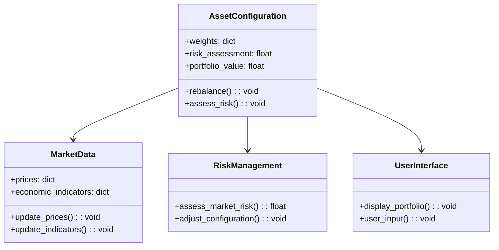
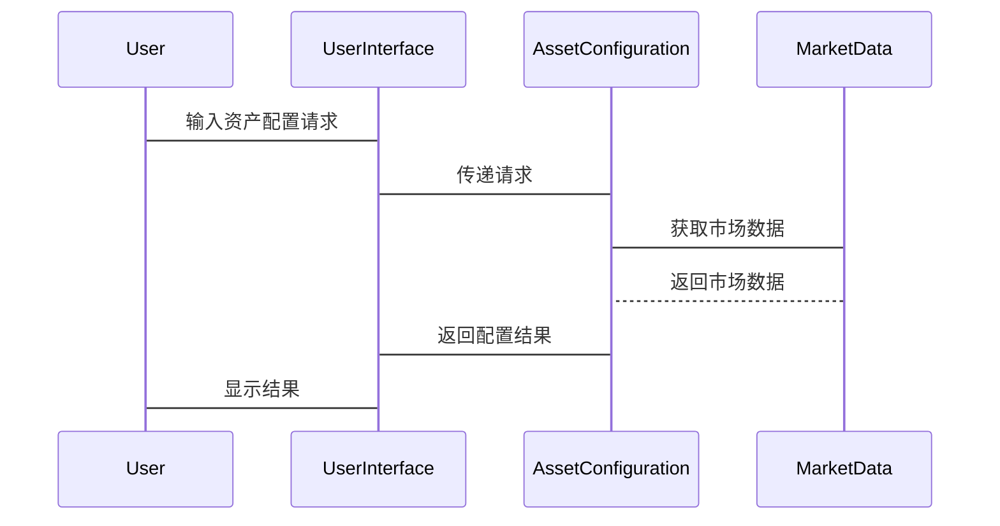

                 


---

# 伯格的资产配置理论：应对极端市场波动的策略

> **关键词**：伯格的资产配置理论、极端市场波动、风险管理、投资组合优化、动态资产配置、数学模型、投资策略

> **摘要**：本文深入探讨伯格的资产配置理论，分析其在应对极端市场波动中的策略。通过数学模型、实际案例和系统架构的详细讲解，阐述如何通过科学的资产配置实现投资组合的稳定与收益。本文结合技术分析和经济指标，提供应对市场波动的最佳实践和风险管理方法。

---

## 第1章: 资产配置理论概述

### 1.1 伯格的资产配置理论背景

#### 1.1.1 资产配置的定义与核心要素

资产配置是指将资金分配到不同资产类别（如股票、债券、现金等）中的过程，以实现投资目标。核心要素包括：

- **资产类别**：股票、债券、现金等。
- **风险偏好**：投资者对风险的承受能力。
- **投资期限**：资金的投资时间跨度。
- **市场预测**：对市场的预期。

伯格的资产配置理论强调通过科学的配置比例，分散风险并最大化收益。

#### 1.1.2 伯格理论的起源与发展

伯格（John Bogle）是指数基金之父，他提出的资产配置理论基于现代投资组合理论（MPT）。伯格认为，长期稳定的资产配置能够有效应对市场波动。

#### 1.1.3 资产配置在投资中的重要性

资产配置是投资组合管理的核心，直接影响投资收益和风险。合理的资产配置能够在不同市场环境下平衡收益与风险。

### 1.2 伯格理论的核心概念

#### 1.2.1 资产配置的基本原理

伯格的理论基于以下原则：

- **分散投资**：通过多样化投资降低风险。
- **长期持有**：避免频繁交易以减少成本。
- **定期再平衡**：根据市场变化调整配置比例。

#### 1.2.2 资产配置与投资组合管理的关系

资产配置是投资组合管理的基础，决定了组合的风险和收益特征。投资组合管理通过动态调整配置比例优化收益。

#### 1.2.3 伯格理论的独特性与创新点

伯格的理论强调低成本和长期持有，认为市场 timing 并不可靠，而通过分散投资和长期持有可以获得稳定收益。

### 1.3 伯格理论的数学模型与公式

#### 1.3.1 投资组合的数学表达

投资组合的收益可以表示为各资产收益的加权平均：

$$
E(R_p) = \sum_{i=1}^{n} w_i E(R_i)
$$

其中，$w_i$ 是第 $i$ 个资产的权重，$E(R_i)$ 是第 $i$ 个资产的期望收益。

#### 1.3.2 资产配置的优化模型

基于现代投资组合理论的优化模型：

$$
\text{Minimize } \sigma_p^2 \text{ subject to } \sum_{i=1}^{n} w_i = 1
$$

其中，$\sigma_p$ 是投资组合的波动率。

#### 1.3.3 风险与收益的数学关系

投资组合的收益与风险的关系可以通过夏普比率（Sharpe Ratio）衡量：

$$
\text{夏普比率} = \frac{E(R_p - R_f)}{\sigma_p}
$$

其中，$R_f$ 是无风险利率。

---

## 第2章: 资产配置的核心要素与原理

### 2.1 资产配置的分类与特点

#### 2.1.1 按资产类别划分的配置方式

- **股票**：成长股、价值股、指数基金。
- **债券**：国债、企业债、可转债。
- **现金**：活期存款、货币市场基金。

#### 2.1.2 按时间维度划分的配置策略

- **长期配置**：持有时间超过10年，注重资产增值。
- **中期配置**：持有时间3-10年，平衡收益与流动性。
- **短期配置**：持有时间不足3年，注重流动性。

#### 2.1.3 资产配置的灵活性与稳定性

灵活性资产（如股票）在市场波动中调整空间大，稳定性资产（如债券）在市场下跌时提供保护。

### 2.2 资产配置的优化方法

#### 2.2.1 均值-方差优化模型

通过优化算法找到收益与风险的最佳平衡点。

#### 2.2.2 风险平价配置策略

将风险分配到各资产类别，避免单一资产承担过多风险。

#### 2.2.3 基于现代投资组合理论的优化

通过数学模型优化投资组合的收益-风险比。

### 2.3 伯格理论中的资产配置权重分配

#### 2.3.1 长期资产配置的权重设定

- 股票：60%
- 债券：25%
- 现金：15%

#### 2.3.2 短期资产配置的动态调整

根据市场变化，动态调整各资产的权重，确保组合的风险和收益与市场环境相匹配。

#### 2.3.3 资产配置权重与市场周期的关系

在牛市中增加股票配置，在熊市中增加债券配置。

### 2.4 本章小结

---

## 第3章: 资产配置与风险管理

### 3.1 风险管理在资产配置中的作用

#### 3.1.1 风险的定义与分类

- **市场风险**：整体市场波动带来的风险。
- **流动性风险**：资产难以变现的风险。
- **信用风险**：债券发行人违约的风险。

#### 3.1.2 资产配置与风险控制的关系

资产配置是风险管理的核心，通过分散投资降低风险。

#### 3.1.3 伯格理论中的风险管理框架

- 定期评估组合风险。
- 保持足够的流动性。
- 避免过度集中风险。

### 3.2 资产配置的风险调整策略

#### 3.2.1 风险平价配置的实现方法

通过调整各资产的风险贡献，使组合的风险在各资产间均匀分布。

#### 3.2.2 基于VaR的资产配置优化

使用VaR（Value at Risk）模型评估和管理风险。

#### 3.2.3 压力测试在资产配置中的应用

模拟极端市场情况，评估组合在压力下的表现。

### 3.3 伯格理论中的风险管理实践

#### 3.3.1 资产配置的风险调整模型

- 定期再平衡组合。
- 监控各资产的风险暴露。
- 根据市场变化调整风险预算。

#### 3.3.2 风险预算的动态调整

根据市场环境，动态调整各资产的风险预算。

#### 3.3.3 风险管理中的监控与预警机制

- 定期评估组合风险。
- 设置风险预警指标。
- 及时应对风险事件。

### 3.4 本章小结

---

## 第4章: 资产配置的动态调整与市场波动应对

### 4.1 市场波动对资产配置的影响

#### 4.1.1 市场波动的定义与特征

市场波动是资产价格短期剧烈波动的现象，通常由市场情绪、经济数据等因素引起。

#### 4.1.2 市场波动对投资组合的影响

- 收益波动加剧。
- 风险增加。
- 持股体验下降。

#### 4.1.3 伯格理论中的市场波动应对策略

- 保持长期视角，避免频繁交易。
- 通过分散投资降低波动影响。
- 定期再平衡组合。

### 4.2 动态资产配置的实现方法

#### 4.2.1 基于市场周期的动态调整

根据市场周期（复苏、增长、滞胀、衰退）调整资产配置。

#### 4.2.2 基于技术分析的动态配置

通过技术指标（如均线、RSI）指导配置调整。

#### 4.2.3 基于经济指标的动态调整

根据GDP、利率、通胀等经济指标调整配置。

### 4.3 伯格理论中的极端市场波动应对策略

#### 4.3.1 极端市场波动的定义与特征

- 收益率大幅偏离正常范围。
- 市场流动性枯竭。
- 投资者情绪极端波动。

#### 4.3.2 伯格理论中的极端市场应对框架

- 保持高流动性资产。
- 减少高风险资产配置。
- 严格执行再平衡策略。

#### 4.3.3 极端市场波动下的资产配置调整

- 增加现金持有。
- 减少股票配置。
- 增加短期债券配置。

### 4.4 本章小结

---

## 第5章: 资产配置的实战案例分析

### 5.1 伯格理论的经典案例分析

#### 5.1.1 伯格在2008年金融危机中的投资策略

- 增加债券配置。
- 减少股票配置。
- 保持长期持有。

#### 5.1.2 伯格在2020年新冠疫情中的资产配置调整

- 增加现金持有。
- 减少高风险资产。
- 逐步增加股票配置。

### 5.2 实战案例的详细分析

#### 5.2.1 案例背景介绍

2008年金融危机期间，伯格的理论帮助投资者减少了损失。

#### 5.2.2 资产配置的具体操作

- 从60%股票调整为40%股票，增加债券和现金配置。

#### 5.2.3 风险管理措施

- 定期再平衡组合。
- 监控市场波动。
- 保持足够的流动性。

### 5.3 案例分析的总结与启示

伯格的理论在极端市场条件下表现出了较强的稳健性，通过科学的资产配置实现了风险控制和收益稳定。

---

## 第6章: 资产配置的系统架构与技术实现

### 6.1 系统功能设计

#### 6.1.1 领域模型（Mermaid 类图）



#### 6.1.2 系统架构设计（Mermaid 架构图）


### 6.2 系统接口设计

#### 6.2.1 API 接口

- `get_market_data()`：获取市场数据。
- `calculate_risk()`：计算风险。
- `adjust_configuration()`：调整配置。

#### 6.2.2 数据流设计

用户输入 -> UserInterface -> AssetConfiguration -> MarketData -> API Gateway -> 返回结果。

### 6.3 系统交互（Mermaid 序列图）



---

## 第7章: 项目实战与最佳实践

### 7.1 环境安装

#### 7.1.1 Python 环境配置

安装必要的库：

```bash
pip install numpy pandas matplotlib
```

#### 7.1.2 数据源配置

使用Yahoo Finance获取市场数据。

### 7.2 系统核心实现源代码

#### 7.2.1 资产配置模块

```python
import numpy as np
import pandas as pd

def calculate_portfolios(assets, weights):
    returns = pd.Series([0.08, 0.05, 0.06, 0.03], index=assets)
    cov_matrix = np.array([[0.04, 0.02, 0.01, 0],
                            [0.02, 0.03, 0.01, 0],
                            [0.01, 0.01, 0.02, 0],
                            [0, 0, 0, 0.05]])
    portfolio_variance = np.dot(weights.T, np.dot(cov_matrix, weights))
    portfolio_return = sum(weights * returns)
    return portfolio_return, portfolio_variance
```

#### 7.2.2 风险管理模块

```python
def risk_assessment(portfolio_value, market_volatility):
    if market_volatility > 0.15:
        return 'High Risk'
    elif market_volatility > 0.10:
        return 'Medium Risk'
    else:
        return 'Low Risk'
```

### 7.3 代码应用解读与分析

通过上述代码，可以实现资产配置的计算和风险管理的评估。用户可以根据市场波动调整资产配置权重，优化投资组合。

### 7.4 实际案例分析

#### 7.4.1 案例背景

2020年新冠疫情导致市场剧烈波动，伯格理论指导下的资产配置在疫情期间的表现。

#### 7.4.2 配置调整

- 股票：40%
- 债券：30%
- 现金：30%

### 7.5 项目小结

通过代码实现伯格的资产配置理论，可以有效应对市场波动，实现投资收益与风险的平衡。

---

## 第8章: 结论与展望

### 8.1 本章总结

伯格的资产配置理论通过科学的配置策略和风险管理，帮助投资者应对极端市场波动，实现长期稳健的投资收益。

### 8.2 未来展望

- 结合人工智能优化资产配置。
- 开发更多风险管理工具。
- 推动个性化投资策略的发展。

---

## 参考文献

1. 伯格（John Bogle）的经典著作。
2. 现代投资组合理论的相关文献。
3. 市场风险管理的学术研究。
4. 技术分析与市场预测的最新进展。

---

通过以上结构，文章详细阐述了伯格的资产配置理论，并结合数学模型、系统架构和实战案例，为读者提供了应对极端市场波动的策略和方法。

