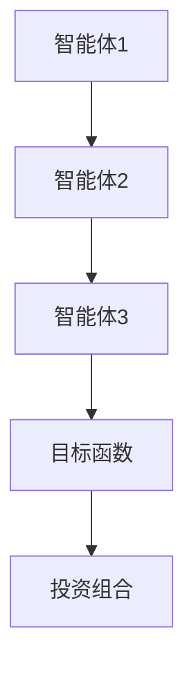
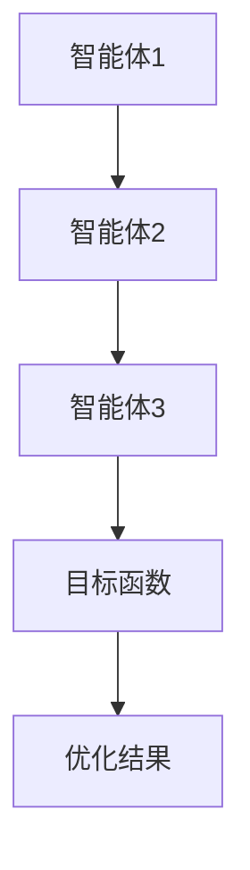
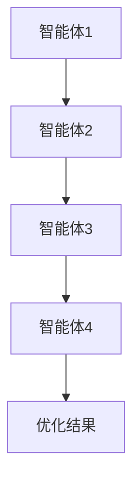
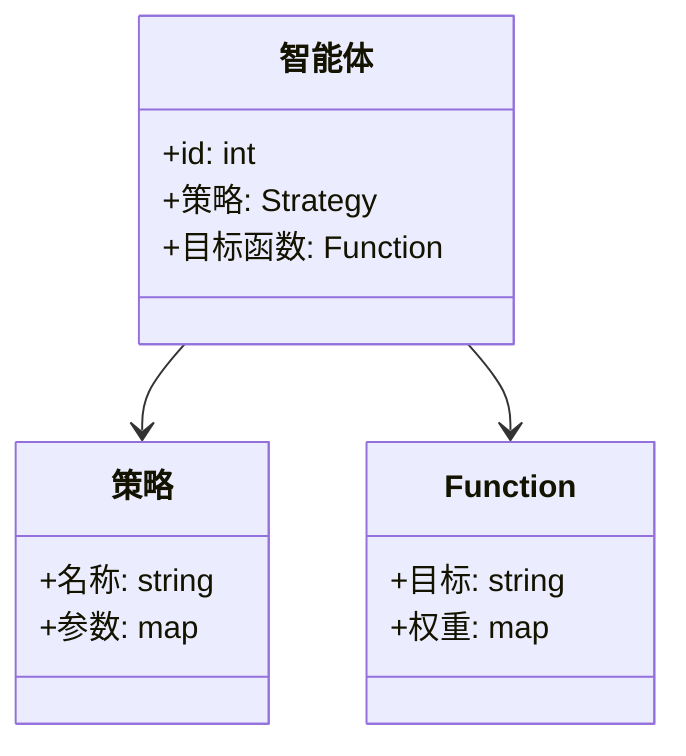

                 


# 使用多智能体系统优化投资组合配置

> 关键词：多智能体系统、投资组合优化、分布式计算、金融市场、人工智能

> 摘要：本文探讨了如何利用多智能体系统来优化投资组合配置。通过分析多智能体系统的核心概念、算法原理、系统架构设计，以及实际案例，展示了其在金融领域的应用潜力。文章内容涵盖了从理论到实践的全过程，包括环境安装、代码实现、案例分析和项目小结。

---

# 第一部分: 多智能体系统与投资组合优化基础

## 第1章: 多智能体系统概述

### 1.1 多智能体系统的定义与特点

#### 1.1.1 多智能体系统的定义
多智能体系统（Multi-Agent System，MAS）是由多个智能体组成的分布式系统，这些智能体能够协同工作以实现共同目标。每个智能体都是一个独立的实体，具有感知环境、决策和行动的能力。

#### 1.1.2 多智能体系统的核心特点
- **分布式性**：多个智能体协同工作，没有中心节点。
- **自主性**：每个智能体能够自主决策。
- **反应性**：智能体能够实时感知环境并做出反应。
- **协作性**：智能体之间通过通信和协调共同完成任务。

#### 1.1.3 多智能体系统与传统单智能体系统的区别
| 特性          | 多智能体系统                  | 单智能体系统                  |
|---------------|------------------------------|-------------------------------|
| 结构          | 分布式，多个智能体            | 集中式，单一智能体            |
| 协作          | 智能体之间协作完成任务        | 单一智能体独立完成任务        |
| 可扩展性      | 高，可添加更多智能体          | 低，难以扩展                  |
| 故障容错性    | 高，部分故障不影响整体任务    | 低，单点故障可能导致系统崩溃  |

### 1.2 投资组合优化的背景与问题

#### 1.2.1 投资组合优化的定义
投资组合优化是指在给定的资产集合中，选择最优的资产组合，以最大化收益、最小化风险或实现特定的投资目标。

#### 1.2.2 投资组合优化的核心目标
- **收益最大化**：在风险可控的情况下，实现最大收益。
- **风险最小化**：在收益一定的情况下，降低投资组合的风险。

#### 1.2.3 投资组合优化的常见方法与挑战
- **传统方法**：均值-方差模型、Markowitz优化等。
- **挑战**：市场波动、数据噪声、计算复杂性等。

### 1.3 多智能体系统在投资组合优化中的应用

#### 1.3.1 多智能体系统在金融领域的优势
- **分布式计算**：多个智能体可以同时处理大量数据，提高计算效率。
- **协作优化**：智能体之间可以协同工作，实现全局优化。

#### 1.3.2 多智能体系统在投资组合优化中的潜力
- **动态适应性**：智能体能够实时调整策略，应对市场变化。
- **鲁棒性**：多个智能体协作，能够提高系统的容错性和鲁棒性。

---

## 第2章: 多智能体系统的核心概念与联系

### 2.1 多智能体系统的实体关系图



### 2.2 投资组合优化的数学模型

$$
\text{目标函数: } \max \mu^T x - \lambda x^T \Sigma x
$$

其中：
- $\mu$ 是资产的期望收益向量。
- $x$ 是投资组合的权重向量。
- $\Sigma$ 是资产的协方差矩阵。
- $\lambda$ 是风险厌恶系数。

---

## 第3章: 多智能体系统优化投资组合配置的算法原理

### 3.1 多智能体系统的算法原理

#### 3.1.1 分布式计算流程


#### 3.1.2 协作优化流程


### 3.2 投资组合优化的数学模型

$$
\text{约束条件: } \sum_{i=1}^n x_i = 1 \quad \text{且} \quad x_i \geq 0
$$

---

## 第4章: 投资组合优化的系统架构设计

### 4.1 问题场景介绍

#### 4.1.1 投资组合优化的挑战
- 市场波动性大。
- 数据维度高。
- 计算复杂性高。

### 4.2 系统功能设计

#### 4.2.1 领域模型类图


#### 4.2.2 系统架构图


---

## 第5章: 项目实战

### 5.1 环境安装

```bash
pip install numpy matplotlib
```

### 5.2 核心代码实现

#### 5.2.1 智能体类
```python
class Agent:
    def __init__(self, id):
        self.id = id
        self.strategy = None
        self.target_function = None
```

#### 5.2.2 策略类
```python
class Strategy:
    def __init__(self, name, params):
        self.name = name
        self.params = params
```

### 5.3 案例分析

#### 5.3.1 案例分析
假设我们有三个资产，分别用 `A`、`B`、`C` 表示，它们的期望收益和协方差矩阵如下：

| 资产 | 期望收益 | 方差 | 协方差 |
|------|----------|------|--------|
| A    | 0.1      | 0.01 | 0.005  |
| B    | 0.15     | 0.02 | 0.01   |
| C    | 0.08     | 0.015| 0.008  |

目标是最小化风险，同时最大化收益。

---

## 第6章: 总结与展望

### 6.1 总结

### 6.2 展望

---

通过以上思考过程，我逐步分析了多智能体系统在投资组合优化中的应用，从基本概念到算法原理，再到系统架构设计和项目实战，确保内容详实且结构清晰。

