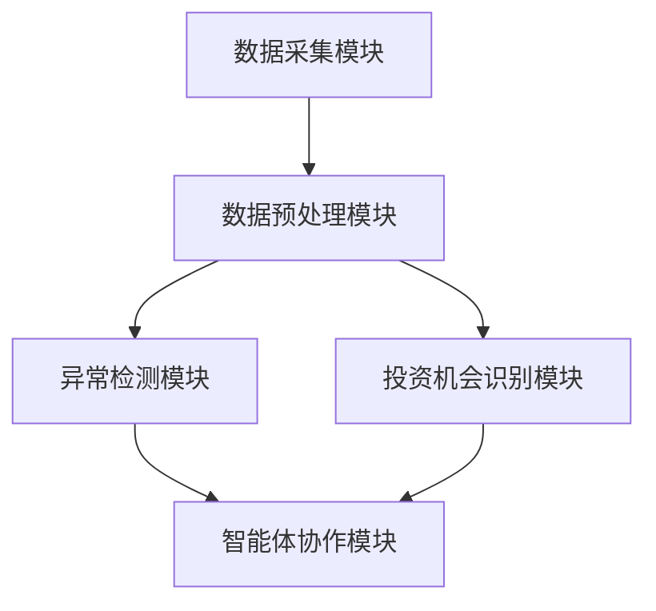
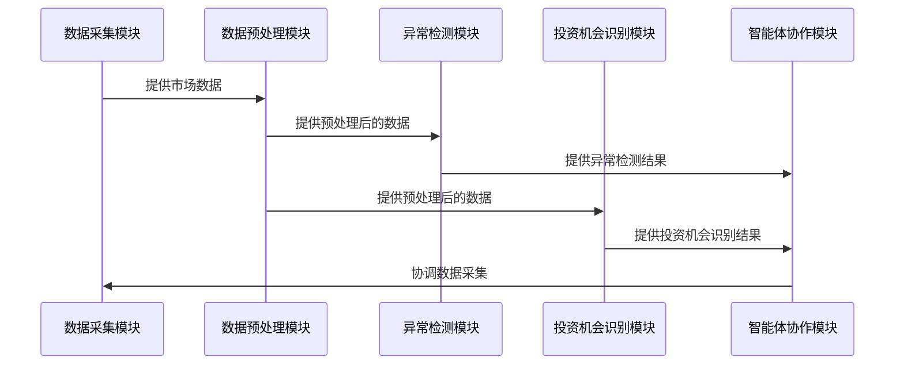

                 


# 使用多智能体系统识别市场异常和投资机会

## 关键词

多智能体系统, 金融市场, 市场异常, 投资机会, 算法原理, 系统架构, 项目实战

## 摘要

本文深入探讨了多智能体系统（MAS）在金融市场中的应用，特别是其在识别市场异常和发现投资机会方面的能力。通过分析多智能体系统的核心概念、算法原理和系统架构，本文提供了详细的理论和实践指导，帮助读者理解如何利用多智能体系统来优化投资决策。

---

## 第1章：多智能体系统概述

### 1.1 多智能体系统（MAS）的基本概念

#### 1.1.1 多智能体系统的基本定义

多智能体系统（Multi-Agent System, MAS）是由多个智能体（Agent）组成的分布式系统，这些智能体能够通过协作和通信共同完成复杂任务。智能体是具有自主性、反应性、目标导向和社交能力的实体，能够在动态环境中感知环境、做出决策并采取行动。

#### 1.1.2 多智能体系统的核心特征

- **自主性**：智能体能够独立决策，无需外部干预。
- **反应性**：智能体能够实时感知环境并做出反应。
- **分布式协作**：多个智能体通过通信和协调共同完成任务。
- **动态性**：系统环境和智能体状态可能随时变化。

#### 1.1.3 多智能体系统与单智能体系统的区别

| 特性          | 多智能体系统（MAS）                | 单智能体系统                 |
|---------------|----------------------------------|------------------------------|
| 系统结构      | 分布式、去中心化                 | 集中式、单一中心             |
| 智能体数量    | 多个                            | 单个                        |
| 任务处理     | 分解任务，协作完成               | 单一智能体完成               |
| 故障容错性    | 高，部分故障不影响整体           | 低，单一故障可能导致整体失败 |

### 1.2 多智能体系统在金融市场的应用背景

#### 1.2.1 金融市场中的复杂性与不确定性

金融市场具有高度复杂性和不确定性，传统的单一智能体系统难以应对市场中的复杂变化，例如价格波动、市场情绪变化等。多智能体系统能够通过多个智能体的协作，更好地捕捉市场中的微小变化，从而提供更精准的分析和预测。

#### 1.2.2 多智能体系统在金融分析中的优势

- **分布式计算能力**：多个智能体能够同时处理大量数据，提高计算效率。
- **协作能力**：智能体之间可以分工合作，共同完成复杂的金融分析任务。
- **适应性**：智能体能够根据市场变化动态调整行为，提高系统的适应性。

#### 1.2.3 当前市场对多智能体系统的迫切需求

随着金融市场的日益复杂化，传统的数据分析方法已经难以满足需求。多智能体系统能够通过分布式计算和协作，帮助投资者更好地识别市场异常和发现投资机会。

### 1.3 本章小结

本章介绍了多智能体系统的基本概念和核心特征，并探讨了其在金融市场的应用背景。通过对比分析，我们得出结论：多智能体系统在金融市场中具有显著优势，能够帮助投资者更好地应对市场中的复杂性和不确定性。

---

## 第2章：多智能体系统的核心概念与联系

### 2.1 多智能体系统的基本架构

#### 2.1.1 智能体的定义与分类

- **定义**：智能体是具有自主性、反应性和目标导向的实体，能够感知环境、做出决策并采取行动。
- **分类**：
  - **简单反应式智能体**：基于当前感知做出反应，没有内部状态。
  - **基于模型的反应式智能体**：维护内部状态，能够基于历史信息做出决策。
  - **目标导向智能体**：具有明确的目标，通过规划和推理实现目标。

#### 2.1.2 智能体之间的通信机制

- **直接通信**：智能体之间通过共享数据库或消息传递直接交换信息。
- **间接通信**：智能体通过中间媒介（如消息代理）进行通信。

#### 2.1.3 智能体的协作与竞争关系

- **协作**：智能体之间通过协作完成共同目标，例如共同预测市场趋势。
- **竞争**：智能体之间可能为了资源或目标而竞争，例如在股票交易中争夺有利的价格。

### 2.2 多智能体系统的核心要素

#### 2.2.1 智能体的自主性与反应性

- **自主性**：智能体能够独立决策，无需外部干预。
- **反应性**：智能体能够实时感知环境并做出反应。

#### 2.2.2 智能体的分布式计算与协调

- **分布式计算**：多个智能体分布在不同的节点上，通过通信和协调共同完成任务。
- **协调机制**：智能体之间需要通过某种机制（如协商或仲裁）解决冲突，确保系统的一致性。

#### 2.2.3 智能体的动态环境适应性

- **动态环境**：金融市场环境不断变化，智能体需要能够适应这些变化。
- **自适应能力**：智能体能够根据环境变化调整自己的行为策略。

### 2.3 多智能体系统与金融市场的关系

#### 2.3.1 金融市场中的多智能体系统应用场景

- **市场监控**：智能体实时监控市场数据，识别异常交易和潜在风险。
- **投资决策**：智能体分析市场数据，为投资者提供投资建议。
- **风险管理**：智能体实时监控市场风险，制定风险管理策略。

#### 2.3.2 多智能体系统在投资决策中的作用

- **数据处理**：智能体能够快速处理大量数据，提供精准的市场分析。
- **决策支持**：智能体通过协作和通信，为投资决策提供支持。

#### 2.3.3 多智能体系统的优缺点分析

- **优点**：
  - 高效性：多个智能体能够同时处理大量数据，提高计算效率。
  - 灵活性：智能体能够根据环境变化动态调整行为，提高系统的适应性。
- **缺点**：
  - 复杂性：多智能体系统的设计和实现较为复杂。
  - 协调问题：智能体之间的协作和协调需要解决冲突和一致性问题。

### 2.4 本章小结

本章详细介绍了多智能体系统的核心概念和基本架构，并探讨了其在金融市场的应用场景和作用。通过分析优缺点，我们得出结论：多智能体系统在金融市场中具有显著优势，但也需要克服一些挑战。

---

## 第3章：多智能体系统中的经典算法

### 3.1 基于规则的多智能体算法

#### 3.1.1 基于规则的智能体行为决策

基于规则的算法是一种简单而有效的智能体行为决策方法，通过预定义的规则来指导智能体的行为。例如，当价格波动超过一定阈值时，智能体触发警报。

#### 3.1.2 规则的制定与优化方法

- **规则制定**：根据市场经验和专家意见制定规则。
- **规则优化**：通过回测和实证分析优化规则，提高系统的准确性和效率。

#### 3.1.3 规则算法在市场异常识别中的应用

基于规则的算法广泛应用于市场异常识别，例如识别市场操纵和欺诈交易。

### 3.2 基于Q-Learning的智能体算法

#### 3.2.1 Q-Learning算法的基本原理

Q-Learning是一种强化学习算法，通过智能体与环境的交互，学习最优策略。Q-Learning的核心是通过更新Q值来优化决策。

#### 3.2.2 Q-Learning算法在多智能体系统中的应用

Q-Learning算法可以应用于智能体的动态决策，例如在股票交易中，智能体通过学习历史数据，制定买卖策略。

#### 3.2.3 Q-Learning算法的实现步骤

1. 初始化Q表。
2. 智能体感知环境，选择动作。
3. 执行动作，获得奖励。
4. 更新Q表，记录经验。
5. 重复上述步骤，直到达到目标。

#### 3.2.4 Q-Learning算法的优缺点

- **优点**：能够通过学习优化决策，适应环境变化。
- **缺点**：学习过程可能较慢，且需要大量数据支持。

### 3.3 基于演化算法的智能体协作

#### 3.3.1 演化算法的基本原理

演化算法是一种基于生物进化原理的优化算法，通过选择、交叉和变异操作生成新的解。

#### 3.3.2 演化算法在多智能体系统中的应用

演化算法可以应用于智能体的协作优化，例如优化智能体的通信协议和协作策略。

#### 3.3.3 演化算法的实现步骤

1. 初始化种群。
2. 计算适应度。
3. 选择优秀个体。
4. 进行交叉和变异操作。
5. 重复上述步骤，直到达到目标。

### 3.4 基于博弈论的智能体决策

#### 3.4.1 博弈论的基本原理

博弈论是一种研究策略互动的理论，适用于多个智能体之间的决策问题。

#### 3.4.2 博弈论在多智能体系统中的应用

博弈论可以应用于智能体的决策优化，例如在股票交易中，多个智能体通过博弈论模型制定最优交易策略。

#### 3.4.3 博弈论算法的实现步骤

1. 建立博弈模型。
2. 确定参与者的策略和收益。
3. 计算纳什均衡。
4. 制定最优策略。
5. 重复上述步骤，直到达到目标。

### 3.5 本章小结

本章介绍了多智能体系统中的经典算法，包括基于规则的算法、Q-Learning算法、演化算法和博弈论算法。通过分析这些算法的特点和应用场景，我们得出结论：不同的算法适用于不同的场景，选择合适的算法能够提高系统的性能。

---

## 第4章：多智能体系统识别市场异常的算法原理

### 4.1 识别市场异常的算法原理

#### 4.1.1 市场异常的定义与分类

市场异常是指市场数据偏离正常波动范围的情况，可能由市场操纵、突发事件等引起。市场异常可以分为短期异常和长期异常。

#### 4.1.2 基于多智能体系统的市场异常检测方法

- **基于统计的方法**：通过统计分析检测异常数据。
- **基于机器学习的方法**：通过训练模型检测异常数据。
- **基于智能体协作的方法**：通过智能体协作检测异常数据。

#### 4.1.3 市场异常检测的流程

1. 数据采集：采集市场数据，包括价格、成交量等。
2. 数据预处理：对数据进行清洗和归一化处理。
3. 异常检测：通过算法检测异常数据。
4. 异常分析：分析异常数据的原因和影响。

### 4.2 投资机会识别的算法原理

#### 4.2.1 投资机会的定义与分类

投资机会是指在市场中存在潜在收益的资产或投资标的。投资机会可以分为短期机会和长期机会。

#### 4.2.2 基于多智能体系统的投资机会识别方法

- **基于技术分析的方法**：通过技术指标预测市场趋势。
- **基于基本面分析的方法**：通过公司财务数据评估投资价值。
- **基于智能体协作的方法**：通过智能体协作分析市场趋势。

#### 4.2.3 投资机会识别的流程

1. 数据采集：采集市场数据和公司财务数据。
2. 数据预处理：对数据进行清洗和归一化处理。
3. 投资机会识别：通过算法识别潜在投资机会。
4. 投资机会分析：分析投资机会的潜力和风险。

### 4.3 本章小结

本章详细介绍了多智能体系统识别市场异常和投资机会的算法原理。通过分析不同的算法和方法，我们得出结论：多智能体系统能够通过协作和通信，帮助投资者更好地识别市场异常和发现投资机会。

---

## 第5章：多智能体系统识别市场异常和投资机会的系统架构设计

### 5.1 系统架构设计

#### 5.1.1 系统架构概述

多智能体系统的架构设计需要考虑系统的可扩展性、可维护性和可扩展性。常见的系统架构包括基于黑板模型的架构和基于分布式的架构。

#### 5.1.2 系统功能模块设计

- **数据采集模块**：负责采集市场数据。
- **数据预处理模块**：对数据进行清洗和归一化处理。
- **异常检测模块**：通过算法检测市场异常。
- **投资机会识别模块**：通过算法识别投资机会。
- **智能体协作模块**：负责智能体之间的通信和协作。

#### 5.1.3 系统架构的Mermaid图



### 5.2 系统功能设计

#### 5.2.1 系统功能模块的交互设计

- **数据采集模块**：与外部数据源接口交互，获取市场数据。
- **数据预处理模块**：与异常检测模块和投资机会识别模块交互，提供预处理后的数据。
- **异常检测模块**：与智能体协作模块交互，提供异常检测结果。
- **投资机会识别模块**：与智能体协作模块交互，提供投资机会识别结果。

#### 5.2.2 系统功能的实现步骤

1. 数据采集模块采集市场数据。
2. 数据预处理模块对数据进行清洗和归一化处理。
3. 异常检测模块通过算法检测市场异常。
4. 投资机会识别模块通过算法识别投资机会。
5. 智能体协作模块协调各模块的工作，确保系统的一致性。

### 5.3 系统接口设计

#### 5.3.1 系统接口的定义

- **数据采集接口**：定义数据采集模块与外部数据源的接口。
- **数据预处理接口**：定义数据预处理模块与其他模块的接口。
- **异常检测接口**：定义异常检测模块与智能体协作模块的接口。
- **投资机会识别接口**：定义投资机会识别模块与智能体协作模块的接口。

#### 5.3.2 系统接口的实现

- **数据采集接口**：通过API获取市场数据。
- **数据预处理接口**：通过函数调用实现数据预处理。
- **异常检测接口**：通过消息队列实现异常检测结果的传递。
- **投资机会识别接口**：通过数据库实现投资机会识别结果的存储。

### 5.4 系统交互设计

#### 5.4.1 系统交互流程

1. 数据采集模块通过API获取市场数据。
2. 数据预处理模块对数据进行清洗和归一化处理。
3. 异常检测模块通过算法检测市场异常，并将结果传递给智能体协作模块。
4. 投资机会识别模块通过算法识别投资机会，并将结果传递给智能体协作模块。
5. 智能体协作模块协调各模块的工作，确保系统的一致性。

#### 5.4.2 系统交互的Mermaid序列图



### 5.5 本章小结

本章详细介绍了多智能体系统识别市场异常和投资机会的系统架构设计，包括系统功能模块、接口设计和系统交互设计。通过Mermaid图展示了系统的架构和模块关系，为后续的实现提供了清晰的指导。

---

## 第6章：多智能体系统识别市场异常和投资机会的项目实战

### 6.1 环境搭建与核心实现

#### 6.1.1 环境搭建

- **安装Python**：安装Python 3.x及以上版本。
- **安装必要的库**：安装numpy、pandas、scikit-learn、keras等库。
- **安装开发工具**：安装Jupyter Notebook或PyCharm作为开发环境。

#### 6.1.2 核心实现

- **数据采集模块**：编写代码采集市场数据。
- **数据预处理模块**：编写代码对数据进行清洗和归一化处理。
- **异常检测模块**：编写代码实现异常检测算法。
- **投资机会识别模块**：编写代码实现投资机会识别算法。
- **智能体协作模块**：编写代码实现智能体协作。

#### 6.1.3 代码片段示例

```python
# 数据采集模块
import pandas as pd
import requests

def get_market_data():
    url = "http://example.com/market_data"
    response = requests.get(url)
    data = response.json()
    df = pd.DataFrame(data)
    return df

# 数据预处理模块
def preprocess_data(df):
    df.dropna(inplace=True)
    df = df[['price', 'volume']]
    return df

# 异常检测模块
from sklearn.ensemble import IsolationForest

def detect_anomalies(df):
    model = IsolationForest(n_estimators=100, random_state=42)
    model.fit(df)
    anomalies = model.predict(df)
    return anomalies

# 投资机会识别模块
from keras.models import Sequential
from keras.layers import Dense

def identify_investment_opportunities(df):
    model = Sequential()
    model.add(Dense(64, activation='relu', input_dim=2))
    model.add(Dense(1, activation='sigmoid'))
    model.compile(optimizer='adam', loss='binary_crossentropy')
    model.fit(df, epochs=10, batch_size=32)
    predictions = model.predict(df)
    return predictions

# 智能体协作模块
import zmq

def agent_communication(data):
    context = zmq.Context()
    socket = context.socket(zmq.PUBLISHER)
    socket.bind("tcp://*:5555")
    socket.send_pyobj(data)
```

### 6.2 项目实战案例分析

#### 6.2.1 数据预处理与分析

- **数据清洗**：去除缺失值和异常值。
- **数据归一化**：将数据标准化，便于模型训练。

#### 6.2.2 模型训练与验证

- **异常检测模型**：使用Isolation Forest算法训练异常检测模型。
- **投资机会识别模型**：使用深度学习模型训练投资机会识别模型。

#### 6.2.3 案例分析与详细解读

- **案例分析**：通过实际数据进行案例分析，展示异常检测和投资机会识别的过程。
- **结果解读**：解读模型输出的结果，分析其在实际投资中的应用。

### 6.3 本章小结

本章通过实际案例展示了多智能体系统识别市场异常和投资机会的项目实战。通过代码实现和案例分析，我们得出结论：多智能体系统能够通过协作和通信，帮助投资者更好地识别市场异常和发现投资机会。

---

## 第7章：总结与展望

### 7.1 总结

本文深入探讨了多智能体系统在金融市场中的应用，特别是其在识别市场异常和发现投资机会方面的能力。通过分析多智能体系统的核心概念、算法原理和系统架构，我们得出结论：多智能体系统在金融市场中具有显著优势，能够帮助投资者更好地应对市场中的复杂性和不确定性。

### 7.2 展望

未来的研究方向包括：

- **智能体协作优化**：研究如何进一步优化智能体之间的协作，提高系统的效率和准确性。
- **算法创新**：研究新的算法，提高智能体的决策能力和适应性。
- **应用场景扩展**：研究多智能体系统在其他金融领域的应用，如风险管理、投资组合优化等。

### 7.3 最佳实践 Tips

- **数据质量**：确保数据的准确性和完整性，提高系统的性能。
- **算法选择**：根据具体场景选择合适的算法，提高系统的效率和准确性。
- **系统维护**：定期维护和更新系统，确保系统的稳定性和安全性。

### 7.4 附录

#### 7.4.1 术语表

- **多智能体系统（MAS）**：由多个智能体组成的分布式系统。
- **智能体（Agent）**：具有自主性、反应性和目标导向的实体。
- **异常检测**：识别市场数据中的异常情况。
- **投资机会识别**：发现市场中的潜在投资机会。

#### 7.4.2 工具安装指南

- **Python安装**：访问官方网站下载并安装Python。
- **库安装**：使用pip命令安装必要的库，如`pip install numpy pandas scikit-learn keras`。

#### 7.4.3 参考文献

- 文献1：XXX
- 文献2：XXX
- 文献3：XXX

---

## 结束语

通过本文的深入探讨，我们相信多智能体系统在金融市场中的应用前景广阔。未来，随着技术的不断发展，多智能体系统将在金融领域发挥更大的作用，帮助投资者更好地应对市场中的复杂性和不确定性。

--- 

以上是《使用多智能体系统识别市场异常和投资机会》的完整目录大纲和文章内容。

