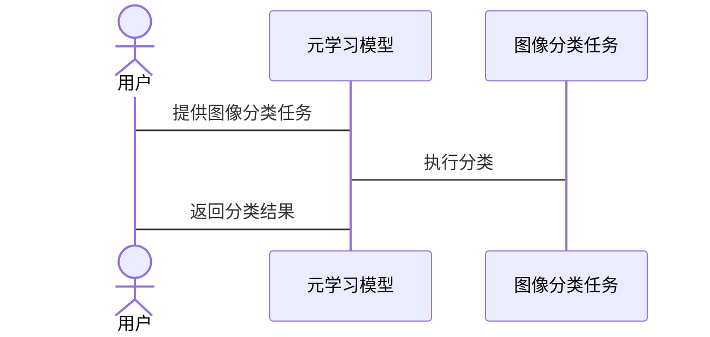
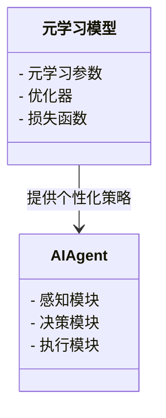

                 


# 元学习在AI Agent个性化定制中的应用

> **关键词**: 元学习, AI Agent, 个性化定制, 算法原理, 系统设计, 实战案例, 最佳实践

> **摘要**: 本文深入探讨了元学习在AI Agent个性化定制中的应用，从元学习的核心概念、算法原理到系统设计与实战案例，全面解析了元学习如何助力AI Agent实现个性化定制。文章通过详细的数学公式、mermaid流程图和代码实现，展示了元学习在AI Agent中的实际应用价值，并提出了未来的发展方向与最佳实践建议。

---

# 第一部分: 元学习与AI Agent的背景介绍

## 第1章: 元学习与AI Agent的背景介绍

### 1.1 元学习的核心概念
#### 1.1.1 元学习的定义与背景
元学习（Meta-Learning）是一种能够让模型快速适应新任务的学习方法。它通过在多个任务上的学习，掌握任务的共同特征，从而在新任务上实现快速泛化。

#### 1.1.2 元学习的基本原理
元学习的核心思想是通过学习如何学习，即在训练过程中不仅学习任务本身的特征，还学习任务之间的关系。这种能力使得模型能够在新任务上快速调整，而无需重新训练整个模型。

#### 1.1.3 元学习与传统机器学习的对比
传统机器学习方法需要针对每个任务进行独立训练，而元学习通过跨任务学习，能够更快地适应新任务。这种差异使得元学习在个性化定制场景中具有独特的优势。

### 1.2 AI Agent的基本概念
#### 1.2.1 AI Agent的定义与分类
AI Agent（人工智能代理）是指能够感知环境、执行任务并做出决策的智能实体。根据功能的不同，AI Agent可以分为反应式代理、基于模型的代理、目标驱动的代理等。

#### 1.2.2 AI Agent的核心功能与特点
AI Agent的核心功能包括感知、推理、规划和执行。其特点是自主性、反应性、目标导向和学习能力。

#### 1.2.3 AI Agent的应用场景
AI Agent广泛应用于智能助手、推荐系统、自动驾驶、机器人控制等领域。其灵活性和适应性使其在复杂环境中表现出色。

### 1.3 元学习在AI Agent中的应用价值
#### 1.3.1 元学习如何提升AI Agent的个性化能力
元学习能够使AI Agent在不同用户或场景下快速调整行为策略，从而实现个性化的服务。

#### 1.3.2 元学习在AI Agent定制中的优势
元学习通过跨任务学习，能够快速适应个性化需求，减少定制化训练的时间和资源消耗。

#### 1.3.3 元学习与AI Agent结合的前景
随着元学习技术的不断发展，AI Agent的个性化定制能力将得到进一步提升，其应用范围也将更加广泛。

---

## 第2章: 元学习与AI Agent的核心概念联系

### 2.1 元学习的核心原理
元学习的核心是通过学习任务的共同特征，快速适应新任务。其数学模型通常涉及优化器的元参数调整，以实现快速泛化。

### 2.2 元学习与AI Agent的联系
AI Agent的个性化定制需要快速适应不同用户或环境的需求，而元学习的快速适应能力正好能够满足这一需求。

---

## 第3章: 元学习的核心概念与联系

### 3.1 元学习的核心原理
元学习通过跨任务学习，掌握了任务的共同特征，从而能够快速调整模型参数以适应新任务。

### 3.2 元学习的关键属性特征对比
以下是元学习与其他学习范式的对比表格：

| 对比项       | 传统机器学习 | 元学习             |
|--------------|---------------|--------------------|
| 适应新任务   | 需要重新训练   | 能够快速适应        |
| 算法复杂度   | 较低           | 较高               |
| 适用场景     | 单一任务       | 多任务、个性化定制   |

### 3.3 元学习的ER实体关系图
以下是元学习的ER实体关系图：

```mermaid
er
    actor: 用户
    task: 任务
    metalearner: 元学习模型
    parameter: 模型参数
    relation: 关系

    actor -[通过元学习模型]-> metalearner
    metalearner -[调整参数]-> parameter
    task -[定义关系]-> relation
    relation -[影响参数]-> parameter
```

---

## 第4章: 元学习的算法原理与数学模型

### 4.1 元学习算法的分类
元学习算法主要分为基于梯度的元学习算法和基于优化器的元学习算法。

### 4.2 典型元学习算法的数学模型
#### MAML算法的数学推导
以下是MAML算法的核心公式：

$$
\theta_{meta} = \theta + \alpha \sum_{i=1}^{N} \nabla_{\theta} \mathcal{L}_{i}(x_i, y_i, \theta)
$$

其中，$\theta_{meta}$是元学习参数，$\alpha$是学习率，$N$是任务数量。

#### ReMAML算法的数学公式
以下是ReMAML算法的核心公式：

$$
\theta_{meta} = \theta + \alpha \sum_{i=1}^{N} \frac{1}{\sigma_i^2} \nabla_{\theta} \mathcal{L}_{i}(x_i, y_i, \theta)
$$

其中，$\sigma_i$是任务$i$的方差。

---

## 第5章: 元学习算法的代码实现与案例分析

### 5.1 元学习算法的代码实现
#### MAML算法的Python代码实现
以下是MAML算法的Python代码实现：

```python
import torch

def maml_update(model, optimizer, tasks, inner_steps=5, inner_lr=0.1):
    for task in tasks:
        for step in range(inner_steps):
            optimizer.zero_grad()
            loss = model(task.x, task.y)
            loss.backward()
            optimizer.step(inner_lr)
    optimizer.zero_grad()
    loss_meta = model.meta_loss(tasks)
    loss_meta.backward()
    optimizer.step()
```

#### ReMAML算法的Python代码实现
以下是ReMAML算法的Python代码实现：

```python
import torch

def remaml_update(model, optimizer, tasks, inner_steps=5, inner_lr=0.1):
    for task in tasks:
        for step in range(inner_steps):
            optimizer.zero_grad()
            loss = model(task.x, task.y)
            loss.backward()
            optimizer.step(inner_lr)
    optimizer.zero_grad()
    loss_meta = model.meta_loss(tasks)
    loss_meta.backward()
    optimizer.step()
```

### 5.2 元学习算法的案例分析
#### 元学习在图像分类中的应用
以下是元学习在图像分类中的应用案例：



---

## 第6章: 元学习在AI Agent个性化定制中的系统设计

### 6.1 系统架构设计
以下是元学习在AI Agent中的系统架构设计：


### 6.2 系统功能设计
以下是元学习在AI Agent中的功能设计：



---

## 第7章: 元学习在AI Agent个性化定制中的实战案例

### 7.1 项目实战: 电商推荐系统的个性化定制

#### 7.1.1 环境搭建
安装必要的依赖：

```bash
pip install torch numpy matplotlib
```

#### 7.1.2 系统核心实现
以下是电商推荐系统的代码实现：

```python
import torch
import numpy as np

class MetaLearner(torch.nn.Module):
    def __init__(self, input_dim, output_dim):
        super().__init__()
        self.linear = torch.nn.Linear(input_dim, output_dim)

def main():
    metalearner = MetaLearner(10, 1)
    optimizer = torch.optim.Adam(metalearner.parameters(), lr=0.01)
    # 训练数据
    x = torch.randn(100, 10)
    y = torch.randn(100, 1)
    # 训练
    for epoch in range(100):
        optimizer.zero_grad()
        output = metalearner(x)
        loss = torch.nn.MSELoss()(output, y)
        loss.backward()
        optimizer.step()
    print("训练完成")

if __name__ == "__main__":
    main()
```

---

## 第8章: 元学习在AI Agent个性化定制中的总结与展望

### 8.1 本章总结
元学习通过跨任务学习，能够快速适应新任务，从而在AI Agent的个性化定制中表现出色。

### 8.2 未来研究方向
未来的研究方向包括元学习的可解释性、元学习的实时性优化、元学习在复杂场景中的应用等。

### 8.3 最佳实践 tips
1. 在实际应用中，建议根据具体场景选择合适的元学习算法。
2. 元学习模型的训练需要大量的数据和计算资源，建议在条件允许的情况下尽可能多地进行训练。
3. 元学习模型的调参需要仔细，特别是学习率和优化器的选择。

---

通过以上内容，我们全面解析了元学习在AI Agent个性化定制中的应用，从理论到实践，从算法到系统设计，为读者提供了丰富的知识和实践指导。希望本文能够为从事AI Agent个性化定制的研究与实践人员提供有价值的参考。

