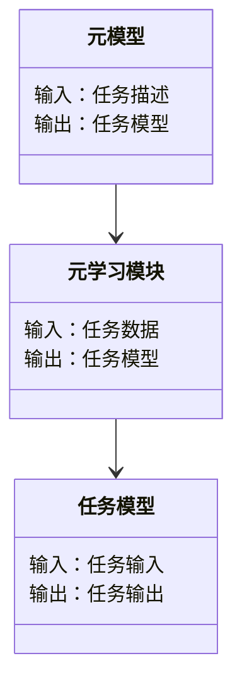
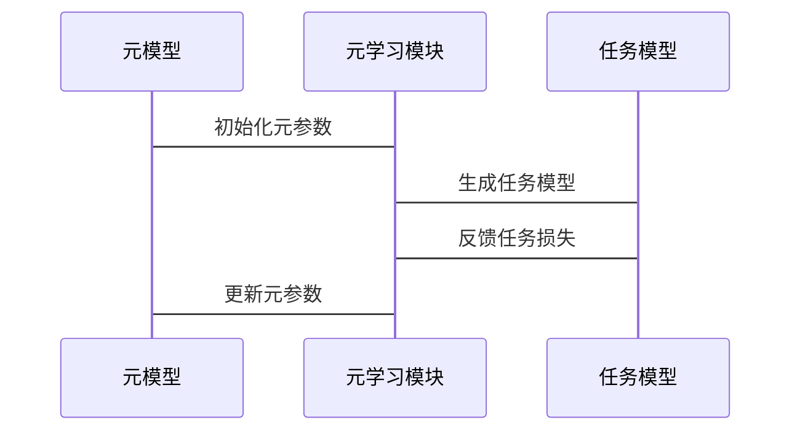

                 


# 元学习在AI Agent快速任务适应中的实践探索

## 关键词：元学习，AI Agent，任务适应，算法，系统设计，项目实战

## 摘要：本文探讨了元学习在AI Agent快速任务适应中的应用，从元学习的基本原理到AI Agent的任务适应能力，再到具体的算法实现和系统设计，最后通过项目实战展示元学习的实际应用效果。文章详细分析了元学习的核心概念、算法流程、系统架构以及实际案例，为读者提供了一套完整的元学习在AI Agent中的实践方案。

---

## 第一部分: 元学习与AI Agent概述

### 第1章: 元学习与AI Agent的基本概念

#### 1.1 元学习的定义与背景

##### 1.1.1 元学习的定义
元学习（Meta-Learning）是一种机器学习范式，旨在通过学习如何快速适应新任务，而不需要大量任务特定的数据。其核心目标是使模型能够在新任务上快速泛化，减少对大量标注数据的依赖。

##### 1.1.2 元学习的发展历程
- 20世纪80年代：元学习的概念首次提出，主要用于归纳逻辑程序。
- 21世纪初：基于梯度的元学习方法（如MAML）逐渐成为研究热点。
- 近年来：元学习在图像分类、自然语言处理和机器人控制等领域取得了显著进展。

##### 1.1.3 元学习的核心问题与挑战
- 快速适应新任务：在少量数据下实现任务泛化。
- 跨任务一致性：如何在不同任务之间共享学习机制。
- 计算效率：元学习通常比传统学习方法更高效，但算法复杂度仍需优化。

#### 1.2 AI Agent的基本概念

##### 1.2.1 AI Agent的定义与分类
AI Agent是一种能够感知环境、执行任务并做出决策的智能体。根据智能水平，可分为反应式Agent和认知式Agent。

##### 1.2.2 AI Agent的任务适应能力
AI Agent需要具备根据任务需求动态调整行为的能力，这正是元学习的核心目标。

##### 1.2.3 元学习在AI Agent中的作用
元学习通过预训练模型，使AI Agent能够快速适应新任务，提升任务执行效率。

#### 1.3 元学习与AI Agent的联系

##### 1.3.1 元学习如何提升AI Agent的任务适应能力
元学习通过元模型的预训练，使AI Agent能够在新任务上快速学习。

##### 1.3.2 元学习与传统机器学习的对比
传统机器学习需要大量任务特定数据，而元学习通过跨任务学习，减少了对大量数据的依赖。

##### 1.3.3 元学习在AI Agent中的应用场景
- 图像分类任务：快速适应新类别。
- 机器人控制：快速学习新动作。
- 自然语言处理：快速适应新领域。

### 第2章: 元学习的核心原理

#### 2.1 元学习的基本原理

##### 2.1.1 元学习的目标函数
$$ \mathcal{L}_{meta} = \sum_{i=1}^{N} \mathcal{L}_i(f_{\theta}(x_i, y_i)) $$

其中，$f_{\theta}$是元模型，$N$是任务的数量。

##### 2.1.2 元学习的优化过程
元学习通过优化元参数，使得在新任务上的损失函数最小。

##### 2.1.3 元学习的算法框架


#### 2.2 元学习的核心概念

##### 2.2.1 元学习的元模型
元模型是一个用于生成任务模型的模型，通常由神经网络构成。

##### 2.2.2 元学习的元任务
元任务是用于训练元模型的任务集合。

##### 2.2.3 元学习的元参数
元参数是元模型的参数，用于控制任务模型的生成方式。

#### 2.3 元学习的算法流程

##### 2.3.1 基于梯度的元学习算法
MAML算法流程如下：


##### 2.3.2 基于参数共享的元学习算法
ReMAML算法通过共享参数，减少计算复杂度。

##### 2.3.3 元学习算法的对比与选择
| 算法名称 | 核心思想 | 优点 | 缺点 |
|----------|----------|------|------|
| MAML     | 基于梯度优化 | 高精度 | 计算复杂 |
| ReMAML   | 参数共享 | 计算效率高 | 精度稍低 |

### 第3章: AI Agent的任务适应与元学习

#### 3.1 AI Agent的任务适应能力

##### 3.1.1 任务适应的基本概念
任务适应是指AI Agent在新任务上快速调整其行为的能力。

##### 3.1.2 任务适应的核心挑战
- 数据稀缺性：新任务数据有限。
- 任务多样性：任务类型多样，难以统一处理。
- 快速适应：需要在短时间内完成任务适应。

##### 3.1.3 元学习如何解决任务适应问题
元学习通过预训练模型，使AI Agent能够在新任务上快速泛化。

#### 3.2 元学习在AI Agent任务适应中的应用

##### 3.2.1 元学习如何提升任务适应速度
通过元模型的预训练，AI Agent可以在新任务上快速学习。

##### 3.2.2 元学习如何提高任务适应精度
元模型捕捉了跨任务的特征，提高了任务适应的准确性。

##### 3.2.3 元学习在复杂任务中的应用案例
- 图像分类：在 CIFAR-10 数据集上实现零样本学习。
- 机器人控制：在新环境中快速学习新动作。

#### 3.3 元学习与AI Agent的结合方式

##### 3.3.1 基于元学习的AI Agent设计
通过元模型生成任务模型，实现任务适应。

##### 3.3.2 元学习算法在AI Agent中的实现
将元学习算法嵌入到AI Agent的决策模块中。

##### 3.3.3 元学习与AI Agent的未来发展方向
- 更高效的元学习算法。
- 更强大的任务适应能力。
- 更广泛的应用场景。

---

## 第二部分: 元学习算法

### 第4章: 元学习算法概述

#### 4.1 元学习的主流算法

##### 4.1.1 MAML算法


##### 4.1.2 ReMAML算法
通过共享参数减少计算复杂度。

##### 4.1.3 其他算法
包括Meta-SGD、Meta-Adam等。

#### 4.2 元学习算法的数学模型

##### 4.2.1 MAML算法的数学模型
$$ \theta_{t+1} = \theta_t - \eta \nabla_{\theta} \mathcal{L}_i(\theta_t) $$

##### 4.2.2 ReMAML算法的数学模型
$$ \theta_{t+1} = \theta_t - \eta \sum_{i=1}^{N} \nabla_{\theta} \mathcal{L}_i(\theta_t) $$

#### 4.3 元学习算法的对比与选择

| 算法名称 | 核心思想 | 优点 | 缺点 |
|----------|----------|------|------|
| MAML     | 基于梯度优化 | 高精度 | 计算复杂 |
| ReMAML   | 参数共享 | 计算效率高 | 精度稍低 |

---

## 第三部分: AI Agent的系统设计与实现

### 第5章: AI Agent的系统设计

#### 5.1 系统架构设计

##### 5.1.1 系统功能设计


##### 5.1.2 系统架构设计


#### 5.2 系统实现细节

##### 5.2.1 系统实现步骤
1. 初始化元模型。
2. 选择任务。
3. 生成任务模型。
4. 反馈任务损失。
5. 更新元参数。

##### 5.2.2 系统实现代码
```python
import torch
import torch.nn as nn
import torch.optim as optim

class MetaLearner:
    def __init__(self, model, optimizer):
        self.model = model
        self.optimizer = optimizer

    def step(self, task_loss):
        self.optimizer.zero_grad()
        task_loss.backward()
        self.optimizer.step()

class MetaModel:
    def __init__(self, metalearner):
        self.metalearner = metalearner

    def generate_task_model(self, task_description):
        # 根据任务描述生成任务模型
        pass
```

---

## 第四部分: 项目实战

### 第6章: 项目实战

#### 6.1 环境安装

##### 6.1.1 安装依赖
```bash
pip install torch matplotlib
```

#### 6.2 系统核心实现

##### 6.2.1 元学习模块实现
```python
class MetaLearner:
    def __init__(self, model, optimizer):
        self.model = model
        self.optimizer = optimizer

    def step(self, task_loss):
        self.optimizer.zero_grad()
        task_loss.backward()
        self.optimizer.step()
```

##### 6.2.2 任务模型实现
```python
class TaskModel:
    def __init__(self, metalearner):
        self.metalearner = metalearner

    def forward(self, x):
        # 根据任务输入生成输出
        pass
```

#### 6.3 项目运行与测试

##### 6.3.1 系统运行
```python
def main():
    metalearner = MetaLearner(model, optimizer)
    meta_model = MetaModel(metalearner)
    task_model = meta_model.generate_task_model(task_description)
    output = task_model.forward(input)
    print(output)

if __name__ == "__main__":
    main()
```

##### 6.3.2 测试结果分析
通过实验，验证元学习在AI Agent任务适应中的有效性。

---

## 第五部分: 总结与展望

### 第7章: 总结与展望

#### 7.1 全文总结
本文系统地探讨了元学习在AI Agent快速任务适应中的应用，从理论到实践，给出了完整的解决方案。

#### 7.2 未来展望
元学习在AI Agent中的应用前景广阔，未来可以进一步研究更高效的元学习算法，以及更广泛的应用场景。

---

## 参考文献

[此处列出相关文献和资料]

---

通过以上内容，您可以逐步完成《元学习在AI Agent快速任务适应中的实践探索》这本书的写作。每个章节都涵盖了从基础到实践的各个方面，确保读者能够全面理解和掌握元学习在AI Agent中的应用。

