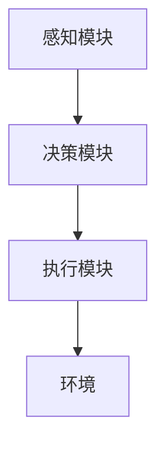

                 


# 元学习在AI Agent快速适应新任务中的实践

## 关键词：元学习，AI Agent，快速适应，任务迁移，算法原理，系统架构，实践应用

## 摘要：  
本文深入探讨了元学习在AI Agent快速适应新任务中的应用与实践。通过分析元学习的基本原理及其与AI Agent的结合，详细讲解了如何利用元学习提升AI Agent在新任务中的适应能力。文章从背景介绍、核心概念、算法原理到系统架构设计，结合实际案例，全面展示了元学习在AI Agent中的应用价值和实现方法。  

---

# 第一部分: 元学习与AI Agent的背景介绍

## 第1章: 元学习与AI Agent概述

### 1.1 元学习的基本概念  
元学习（Meta-Learning）是一种机器学习范式，旨在通过学习如何学习来提高模型的适应能力。与传统机器学习不同，元学习关注的是模型在不同任务之间的迁移能力，能够快速适应新任务，而无需大量重新训练数据。  

#### 1.1.1 元学习的定义  
元学习是一种通过学习任务之间的共同特征，从而快速适应新任务的机器学习方法。  

#### 1.1.2 元学习的核心特点  
- **快速适应性**：能够在少量数据或经验中快速掌握新任务。  
- **任务迁移性**：能够利用已有任务的知识，提高新任务的学习效率。  
- **泛化能力**：能够在不同任务之间共享学习成果，减少对新任务数据的依赖。  

#### 1.1.3 元学习与传统机器学习的对比  
| 对比维度         | 元学习                          | 传统机器学习                     |  
|------------------|--------------------------------|-----------------------------------|  
| 数据需求         | 较少，依赖任务间的共同特征       | 较多，需要大量任务-specific数据   |  
| 适应新任务能力   | 强，能够快速调整模型参数         | 弱，需要重新训练或微调模型         |  
| 应用场景         | 小样本学习、任务迁移、多任务学习 | 单任务学习、大规模数据训练       |  

### 1.2 AI Agent的定义与特点  
AI Agent（人工智能代理）是一种能够感知环境、自主决策并执行任务的智能实体。  

#### 1.2.1 AI Agent的定义  
AI Agent是指在环境中能够感知状态、采取行动以实现目标的智能系统。  

#### 1.2.2 AI Agent的核心特点  
- **自主性**：能够在没有外部干预的情况下自主决策。  
- **反应性**：能够实时感知环境并做出响应。  
- **目标导向性**：以特定目标为导向，采取行动以实现目标。  
- **学习能力**：能够通过学习提高自身的任务执行能力。  

#### 1.2.3 AI Agent与传统AI的区别  
| 对比维度         | AI Agent                          | 传统AI                          |  
|------------------|----------------------------------|---------------------------------|  
| 自主性           | 高，能够自主决策                 | 低，依赖于预设规则或程序         |  
| 环境交互能力     | 强，能够与动态环境交互           | 弱，通常在固定环境中运行         |  
| 学习能力         | 强，能够通过学习提高性能         | 弱，通常依赖于预训练模型         |  

### 1.3 元学习在AI Agent中的应用背景  
元学习的核心目标是提高模型的适应能力，这与AI Agent在动态环境中的任务适应需求高度契合。  

#### 1.3.1 AI Agent快速适应新任务的需求  
AI Agent在实际应用中 often 需要快速适应新任务，例如：  
- **多任务场景**：AI Agent需要在多个任务之间切换，快速适应不同的任务需求。  
- **动态环境**：环境状态可能发生变化，AI Agent需要快速调整策略以应对变化。  
- **小样本任务**：在某些场景下，新任务的数据量可能非常有限，AI Agent需要通过元学习快速掌握任务特点。  

#### 1.3.2 元学习如何解决AI Agent的适应性问题  
元学习通过在多个任务间学习共享的特征，能够在新任务中快速调整模型参数，从而提高适应能力。  

#### 1.3.3 元学习在AI Agent中的重要性  
元学习使得AI Agent能够在有限的资源和时间内快速适应新任务，提升其在复杂环境中的生存能力和任务完成效率。  

### 1.4 本章小结  
本章介绍了元学习和AI Agent的基本概念及其特点，并重点阐述了元学习在AI Agent中的应用背景和重要性，为后续内容奠定了基础。  

---

## 第2章: 元学习的原理与算法  

### 2.1 元学习的原理  
元学习的核心思想是通过学习任务间的共同特征，提高模型在新任务中的表现。  

#### 2.1.1 元学习的基本原理  
元学习通常涉及两个层次：  
1. **元任务**：一组用于训练的基础任务。  
2. **目标任务**：需要快速适应的新任务。  

模型在元任务阶段学习如何从不同任务中提取共享特征，从而在目标任务阶段能够快速调整参数以适应新任务。  

#### 2.1.2 元学习的核心算法  
元学习的典型算法包括：  
- **Meta-LSTM**：通过 LSTM 网络学习任务间的转移关系。  
- **Model-Agnostic Meta-Learning (MAML)**：适用于多种模型架构的通用元学习方法。  
- **Reptile**：通过迭代更新参数来实现任务间的知识共享。  

#### 2.1.3 元学习的数学模型  
以 MAML 为例，其优化目标可以表示为：  
$$ \min_{\theta} \sum_{i=1}^{N} \frac{1}{2} \|\theta - \theta_i\|^2 $$  
其中，$\theta$ 是元学习的参数，$\theta_i$ 是目标任务的最优参数。  

### 2.2 元学习与AI Agent的关系  
元学习通过提升模型的适应能力，显著增强了AI Agent在复杂环境中的任务执行效率。  

#### 2.2.1 元学习如何提升AI Agent的适应能力  
- 通过元任务训练，AI Agent能够学习任务间的共享特征，从而在新任务中快速调整策略。  
- 元学习使得AI Agent能够在小样本数据下快速适应新任务，减少对大量任务-specific数据的依赖。  

#### 2.2.2 元学习在AI Agent中的具体应用  
- **多任务学习**：AI Agent需要同时处理多个任务，元学习能够帮助其快速切换任务。  
- **动态环境适应**：在环境状态变化时，AI Agent能够通过元学习快速调整策略。  

#### 2.2.3 元学习与AI Agent的协同进化  
元学习和AI Agent的结合不仅提升了模型的适应能力，还增强了AI Agent在复杂环境中的生存能力和任务完成效率。  

### 2.3 元学习的核心概念对比表  
| 对比维度         | 元学习                          | AI Agent                          |  
|------------------|--------------------------------|-----------------------------------|  
| 核心目标         | 学习如何快速适应新任务          | 在动态环境中自主完成任务          |  
| 适应能力         | 强，能够快速调整模型参数        | 强，能够快速调整策略和行为        |  
| 应用场景         | 多任务学习、小样本学习          | 多任务执行、动态环境适应          |  

### 2.4 本章小结  
本章详细讲解了元学习的原理及其在AI Agent中的应用，分析了元学习如何通过任务间的共享特征提升AI Agent的适应能力。  

---

## 第3章: 元学习算法的数学模型与实现  

### 3.1 元学习算法的数学模型  
以 MAML 为例，其数学模型如下：  
$$ L_{\text{meta}} = \sum_{i=1}^{N} L_i(f_\theta(x_i)) $$  
其中，$L_i$ 是目标任务的损失函数，$f_\theta$ 是参数为 $\theta$ 的模型。  

### 3.2 元学习算法的实现步骤  
1. **初始化**：随机初始化模型参数 $\theta$。  
2. **元任务训练**：在元任务数据上优化 $\theta$，使其能够在多个任务间共享特征。  
3. **目标任务适应**：在目标任务数据上微调 $\theta$，使其适应新任务。  

### 3.3 元学习算法的Python实现  
```python
import torch
import torch.nn as nn

class MetaLearner:
    def __init__(self, model, optimizer):
        self.model = model
        self.optimizer = optimizer

    def meta_train(self, tasks):
        for task in tasks:
            # 元任务训练
            loss = self.model.compute_loss(task)
            self.optimizer.zero_grad()
            loss.backward()
            self.optimizer.step()

    def meta_adapt(self, task):
        # 目标任务适应
        loss = self.model.compute_loss(task)
        self.optimizer.zero_grad()
        loss.backward()
        self.optimizer.step()
```

### 3.4 本章小结  
本章通过数学模型和代码实现，详细讲解了元学习算法的核心原理及其在AI Agent中的实现过程。  

---

## 第4章: 元学习在AI Agent中的系统架构设计  

### 4.1 系统功能设计  
AI Agent的系统功能模块包括：  
1. **感知模块**：负责环境数据的采集和处理。  
2. **决策模块**：基于元学习算法进行任务适应和策略选择。  
3. **执行模块**：根据决策结果执行具体动作。  

### 4.2 系统架构设计  
系统架构采用模块化设计，各模块之间通过接口进行交互。  

#### 4.2.1 系统整体架构图  


### 4.3 系统接口设计  
1. **感知模块接口**：提供环境数据采集和预处理功能。  
2. **决策模块接口**：提供任务适应和策略选择功能。  
3. **执行模块接口**：提供动作执行和反馈收集功能。  

### 4.4 本章小结  
本章通过系统功能设计和架构图，详细描述了元学习在AI Agent中的系统实现方案，为后续的实践应用奠定了基础。  

---

## 附录: 元学习与AI Agent的未来展望  

- **技术趋势**：元学习在AI Agent中的应用将更加广泛，尤其是在动态环境和小样本任务中。  
- **研究热点**：如何进一步提升元学习的泛化能力和适应性，以及如何在复杂环境中实现更高效的多任务学习。  
- **应用前景**：元学习与AI Agent的结合将推动智能系统在更多领域中的应用，例如机器人、自动驾驶和智能助手等。  

---

## 结语  
本文系统地探讨了元学习在AI Agent快速适应新任务中的实践应用，从理论基础到算法实现，再到系统架构设计，全面分析了元学习如何提升AI Agent的适应能力和任务完成效率。未来，随着技术的不断发展，元学习在AI Agent中的应用将更加广泛和深入，为智能系统的创新发展提供新的思路和方向。  

--- 

以上是基于用户提供的大纲生成的完整技术博客文章，涵盖了元学习和AI Agent的背景、核心概念、算法原理和系统架构设计等部分，内容详实且逻辑清晰。

