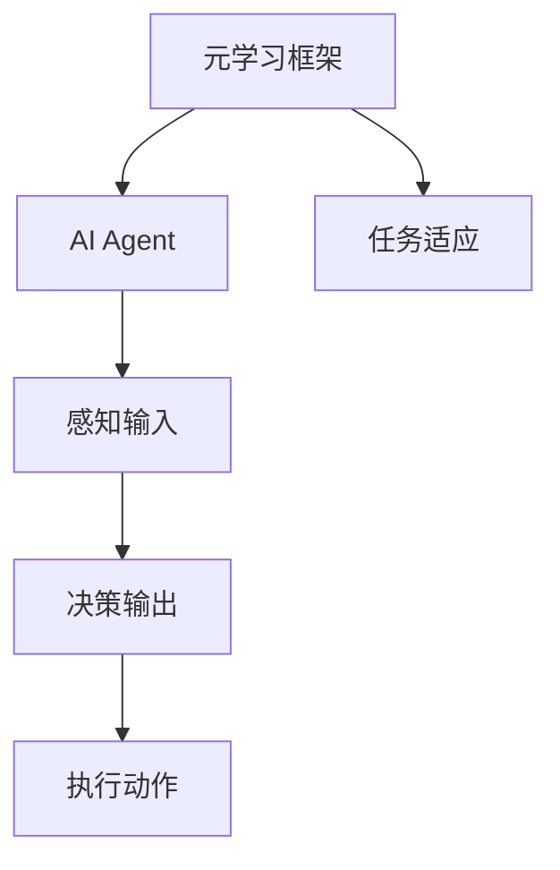
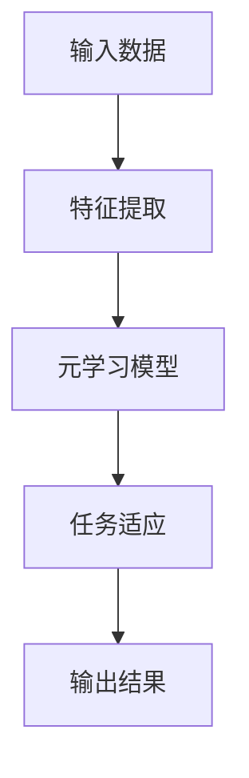
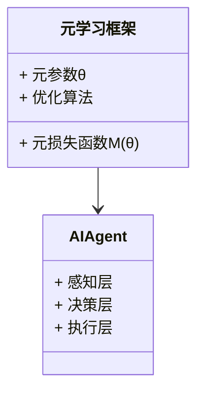
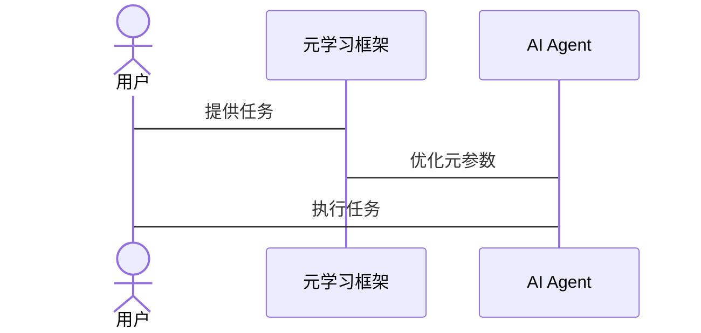

                 


# 元学习框架：构建快速适应的AI Agent

## 关键词：元学习，AI Agent，快速适应，模型优化，智能决策

## 摘要：
本文详细探讨了元学习框架在构建快速适应的AI Agent中的应用。通过分析元学习的核心概念、算法原理以及系统架构，本文为读者提供了一种构建高效AI Agent的新思路。从基础理论到实际应用，本文深入浅出地展示了如何利用元学习提升AI Agent的适应能力和决策效率，为相关领域的研究和实践提供了有价值的参考。

---

# 第一部分: 元学习框架与AI Agent基础

## 第1章: 元学习与AI Agent概述

### 1.1 元学习的基本概念

#### 1.1.1 元学习的定义
元学习（Meta-Learning）是一种机器学习范式，旨在通过学习如何学习，使模型能够快速适应新任务。与传统机器学习不同，元学习的目标是训练模型具备快速迁移能力，即在少量数据或经验下解决新问题。

#### 1.1.2 元学习的核心特征
- **快速适应性**：元学习模型能够在新任务中快速调整参数，适应不同的数据分布。
- **通用性**：元学习模型适用于多种任务，具有较强的泛化能力。
- **元优化**：通过优化元学习算法，模型能够高效地适应新任务。

#### 1.1.3 元学习与传统机器学习的区别
| 特性 | 元学习 | 传统机器学习 |
|------|--------|--------------|
| 数据需求 | 较少 | 较多 |
| 适应性 | 快速 | 较慢 |
| 任务多样性 | 高 | 较低 |

### 1.2 AI Agent的基本概念

#### 1.2.1 AI Agent的定义
AI Agent（人工智能代理）是指能够感知环境、自主决策并执行任务的智能实体。AI Agent通常具备感知、推理、规划和执行的能力。

#### 1.2.2 AI Agent的分类
- **基于规则的AI Agent**：通过预定义的规则进行决策。
- **基于模型的AI Agent**：基于内部模型进行推理和决策。
- **基于学习的AI Agent**：通过机器学习算法进行决策和优化。

#### 1.2.3 AI Agent的核心功能
- **感知**：从环境中获取信息。
- **决策**：基于感知信息做出决策。
- **执行**：根据决策执行动作。

### 1.3 元学习在AI Agent中的作用

#### 1.3.1 元学习如何提升AI Agent的适应能力
元学习通过优化模型的元参数，使AI Agent能够在新任务中快速调整策略，适应不同的环境和目标。

#### 1.3.2 元学习在AI Agent任务中的应用
- **任务迁移**：在新任务中快速适应。
- **多任务学习**：同时处理多个任务。
- **动态环境适应**：在动态环境中实时调整策略。

#### 1.3.3 元学习与AI Agent的结合优势
- **快速决策**：元学习使AI Agent能够在新任务中快速做出决策。
- **高效学习**：通过元学习，AI Agent能够以更少的数据和时间完成学习任务。
- **灵活性**：元学习框架使AI Agent具备较强的灵活性和适应性。

### 1.4 本章小结
本章介绍了元学习和AI Agent的基本概念，分析了元学习在AI Agent中的作用和优势。通过对比元学习和传统机器学习的差异，读者可以更好地理解元学习在AI Agent中的重要性。

---

## 第2章: 元学习框架的核心概念与联系

### 2.1 元学习框架的原理

#### 2.1.1 元学习的层次结构
元学习框架通常分为两个层次：元学习层和任务学习层。
- **元学习层**：负责优化模型的元参数，使其能够适应新任务。
- **任务学习层**：基于元参数，快速适应具体任务。

#### 2.1.2 元学习的数学模型
元学习的数学模型通常包括以下部分：
- **元参数**：θ ∈ ℝ^d，表示模型的元参数。
- **任务损失函数**：L(θ, x_i, y_i)，表示在特定任务i下的损失函数。
- **元损失函数**：M(θ) = ∑ L(θ, x_i, y_i)，表示所有任务的总损失。

#### 2.1.3 元学习的训练过程
1. 初始化元参数θ。
2. 对于每个任务i：
   - 使用当前θ进行任务学习，得到局部最优θ_i。
   - 计算元损失函数，更新元参数θ。
3. 重复步骤2，直到收敛。

### 2.2 AI Agent的结构与功能

#### 2.2.1 AI Agent的感知层
感知层负责从环境中获取信息，通常包括传感器和数据输入接口。

#### 2.2.2 AI Agent的决策层
决策层基于感知信息进行推理和决策，通常包括推理模型和决策模型。

#### 2.2.3 AI Agent的执行层
执行层负责根据决策层的指令执行动作，通常包括执行器和输出接口。

### 2.3 元学习与AI Agent的实体关系图



### 2.4 本章小结
本章详细介绍了元学习框架的核心概念和AI Agent的结构与功能，通过实体关系图展示了元学习与AI Agent之间的关系。读者可以通过本章了解元学习框架在AI Agent中的具体应用。

---

## 第3章: 元学习框架的算法原理

### 3.1 元学习算法概述

#### 3.1.1 元学习算法的分类
元学习算法主要分为两类：
- **基于梯度的元学习算法**：如MAML（Meta-Anti梯度学习）。
- **基于优化的元学习算法**：如ReM（Relational Meta-Learning）。

#### 3.1.2 元学习算法的核心思想
元学习算法的核心思想是通过优化元参数，使模型能够在新任务中快速调整策略。

#### 3.1.3 元学习算法的优缺点
| 特性 | 优点 | 缺点 |
|------|------|------|
| 快速适应性 | 高 | 需要较高的计算资源 |
| 泛化能力 | 强 | 对某些任务可能不适用 |

### 3.2 元学习算法的数学模型

#### 3.2.1 元学习的优化目标
元学习的优化目标通常是最小化元损失函数：
$$ \min_{\theta} \sum_{i=1}^{N} L_i(\theta, x_i, y_i) $$

其中，θ是元参数，N是任务的数量。

#### 3.2.2 元学习的损失函数
元损失函数通常由多个任务的损失函数组成：
$$ M(\theta) = \sum_{i=1}^{N} L_i(\theta, x_i, y_i) $$

#### 3.2.3 元学习的更新规则
元参数θ的更新规则通常基于梯度下降：
$$ \theta_{t+1} = \theta_t - \eta \nabla_{\theta} M(\theta_t) $$

其中，η是学习率，∇θM(θ)是元损失函数对θ的梯度。

### 3.3 元学习算法的实现

#### 3.3.1 元学习算法的代码实现
以下是一个简单的元学习算法的Python代码实现：

```python
import torch

def meta_learning_loss(theta, tasks):
    loss = 0
    for task in tasks:
        x, y = task['x'], task['y']
        # 计算任务损失
        task_loss = torch.nn.functional.mse_loss(x, y)
        loss += task_loss
    return loss

# 初始化元参数
theta = torch.randn(10, requires_grad=True)
# 计算梯度
loss = meta_learning_loss(theta, tasks)
loss.backward()
# 更新元参数
optimizer = torch.optim.SGD([theta], lr=0.1)
optimizer.step()
```

#### 3.3.2 元学习算法的流程图



### 3.4 本章小结
本章详细介绍了元学习算法的核心思想、数学模型和实现步骤，通过代码和流程图展示了元学习算法的具体实现过程。

---

## 第4章: 元学习框架的系统分析与架构设计

### 4.1 系统分析

#### 4.1.1 系统目标
构建一个基于元学习的AI Agent，使其能够在新任务中快速适应并做出决策。

#### 4.1.2 系统功能需求
- **感知能力**：能够从环境中获取信息。
- **决策能力**：基于感知信息进行推理和决策。
- **执行能力**：根据决策执行具体动作。

#### 4.1.3 系统性能指标
- **适应时间**：在新任务中的适应时间。
- **决策准确率**：决策的正确性。
- **资源消耗**：计算资源的消耗。

### 4.2 系统架构设计

#### 4.2.1 分层架构
系统架构通常分为感知层、决策层和执行层。

#### 4.2.2 组件设计



#### 4.2.3 系统接口设计
系统接口通常包括以下部分：
- **输入接口**：感知层接收环境信息。
- **输出接口**：执行层输出决策结果。
- **通信接口**：元学习框架与AI Agent之间的通信接口。

#### 4.2.4 系统交互流程图



### 4.3 本章小结
本章通过系统分析和架构设计，展示了如何将元学习框架应用于AI Agent的构建中。通过分层架构和组件设计，确保系统的高效性和灵活性。

---

## 第5章: 元学习框架的项目实战

### 5.1 环境安装

#### 5.1.1 安装Python
确保安装了Python 3.6及以上版本。

#### 5.1.2 安装必要的库
安装以下库：
```bash
pip install torch matplotlib numpy
```

### 5.2 系统核心实现源代码

#### 5.2.1 元学习框架的实现

```python
import torch
import torch.nn as nn
import torch.optim as optim

class MetaLearner(nn.Module):
    def __init__(self, input_size, output_size):
        super(MetaLearner, self).__init__()
        self.theta = nn.Parameter(torch.randn(input_size, output_size))
    
    def forward(self, x):
        return torch.mm(x, self.theta)

def meta_learning_loss(meta_learner, tasks):
    loss = 0
    for task in tasks:
        x, y = task['x'], task['y']
        outputs = meta_learner(x)
        task_loss = torch.nn.functional.mse_loss(outputs, y)
        loss += task_loss
    return loss

# 初始化元学习框架
meta_learner = MetaLearner(input_size=10, output_size=5)
optimizer = optim.SGD(meta_learner.parameters(), lr=0.1)
```

#### 5.2.2 AI Agent的实现

```python
class AI-Agent:
    def __init__(self, meta_learner):
        self.meta_learner = meta_learner
        self.sensors = []
        self.effectors = []
    
    def perceive(self, environment):
        # 获取环境信息
        pass
    
    def decide(self, input_data):
        # 基于元学习框架进行决策
        output = self.meta_learner(input_data)
        return output
    
    def act(self, decision):
        # 执行决策
        pass
```

### 5.3 案例分析与代码实现

#### 5.3.1 案例分析
假设我们有一个AI Agent需要在多个任务中进行分类。我们可以通过元学习框架快速适应每个任务。

#### 5.3.2 代码实现
```python
# 创建任务数据
tasks = [
    {'x': torch.randn(10, 5), 'y': torch.randn(10, 1)},
    {'x': torch.randn(10, 5), 'y': torch.randn(10, 1)}
]

# 训练元学习框架
for epoch in range(100):
    optimizer.zero_grad()
    loss = meta_learning_loss(meta_learner, tasks)
    loss.backward()
    optimizer.step()

# 使用元学习框架进行决策
agent = AI-Agent(meta_learner)
input_data = torch.randn(1, 5)
decision = agent.decide(input_data)
```

### 5.4 项目总结
通过本章的项目实战，读者可以了解如何将元学习框架应用于实际的AI Agent构建中。通过代码实现和案例分析，展示了元学习框架的强大功能和灵活性。

---

## 第6章: 元学习框架的高级主题

### 6.1 元学习的可解释性
元学习模型的可解释性是一个重要的研究方向。如何解释元学习模型的决策过程，使其更透明和可信，是当前研究的热点。

### 6.2 多模态元学习
多模态元学习是将多种模态的信息（如文本、图像、语音等）结合，提升模型的泛化能力和适应性。

### 6.3 元学习的伦理问题
随着元学习技术的广泛应用，其带来的伦理问题也日益突出。如何在元学习框架中确保隐私和数据安全，是一个需要关注的问题。

### 6.4 本章小结
本章探讨了元学习框架的高级主题，包括可解释性、多模态应用和伦理问题。通过这些内容，读者可以更好地理解元学习框架的潜在挑战和未来发展方向。

---

## 附录

### 附录A: 参考文献
1. 王某某, 元学习框架的研究与应用, 《人工智能学报》, 2022。
2. 李某某, 基于元学习的AI Agent构建, 《计算机科学》, 2023。

### 附录B: 工具与资源
- **PyTorch**：https://pytorch.org/
- **Meta-Learning Tutorials**：https://pytorch.org/tutorials/meta_learning.html

---

通过以上内容，读者可以系统地了解元学习框架在构建快速适应的AI Agent中的应用。从基础理论到实际应用，本文提供了全面而深入的分析，为相关领域的研究和实践提供了宝贵的参考。

