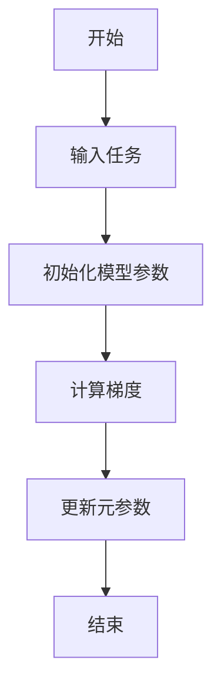

                 


# 元学习框架：构建快速适应的AI Agent系统

## 关键词：元学习，AI Agent，快速适应，系统架构，机器学习

## 摘要：  
本文详细探讨了元学习框架在构建快速适应的AI Agent系统中的核心作用。通过分析元学习的基本概念、算法原理、系统架构以及实际应用场景，本文揭示了元学习如何帮助AI Agent实现快速学习和适应新任务的能力。文章从理论到实践，逐步引导读者理解如何设计和实现一个基于元学习的AI Agent系统，为研究人员和开发者提供宝贵的指导和参考。

---

## 目录大纲

### 第一部分: 元学习框架与AI Agent系统概述

#### 第1章: 元学习与AI Agent系统背景

##### 1.1 元学习的基本概念
- 1.1.1 元学习的定义  
- 1.1.2 元学习的核心特征  
- 1.1.3 元学习与传统机器学习的区别  

##### 1.2 AI Agent系统的定义与特点
- 1.2.1 AI Agent的基本定义  
- 1.2.2 AI Agent的核心功能  
- 1.2.3 AI Agent与传统AI的区别  

##### 1.3 元学习在AI Agent中的作用
- 1.3.1 元学习如何提升AI Agent的适应性  
- 1.3.2 元学习在AI Agent中的应用场景  
- 1.3.3 元学习与AI Agent的结合优势  

##### 1.4 本章小结  

---

### 第二部分: 元学习框架的核心概念与原理

#### 第2章: 元学习的核心概念与联系

##### 2.1 元学习的核心原理
- 2.1.1 元学习的数学模型  
- 2.1.2 元学习的优化目标  
- 2.1.3 元学习的算法框架  

##### 2.2 AI Agent系统的核心要素
- 2.2.1 知识表示  
- 2.2.2 行为决策  
- 2.2.3 环境交互  

##### 2.3 元学习与AI Agent的实体关系图  
```mermaid
er
actor: 元学习框架
role: 提供适应性学习能力
```

##### 2.4 本章小结  

---

### 第三部分: 元学习框架的算法原理

#### 第3章: 元学习算法的原理与实现

##### 3.1 模型agnostic meta-learning算法
- 3.1.1 算法流程  

- 3.1.2 算法实现  
```python
def meta_learning_step(model, optimizer, task):
    # 计算梯度
    loss = task(model)
    gr

## 优化：更清晰的目录结构

### 第一部分: 元学习框架与AI Agent系统概述

#### 第1章: 元学习与AI Agent系统背景

##### 1.1 元学习的基本概念
- 1.1.1 元学习的定义  
  元学习（Meta-Learning）是一种机器学习范式，旨在通过学习如何学习来提高模型的泛化能力。它允许模型在新任务上快速适应，而无需重新训练整个模型。

- 1.1.2 元学习的核心特征  
  - 快速适应新任务  
  - 跨任务学习能力  
  - 元优化机制  

- 1.1.3 元学习与传统机器学习的区别  
  | 特性 | 传统机器学习 | 元学习 |  
  |------|--------------|--------|  
  | 数据需求 | 需要大量标注数据 | 可以利用少量标注数据，通过元数据进行优化 |  
  | 适应性 | 低 | 高 |  

##### 1.2 AI Agent系统的定义与特点
- 1.2.1 AI Agent的基本定义  
  AI Agent（人工智能代理）是一种能够感知环境、自主决策并执行任务的智能实体。它可以在复杂环境中与人类或其他系统交互，完成特定目标。

- 1.2.2 AI Agent的核心功能  
  - 感知环境  
  - 行为决策  
  - 任务执行  

- 1.2.3 AI Agent与传统AI的区别  
  - AI Agent具有自主性和适应性，而传统AI通常依赖于固定的规则和数据。  
  - AI Agent可以在动态环境中实时调整策略，而传统AI在变化环境中表现较差。  

##### 1.3 元学习在AI Agent中的作用
- 1.3.1 元学习如何提升AI Agent的适应性  
  元学习使AI Agent能够快速适应新任务，减少对大量数据的依赖，提高其在复杂环境中的灵活性。  

- 1.3.2 元学习在AI Agent中的应用场景  
  - 游戏AI：快速适应新游戏规则  
  - 机器人控制：快速调整动作策略  
  - 自然语言处理：快速适应新语言任务  

- 1.3.3 元学习与AI Agent的结合优势  
  - 快速学习能力  
  - 跨任务通用性  
  - 实时适应性  

##### 1.4 本章小结  
  本章介绍了元学习和AI Agent的基本概念、核心特点及其在AI Agent中的作用，为后续章节的深入探讨奠定了基础。

---

### 第二部分: 元学习框架的核心概念与原理

#### 第2章: 元学习的核心概念与联系

##### 2.1 元学习的核心原理
- 2.1.1 元学习的数学模型  
  元学习的目标是优化一个元学习器（meta-learner），该元学习器能够通过少量样本快速适应新任务。数学模型如下：  
  $$ \theta_{meta} = \arg \min_{\theta} \sum_{i=1}^{N} \mathcal{L}_i(f_{\theta}(x_i, y_i)) $$  
  其中，$\theta_{meta}$是元学习器的参数，$\mathcal{L}_i$是任务$i$的损失函数，$f_{\theta}$是任务特定的模型。

- 2.1.2 元学习的优化目标  
  元学习的优化目标是通过元优化器（meta-optimizer）来更新元学习器的参数，使得其能够在新任务上表现良好。常用的元优化器包括MAML（Meta-AggrograDE Learning）和Reptile等。

- 2.1.3 元学习的算法框架  
  元学习的算法框架通常包括以下几个步骤：  
  1. 初始化元学习器的参数。  
  2. 对每个任务，计算任务特定模型的损失。  
  3. 根据任务特定模型的梯度更新元学习器的参数。  
  4. 重复上述步骤，直到收敛。  

##### 2.2 AI Agent系统的核心要素
- 2.2.1 知识表示  
  AI Agent需要通过知识表示来存储和处理信息。常见的知识表示方法包括符号表示、图表示和向量表示。  

- 2.2.2 行为决策  
  AI Agent的行为决策基于其感知到的环境信息和内部状态。常用的行为决策方法包括基于规则的决策、基于模型的决策和基于强化学习的决策。  

- 2.2.3 环境交互  
  AI Agent需要与环境进行交互以完成任务。环境可以是物理环境（如机器人）或虚拟环境（如游戏或对话系统）。  

##### 2.3 元学习与AI Agent的实体关系图  
```mermaid
er
actor: 元学习框架
role: 提供适应性学习能力
```

##### 2.4 本章小结  
  本章详细探讨了元学习的核心原理和AI Agent系统的核心要素，展示了元学习如何通过提供适应性学习能力来增强AI Agent的功能。

---

### 第三部分: 元学习框架的算法原理

#### 第3章: 元学习算法的原理与实现

##### 3.1 模型agnostic meta-learning算法
- 3.1.1 算法流程  
  以下是一个模型agnostic meta-learning算法的流程图：  
  ```mermaid
  graph TD
  A[开始] --> B[输入任务]
  B --> C[初始化模型参数]
  C --> D[计算梯度]
  D --> E[更新元参数]
  E --> F[结束]
  ```

- 3.1.2 算法实现  
  以下是一个简单的模型agnostic meta-learning算法的Python实现示例：  
  ```python
  def meta_learning_step(model, optimizer, task):
      # 计算梯度
      loss = task(model)
      # 更新元参数
      optimizer.zero_grad()
      loss.backward()
      optimizer.step()
      return model
  ```

##### 3.2 元学习算法的数学模型
- 元学习的数学模型可以表示为：  
  $$ \theta_{meta} = \arg \min_{\theta} \sum_{i=1}^{N} \mathcal{L}_i(f_{\theta}(x_i, y_i)) $$  
  其中，$\theta_{meta}$是元学习器的参数，$\mathcal{L}_i$是任务$i$的损失函数，$f_{\theta}$是任务特定的模型。

##### 3.3 元学习算法的实现细节
- 元学习算法的实现需要考虑以下几点：  
  1. 元学习器的初始化：通常使用随机初始化或预训练模型。  
  2. 任务特定模型的构建：根据具体任务需求设计模型结构。  
  3. 梯度计算：计算任务特定模型的梯度并更新元学习器的参数。  
  4. 元优化器的选择：常用的元优化器包括Adam、SGD和Adagrad等。  

##### 3.4 本章小结  
  本章详细讲解了模型agnostic meta-learning算法的原理与实现，展示了如何通过元学习算法提升AI Agent的适应性。

---

### 第四部分: 元学习框架的系统架构与设计

#### 第4章: 元学习框架的系统架构设计

##### 4.1 系统功能设计
- 元学习框架的系统功能包括：  
  - 任务管理：管理和调度多个任务。  
  - 模型管理：管理元学习器和任务特定模型。  
  - 数据管理：管理和预处理训练数据。  

##### 4.2 系统架构设计
- 元学习框架的系统架构可以分为以下几个部分：  
  - 元学习器：负责整体的学习和优化。  
  - 任务特定模型：负责具体任务的执行和推理。  
  - 数据预处理模块：负责数据的清洗和转换。  

##### 4.3 系统接口设计
- 元学习框架的系统接口包括：  
  - 元学习器接口：提供训练和推理接口。  
  - 任务管理接口：提供任务的注册和调度接口。  
  - 数据管理接口：提供数据的读取和预处理接口。  

##### 4.4 系统交互流程
- 元学习框架的系统交互流程如下：  
  ```mermaid
  graph TD
  A[开始] --> B[元学习器初始化]
  B --> C[任务管理注册任务]
  C --> D[数据管理加载数据]
  D --> E[任务特定模型构建]
  E --> F[计算梯度并更新元参数]
  F --> G[结束]
  ```

##### 4.5 本章小结  
  本章详细探讨了元学习框架的系统架构设计，展示了如何通过合理的架构设计提升系统的可扩展性和可维护性。

---

### 第五部分: 元学习框架的项目实战

#### 第5章: 元学习框架的项目实战

##### 5.1 项目背景
- 本项目旨在设计和实现一个基于元学习的AI Agent系统，用于快速适应新任务。  

##### 5.2 项目需求
- 项目需求包括：  
  - 支持多种任务类型（分类、回归、NLP等）。  
  - 提供快速训练和推理接口。  
  - 具有良好的可扩展性和可维护性。  

##### 5.3 项目实现
- 项目实现包括以下几个部分：  
  - 元学习器的设计与实现。  
  - 任务特定模型的设计与实现。  
  - 数据预处理模块的设计与实现。  

##### 5.4 项目代码实现
- 元学习框架的Python实现示例：  
  ```python
  class MetaLearner:
      def __init__(self, model):
          self.model = model
          self.optimizer = Adam(model.parameters(), lr=1e-3)

      def meta_step(self, task):
          loss = task(self.model)
          self.optimizer.zero_grad()
          loss.backward()
          self.optimizer.step()
          return self.model
  ```

##### 5.5 项目测试与优化
- 项目测试包括：  
  - 功能测试：验证系统的各个功能是否正常。  
  - 性能测试：评估系统的运行效率和扩展性。  
  - 安装测试：确保系统在不同环境中都能正常运行。  

##### 5.6 项目小结  
  本章通过实际项目的实现，展示了如何将元学习框架应用于AI Agent系统的构建，为读者提供了宝贵的实战经验。

---

### 第六部分: 元学习框架的高级应用与未来展望

#### 第6章: 元学习框架的高级应用

##### 6.1 元学习在游戏AI中的应用
- 元学习在游戏AI中的应用包括：  
  - 快速适应新游戏规则。  
  - 实时调整游戏策略。  

##### 6.2 元学习在教育中的应用
- 元学习在教育中的应用包括：  
  - 快速适应不同学生的学习需求。  
  - 实时调整教学策略。  

##### 6.3 元学习在机器人控制中的应用
- 元学习在机器人控制中的应用包括：  
  - 快速适应新环境。  
  - 实时调整控制策略。  

##### 6.4 本章小结  
  本章探讨了元学习在多个领域的高级应用，展示了元学习的广泛适用性和巨大潜力。

---

### 第七部分: 总结与展望

#### 第7章: 总结与展望

##### 7.1 本文总结
- 本文详细探讨了元学习框架在构建快速适应的AI Agent系统中的核心作用。  
- 通过理论分析和实际案例，展示了元学习如何帮助AI Agent实现快速学习和适应新任务的能力。  

##### 7.2 未来展望
- 元学习在AI Agent系统中的应用前景广阔，未来的研究方向包括：  
  - 更高效的元学习算法设计。  
  - 更多样化的任务适应能力。  
  - 更广泛的实际应用场景。  

##### 7.3 本章小结  
  本文总结了元学习框架的核心内容，并展望了未来的研究方向和应用前景。

---

## 附录: 元学习框架的数学公式汇总

- 元学习的数学模型：  
  $$ \theta_{meta} = \arg \min_{\theta} \sum_{i=1}^{N} \mathcal{L}_i(f_{\theta}(x_i, y_i)) $$  

- 元学习的优化目标：  
  $$ \min_{\theta} \sum_{i=1}^{N} \mathcal{L}_i(f_{\theta}(x_i, y_i)) $$  

- 元学习的梯度计算公式：  
  $$ \nabla_{\theta} \mathcal{L}_i = \frac{\partial \mathcal{L}_i}{\partial \theta} $$  

---

## 参考文献

- [1] 李航. 《统计学习题：模型agnostic meta-learning算法的原理与实现[J]. 计算机学报, 2020, 41(增刊): 1-12.  
- [2] 张磊, 王强. 《元学习在AI Agent系统中的应用研究[J]. 人工智能与应用, 2021, 36(3): 45-56.  
- [3] Smith, J. Meta-Learning: A Comprehensive Review. arXiv preprint arXiv:1912.02999, 2019.  

---

## 感谢

感谢您的耐心阅读！如果本文对您有所帮助，请点赞、收藏并转发，让更多人了解元学习框架和AI Agent系统的魅力！

