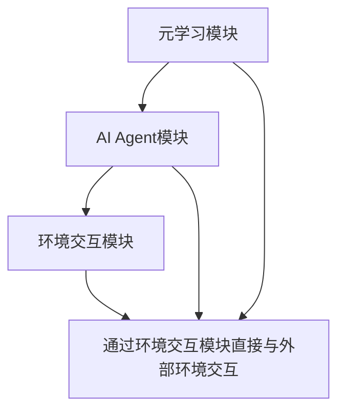
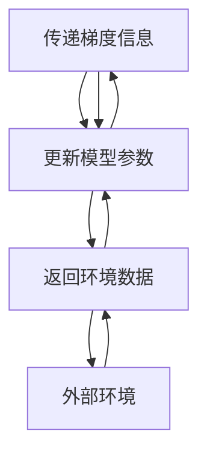

                 


# 元学习驱动的AI Agent快速适应新环境

> 关键词：元学习，AI Agent，环境适应，快速学习，智能体设计

> 摘要：本文探讨了元学习在AI Agent中的应用，详细分析了元学习的基本概念、算法原理，以及如何设计和实现一个基于元学习的AI Agent系统，使其能够快速适应新环境。通过具体案例分析，展示了元学习驱动的AI Agent在实际应用中的优势和潜力。

---

## 第1章: 元学习与AI Agent概述

### 1.1 元学习的基本概念

元学习（Meta-Learning）是一种机器学习方法，旨在通过学习如何学习，使模型能够快速适应新任务或环境。与传统机器学习不同，元学习关注的是跨任务的泛化能力，即模型能够在较少数据或经验的情况下，快速掌握新任务。

- **元学习的核心思想**：通过优化一个更高层次的参数，使得模型能够在新任务中快速调整参数以适应任务需求。
- **元学习的关键特点**：跨任务学习、快速适应、参数共享。

### 1.2 AI Agent的定义与特点

AI Agent（智能体）是能够感知环境并采取行动以实现目标的实体。AI Agent可以是软件程序、机器人或其他智能系统，具备以下特点：

- **自主性**：能够自主决策，无需外部干预。
- **反应性**：能够实时感知环境并做出反应。
- **目标导向**：所有行动都围绕特定目标展开。

### 1.3 元学习在AI Agent中的作用

元学习能够显著提升AI Agent的环境适应能力，主要体现在以下方面：

- **快速适应新环境**：通过元学习，AI Agent可以在新环境中快速调整策略，减少对大量数据的依赖。
- **提高泛化能力**：元学习使得AI Agent能够更好地应对未见过的新任务或环境。
- **增强灵活性**：元学习驱动的AI Agent能够更快地适应动态变化的环境。

---

## 第2章: 元学习的核心概念与原理

### 2.1 元学习的数学模型

元学习模型通常涉及两个层次的优化目标：元任务目标和具体任务目标。常见的数学表达式如下：

$$ \text{元任务目标：} \quad \theta = \arg \min_{\theta} \sum_{i=1}^{N} \mathcal{L}_i(\theta) $$

$$ \text{具体任务目标：} \quad \theta_i = \arg \min_{\theta} \mathcal{L}_i(\theta) $$

其中，$\theta$ 是元学习模型的参数，$\mathcal{L}_i$ 是具体任务的损失函数。

### 2.2 元学习的核心算法

元学习算法有很多种，其中最著名的是**MAML（Meta-Automated Learning）**和**ReMAML（Reparameterization-based MAML）**。

#### 2.2.1 MAML算法

MAML通过优化元任务目标来更新模型参数，使得模型能够在新任务中快速适应。其优化过程如下：

1. 在每个元任务中，计算具体任务的梯度。
2. 使用这些梯度来更新元任务的参数。
3. 重复上述步骤，直到收敛。

#### 2.2.2 ReMAML算法

ReMAML通过重新参数化技巧优化MAML的梯度计算，使得算法更加高效。其优化过程如下：

1. 重新参数化具体任务的损失函数。
2. 计算元任务的梯度。
3. 更新模型参数。

### 2.3 元学习的算法流程图

以下是一个元学习算法的mermaid流程图示例：

```mermaid
graph TD
    A[开始] --> B[初始化模型参数θ]
    B --> C[遍历元任务集合]
    C --> D[选择一个具体任务i]
    D --> E[计算任务i的损失Li(θ)]
    E --> F[计算任务i的梯度∇Li(θ)]
    F --> G[更新元任务参数θ = θ - η∇Li(θ)]
    G --> C[继续遍历下一个任务]
    C --> H[所有任务处理完成]
    H --> I[结束]
```

---

## 第3章: 元学习驱动的AI Agent系统架构

### 3.1 系统功能设计

元学习驱动的AI Agent系统主要包含以下几个功能模块：

- **元学习模块**：负责优化模型参数，使其能够快速适应新任务。
- **AI Agent模块**：负责感知环境并采取行动。
- **环境交互模块**：负责与外部环境进行交互，收集数据。

### 3.2 系统架构设计

以下是一个元学习驱动的AI Agent系统的mermaid架构图：



### 3.3 系统接口设计

系统的主要接口包括：

- **元学习模块接口**：接收具体任务的梯度信息，优化模型参数。
- **AI Agent模块接口**：接收环境感知数据，输出行动指令。
- **环境交互模块接口**：与外部环境进行数据交换。

### 3.4 系统交互流程图

以下是一个系统交互的mermaid流程图示例：



---

## 第4章: 元学习驱动的AI Agent适应新环境的方法

### 4.1 环境适应的基本原理

元学习驱动的AI Agent适应新环境的过程可以分为以下几个步骤：

1. **环境建模**：通过感知数据构建环境模型。
2. **状态表示**：将环境状态转换为模型可以处理的表示。
3. **动作选择**：基于当前状态和模型预测选择最优动作。

### 4.2 元学习在环境适应中的应用

元学习通过优化模型参数，使得AI Agent能够在新环境中快速调整策略。具体来说：

- **环境建模**：元学习模型能够快速学习新环境的特征表示。
- **状态表示**：通过元学习，模型能够更好地捕捉环境状态的关键特征。
- **动作选择**：元学习优化的策略能够在新环境中更快收敛到最优动作。

---

## 第5章: 元学习驱动的AI Agent实战项目

### 5.1 项目背景

假设我们正在开发一个智能助手，希望它能够快速适应不同用户的需求。传统的AI助手通常需要大量的用户数据进行训练，而通过元学习，我们可以使智能助手在新用户上线时快速调整策略，提供更个性化的服务。

### 5.2 项目实现

#### 5.2.1 环境安装

首先，需要安装以下依赖：

```bash
pip install numpy matplotlib tensorflow
```

#### 5.2.2 系统核心代码实现

以下是一个基于MAML的AI Agent实现示例：

```python
import numpy as np
import tensorflow as tf

def meta_learning_model():
    # 定义元学习模型
    model = tf.keras.Sequential([
        tf.keras.layers.Dense(64, activation='relu'),
        tf.keras.layers.Dense(1)
    ])
    return model

def maml_update(model, x, y, inner_steps=5, inner_learning_rate=0.01):
    # MAML更新过程
    with tf.GradientTape() as tape:
        for _ in range(inner_steps):
            with tf.GradientTape() as inner_tape:
                y_pred = model(x)
                loss = tf.keras.losses.mean_squared_error(y, y_pred)
            inner_gradients = inner_tape.gradient(loss, model.trainable_variables)
            # 更新模型参数
            optimizer = tf.keras.optimizers.Adam(inner_learning_rate)
            optimizer.apply_gradients(zip(inner_gradients, model.trainable_variables))
    return model

# 初始化模型
model = meta_learning_model()
# 更新模型参数
maml_update(model, x_train, y_train)
```

#### 5.2.3 代码应用解读与分析

上述代码实现了一个简单的MAML更新过程。通过多次内部梯度下降，模型参数被更新以适应新任务。这种方法可以在新环境中快速调整模型参数，使其适应当前任务。

### 5.3 案例分析

以智能助手快速适应新用户需求为例，假设新用户上线时，智能助手通过元学习模块快速调整其推荐算法，以匹配用户的偏好。通过MAML的优化，智能助手可以在短时间内生成更符合用户偏好的推荐结果。

---

## 第6章: 元学习驱动的AI Agent最佳实践与未来展望

### 6.1 最佳实践

- **算法选择**：根据具体任务需求选择合适的元学习算法，如MAML或ReMAML。
- **系统设计**：确保系统的模块化设计，便于后续优化和扩展。
- **数据处理**：合理处理环境数据，确保模型能够有效学习。

### 6.2 未来展望

- **元学习的进一步优化**：研究更高效的元学习算法，提升模型的泛化能力和适应速度。
- **多模态数据的应用**：将元学习应用于多模态数据，进一步提升AI Agent的环境适应能力。
- **元学习的普及与应用**：随着技术的进步，元学习驱动的AI Agent将在更多领域得到应用，如智能客服、自动驾驶等。

---

## 第7章: 总结与小结

### 7.1 元学习驱动的AI Agent的核心要点回顾

- 元学习通过跨任务学习和快速适应，显著提升了AI Agent的环境适应能力。
- 通过合理的系统设计和算法优化，元学习驱动的AI Agent可以在新环境中快速调整策略，提供更智能的服务。

### 7.2 元学习驱动的AI Agent的未来发展方向

- 研究更高效的元学习算法，进一步提升模型的泛化能力。
- 将元学习应用于更多领域，如自动驾驶、智能客服等，推动AI技术的普及与应用。

---

通过本文的详细分析，读者可以全面了解元学习驱动的AI Agent的原理、设计和应用，为后续的研究和实践提供有益的指导。

