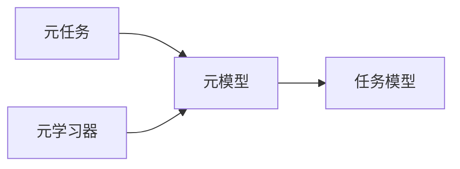
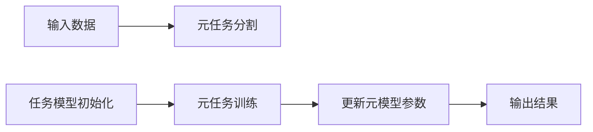
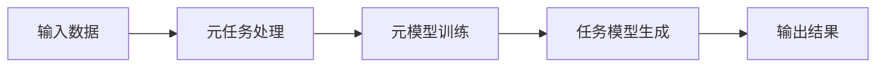

                 

# 元学习：让AI Agent学会如何学习

## 关键词

- 元学习
- AI Agent
- 元学习算法
- 系统架构设计
- 项目实战

## 摘要

元学习是一种新兴的机器学习范式，它允许AI Agent在不同的任务之间进行归纳和推理，从而在有限的数据和经验下快速适应新任务。本文将详细探讨元学习的核心概念、算法原理、系统架构设计以及实际项目中的应用。通过理论与实践相结合的方式，帮助读者深入理解元学习的原理和应用场景，掌握如何设计和实现高效的元学习系统。

---

# 目录大纲

## 第一部分: 元学习基础与核心概念

### 第1章: 元学习的背景与问题背景

#### 1.1 元学习的定义与核心概念
- 元学习的定义
- 元学习的核心概念：元任务、元模型、元学习器
- 元学习与传统机器学习的对比

#### 1.2 元学习的问题背景
- 传统机器学习的局限性
- 元学习解决的问题：数据不足、任务多样性
- 元学习的应用场景：快速适应新任务、小样本学习

#### 1.3 元学习的重要性与未来趋势
- 元学习在AI Agent中的作用
- 元学习的未来发展
- 元学习对AI Agent的潜在影响

### 第2章: 元学习的核心概念与联系

#### 2.1 元学习框架的构成
- 元任务的定义与特征
- 元模型的定义与属性
- 元学习的优化目标与策略

#### 2.2 元学习的核心要素
- 元任务的特征：任务多样性、小样本性
- 元模型的属性：通用性、适应性
- 元学习的优化策略：梯度优化、记忆机制

#### 2.3 元学习框架的ER实体关系图

---

## 第二部分: 元学习算法原理

### 第3章: 元学习算法的核心思想与实现

#### 3.1 元学习算法的核心思想
- 元学习的归纳推理
- 元学习的迁移能力
- 元学习的适应性

#### 3.2 主流元学习算法介绍
- MAML算法
- ReMAML算法
- Meta-SGD算法

#### 3.3 元学习算法的流程图

#### 3.4 元学习算法的数学模型与公式
- 元任务的数学表示：$y = f(x)$
- 元模型的数学表示：$\theta = \{ \theta_1, \theta_2, ..., \theta_n \}$
- 元学习算法的优化目标：$\min_{\theta} \sum_{i=1}^n L_i(\theta)$

---

### 第4章: 元学习的数学模型与公式

#### 4.1 元学习的数学模型
- 元任务的数学表示：$y = f(x)$
- 元模型的数学表示：$\theta = \{ \theta_1, \theta_2, ..., \theta_n \}$
- 元学习的优化目标：$\min_{\theta} \sum_{i=1}^n L_i(\theta)$

#### 4.2 元学习算法的详细推导
- MAML算法的推导：$\theta = \arg \min_{\theta} \sum_{i=1}^n L_i(\theta)$
- ReMAML算法的改进：$\theta = \arg \min_{\theta} \sum_{i=1}^n L_i(\theta_i)$
- Meta-SGD算法的实现：$\theta = \arg \min_{\theta} \sum_{i=1}^n L_i(\theta)$

---

## 第三部分: 元学习的系统架构与设计

### 第5章: 元学习系统的架构设计

#### 5.1 问题场景与需求分析
- 问题场景：快速适应新任务
- 需求分析：任务多样性、小样本学习

#### 5.2 系统功能设计
- 元任务处理模块
- 元模型训练模块
- 任务模型生成模块

#### 5.3 系统架构设计

#### 5.4 接口设计与交互流程
- 元任务处理接口
- 元模型训练接口
- 任务模型生成接口

---

## 第四部分: 项目实战

### 第6章: 元学习项目的实战与实现

#### 6.1 项目环境搭建
- 环境安装：Python 3.8+
- 依赖库安装：TensorFlow、Keras、PyTorch
- 数据集准备：CIFAR-10、MNIST

#### 6.2 系统核心实现
- 元任务处理模块的实现
- 元模型训练模块的实现
- 任务模型生成模块的实现

#### 6.3 代码实现与解读
- 元学习算法的代码实现
- 系统架构的代码实现
- 系统功能的代码实现

#### 6.4 实际案例分析
- 元学习在图像分类中的应用
- 元学习在自然语言处理中的应用
- 元学习在推荐系统中的应用

---

## 第五部分: 最佳实践与总结

### 第7章: 元学习的总结与展望

#### 7.1 元学习的最佳实践
- 元任务设计的技巧
- 元模型选择的策略
- 元学习算法的优化

#### 7.2 小结
- 元学习的核心思想
- 元学习的应用场景
- 元学习的未来发展

#### 7.3 注意事项
- 数据质量的影响
- 算法选择的策略
- 系统设计的注意事项

#### 7.4 拓展阅读
- 元学习的最新研究
- 元学习的开源工具
- 元学习的未来趋势

---

通过以上目录大纲，我们可以看到，本文将从元学习的基本概念出发，逐步深入探讨其算法原理、系统架构设计以及实际项目中的应用。通过理论与实践相结合的方式，帮助读者全面掌握元学习的核心思想和实现方法。

