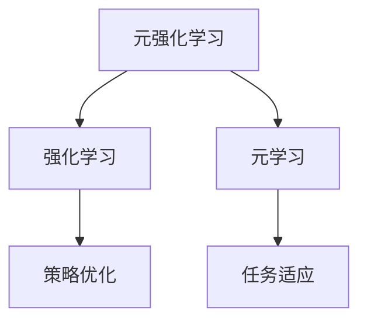
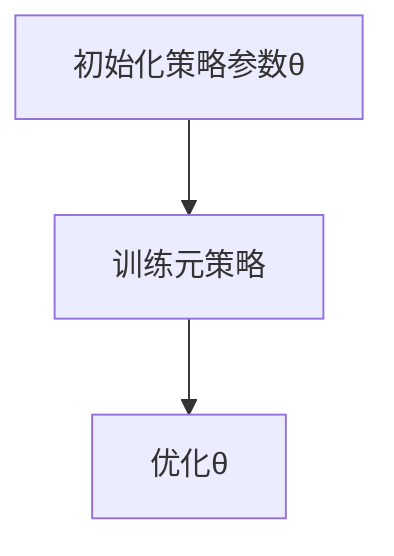
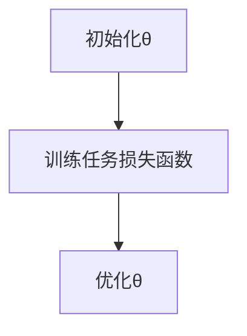
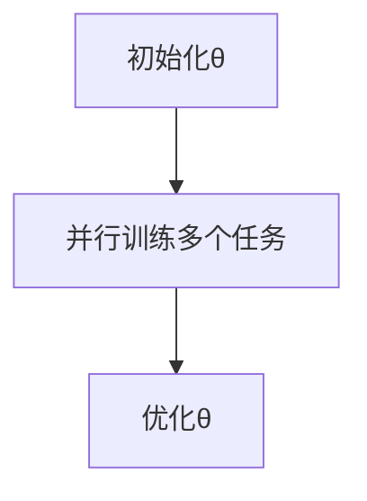
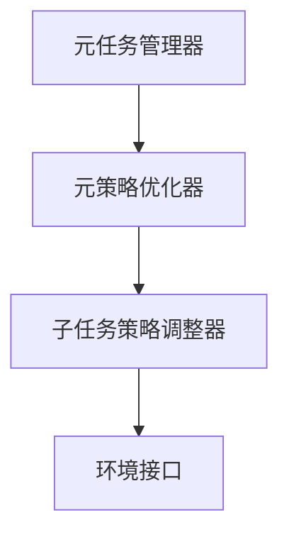

                 


# 元强化学习：优化AI Agent的学习策略

> **关键词**：元强化学习，强化学习，人工智能，AI代理，学习策略，优化方法，算法实现

> **摘要**：元强化学习是一种新兴的人工智能技术，它通过优化AI Agent的学习策略，使其能够在复杂环境中快速适应和决策。本文从基础概念、核心原理、算法实现到实际应用，全面解析元强化学习的奥秘，帮助读者掌握这一前沿技术。

---

## 第一部分：背景介绍

### 第1章：元强化学习概述

#### 1.1 强化学习的基本概念
- **定义**：强化学习是一种通过智能体与环境交互来学习策略的方法，目标是在环境中获得最大化的累积奖励。
- **基本组成**：
  - 状态（State）：环境的当前情况。
  - 行动（Action）：智能体的选择。
  - 奖励（Reward）：对智能体行为的反馈。
  - 策略（Policy）：智能体选择动作的概率分布。
- **学习目标**：通过试错，找到最优策略，最大化累积奖励。

#### 1.2 元强化学习的定义与特点
- **定义**：元强化学习（Meta-Reinforcement Learning）是一种通过元学习（Meta-Learning）框架优化强化学习（Reinforcement Learning）策略的方法，旨在提升智能体在多任务或多环境中的快速适应能力。
- **特点**：
  - **元知识**：学习如何快速适应新任务。
  - **泛化能力**：在新环境中快速调整策略。
  - **高效性**：减少样本需求，加速学习过程。

#### 1.3 元强化学习的研究背景与应用
- **背景**：随着人工智能的快速发展，强化学习在机器人控制、游戏AI、自动驾驶等领域取得了显著成果，但其在复杂动态环境中的适应性和效率仍需提升。
- **应用**：广泛应用于机器人控制、游戏AI、自动驾驶、推荐系统等场景。

---

### 第2章：元强化学习的核心概念与背景

#### 2.1 元学习的核心概念
- **元学习的定义**：通过学习如何学习，掌握快速适应新任务的能力。
- **元知识**：包括任务之间的关系、策略的调整方式等。

#### 2.2 元强化学习与强化学习的区别
| 特性             | 强化学习                  | 元强化学习               |
|------------------|--------------------------|--------------------------|
| 学习目标         | 优化单任务策略            | 优化多任务的元策略        |
| 适应性           | 针对特定环境              | 针对多个或未知环境          |
| 学习效率         | 需大量样本               | 通过元学习减少样本需求    |

#### 2.3 元强化学习的核心要素
- **元任务**：多个相关任务的集合，用于训练元策略。
- **元策略**：指导智能体如何快速调整策略以适应新任务。
- **任务适应**：智能体根据元知识快速调整策略的能力。

---

## 第二部分：元强化学习的核心概念与联系

### 第3章：元强化学习的核心原理

#### 3.1 元强化学习的原理
- **元任务训练**：通过训练多个任务，学习如何快速适应新任务。
- **策略优化**：元策略指导智能体在新任务中调整策略，以最大化累积奖励。

#### 3.2 元强化学习与其他相关概念的联系

| 概念         | 定义                           | 与元强化学习的关系           |
|--------------|--------------------------------|----------------------------|
| 迁移学习     | 利用已学习的知识辅助新任务      | 元强化学习通过元知识实现迁移 |
| 多任务学习   | 同时学习多个任务               | 元强化学习是一种多任务学习形式 |
| 元推理       | 推理如何进行推理               | 元强化学习涉及策略的元推理     |

#### 3.3 元强化学习的ER实体关系图


---

## 第三部分：元强化学习的算法原理

### 第4章：元强化学习算法的概述

#### 4.1 元学习算法的基本流程
1. **初始化**：设定初始策略参数。
2. **元任务训练**：在多个任务上训练元策略。
3. **策略调整**：根据元策略调整子任务策略。
4. **优化**：通过梯度下降优化元策略参数。

#### 4.2 元强化学习算法的分类
- **基于模型的元强化学习**：学习环境模型，指导策略调整。
- **无模型的元强化学习**：直接优化策略，无需环境模型。

---

### 第5章：元强化学习算法的实现

#### 5.1 Meta-Q-Learning算法

##### 5.1.1 算法流程


##### 5.1.2 算法代码实现
```python
import numpy as np

def meta_q_learning(env, num_tasks, episodes):
    theta = np.random.randn()  # 初始策略参数
    for episode in range(episodes):
        for task in range(num_tasks):
            # 训练元策略
            states, actions, rewards = [], [], []
            state = env.reset(task)
            while not done:
                action = choose_action(state, theta)
                next_state, reward, done = env.step(action)
                states.append(state)
                actions.append(action)
                rewards.append(reward)
            # 优化theta
            theta += learning_rate * compute_gradient(theta, states, actions, rewards)
    return theta
```

#### 5.2 Model-Agnostic Meta-Learning (MAML)算法

##### 5.2.1 算法流程


##### 5.2.2 算法代码实现
```python
def maml_algorithm(env, theta, inner_steps, outer_steps):
    for outer_step in range(outer_steps):
        # 训练任务损失函数
        for task in range(num_tasks):
            gradients = []
            for inner_step in range(inner_steps):
                state = env.reset(task)
                done = True
                while not done:
                    action = choose_action(state, theta)
                    next_state, reward, done = env.step(action)
                    # 计算梯度
                    gradients.append(compute_gradient(theta, state, action, reward))
            # 外层优化
            theta += outer_learning_rate * sum(gradients)
    return theta
```

#### 5.3 多任务强化学习算法

##### 5.3.1 算法流程


##### 5.3.2 算法代码实现
```python
def multi_task_reinforcement_learning(env, theta, episodes):
    for episode in range(episodes):
        tasks = env.get_all_tasks()
        for task in tasks:
            state = env.reset(task)
            done = True
            while not done:
                action = choose_action(state, theta)
                next_state, reward, done = env.step(action)
                # 更新策略
                theta += learning_rate * compute_gradient(theta, state, action, reward)
    return theta
```

---

## 第四部分：系统分析与架构设计

### 第6章：元强化学习系统分析

#### 6.1 元强化学习系统的设计目标
- **高效性**：快速适应新任务。
- **通用性**：适用于多种环境和任务。
- **可扩展性**：支持增加新任务。

#### 6.2 元强化学习系统的功能模块
| 模块             | 功能描述                     |
|------------------|-----------------------------|
| 环境接口         | 提供与外部环境交互的接口     |
| 元任务管理器     | 管理多个元任务               |
| 元策略优化器     | 优化元策略参数               |
| 子任务策略调整器 | 根据元策略调整子任务策略     |

#### 6.3 系统架构图


---

## 第五部分：项目实战

### 第7章：元强化学习项目实现

#### 7.1 项目环境安装
```bash
pip install gym numpy tensorflow
```

#### 7.2 核心代码实现
```python
import gym
import numpy as np
import tensorflow as tf

# 定义环境
env = gym.make('CartPole-v0')

# 元策略优化器
class MetaOptimizer:
    def __init__(self, learning_rate):
        self.lr = learning_rate
        self.theta = tf.Variable(tf.random.normal([env.observation_space.shape[0], 1]))

    def optimize(self, gradients):
        optimizer = tf.keras.optimizers.Adam(learning_rate=self.lr)
        optimizer.apply_gradients(zip([self.theta], [-np.mean(gradients)]))
        return self.theta

# 子任务策略调整器
class PolicyAdjuster:
    def __init__(self, theta):
        self.theta = theta

    def adjust_policy(self, state):
        return np.argmax(np.dot(state, self.theta))
```

#### 7.3 代码应用解读
- **MetaOptimizer**：负责优化元策略参数。
- **PolicyAdjuster**：根据元策略调整子任务策略。

#### 7.4 案例分析与总结
通过训练多个子任务，元策略能够快速调整子任务策略，显著提升智能体在新环境中的表现。

---

## 第六部分：最佳实践与总结

### 第8章：元强化学习的最佳实践

#### 8.1 实践建议
- **选择合适的算法**：根据任务需求选择Meta-Q-Learning、MAML等算法。
- **环境设计**：确保环境多样性，提升元策略的泛化能力。
- **参数调优**：通过实验调整学习率、任务数量等参数。

#### 8.2 小结
元强化学习通过优化元策略，显著提升了智能体的学习效率和适应能力，是未来人工智能领域的重要研究方向。

#### 8.3 注意事项
- 避免过度拟合元任务，确保泛化能力。
- 合理设计奖励机制，引导正确的学习方向。

#### 8.4 拓展阅读
推荐阅读相关论文和书籍，深入理解元强化学习的数学原理和最新研究成果。

---

**总结**：元强化学习通过优化AI Agent的学习策略，使其在复杂环境中表现出色。本文从基础到实践，全面解析了元强化学习的核心概念、算法实现和应用场景，为读者提供了深入的技术洞察。

