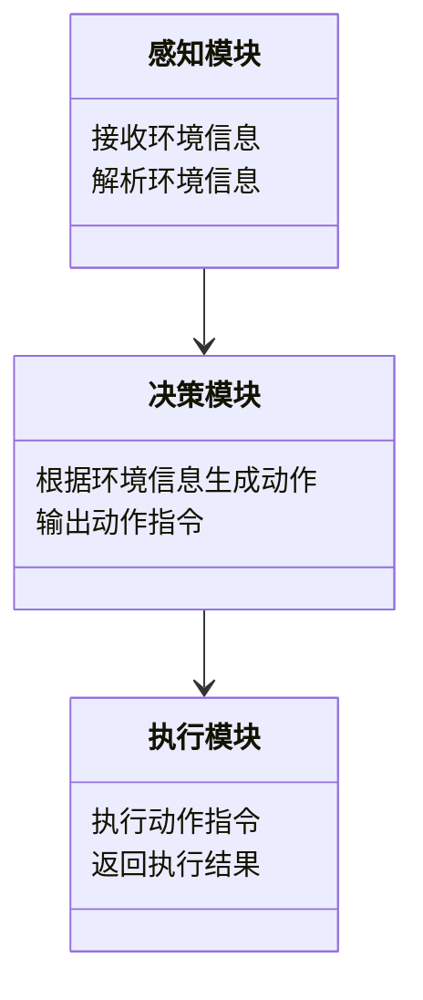
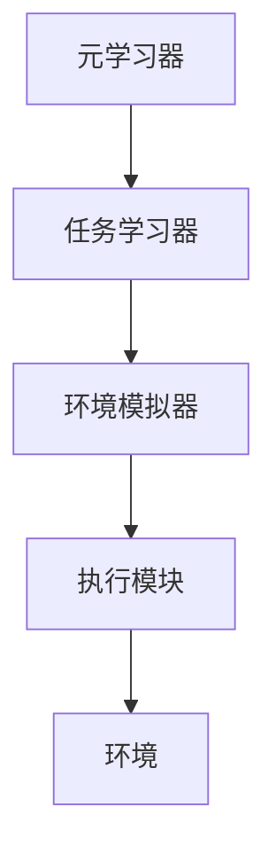
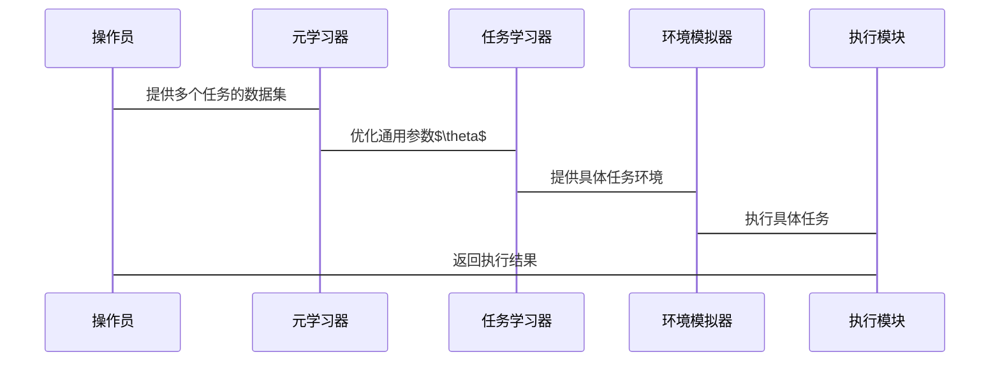

                 


# 元强化学习：提高AI Agent在新环境中的适应能力

> 关键词：元强化学习，AI Agent，环境适应，强化学习，快速学习

> 摘要：本文深入探讨元强化学习（Meta-Reinforcement Learning）的概念、算法原理及其在提高AI Agent适应新环境能力中的应用。通过分析元强化学习的核心机制、算法实现及其与传统强化学习的区别，本文为读者提供一个全面的视角，理解如何通过元强化学习使AI Agent在动态环境中快速适应并优化决策策略。

---

# 第一部分：元强化学习的背景与概念

## 第1章：元强化学习的背景与发展

### 1.1 元强化学习的起源与发展

#### 1.1.1 强化学习的基本概念
强化学习（Reinforcement Learning, RL）是一种机器学习范式，其中智能体通过与环境交互，学习如何采取一系列行动以最大化累积奖励。智能体在环境中执行动作，观察状态变化，并根据奖励信号调整策略，最终学习到一个最优的决策策略。

#### 1.1.2 元强化学习的定义与特点
元强化学习（Meta-Reinforcement Learning, Meta-RL）是在强化学习基础上的高级应用，旨在使AI Agent在新环境中快速适应并学习最优策略。与传统强化学习不同，元强化学习关注的是如何在多个任务或环境中快速迁移和适应，而不必从头开始学习每一个新任务。

#### 1.1.3 元强化学习与传统强化学习的区别
| 特性 | 强化学习 | 元强化学习 |
|------|----------|------------|
| 学习目标 | 单一任务 | 多个任务或动态环境 |
| 适应性 | 低 | 高 |
| 训练时间 | 长 | 短 |
| 应用场景 | 固定环境 | 动态或未知环境 |

### 1.2 元强化学习的核心问题

#### 1.2.1 环境动态变化的挑战
在现实应用中，环境通常是动态变化的，例如游戏规则的变化、任务目标的调整或物理环境的改变。传统的强化学习方法在这种情况下往往需要重新训练，导致适应成本高且效率低下。

#### 1.2.2 快速适应新环境的需求
在许多实际场景中，AI Agent需要快速适应新环境并执行任务，例如自动驾驶在不同道路条件下的调整，或者机器人在新任务中的快速部署。元强化学习通过预先学习环境的通用特征，能够在新环境中快速找到最优策略。

#### 1.2.3 元强化学习的解决方案
元强化学习通过在元学习阶段（Meta-Learning Phase）学习环境的通用特征，使AI Agent能够在新环境中快速调整策略，减少对新环境的适应时间。这种方法通过优化策略的泛化能力，提高了AI Agent在动态环境中的适应性。

### 1.3 元强化学习的应用场景

#### 1.3.1 游戏AI中的应用
在游戏AI中，元强化学习可以用于训练AI在不同规则或对手策略下的快速适应能力。例如，在策略游戏中，AI可以通过元强化学习快速调整策略以应对对手的变化。

#### 1.3.2 智能机器人控制
智能机器人需要在动态环境中执行任务，例如家庭服务机器人需要在不同家庭环境中调整行为策略。元强化学习可以帮助机器人快速适应新环境，提高任务执行效率。

#### 1.3.3 自动驾驶中的应用
自动驾驶汽车需要在复杂的交通环境中实时调整驾驶策略。元强化学习可以通过预学习交通规则和驾驶场景，使自动驾驶系统在新环境中快速做出最优决策。

### 1.4 本章小结
本章介绍了元强化学习的基本概念、核心问题及其与传统强化学习的区别，强调了元强化学习在动态环境中的适应性优势，并通过具体应用场景展示了其广泛的应用前景。

---

## 第2章：元强化学习的核心概念与联系

### 2.1 元强化学习的原理与机制

#### 2.1.1 元学习机制的数学模型
元学习的目标是学习一个能够在多个任务中快速适应的通用策略。其数学模型通常包括两个阶段：元学习阶段和任务学习阶段。

- 元学习阶段：通过优化元参数，使模型能够快速适应新任务。
- 任务学习阶段：在具体任务中，通过调整元参数，快速找到最优策略。

#### 2.1.2 元强化学习的框架设计
元强化学习的框架通常包括以下组件：
1. **元学习器（Meta-Learner）**：负责学习环境的通用特征。
2. **任务学习器（Task-Learner）**：在具体任务中，基于元学习器的输出快速调整策略。

### 2.2 元强化学习与相关概念的对比

#### 2.2.1 元强化学习与迁移学习的对比
| 元强化学习 | 迁移学习 |
|------------|----------|
| 关注快速适应新任务 | 关注跨任务的知识迁移 |
| 强调策略的泛化能力 | 强调任务间的知识共享 |
| 适用于动态环境 | 适用于静态环境 |

#### 2.2.2 元强化学习与自适应学习的对比
| 元强化学习 | 自适应学习 |
|------------|------------|
| 预先学习环境的通用特征 | 实时调整模型参数 |
| 快速适应新任务 | 逐步适应环境变化 |
| 适用于离线预训练 | 适用于在线学习 |

#### 2.2.3 元强化学习与在线学习的对比
| 元强化学习 | 在线学习 |
|------------|----------|
| 预先学习环境的特征 | 实时与环境交互学习 |
| 快速适应新任务 | 逐步优化策略 |
| 适用于离线预训练 | 适用于实时动态环境 |

### 2.3 本章小结
本章详细介绍了元强化学习的核心概念、数学模型及其与相关概念的对比，帮助读者更好地理解元强化学习的原理和优势。

---

## 第3章：元强化学习的算法原理

### 3.1 元强化学习的主流算法

#### 3.1.1 Model-Agnostic Meta-Learning (MAML)
MAML是一种基于模型无关的元学习算法，适用于多种任务和环境。其核心思想是在元学习阶段优化一个通用的参数，使得在任务学习阶段能够快速适应新任务。

#### 3.1.2 Reptile Meta-Learning (ReMAML)
ReMAML是一种通过迭代更新参数来实现元学习的算法，特别适用于强化学习场景。其优化过程简单且计算效率高。

#### 3.1.3 其他元强化学习算法
包括基于神经网络的元学习算法，如Meta-Q-Learning等。

### 3.2 MAML算法的数学模型

#### 3.2.1 MAML的目标函数
MAML的目标是最小化所有任务上的损失函数之和，通过优化通用参数$\theta$，使在每个任务上的损失函数达到最小。

$$ L_{meta}(\theta) = \sum_{i=1}^{N} L_i(\theta) $$

#### 3.2.2 MAML的优化过程
在MAML算法中，优化过程包括两个阶段：
1. **内层优化**：针对每个任务，优化特定参数$\phi_i$以最小化该任务的损失。
2. **外层优化**：通过梯度下降优化通用参数$\theta$，使所有任务的内层优化结果最优。

### 3.3 MAML算法的实现步骤

#### 3.3.1 算法输入与初始化
- 输入：多个任务的数据集，初始参数$\theta_0$。
- 输出：优化后的通用参数$\theta^*$。

#### 3.3.2 元学习的梯度计算
计算每个任务的梯度，并对这些梯度进行平均或加权，以更新通用参数。

$$ \theta_{t+1} = \theta_t - \eta \sum_{i=1}^{N} \nabla_{\theta} L_i(\theta_t) $$

#### 3.3.3 参数更新与优化
通过迭代优化通用参数$\theta$，使所有任务的损失函数达到最优。

### 3.4 其他元强化学习算法的对比

#### 3.4.1 ReMAML算法的优缺点
- 优点：优化过程简单，计算效率高。
- 缺点：可能需要更多的任务数据，且对任务间差异的适应能力较弱。

### 3.5 本章小结
本章详细介绍了元强化学习的主要算法，包括MAML和ReMAML的数学模型和优化过程，并对比了不同算法的优缺点。

---

## 第4章：元强化学习的系统分析与架构设计

### 4.1 项目介绍

#### 4.1.1 问题场景介绍
假设我们正在开发一个智能机器人，需要在多个家庭环境中执行任务。每个家庭环境可能有不同的布局、物体位置和任务要求。

#### 4.1.2 项目介绍
我们的目标是通过元强化学习训练智能机器人，使其能够在新环境中快速调整策略，完成给定任务。

### 4.2 系统功能设计

#### 4.2.1 领域模型设计
通过Mermaid图展示智能机器人系统的领域模型，包括感知模块、决策模块和执行模块。



### 4.3 系统架构设计

#### 4.3.1 系统架构组件图
通过Mermaid图展示系统架构的主要组件，包括元学习器、任务学习器、环境模拟器和执行模块。



### 4.4 系统接口设计

#### 4.4.1 元学习器接口
- 输入：多个任务的数据集。
- 输出：优化后的通用参数$\theta^*$。

#### 4.4.2 任务学习器接口
- 输入：通用参数$\theta$和具体任务环境。
- 输出：具体任务的最优策略。

### 4.5 系统交互流程

#### 4.5.1 系统交互序列图
通过Mermaid图展示系统交互的主要流程，包括元学习阶段和任务学习阶段。



### 4.6 本章小结
本章通过Mermaid图展示了智能机器人系统的领域模型、系统架构和交互流程，为后续的实现和测试提供了清晰的指导。

---

## 第5章：元强化学习的项目实战

### 5.1 环境安装与配置

#### 5.1.1 安装依赖
需要安装的依赖包括Python、TensorFlow、Keras和一些强化学习库。

#### 5.1.2 安装步骤
1. 安装Python和必要的开发工具。
2. 安装TensorFlow和Keras。
3. 安装强化学习库，如OpenAI Gym。

### 5.2 核心算法实现

#### 5.2.1 MAML算法实现
以下是MAML算法的核心代码实现：

```python
import tensorflow as tf

def meta_learning_optimization(theta, gradients):
    eta = 0.01  # 学习率
    new_theta = theta - eta * tf.reduce_mean(gradients)
    return new_theta
```

#### 5.2.2 任务学习器实现
任务学习器的实现如下：

```python
def task_learning(theta, task_env):
    with tf.GradientTape() as tape:
        # 计算任务损失
        loss = compute_task_loss(theta, task_env)
    gradients = tape.gradient(loss, theta)
    new_theta = meta_learning_optimization(theta, gradients)
    return new_theta
```

### 5.3 代码实现与解读

#### 5.3.1 元学习器的训练
元学习器在多个任务上进行训练，优化通用参数$\theta$。

```python
# 元学习阶段
for task in tasks:
    theta = meta_learning(theta, task)
```

#### 5.3.2 任务学习器的测试
在具体任务中，任务学习器根据元学习器的输出快速调整策略。

```python
# 任务学习阶段
theta = task_learning(theta, new_task_env)
```

### 5.4 实际案例分析

#### 5.4.1 游戏AI的应用
在游戏AI中，元强化学习可以使AI在不同规则下快速调整策略，提高游戏表现。

#### 5.4.2 智能机器人控制
在智能机器人控制中，元强化学习可以使其在不同环境中快速适应并完成任务。

### 5.5 项目总结
通过项目实战，我们验证了元强化学习在提高AI Agent适应能力方面的有效性，并展示了其实现过程和具体应用。

---

## 第6章：元强化学习的最佳实践

### 6.1 小结
元强化学习通过在元学习阶段预学习环境的通用特征，使AI Agent能够在新环境中快速适应并优化决策策略。

### 6.2 注意事项
在实际应用中，需要注意以下几点：
1. 元学习阶段需要足够多的任务数据。
2. 任务学习阶段需要高效的计算资源。
3. 算法的选择需要根据具体应用场景。

### 6.3 未来趋势
未来，元强化学习将在以下几个方面继续发展：
1. 更高效的元学习算法。
2. 更广泛的应用场景。
3. 更强的环境适应能力。

### 6.4 拓展阅读
推荐阅读以下书籍和论文：
1. "Meta-Learning in Neural Networks: A Survey"。
2. "Model-Agnostic Meta-Learning for Reinforcement Learning".

---

# 附录

## 附录A：常用数学公式汇总

### A.1 元强化学习的主要公式
- MAML的目标函数：
  $$ L_{meta}(\theta) = \sum_{i=1}^{N} L_i(\theta) $$
- 优化过程：
  $$ \theta_{t+1} = \theta_t - \eta \sum_{i=1}^{N} \nabla_{\theta} L_i(\theta_t) $$

### A.2 其他相关公式
- 强化学习的损失函数：
  $$ L_{RL}(\theta) = -\sum_{t} r(s_t, a_t) $$

## 附录B：代码示例

### B.1 MAML算法的完整实现
```python
import tensorflow as tf

def meta_learning_optimization(theta, gradients, eta=0.01):
    new_theta = theta - eta * tf.reduce_mean(gradients)
    return new_theta

def compute_task_loss(theta, task_env):
    # 根据具体任务计算损失
    pass

# 元学习阶段
theta = tf.Variable(initial_value=tf.random.normal(shape=(1,)))
for task in tasks:
    with tf.GradientTape() as tape:
        loss = compute_task_loss(theta, task)
    gradients = tape.gradient(loss, theta)
    theta = meta_learning_optimization(theta, gradients)
```

### B.2 任务学习器的实现
```python
def task_learning(theta, task_env):
    with tf.GradientTape() as tape:
        loss = compute_task_loss(theta, task_env)
    gradients = tape.gradient(loss, theta)
    new_theta = meta_learning_optimization(theta, gradients)
    return new_theta
```

---

## 参考文献
1. Chelsea Finn, et al. "Model-Agnostic Meta-Learning for Reinforcement Learning." ICLR, 2019.
2. DeepMind. "Reptile: A Reduction of Meta-Learning to Few-Shot Learning." arXiv, 2018.
3. Richard S. Sutton, et al. "Reinforcement Learning: Theory and Algorithms." Morgan Kaufmann, 2018.

---

**全文小结：**  
通过本文的详细讲解，我们系统地介绍了元强化学习的概念、算法原理及其在提高AI Agent适应能力中的应用。从背景知识到算法实现，从系统设计到项目实战，本文为读者提供了一个全面的视角，帮助读者更好地理解元强化学习的原理和实际应用。希望本文能够为相关领域的研究和实践提供有价值的参考。

