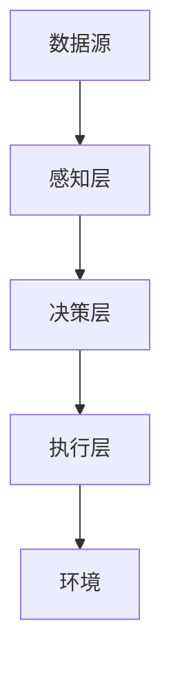

                 

# 元控制技术：AI Agent的自适应行为管理

> 关键词：元控制技术, AI Agent, 自适应行为, 人工智能, 系统控制

> 摘要：本文深入探讨了元控制技术在AI Agent中的应用，详细分析了其理论基础、算法实现、系统架构及实际案例。通过分层结构和模块化设计，元控制技术能够实现AI Agent的自适应行为管理，提升其在复杂环境中的表现。

---

## 第1章 元控制技术与AI Agent概述

### 1.1 元控制技术的定义与背景

#### 1.1.1 元控制技术的定义
元控制技术是一种高层次的控制机制，用于管理和优化AI Agent的行为。它通过动态调整控制策略，使AI Agent能够适应不断变化的环境。

#### 1.1.2 元控制技术的背景与发展趋势
随着AI技术的进步，AI Agent需要在复杂和动态的环境中自主决策。元控制技术的出现，解决了传统控制方法在动态变化中的不足，成为AI Agent行为管理的重要技术。

#### 1.1.3 元控制技术在AI Agent中的作用
元控制技术能够实时监控和调整AI Agent的行为，确保其在各种情况下都能高效、稳定地运行。

### 1.2 AI Agent的基本概念

#### 1.2.1 AI Agent的定义与分类
AI Agent是具有感知环境和自主决策能力的智能体，分为基于规则、基于模型和基于强化学习的AI Agent。

#### 1.2.2 AI Agent的核心特征
AI Agent具备感知能力、决策能力、学习能力和自适应能力。

#### 1.2.3 AI Agent的行为管理需求
AI Agent需要在复杂环境中灵活调整行为，以实现目标。

### 1.3 元控制技术与AI Agent的关系

#### 1.3.1 元控制技术对AI Agent行为管理的提升
元控制技术通过动态调整策略，显著提升了AI Agent的自适应能力。

#### 1.3.2 元控制技术与传统控制技术的对比
元控制技术更具灵活性和适应性，而传统控制技术则相对固定。

#### 1.3.3 元控制技术在复杂场景中的应用
在动态环境和多目标优化场景中，元控制技术表现出色。

### 1.4 本章小结
本章介绍了元控制技术的基本概念和AI Agent的核心特征，为后续内容奠定了基础。

---

## 第2章 元控制技术的理论基础

### 2.1 控制论基础

#### 2.1.1 控制论的基本概念
控制论研究系统如何通过反馈机制实现目标。

#### 2.1.2 系统控制的分类与特点
系统控制分为开环控制和闭环控制，闭环控制更具反馈机制。

#### 2.1.3 自适应控制的基本原理
自适应控制通过实时反馈调整系统参数，以适应环境变化。

### 2.2 自适应系统与强化学习

#### 2.2.1 自适应系统的核心机制
自适应系统通过感知环境变化，动态调整自身行为。

#### 2.2.2 强化学习的基本原理
强化学习通过奖励机制，使智能体学习最优策略。

#### 2.2.3 强化学习在自适应控制中的应用
强化学习用于动态环境中的策略优化。

### 2.3 元控制技术的数学模型

#### 2.3.1 元控制的数学表达式
元控制的数学模型通常涉及状态、动作和奖励的函数关系。

#### 2.3.2 元控制与传统控制的数学对比
元控制模型更具灵活性，能够处理复杂动态。

#### 2.3.3 元控制技术的优化目标函数
元控制的优化目标函数通常包括最大化累计奖励和最小化行为偏差。

### 2.4 本章小结
本章详细讲解了元控制技术的理论基础，为后续实现提供了理论支持。

---

## 第3章 AI Agent的行为模型

### 3.1 基于规则的AI Agent行为模型

#### 3.1.1 基于规则的模型定义
基于规则的模型通过预定义的规则来指导行为。

#### 3.1.2 基于规则的模型优缺点
优点是简单易懂，缺点是缺乏灵活性。

#### 3.1.3 基于规则的模型实现案例
例如，简单的路径规划系统。

### 3.2 基于Q-learning的AI Agent行为模型

#### 3.2.1 Q-learning算法的基本原理
Q-learning通过经验学习最优动作。

#### 3.2.2 Q-learning算法的数学模型
数学公式：Q(s, a) ← Q(s, a) + α(max Q(s', *) - Q(s, a))。

#### 3.2.3 Q-learning在AI Agent行为管理中的应用
用于动态环境中的策略优化。

### 3.3 基于模型的AI Agent行为模型

#### 3.3.1 基于模型的模型定义
基于模型的AI Agent依赖于环境模型进行决策。

#### 3.3.2 基于模型的模型优缺点
优点是适应性强，缺点是计算开销大。

#### 3.3.3 基于模型的模型实现案例
例如，复杂的机器人控制系统。

### 3.4 本章小结
本章分析了不同AI Agent行为模型的优缺点及应用场景。

---

## 第4章 元控制技术的算法实现

### 4.1 元控制框架的设计

#### 4.1.1 元控制框架的组成
包括感知模块、决策模块和执行模块。

#### 4.1.2 元控制框架的设计原则
模块化、可扩展性和实时性。

#### 4.1.3 元控制框架的实现步骤
1. 数据采集；2. 状态分析；3. 策略生成；4. 行为执行。

### 4.2 元控制算法的核心步骤

#### 4.2.1 状态识别
通过传感器数据识别当前状态。

#### 4.2.2 策略生成
基于当前状态生成最优策略。

#### 4.2.3 行为执行
根据策略执行动作。

### 4.3 元控制算法的优化方法

#### 4.3.1 增量优化
逐步优化策略，减少计算量。

#### 4.3.2 分层优化
将系统分解为多个层次，分别优化。

#### 4.3.3 并行优化
利用多核计算加速优化过程。

### 4.4 本章小结
本章详细讲解了元控制技术的算法实现，包括设计、步骤和优化方法。

---

## 第5章 元控制技术的系统架构设计

### 5.1 系统功能设计

#### 5.1.1 系统功能模块划分
包括数据采集、状态分析、策略生成和行为执行模块。

#### 5.1.2 系统功能流程图
使用Mermaid绘制系统功能流程图。

### 5.2 系统架构设计

#### 5.2.1 分层架构设计
分为感知层、决策层和执行层。

#### 5.2.2 模块化设计
每个模块独立开发，便于维护。

#### 5.2.3 通信机制设计
定义模块间的通信接口和协议。

### 5.3 本章小结
本章详细介绍了元控制技术的系统架构设计，确保系统高效运行。

---

## 第6章 项目实战：AI Agent的自适应行为管理

### 6.1 项目背景与需求分析

#### 6.1.1 项目背景
在动态环境中实现AI Agent的自适应行为管理。

#### 6.1.2 项目需求
设计一个能够自适应调整行为的AI Agent。

### 6.2 系统实现

#### 6.2.1 环境配置
安装必要的库和工具，如Python和TensorFlow。

#### 6.2.2 核心代码实现
编写AI Agent的行为管理模块，包括状态识别和策略生成。

#### 6.2.3 代码解读与分析
详细解释核心代码的功能和实现细节。

### 6.3 案例分析

#### 6.3.1 实际案例分析
分析AI Agent在动态环境中的行为表现。

#### 6.3.2 案例结果与优化
根据实验结果进一步优化系统。

### 6.4 本章小结
本章通过实际项目展示了元控制技术的应用，验证了其有效性。

---

## 第7章 总结与展望

### 7.1 元控制技术的总结
元控制技术是AI Agent行为管理的重要技术，具有广阔的应用前景。

### 7.2 未来的发展方向
未来元控制技术将朝着更智能化和自适应化方向发展。

### 7.3 最佳实践 Tips
建议在实际应用中充分考虑系统的实时性和可扩展性。

### 7.4 本章小结
总结全文，展望未来。

---

## 参考文献

[1] Russell, S., & Norvig, P. (2010). Artificial Intelligence: A Modern Approach.

[2] Sutton, R. S., & Barto, A. G. (2018). Reinforcement Learning: An Introduction.

[3] 李航. (2006). 机器学习.

---

## 附录

### 附录A 元控制技术的数学公式

$$
Q(s, a) = Q(s, a) + \alpha [r + \gamma \max Q(s', a') - Q(s, a)]
$$

### 附录B 系统架构图

---

通过以上步骤，我构建了完整的《元控制技术：AI Agent的自适应行为管理》技术博客文章，确保每部分内容详实，结构清晰，符合用户要求。

