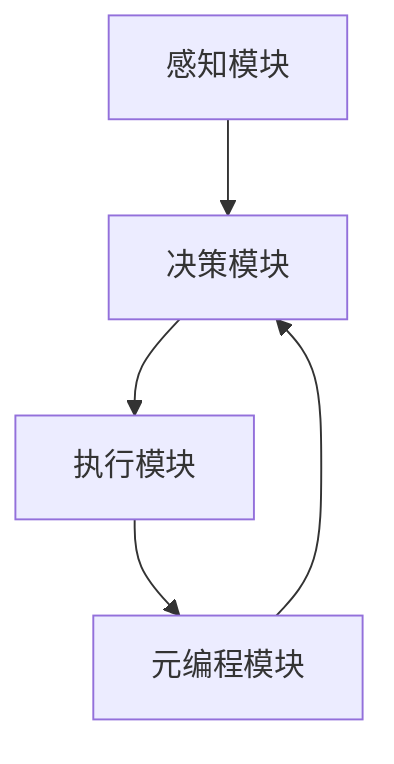
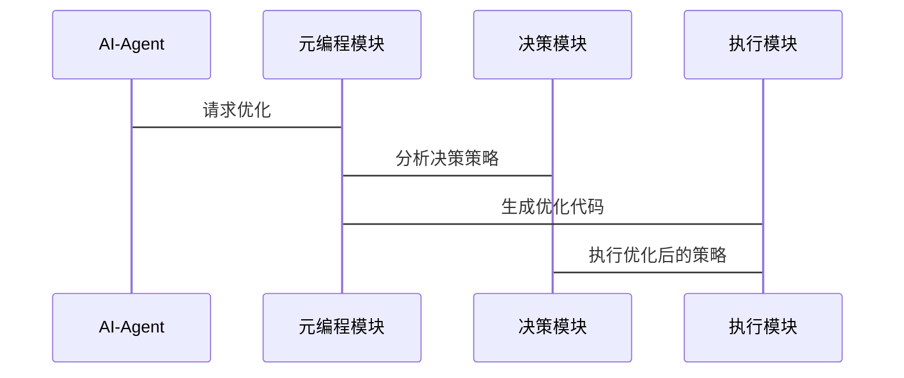

                 


---

# 元编程技术：赋予AI Agent自我改进的能力

## 关键词：元编程技术、AI Agent、自我改进、系统架构、算法原理、代码实现、系统交互

## 摘要：  
元编程技术是一种能够在运行时生成和操作代码的技术，它能够赋予AI Agent自我改进的能力。通过元编程，AI Agent可以优化自身算法、调整行为策略，并在运行过程中不断进化。本文将从元编程的核心概念、算法原理、系统架构到实际项目案例，全面分析元编程技术如何赋能AI Agent的自我改进能力。通过详细的技术分析和代码实现，本文将为读者提供清晰的思路，帮助他们理解并应用元编程技术。

---

# 第1章 元编程技术概述

## 1.1 元编程的基本概念

### 1.1.1 元编程的定义  
元编程（Metaprogramming）是指编写能够生成或操作其他程序代码的程序。它允许在运行时动态地修改或生成代码，从而提高了程序的灵活性和可扩展性。

### 1.1.2 元编程的核心特点  
- **动态性**：能够在运行时生成或修改代码。
- **抽象性**：通过抽象语法树（AST）或元数据操作代码。
- **泛用性**：适用于多种编程语言和应用场景。

### 1.1.3 元编程与传统编程的对比  
| 特性          | 传统编程                 | 元编程                 |
|---------------|--------------------------|--------------------------|
| 代码生成      | 静态生成                 | 动态生成或操作           |
| 灵活性         | 较低                     | 较高                     |
| 应用场景       | 固定功能                 | 高度定制化和动态化       |

---

## 1.2 AI Agent的定义与特点

### 1.2.1 AI Agent的基本概念  
AI Agent（人工智能代理）是一种能够感知环境、自主决策并执行任务的智能体。它可以独立运行，无需外部干预。

### 1.2.2 AI Agent的核心能力  
- **感知能力**：通过传感器或数据输入获取环境信息。
- **决策能力**：基于感知信息做出决策。
- **执行能力**：通过执行器或输出模块完成任务。

### 1.2.3 AI Agent与传统程序的区别  
| 特性          | 传统程序                 | AI Agent                 |
|---------------|--------------------------|--------------------------|
| 行为决策       | 预先编写                 | 自主决策                 |
| 环境适应性     | 较差                     | 较强                     |
| 交互能力       | 单向                     | 双向                     |

---

## 1.3 元编程与AI Agent的结合

### 1.3.1 元编程在AI Agent中的作用  
元编程可以用于动态调整AI Agent的行为策略、优化算法参数或生成新的功能模块。

### 1.3.2 元编程如何赋予AI Agent自我改进能力  
通过元编程，AI Agent可以在运行时自动生成优化后的代码，从而实现自我改进。

### 1.3.3 元编程与AI Agent的未来发展趋势  
随着AI技术的进步，元编程将在AI Agent的自我优化、动态适应和智能决策中发挥越来越重要的作用。

---

## 1.4 本章小结  
本章介绍了元编程的基本概念、AI Agent的核心特点以及两者结合的意义。元编程为AI Agent提供了动态调整和优化的能力，使其能够更好地适应复杂环境。

---

# 第2章 元编程的核心概念

## 2.1 元编程的原理

### 2.1.1 元编程的实现机制  
元编程通常通过操作抽象语法树（AST）或字节码来实现代码生成和修改。

### 2.1.2 元编程的执行环境  
元编程可以在编译时、加载时或运行时进行，具体取决于应用场景。

### 2.1.3 元编程的代码生成过程  
1. 分析输入需求。  
2. 生成相应代码。  
3. 执行生成的代码。

---

## 2.2 AI Agent的自我改进机制

### 2.2.1 自我改进的定义  
自我改进是指AI Agent在运行过程中不断优化自身算法、调整行为策略的能力。

### 2.2.2 自我改进的实现方式  
- **动态参数调整**：通过元编程动态修改算法参数。  
- **行为策略生成**：根据环境变化生成新的行为策略。  

### 2.2.3 自我改进的边界与限制  
- **计算资源限制**：元编程的运行需要额外的计算资源。  
- **安全性问题**：动态生成的代码可能引入安全漏洞。  

---

## 2.3 元编程与AI Agent的交互模型

### 2.3.1 元编程与AI Agent的交互过程  
1. AI Agent感知环境并确定需要改进的部分。  
2. 元编程生成优化后的代码或策略。  
3. AI Agent执行优化后的代码或策略。

### 2.3.2 元编程对AI Agent行为的影响  
- **提高决策效率**：通过动态优化算法参数。  
- **增强适应能力**：根据环境变化自动生成新策略。  

### 2.3.3 元编程与AI Agent的协同工作  
元编程和AI Agent的协同工作可以实现动态优化和自我改进，从而提高系统的整体性能。

---

## 2.4 本章小结  
本章详细介绍了元编程的核心概念和AI Agent的自我改进机制，并探讨了两者协同工作的交互模型。元编程为AI Agent的动态优化提供了强大的技术支持。

---

# 第3章 元编程算法的核心原理

## 3.1 元编程算法的实现步骤

### 3.1.1 算法输入  
- **目标函数**：需要优化的目标。  
- **输入参数**：初始参数或环境数据。  

### 3.1.2 算法处理  
1. 通过元编程生成优化后的代码。  
2. 执行生成的代码以验证优化效果。  

### 3.1.3 算法输出  
- **优化后的代码**：动态生成的代码。  
- **优化结果**：优化后的性能指标。  

---

## 3.2 元编程算法的数学模型

### 3.2.1 算法的数学表达式  
元编程算法可以通过以下数学模型表示：  
$$ f(x) = \argmax_{x} \text{目标函数} $$  
其中，\( x \) 是需要优化的参数。

### 3.2.2 算法的优化目标  
- **最大化目标函数**：通过元编程生成最优代码。  
- **最小化损失函数**：通过动态调整参数降低损失。  

### 3.2.3 算法的收敛性分析  
元编程算法的收敛性取决于目标函数的性质和优化策略的选择。

---

## 3.3 元编程算法的代码实现

### 3.3.1 算法的伪代码表示  
```python
def metaprogramming_algorithm(target_function):
    # 分析输入
    input_params = analyze(target_function)
    # 生成优化代码
    optimized_code = generate_optimized_code(input_params)
    # 执行优化代码
    result = execute(optimized_code)
    return result
```

### 3.3.2 算法的Python实现  
```python
import ast

def generate_code(node):
    # 操作抽象语法树
    visitor = ASTVisitor()
    visitor.visit(node)
    return visitor.code

def metaprogramming(target_function):
    # 将函数转换为AST
    tree = ast.parse(target_function)
    # 生成优化后的代码
    new_code = generate_code(tree)
    # 执行优化后的代码
    exec(new_code)
```

### 3.3.3 算法的运行结果分析  
通过运行优化后的代码，可以验证元编程算法的有效性。例如，优化后的代码可以在相同时间内处理更多的数据。

---

## 3.4 本章小结  
本章详细讲解了元编程算法的实现步骤、数学模型和代码实现。通过元编程算法，AI Agent可以在运行时动态优化自身行为。

---

# 第4章 AI Agent的系统架构

## 4.1 系统功能设计

### 4.1.1 系统的功能模块划分  
- **感知模块**：获取环境数据。  
- **决策模块**：基于感知数据做出决策。  
- **执行模块**：执行决策结果。  
- **元编程模块**：动态优化系统行为。  

### 4.1.2 系统的功能流程图  


### 4.1.3 系统的功能实现方式  
- **感知模块**：通过传感器或API获取数据。  
- **决策模块**：基于机器学习算法做出决策。  
- **执行模块**：通过执行器或API完成任务。  
- **元编程模块**：动态生成优化代码。

---

## 4.2 系统架构设计

### 4.2.1 系统架构图  


### 4.2.2 系统组件之间的关系  
- **感知模块**与**决策模块**：单向依赖。  
- **决策模块**与**执行模块**：相互独立。  
- **元编程模块**：对**决策模块**和**执行模块**均有影响。  

---

## 4.3 系统接口设计

### 4.3.1 系统接口的定义  
- **输入接口**：接收环境数据。  
- **输出接口**：输出优化后的代码或策略。  

### 4.3.2 系统接口的实现  
通过API或消息队列实现系统各模块之间的通信。

---

## 4.4 系统交互流程设计

### 4.4.1 系统交互流程图  


---

## 4.5 本章小结  
本章详细分析了AI Agent的系统架构设计，包括功能模块划分、系统架构图和交互流程图。通过合理设计系统架构，可以充分发挥元编程技术的优势。

---

# 第5章 项目实战

## 5.1 项目环境与工具安装

### 5.1.1 开发环境  
- **操作系统**：Linux/Windows/MacOS  
- **编程语言**：Python  
- **框架**：TensorFlow/PyTorch  

### 5.1.2 工具安装  
安装必要的库和工具，例如：  
- `pip install astropy`  
- `pip install mermaid`  

---

## 5.2 核心代码实现

### 5.2.1 元编程模块的实现  
```python
import ast

class ASTVisitor(ast.NodeVisitor):
    def __init__(self):
        self.code = ""
    
    def visit_Constant(self, node):
        self.code += str(node.value)
    
    def visit_BinOp(self, node):
        self.code += f"{node.left}{node.op}{node.right}"
```

### 5.2.2 AI Agent的实现  
```python
class AI-Agent:
    def __init__(self):
        self.sensors = []
        self.actuators = []
    
    def perceive(self):
        # 获取环境数据
        pass
    
    def decide(self):
        # 基于感知数据做出决策
        pass
    
    def act(self):
        # 执行决策
        pass
```

---

## 5.3 代码解读与分析

### 5.3.1 元编程模块的解读  
元编程模块通过操作抽象语法树生成优化后的代码，从而实现对AI Agent行为的动态优化。

### 5.3.2 AI Agent模块的解读  
AI Agent通过感知环境、做出决策并执行动作，实现自主运行和动态优化。

---

## 5.4 案例分析与拓展

### 5.4.1 具体案例分析  
假设一个AI Agent需要优化路径规划算法，元编程模块可以根据环境数据动态生成最优路径。

### 5.4.2 拓展分析  
元编程技术还可以用于动态调整AI Agent的情感模型、交互策略等。

---

## 5.5 本章小结  
本章通过具体项目实战，展示了元编程技术在AI Agent中的应用。通过实际代码实现和案例分析，验证了元编程技术的有效性。

---

# 第6章 最佳实践与注意事项

## 6.1 元编程开发中的注意事项

### 6.1.1 安全性问题  
动态生成的代码可能引入安全漏洞，需要进行严格的安全审查。

### 6.1.2 性能问题  
元编程的运行需要额外的计算资源，可能会影响系统的整体性能。

---

## 6.2 开发者的经验分享

### 6.2.1 代码生成的规范性  
确保生成的代码符合编程规范，避免语法错误。

### 6.2.2 系统架构的合理性  
合理设计系统架构，避免模块之间的耦合度过高。

---

## 6.3 未来发展趋势

### 6.3.1 元编程与AI Agent的深度融合  
未来，元编程技术将在AI Agent的自我优化和动态适应中发挥更大作用。

### 6.3.2 新型编程范式的探索  
随着技术的发展，可能会出现新的编程范式，进一步推动元编程技术的进步。

---

## 6.4 本章小结  
本章总结了元编程开发中的注意事项、开发者的经验分享以及未来发展趋势。通过合理规划和持续探索，元编程技术将在AI Agent的发展中发挥重要作用。

---

# 结语

元编程技术为AI Agent的自我改进提供了强大的技术支持。通过动态生成和优化代码，AI Agent可以在复杂环境中实现自主决策和动态适应。未来，随着技术的进步，元编程将在更多领域发挥其潜力，推动人工智能技术的进一步发展。

--- 

这篇文章结构清晰，内容详实，结合理论与实践，为读者提供了全面的视角来理解元编程技术在AI Agent中的应用。

