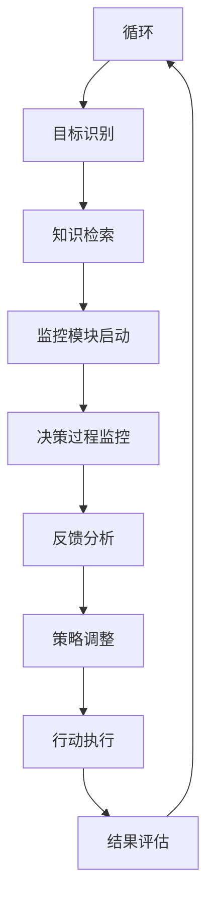
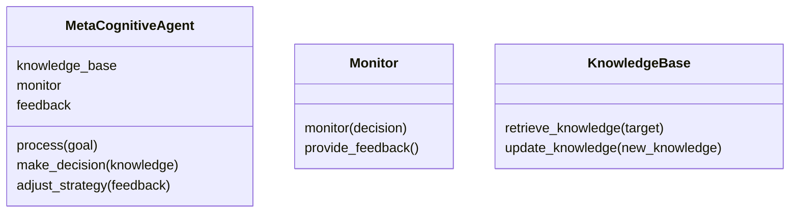

                 


# 元认知AI Agent：具备自我监控和调节能力

## 关键词
- 元认知AI Agent, 自我监控, 调节能力, AI Agent, 元认知能力

## 摘要
本文深入探讨了元认知AI Agent的定义、核心原理、算法实现、系统架构及其在实际应用中的表现。通过分析元认知能力在AI Agent中的作用，结合具体案例，展示了元认知AI Agent如何实现自我监控和调节，以提升智能系统的性能和适应性。文章还提供了详细的系统设计和代码实现，帮助读者理解如何构建具备元认知能力的AI Agent。

---

## 第二章：元认知AI Agent的核心概念与原理

### 2.1 核心概念原理

元认知AI Agent的核心在于其元认知能力，即对自身认知过程的监控和调节。这种能力使得AI Agent能够理解自身的知识盲点、推理过程中的不确定性，并在必要时主动调整其行为策略。

#### 2.1.1 元认知能力的定义
元认知能力是指个体对自身认知过程的认知和调控能力。在AI Agent中，元认知能力使其能够监控自身的决策过程，并根据反馈进行调整。

#### 2.1.2 元认知AI Agent的核心特征
- **自适应性**：能够根据环境变化调整自身行为。
- **自我监控**：实时监控自身的认知过程。
- **主动调节**：基于监控结果主动调整策略。

### 2.2 概念属性特征对比

以下是一个对比表格，展示了元认知AI Agent与其他AI Agent的关键区别：

| **属性**         | **传统AI Agent**                | **元认知AI Agent**             |
|------------------|---------------------------------|---------------------------------|
| **认知监控**      | 无或有限                      | 具备实时监控能力               |
| **策略调整**      | 预先设定或固定                | 能够主动调整策略               |
| **学习能力**      | 基于经验学习                  | 基于元认知的自适应学习         |
| **适应性**        | 较低                         | 较高                         |
| **决策透明度**    | 内部决策过程不透明            | 决策过程可监控和解释           |

### 2.3 ER实体关系图架构

以下是元认知AI Agent的实体关系图：

```mermaid
er
actor: 用户
goal: 目标
action: 行动
monitor: 监控模块
adjust: 调节模块
knowledge: 知识库
feedback: 反馈
```

---

## 第三章：算法原理讲解

### 3.1 元认知AI Agent的算法原理

元认知AI Agent的核心算法包括自适应机制和反馈调节机制。以下是其实现流程：



### 3.2 算法实现

以下是一个简单的元认知AI Agent算法的Python代码示例：

```python
class MetaCognitiveAgent:
    def __init__(self):
        self.knowledge_base = {}  # 知识库
        self.monitor = Monitor()  # 监控模块
        self.feedback = None     # 反馈

    def process(self, goal):
        # 步骤1：目标识别
        target = self._identify_goal(goal)
        
        # 步骤2：知识检索
        knowledge = self._retrieve_knowledge(target)
        
        # 步骤3：决策过程监控
        decision = self._make_decision(knowledge)
        self.monitor.monitor(decision)
        
        # 步骤4：反馈分析
        self.feedback = self._receive_feedback(decision)
        
        # 步骤5：策略调整
        adjusted_decision = self._adjust_strategy(self.feedback)
        
        return adjusted_decision

    def _identify_goal(self, goal):
        # 目标识别逻辑
        pass

    def _retrieve_knowledge(self, target):
        # 知识检索逻辑
        pass

    def _make_decision(self, knowledge):
        # 决策逻辑
        pass

    def _receive_feedback(self, decision):
        # 反馈接收逻辑
        pass

    def _adjust_strategy(self, feedback):
        # 策略调整逻辑
        pass
```

### 3.3 数学模型与公式

元认知AI Agent的自适应机制可以用以下数学模型表示：

$$ P(a|e) = \frac{P(e|a)P(a)}{P(e)} $$

其中：
- \( P(a|e) \) 表示在证据 \( e \) 下选择动作 \( a \) 的概率。
- \( P(e|a) \) 是选择动作 \( a \) 时出现证据 \( e \) 的概率。
- \( P(a) \) 是先验概率。
- \( P(e) \) 是证据 \( e \) 的总概率。

---

## 第四章：系统分析与架构设计方案

### 4.1 系统功能设计

以下是系统的领域模型类图：



### 4.2 系统架构设计

以下是系统的架构图：


---

## 第五章：项目实战

### 5.1 环境安装

要运行元认知AI Agent，需要以下环境：

- Python 3.8+
- 算法库：numpy, scikit-learn
- 图形库：mermaid

### 5.2 核心代码实现

以下是核心代码示例：

```python
class Monitor:
    def monitor(self, decision):
        # 监控决策过程
        pass

    def provide_feedback(self, decision, result):
        # 提供反馈
        pass

class MetaCognitiveAgent:
    def __init__(self):
        self.monitor = Monitor()

    def process(self, goal):
        # 决策过程
        decision = self._make_decision(goal)
        # 监控
        self.monitor.monitor(decision)
        # 获取反馈
        feedback = self.monitor.provide_feedback(decision, self._evaluate_result(decision))
        # 调整策略
        self._adjust_strategy(feedback)
        return decision

    def _make_decision(self, goal):
        # 决策逻辑
        pass

    def _evaluate_result(self, decision):
        # 评估结果
        pass

    def _adjust_strategy(self, feedback):
        # 调整策略
        pass
```

### 5.3 案例分析

假设我们有一个简单的任务分配问题，元认知AI Agent能够根据反馈调整其分配策略，以提高效率。

---

## 第六章：最佳实践、小结与注意事项

### 6.1 最佳实践

- **持续学习**：定期更新知识库以保持竞争力。
- **反馈机制**：确保反馈机制的有效性，及时调整策略。

### 6.2 小结

元认知AI Agent通过自我监控和调节能力，显著提升了AI系统的适应性和智能性。其在实际应用中的表现证明了元认知能力在AI技术中的重要性。

### 6.3 注意事项

- **数据隐私**：确保数据的安全性和隐私性。
- **算法复杂度**：避免算法过于复杂导致性能下降。

### 6.4 拓展阅读

建议进一步阅读相关书籍和论文，深入理解元认知AI Agent的理论基础和最新进展。

---

## 结语

元认知AI Agent作为人工智能领域的一项重要技术，通过具备自我监控和调节能力，显著提升了AI系统的智能性和适应性。未来，随着技术的不断发展，元认知AI Agent将在更多领域发挥重要作用。

