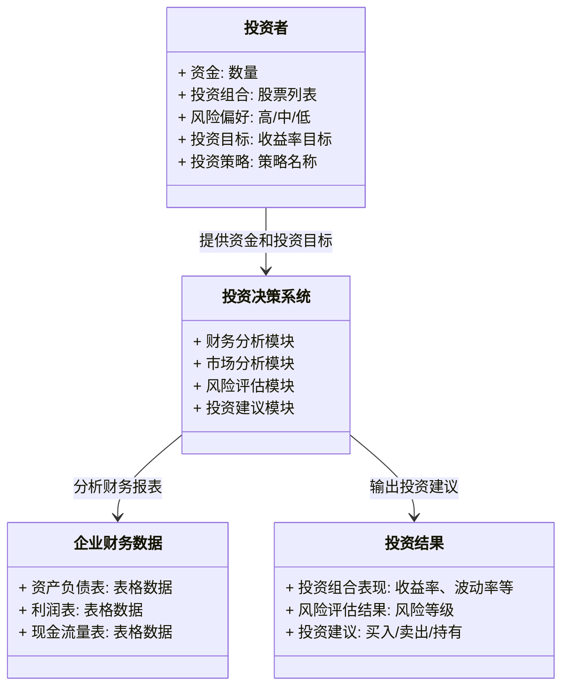
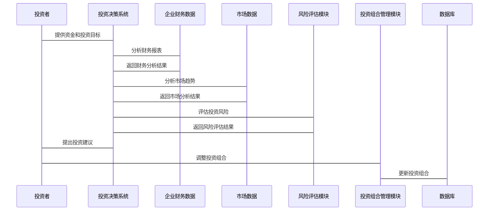

                 


# 克里斯托弗·布朗尼的隐蔽价值投资：发掘资产负债表的秘密

---

## 关键词  
克里斯托弗·布朗尼，隐蔽价值投资，资产负债表，财务报表分析，投资策略，资产质量，风险管理

---

## 摘要  
本文深入探讨了克里斯托弗·布朗尼的隐蔽价值投资理念，重点分析了如何通过资产负债表的核心要素和关键指标来识别潜在投资机会。文章从资产负债表的基本结构出发，结合实际案例，详细讲解了如何通过财务报表分析发现企业的财务健康状况、竞争优势以及潜在风险。同时，文章还介绍了克里斯托弗·布朗尼的投资策略和方法，并提供了实用的项目实战指南，帮助读者掌握如何在实际投资中应用这些分析方法。

---

## 第1章: 隐蔽价值投资的概述

### 1.1 投资的基本概念与分类  
**1.1.1 投资的定义与分类**  
投资是指将资金或资源投入到某个项目或资产中，以期望在未来获得收益或资本增值的行为。根据投资对象的不同，可以将其分为实物投资和金融投资。金融投资又可以进一步细分为股票投资、债券投资、基金投资等多种形式。  

**1.1.2 隐蔽价值投资的定义**  
隐蔽价值投资是一种以发现市场中未被充分认知或低估的价值为核心的投资策略。它强调通过深入分析企业的财务状况、行业地位和竞争优势，挖掘出那些具有长期增长潜力但当前市场估值较低的企业。  

**1.1.3 隐蔽价值投资的核心理念**  
- **价值发现**：寻找市场价格低于内在价值的企业。  
- **长期投资**：注重企业的基本面，而非短期市场波动。  
- **风险管理**：通过严格的财务分析和估值模型，降低投资风险。  

### 1.2 克里斯托弗·布朗尼的投资方法论  
**1.2.1 克里斯托弗·布朗尼的背景介绍**  
克里斯托弗·布朗尼是一位知名的隐蔽价值投资者，以其对资产负债表的深入分析和对企业基本面的精准判断而闻名。他善于从复杂的财务数据中挖掘出企业的真正价值，并通过长期持有优质资产实现投资收益。  

**1.2.2 其他著名投资者对他的影响**  
布朗尼的投资理念深受本杰明·格雷厄姆和菲利普·费雪的影响，尤其是格雷厄姆的“安全边际”概念和费雪的成长股投资策略，为布朗尼的投资方法奠定了基础。  

**1.2.3 他的投资理念与策略**  
布朗尼的投资策略可以总结为“买入优质资产，长期持有”。他特别关注企业的资产负债表，通过分析企业的资产质量、负债结构和所有者权益，寻找那些具有强大财务基础和持续盈利能力的企业。  

### 1.3 资产负债表分析的重要性  
**1.3.1 资产负债表的定义与作用**  
资产负债表是反映企业在某一特定时点的财务状况的重要报表，展示了企业的资产、负债和所有者权益之间的平衡关系。它是投资者评估企业财务健康状况和未来盈利能力的重要工具。  

**1.3.2 资产负债表分析在投资中的价值**  
通过资产负债表分析，投资者可以评估企业的偿债能力、营运能力和盈利能力，从而做出更明智的投资决策。  

**1.3.3 如何通过资产负债表发现投资机会**  
- **识别资产质量**：分析企业的流动资产和非流动资产，判断其资产是否具有流动性高、质量优的特点。  
- **评估负债结构**：关注企业的流动负债和非流动负债，判断其债务是否合理、风险可控。  
- **分析所有者权益**：通过所有者权益的变化，了解企业的资本结构和股东权益的变化趋势。  

---

## 第2章: 资产负债表的结构与核心要素  

### 2.1 资产负债表的基本结构  
**2.1.1 资产、负债、所有者权益的定义与关系**  
- **资产**：企业拥有的资源，能够为企业创造价值。  
- **负债**：企业需要偿还的债务。  
- **所有者权益**：企业净资产的价值，即资产减去负债后的余额。  
三者之间的关系可以用公式表示为：  
$$ \text{资产} = \text{负债} + \text{所有者权益} $$  

**2.1.2 资产负债表的格式与列报原则**  
资产负债表通常采用账户式或报告式两种格式。账户式将资产、负债和所有者权益分别列示，而报告式则按照资产类别进行详细分类。  

### 2.2 资产负债表的核心要素分析  
**2.2.1 流动资产与非流动资产**  
- **流动资产**：可以在一年内变现或消耗的资产，包括现金、应收账款、存货等。  
- **非流动资产**：无法在一年内变现的资产，包括固定资产、无形资产等。  

**2.2.2 流动负债与非流动负债**  
- **流动负债**：需要在一年内偿还的债务，包括应付账款、短期借款等。  
- **非流动负债**：偿还期限超过一年的债务，包括长期借款、应付债券等。  

**2.2.3 所有者权益的构成与意义**  
所有者权益包括股本、资本公积、盈余公积和未分配利润等部分。它是企业资本结构的重要组成部分，反映了股东对企业净资产的权益。  

### 2.3 资产负债表分析的关键指标  
**2.3.1 偿债能力指标**  
- **流动比率（Current Ratio）**：流动资产与流动负债的比率，衡量企业短期偿债能力。  
$$ \text{流动比率} = \frac{\text{流动资产}}{\text{流动负债}} $$  
- **速动比率（Quick Ratio）**：流动资产减去存货与流动负债的比率，反映企业快速偿债的能力。  
$$ \text{速动比率} = \frac{\text{流动资产} - \text{存货}}{\text{流动负债}} $$  

**2.3.2 营运能力指标**  
- **存货周转率（Inventory Turnover）**：衡量企业存货的周转效率。  
$$ \text{存货周转率} = \frac{\text{营业成本}}{\text{平均存货}} $$  
- **应收账款周转率（Receivables Turnover）**：衡量企业应收账款的回收效率。  
$$ \text{应收账款周转率} = \frac{\text{营业收入}}{\text{平均应收账款}} $$  

**2.3.3 盈利能力指标**  
- **净利率（Net Profit Margin）**：净利润与营业收入的比率，衡量企业的盈利能力。  
$$ \text{净利率} = \frac{\text{净利润}}{\text{营业收入}} $$  
- **ROE（Return on Equity）**：净资产收益率，衡量企业所有者权益的回报率。  
$$ \text{ROE} = \frac{\text{净利润}}{\text{所有者权益}} $$  

---

## 第3章: 财务报表分析的方法与技巧  

### 3.1 财务报表分析的基本方法  
**3.1.1 单独分析法**  
单独分析法是指单独分析资产负债表、利润表和现金流量表，分别提取关键信息。  

**3.1.2 比较分析法**  
比较分析法是指将企业的财务数据与行业平均水平或竞争对手进行对比，识别差异和趋势。  

**3.1.3 趋势分析法**  
趋势分析法是指通过分析企业在不同时间点的财务数据，识别其财务状况的变化趋势。  

### 3.2 资产负债表分析的关键点  
**3.2.1 资产质量分析**  
资产质量分析包括对企业流动资产和非流动资产的详细检查，判断其是否具有变现能力强、质量优良的特点。  

**3.2.2 负债结构分析**  
负债结构分析包括对企业流动负债和非流动负债的详细检查，判断其债务是否合理、风险可控。  

**3.2.3 所有者权益变动分析**  
所有者权益变动分析包括对企业股本、资本公积和盈余公积等的变动情况进行详细检查，判断其资本结构是否合理。  

### 3.3 识别财务报表中的潜在问题  
**3.3.1 通过资产负债表识别财务造假**  
- **资产虚增**：检查存货、应收账款等是否存在虚增现象。  
- **负债虚减**：检查应付账款、短期借款等是否存在虚减现象。  

**3.3.2 分析企业财务健康状况**  
通过分析企业的偿债能力、营运能力和盈利能力，判断其财务健康状况。  

**3.3.3 识别企业潜在风险**  
通过分析企业的负债结构、资产质量等，识别其潜在的财务风险和经营风险。  

---

## 第4章: 隐蔽价值投资的核心原理  

### 4.1 隐蔽价值投资的定义与特点  
**4.1.1 隐蔽价值投资的定义**  
隐蔽价值投资是一种以发现市场中未被充分认知或低估的价值为核心的投资策略。它强调通过深入分析企业的财务状况、行业地位和竞争优势，挖掘出那些具有长期增长潜力但当前市场估值较低的企业。  

**4.1.2 隐蔽价值投资的特点**  
- **注重基本面分析**：通过分析企业的财务报表、行业地位和竞争优势，寻找具有长期增长潜力的企业。  
- **关注低估资产**：寻找市场价格低于内在价值的企业。  
- **长期投资**：注重长期持有优质资产，追求稳定的收益增长。  

### 4.2 资产负债表在价值投资中的作用  
**4.2.1 资产负债表分析对价值评估的影响**  
通过分析资产负债表，投资者可以准确评估企业的资产质量、负债结构和所有者权益，从而确定其内在价值。  

**4.2.2 资产负债表分析对投资决策的指导作用**  
通过分析资产负债表，投资者可以判断企业的财务健康状况、偿债能力和发展潜力，从而做出更明智的投资决策。  

**4.2.3 资产负债表分析在风险控制中的应用**  
通过分析资产负债表，投资者可以识别企业的潜在风险，如高负债率、低资产流动性等，从而制定有效的风险管理策略。  

### 4.3 克里斯托弗·布朗尼的投资策略  
**4.3.1 他的核心投资理念**  
布朗尼的投资理念可以总结为“买入优质资产，长期持有”。他特别关注企业的资产负债表，通过分析企业的资产质量、负债结构和所有者权益，寻找那些具有强大财务基础和持续盈利能力的企业。  

**4.3.2 他的投资组合管理方法**  
布朗尼的投资组合管理方法注重分散投资和风险控制。他通过严格筛选优质企业，构建一个多元化且具有长期增长潜力的投资组合。  

**4.3.3 他的风险管理策略**  
布朗尼的风险管理策略包括以下几点：  
- **严格筛选投资标的**：通过深入分析企业的财务报表和行业地位，排除那些财务状况不佳或行业前景黯淡的企业。  
- **分散投资**：通过投资于不同行业和不同规模的企业，降低投资组合的整体风险。  
- **定期复检**：定期检查投资组合的财务状况和市场表现，及时调整投资策略。  

---

## 第5章: 资产负债表分析的实战应用  

### 5.1 项目实战：某企业的资产负债表分析  
**5.1.1 项目背景介绍**  
假设我们选择了一家制造业企业作为分析对象，以下是该企业的资产负债表数据（简化版）：  

| 项目                | 金额（万元） |
|---------------------|--------------|
| 流动资产            | 500          |
| 非流动资产          | 800          |
| 资产总计            | 1300         |
| 流动负债            | 300          |
| 非流动负债          | 400          |
| 负债总计            | 700          |
| 所有者权益          | 600          |
| 资产负债表总计      | 1300         |

**5.1.2 资产质量分析**  
- **流动资产**：流动资产总计为500万元，主要包括现金、应收账款和存货。  
- **非流动资产**：非流动资产总计为800万元，主要包括固定资产和无形资产。  

**5.1.3 负债结构分析**  
- **流动负债**：流动负债总计为300万元，主要包括应付账款和短期借款。  
- **非流动负债**：非流动负债总计为400万元，主要包括长期借款和应付债券。  

**5.1.4 所有者权益分析**  
- **所有者权益总计**：所有者权益总计为600万元，主要包括股本、资本公积和盈余公积。  

**5.1.5 关键指标计算与分析**  
- **流动比率**：  
$$ \text{流动比率} = \frac{500}{300} = 1.67 $$  
- **速动比率**：  
$$ \text{速动比率} = \frac{500 - 200}{300} = 1.00 $$  
- **净利率**：  
$$ \text{净利率} = \frac{100}{800} = 12.5\% $$  
- **ROE**：  
$$ \text{ROE} = \frac{100}{600} = 16.67\% $$  

通过以上分析，我们可以看出，该企业的流动比率和速动比率均处于合理水平，表明其短期偿债能力较强。同时，其净利率和ROE均较高，表明其盈利能力较强。  

### 5.2 投资决策建议  
基于以上分析，我们可以得出以下投资决策建议：  
- **买入建议**：该企业具有较强的财务健康状况和盈利能力，建议投资者买入其股票。  
- **持有建议**：长期持有该企业股票，等待其股价回升至合理估值水平。  
- **风险提示**：需关注该企业的存货周转率和应收账款周转率，确保其营运能力保持稳定。  

---

## 第6章: 系统分析与架构设计方案  

### 6.1 问题场景介绍  
在实际投资过程中，投资者需要面对大量的财务数据和复杂的市场信息，如何高效地进行财务分析和投资决策是投资者面临的主要挑战。  

### 6.2 项目介绍  
本项目旨在构建一个基于资产负债表分析的隐蔽价值投资系统，帮助投资者快速识别具有投资价值的企业，并制定有效的投资策略。  

### 6.3 系统功能设计  
**6.3.1 领域模型（mermaid类图）**  


**6.3.2 系统架构设计（mermaid架构图）**  


**6.3.3 系统接口设计**  
- **输入接口**：投资者提供资金和投资目标。  
- **输出接口**：系统输出投资建议和投资组合表现。  

**6.3.4 系统交互（mermaid序列图）**  


---

## 第7章: 项目实战  

### 7.1 环境安装  
为了进行资产负债表分析，我们需要安装以下工具：  
- **Python**：用于数据分析和编程。  
- **Pandas**：用于处理和分析财务数据。  
- **Matplotlib**：用于可视化财务数据。  

### 7.2 系统核心实现源代码  
以下是基于Python的资产负债表分析代码示例：  

```python
import pandas as pd
import matplotlib.pyplot as plt

# 加载资产负债表数据
df = pd.read_excel('balance_sheet.xlsx')

# 计算关键指标
current_assets = df.loc['流动资产', '金额']
current_liabilities = df.loc['流动负债', '金额']
net_profit = df.loc['净利润', '金额']
total_equity = df.loc['所有者权益总计', '金额']

# 流动比率
current_ratio = current_assets / current_liabilities
print(f'流动比率 = {current_ratio:.2f}')

# 速动比率
quick_assets = current_assets - df.loc['存货', '金额']
quick_ratio = quick_assets / current_liabilities
print(f'速动比率 = {quick_ratio:.2f}')

# 净利率
net_profit_margin = net_profit / df.loc['营业收入', '金额'] * 100
print(f'净利率 = {net_profit_margin:.2f}%')

# ROE
roe = net_profit / total_equity * 100
print(f'ROE = {roe:.2f}%')

# 可视化资产结构
df['金额'].plot(kind='bar', figsize=(10,6))
plt.title('资产结构')
plt.ylabel('金额（万元）')
plt.show()
```

### 7.3 代码应用解读与分析  
- **代码功能**：  
  该代码加载资产负债表数据，计算流动比率、速动比率、净利率和ROE等关键指标，并通过可视化展示资产结构。  
- **代码实现**：  
  使用Pandas进行数据分析，使用Matplotlib进行数据可视化。  

### 7.4 实际案例分析和详细讲解剖析  
通过以上代码，我们可以对某企业的资产负债表数据进行分析，得出以下结论：  
- 该企业的流动比率和速动比率均处于合理水平，表明其短期偿债能力较强。  
- 该企业的净利率和ROE均较高，表明其盈利能力较强。  
- 该企业的资产结构以流动资产为主，表明其资产流动性较高，风险较低。  

### 7.5 项目小结  
通过本项目，我们可以看到，资产负债表分析是隐蔽价值投资的重要工具。通过深入分析企业的财务报表，我们可以准确评估其财务状况和盈利能力，从而做出更明智的投资决策。  

---

## 第8章: 总结  

### 8.1 总结全文  
通过本文的探讨，我们深入理解了克里斯托弗·布朗尼的隐蔽价值投资理念，并掌握了如何通过资产负债表的核心要素和关键指标来识别潜在投资机会。我们还通过实际案例和系统设计，展示了如何将这些理论应用于实际投资决策中。  

### 8.2 最佳实践 tips  
- **注重基本面分析**：通过分析企业的财务报表，识别其财务健康状况和盈利能力。  
- **关注低估资产**：寻找市场价格低于内在价值的企业。  
- **长期投资**：注重长期持有优质资产，追求稳定的收益增长。  
- **风险管理**：通过分散投资和定期复检，降低投资风险。  

### 8.3 未来研究方向  
- **深入研究行业趋势**：分析不同行业的财务特征和投资机会。  
- **开发自动化分析工具**：利用人工智能和大数据技术，提高财务分析效率。  
- **拓展国际投资视野**：研究全球市场的投资机会和风险。  

### 8.4 注意事项  
- **谨慎投资**：投资有风险，需谨慎决策。  
- **持续学习**：市场环境不断变化，需持续学习和更新投资知识。  

---

通过以上内容，我们希望能够为读者提供一篇既有深度又易于理解的专业技术博客文章，帮助他们在隐蔽价值投资领域有所斩获。

